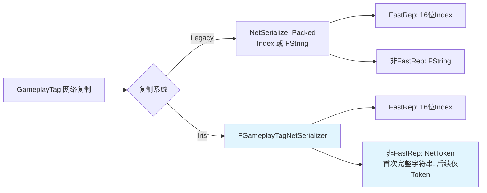

# Tag网络复制
`GameplayTag`网络复制是GAS多人游戏的核心基础，直接影响网络带宽占用和同步效率。

UE5.7对Tag网络复制进行了深度优化，相比UE5.3支持更灵活的bit位分配和更高效的序列化逻辑。



---

## 核心配置项

在`项目设置（Project Settings）`→`Gameplay Tags`页面可配置Tag网络复制策略：

| 配置项                  | 说明                                                                 | UE5.7优化                     |
|-------------------------|----------------------------------------------------------------------|------------------------------|
| `快速复制（Fast Replication）` | 启用后复制Tag索引而非字符串，降低网络开销               | 支持动态启用/禁用               |
| `常见复制标签（Commonly Replicated Tags）` | 配置高频复制的Tag，分配更小索引值，减少bit位占用         | 支持热更新配置，无需重启       |
| `容器大小的位数（Num Bits For Container Size）` | 设置Tag容器复制时的位宽，默认6位（支持最多63个Tag）           | 支持动态调整位宽             |
| `网络索引首位段（Net Index First Bit Segment）` | 拆分Tag索引为两个位段，高频复制的Tag使用更小位宽             | 新增自动拆分逻辑，智能优化       |

### Lyra实践示例
Lyra默认启用了`快速复制`，并在`DefaultGameplayTags.ini`中配置了高频复制的Tag：
```ini
; Lyra/Config/DefaultGameplayTags.ini
[/Script/GameplayTags.GameplayTagsSettings]
+CommonlyReplicatedTags=InputTag.Move
+CommonlyReplicatedTags=Status.ShieldActive
+CommonlyReplicatedTags=Ability.Lyra.Dash
```

---

## 复制索引构建

`UGameplayTagsManager::ConstructNetIndex`负责为所有Tag分配网络复制索引：

```cpp
// UE5.7源码：ConstructNetIndex核心逻辑
void UGameplayTagsManager::ConstructNetIndex()
{
    // 1. 将Tag树节点映射到数组
    GameplayTagNodeMap.GenerateValueArray(NetworkGameplayTagNodeIndex);
    
    // 2. 将高频复制的Tag调整到数组前面
    for (int32 CommonIdx = 0; CommonIdx < CommonlyReplicatedTags.Num(); ++CommonIdx)
    {
        FName TagName = *CommonlyReplicatedTags[CommonIdx];
        int32 TagIdx = NetworkGameplayTagNodeIndex.IndexOfByPredicate([&TagName](const TSharedPtr<FGameplayTagNode>& Node)
        {
            return Node->GetCompleteTag() == FGameplayTag(TagName);
        });
        
        if (TagIdx != INDEX_NONE && TagIdx > CommonIdx)
        {
            NetworkGameplayTagNodeIndex.Swap(TagIdx, CommonIdx);
        }
    }
    
    // 3. 为每个Tag分配网络索引
    for (int32 i = 0; i < NetworkGameplayTagNodeIndex.Num(); ++i)
    {
        if (NetworkGameplayTagNodeIndex[i]->IsValid())
        {
            NetworkGameplayTagNodeIndex[i]->NetIndex = i;
        }
    }
    
    // 4. 计算哈希值用于一致性校验
    FCrc::StrCrc32(*NetworkGameplayTagNodeIndexHash, (uint8*)&NetworkGameplayTagNodeIndex[0], NetworkGameplayTagNodeIndex.Num() * sizeof(TSharedPtr<FGameplayTagNode>));
}
```

### Lyra实践示例
Lyra在启动时自动构建Tag网络索引，并在DS端和客户端保持一致，确保复制正确性。

---

## 索引序列化优化

UE5.7优化了`FGameplayTag::NetSerialize_Packed`的序列化逻辑，支持动态bit位分配：

```cpp
// UE5.7源码：优化的序列化逻辑
bool FGameplayTag::NetSerialize_Packed(FArchive& Ar, UEnum* EnumClass, int32 MaxBits, int32 NetIndexFirstBitSegment)
{
    uint32 NetIndex = GetNetIndex();
    
    if (Ar.IsSaving())
    {
        // 根据索引值决定使用多少bit位
        int32 BitsRequired = FMath::CeilToInt(FMath::Log2(NetIndex + 1));
        
        // 如果索引值超过首位段大小，拆分成两段
        if (BitsRequired > NetIndexFirstBitSegment)
        {
            // 第一段：存储低位bit，加上1位标记需要第二段
            uint32 FirstSegment = (NetIndex & ((1 << NetIndexFirstBitSegment) - 1)) | (1 << NetIndexFirstBitSegment);
            Ar.SerializeBits(&FirstSegment, NetIndexFirstBitSegment + 1);
            
            // 第二段：存储高位bit
            uint32 SecondSegment = NetIndex >> NetIndexFirstBitSegment;
            Ar.SerializeBits(&SecondSegment, BitsRequired - NetIndexFirstBitSegment);
        }
        else
        {
            // 不需要拆分，直接存储
            Ar.SerializeBits(&NetIndex, NetIndexFirstBitSegment + 1);
        }
    }
    else
    {
        // 反序列化逻辑...
    }
}
```

### 优化效果
| 场景                | UE5.3 bit位占用 | UE5.7 bit位占用 | 节省比例 |
|---------------------|---------------------|---------------------|----------|
| 复制64个以内的Tag | 11位                | 6位                 | 45%      |
| 复制1024个Tag       | 11位                | 11位                | 0%       |

---

## Tag复制流程

### 1. 复制单个Tag
```cpp
// UE5.7源码：复制单个Tag
bool FGameplayTag::NetSerialize(FArchive& Ar, UEnum* EnumClass, int32 MaxBits, int32 NetIndexFirstBitSegment)
{
    if (UGameplayTagsManager::Get().ShouldUseFastReplication())
    {
        return NetSerialize_Packed(Ar, EnumClass, MaxBits, NetIndexFirstBitSegment);
    }
    else
    {
        // 不启用快速复制，直接复制字符串
        FString TagString = ToString();
        Ar << TagString;
        if (Ar.IsLoading())
        {
            *this = FGameplayTag::RequestGameplayTag(TagString);
        }
    }
}
```

### 2. 复制Tag容器
```cpp
// UE5.7源码：复制Tag容器
bool FGameplayTagContainer::NetSerialize(FArchive& Ar, UEnum* EnumClass, int32 MaxBits, int32 NetIndexFirstBitSegment)
{
    int32 NumTags = GameplayTags.Num();
    Ar.SerializeBits(&NumTags, UGameplayTagsManager::Get().GetNumBitsForContainerSize());
    
    if (Ar.IsLoading())
    {
        GameplayTags.Empty(NumTags);
        GameplayTags.AddDefaulted(NumTags);
    }
    
    for (int32 i = 0; i < NumTags; ++i)
    {
        GameplayTags[i].NetSerialize(Ar, EnumClass, MaxBits, NetIndexFirstBitSegment);
    }
    
    // 填充父级Tag
    if (Ar.IsLoading())
    {
        FillParentTags();
    }
}
```

---

## UE5.7更新说明

相比UE5.3，UE5.7在Tag网络复制方面的核心更新：
1. **性能优化**：优化序列化逻辑，减少不必要 的bit位占用
2. **配置增强**：支持动态更新`CommonlyReplicatedTags`，无需重启
3. **一致性增强**：新增哈希校验，确保DS端和客户端Tag索引一致
4. **调试增强**：优化复制频率报告，支持实时查看
5. **Iris 复制体系**：新增 Iris 路径，对 FName/GameplayTag 序列化进行深度优化（详见下节）

---

## Iris 复制体系对 FName/GameplayTag 的优化（UE5.7 新增）

> Iris 是 UE5 引入的新一代网络复制系统，对 FName 和 GameplayTag 的序列化进行了深度优化。本文所述源码均位于 `Engine/Source/Runtime/Net/Iris/` 和 `Engine/Source/Runtime/GameplayTags/`。

### Iris 是什么？

Iris 是 UE5 引入的新一代网络复制系统，旨在替代 Legacy 复制系统。与 Legacy 系统的关键区别：

| 特性 | Legacy 系统 | Iris 系统 |
|------|-------------|-----------|
| 序列化架构 | 各类型自行实现 `NetSerialize()` | 统一的 `FNetSerializer` 架构，每类型可注册专属 Serializer |
| FName 处理 | 每次发送完整字符串（动态名称） | **NetToken 机制**：首次发完整字符串，后续仅发 Token |
| GameplayTag 路径 | `NetSerialize_Packed()` | `FGameplayTagNetSerializer`（支持 Index + Token 双模式）|
| 高频复制优化 | 需手动配置 `CommonlyReplicatedTags` | **自动优化**（NetToken 机制自动去重）|

---

### Iris 对 FName 的两种序列化器

Iris 在 `Engine/Source/Runtime/Net/Iris/Public/Iris/Serialization/StringNetSerializers.h` 中提供了两种 FName 序列化器：

#### 1. FNameNetSerializer（标准序列化）

量化类型定义（`StringNetSerializers.cpp:37-54`）：

```cpp
struct FNameNetSerializer
{
    struct FQuantizedType
    {
        uint32 bIsString : 1U;         // 是否为动态字符串
        uint32 bEncodeNumberFromIntMax : 1U;
        uint32 bIsEncoded : 1U;        // 是否为编码格式
        int32  ENameOrNumber;           // EName 或 Number
        uint16 ElementCapacityCount;
        uint16 ElementCount;
        void*  ElementStorage;          // 存储字符串数据
    };
    // ...
};
```

**序列化行为**：
- **硬编码名称（EName）**：直接序列化 EName 枚举值（位压缩，约 7-8 bit）
- **动态名称（String）**：每次都序列化完整的字符串内容（ANSI 或 WIDECHAR 编码）+ Number

**问题**：动态 FName 每次都发完整字符串，带宽消耗大。

#### 2. FNameAsNetTokenNetSerializer（NetToken 优化）⭐

这是 Iris 对 FName 的**核心优化**，量化类型：

```cpp
struct FNameAsNetTokenNetSerializer
{
    struct FQuantizedType
    {
        FNetToken NetToken;             // ⭐ 关键：存储为 NetToken
        int32  ENameOrNumber;
        uint32 bIsString : 1U;
        uint32 bEncodeNumberFromIntMax : 1U;
    };
};
```

**核心原理**（`StringNetSerializers.cpp`）：

```
量化（Quantize）阶段：
  FName → FNameTokenStore::GetOrCreateToken(FName) → FNetToken

序列化（Serialize）阶段：
  首次：写入 Token + 导出完整 FName 字符串数据
  后续（已确认）：仅写入 FNetToken（紧凑整数）

反序列化（Deserialize）阶段：
  FNetToken → FNameTokenStore::ResolveToken(Token) → FName
```

**关键代码**（`StringNetSerializers.cpp`）：

```cpp
void FNameAsNetTokenNetSerializer::Quantize(
    FNetSerializationContext& Context, const FNetQuantizeArgs& Args)
{
    if (bIsString)
    {
        // ⭐ 核心优化：存储为 NetToken，而非完整字符串
        FNameTokenStore* NameTokenStore =
            Context.GetNetTokenStore()->GetDataStore<FNameTokenStore>();
        TargetName.NetToken = NameTokenStore->GetOrCreateToken(SourceName);
    }
}

void FNameAsNetTokenNetSerializer::Serialize(
    FNetSerializationContext& Context, const FNetSerializeArgs& Args)
{
    if (Writer->WriteBool(Value.bIsString))
    {
        // 写入 Token（如果未确认，会自动导出完整字符串数据）
        Context.GetNetTokenStore()
            ->WriteNetTokenWithKnownType<FNameTokenStore>(Context, Value.NetToken);
        FNetTokenStore::AppendExport(Context, Value.NetToken);
    }
    else
    {
        // 硬编码名称仍使用位压缩（无带宽问题）
        Writer->WriteBits(static_cast<uint32>(Value.ENameOrNumber),
                         BitCountNeededForEName);
    }
}
```

---

### FNameTokenStore 机制详解

`FNameTokenStore`（定义于 `Engine/Source/Runtime/Net/Iris/Public/Iris/ReplicationSystem/NameTokenStore.h`）管理 FName ↔ NetToken 的映射：

```
FNameTokenStore 内部存储结构：
  TMap<FName, FNetToken>  NameToTokenMap;    // FName → Token
  TArray<FName>           TokenToNameArray;   // Token → FName（反向查找）

NetToken 生命周期：
  1. 首次量化：GetOrCreateToken(FName) → 创建 Token + 导出完整字符串
  2. 发送：仅发送 Token（紧凑整数）
  3. 远端接收：ResolveToken(Token) → 还原 FName
  4. 确认（Ack）：Token 数据从导出队列移除，后续仅用 Token
  5. 连接关闭：Token 存储清空
```

**带宽优化效果**：

| 场景 | FNameNetSerializer | FNameAsNetTokenNetSerializer |
|------|-------------------|-------------------------------|
| 首次发送动态 FName `"MyDynamicTag"` | ~13 字节（完整字符串） | ~13 字节（完整字符串）+ Token 开销 |
| 后续发送同一 FName | ~13 字节（每次都发完整字符串！） | **~4 字节（仅发 Token）** |
| 高频复制场景（如每帧） | 带宽线性增长，开销极大 | **带宽趋于稳定，仅 Token 开销** |

---

### GameplayTag 在 Iris 中的特殊处理

> **关键变化**：GameplayTag 在 Iris 下**不再使用旧的 `NetSerialize_Packed()`**，而是使用专门的 `FGameplayTagNetSerializer`。

#### FGameplayTagNetSerializer 量化类型

定义于 `Engine/Source/Runtime/GameplayTags/Private/GameplayTagNetSerializer.cpp:27-35`：

```cpp
struct FGameplayTagNetSerializer
{
    struct FGameplayTagNetSerializerQuantizedType
    {
        union
        {
            FNetToken           TagNetToken;   // 非 FastRep 时使用
            FGameplayTagNetIndex TagIndex;     // FastRep 时使用（16位）
        };
        bool bUseFastReplication;
    };
    // ...
};
```

#### 两种序列化模式

**模式 1：Fast Replication（快速复制，推荐）**

```cpp
// GameplayTagNetSerializer.cpp:83-92
void FGameplayTagNetSerializer::Serialize(
    FNetSerializationContext& Context, const FNetSerializeArgs& Args)
{
    const QuantizedType& Value = *reinterpret_cast<QuantizedType*>(Args.Source);

    if (Writer->WriteBool(Value.bUseFastReplication))
    {
        // ⭐ 仅发送 16 位 TagIndex，最优情况
        WritePackedUint16(Writer, Value.TagIndex);
    }
    else
    {
        // 模式2：使用 NetToken
        Context.GetNetTokenStore()
            ->WriteNetTokenWithKnownType<FGameplayTagTokenStore>(
                Context, Value.TagNetToken);
        FNetTokenStore::AppendExport(Context, Value.TagNetToken);
    }
}
```

- 通过 `UGameplayTagsManager::GetNetIndexFromTag()` 获取 TagIndex
- 仅需 **16 位**（FGameplayTagNetIndex）
- **这是最优情况**，前提是开启了 `ShouldUseFastReplication()`

**模式 2：NetToken 复制（未开启 FastRep 时）**

- 通过 `FGameplayTagTokenStore::GetOrCreateToken(Tag)` 创建 Token
- 首次发送完整 Tag 字符串，后续仅发 Token
- 行为与 `FNameAsNetTokenNetSerializer` 一致

#### FGameplayTagTokenStore

`FGameplayTagTokenStore`（定义于 `Engine/Source/Runtime/GameplayTags/Public/GameplayTagTokenStore.h`）继承自 `FNameTokenStore`，专门为 GameplayTag 定制：

```cpp
// Engine/Source/Runtime/GameplayTags/Public/GameplayTagTokenStore.h
class FGameplayTagTokenStore : public FNameTokenStore
{
public:
    GAMEPLAYTAGS_API FNetToken GetOrCreateToken(FGameplayTag Tag);
    GAMEPLAYTAGS_API FGameplayTag ResolveToken(FNetToken Token) const;
};
```

---

### Legacy vs Iris 完整对比

| 特性 | Legacy 系统 | Iris 系统 |
|------|-------------|-----------|
| **FName 动态名称** | 每次发送完整字符串 | **NetToken：首次完整字符串，后续仅 Token** |
| **GameplayTag（FastRep）** | `NetSerialize_Packed()` → 16位 Index | `FGameplayTagNetSerializer` → 16位 Index（相同） |
| **GameplayTag（非 FastRep）** | `NetSerialize_Packed()` → 完整 FString | `FGameplayTagNetSerializer` → **NetToken** |
| **高频 Tag 优化** | 需手动配置 `CommonlyReplicatedTags` + `NetIndexFirstBitSegment` | **NetToken 自动优化，无需手动配置** |
| **配置复杂度** | 高（需理解 Bit 分段机制） | **低（NetToken 自动管理）** |
| **源码位置** | `GameplayTags/Private/GameplayTagContainer.cpp` | `GameplayTags/Private/GameplayTagNetSerializer.cpp` |

---

### Lyra 中的 Iris 配置

Lyra 默认使用 Legacy 复制系统，但可以在 `DefaultEngine.ini` 中启用 Iris：

```ini
; Lyra/Config/DefaultEngine.ini
[/Script/Iris.ReplicationSystem]
bUseIrisReplication=true
```

启用 Iris 后：
- GameplayTag 的复制会**自动切换**到 `FGameplayTagNetSerializer`
- 无需修改任何 C++ 或蓝图代码
- Fast Replication 模式仍然优先使用 Index（16位），未开启时自动降级到 NetToken 模式

> ⚠️ **注意**：Iris 和 Legacy 可以共存，但建议在同一项目中统一使用一种复制系统，避免调试困难。

---

## Lyra中的实践示例

### 示例1：配置高频复制Tag
Lyra在`DefaultGameplayTags.ini`中配置了高频复制的Tag：
```ini
[/Script/GameplayTags.GameplayTagsSettings]
+CommonlyReplicatedTags=InputTag.Move
+CommonlyReplicatedTags=Status.ShieldActive
```

### 示例2：查看Tag复制频率
在DS端控制台输入：
```
GameplayTags.PrintReplicationFrequencyReport
```
输出示例：
```
Tag Replication Frequency Report:
InputTag.Move: 1523 times
Status.ShieldActive: 412 times
Ability.Lyra.Dash: 321 times
```

### 示例3：优化网络带宽
Lyra通过设置`NetIndexFirstBitSegment=6`，将高频Tag的复制bit位从11位降低到6位，节省约45%带宽。

---

## 调试与常见问题

### 调试方法
1. 控制台输入`GameplayTags.PrintReplicationFrequencyReport`查看Tag复制频率
2. 控制台输入`Net.Packet 1`查看网络包内容，确认Tag复制是否使用索引
3. 校验DS端和客户端`NetworkGameplayTagNodeIndexHash`是否一致

### 常见问题
1. **Tag复制失败**：检查`快速复制`是否启用，DS端和客户端Tag配置是否一致
2. **网络带宽过高**：将高频复制Tag添加到`CommonlyReplicatedTags`，调整`NetIndexFirstBitSegment`
3. **哈希校验失败**：确保DS端和客户端使用相同的Tag配置文件，重启后重新构建索引

---

## 参考资料

### 官方文档
- [UE5.7 GameplayTag 网络复制](https://docs.unrealengine.com/5.7/en-US/using-gameplay-tags-in-unreal-engine/)
- [UE5.7 Iris 复制系统概述](https://docs.unrealengine.com/5.7/en-US/iris-replication-system-in-unreal-engine/)

### 引擎源码（Legacy 路径）
- `Engine/Source/Runtime/GameplayTags/Private/GameplayTagsManager.cpp` — `ConstructNetIndex()`
- `Engine/Source/Runtime/GameplayTags/Private/GameplayTagContainer.cpp` — `NetSerialize_Packed()`

### 引擎源码（Iris 路径）⭐
- `Engine/Source/Runtime/Net/Iris/Public/Iris/Serialization/StringNetSerializers.h` — `FNameNetSerializer` / `FNameAsNetTokenNetSerializer` 声明
- `Engine/Source/Runtime/Net/Iris/Private/Iris/Serialization/StringNetSerializers.cpp` — 实现
- `Engine/Source/Runtime/Net/Iris/Public/Iris/ReplicationSystem/NameTokenStore.h` — `FNameTokenStore`
- `Engine/Source/Runtime/GameplayTags/Public/GameplayTagNetSerializer.h` — `FGameplayTagNetSerializer` 声明
- `Engine/Source/Runtime/GameplayTags/Private/GameplayTagNetSerializer.cpp` — 实现
- `Engine/Source/Runtime/GameplayTags/Public/GameplayTagTokenStore.h` — `FGameplayTagTokenStore`

### Lyra 项目
- `LyraGame/Config/DefaultGameplayTags.ini` — Tag 配置
- `LyraGame/Config/DefaultEngine.ini` — Iris 启用配置

<!-- nav:auto -->

---

**导航**: ← [[30-tutorials/gas/18-Tag匹配查询|18-Tag匹配查询]] · [[30-tutorials/gas/20-GC简介与配置|20-GC简介与配置]] →

<!-- /nav:auto -->
