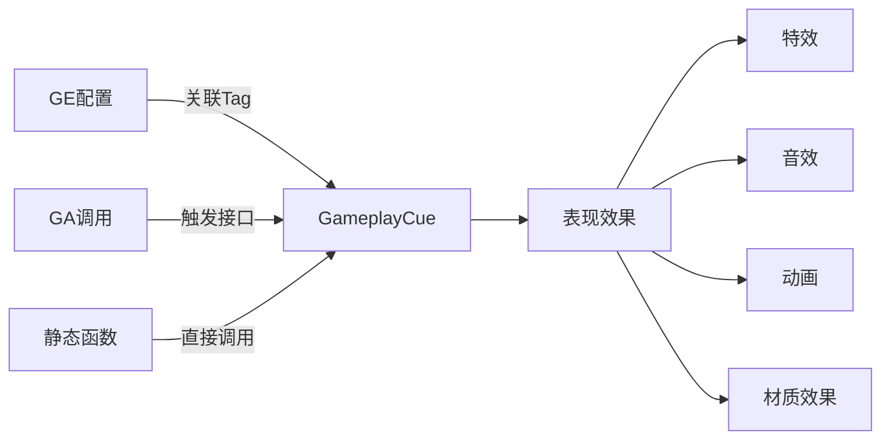

# GC简介与配置

> 💡 **本教程基于 UE5.7**，更新了 GAS 系统的 GameplayCue（GC）机制。

## 概述

---

**GameplayCue（GC）用于播放客户端表现**（特效、音效、动画、材质效果、后处理等）。

**GameplayCue 的核心特性**：

- **解耦逻辑和表现**：通过 GameplayCue 将游戏逻辑与表现分离，逻辑更清晰，表现更容易调整
- **灵活性和可扩展性**：可以定义各种不同类型的 Cue，根据需要调整和扩展效果
- **通过 GameplayTag 触发 GameplayCue**：每个 GameplayCue 都绑定了一个对应的 GameplayTag

在菜单栏 **工具 → GameplayCue 编辑器** 可以查看 GameplayCue 和 GameplayTag 的绑定关系。



## GameplayCue 的状态

---

**OnActive**：对于具有生命周期的持续效果，激活（Add）表现效果（首次激活时触发）
- 对应 GameplayCue 的 `OnActive` 接口

**WhileActive**：对于具有生命周期的持续效果，激活（Add）表现效果（每次复制到客户端都会触发，即使不是刚刚激活）
- 对应 GameplayCue 的 `WhileActive` 接口

**Removed**：对于具有生命周期的持续效果，移除表现效果
- 对应 GameplayCue 的 `OnRemove` 接口

**Executed**：对于一次性的即时效果，执行表现效果
- 对应 GameplayCue 的 `OnExecute` 接口

> 💡 **OnActive 与 WhileActive 的区别**：
> 
> WhileActive 大部分情况下等同于 OnActive，但有一种情况只会调用 WhileActive 不会调用 OnActive：
> - 当一个持续的表现效果激活后，因为网络裁切或者断线重连消失在玩家视野，然后重新进入视野时重新在客户端触发激活（Add）表现效果
> - 再次进入视野时从 DS 复制下来的表现效果因为不是首次触发激活，不会执行 `OnActive`
> - 但 `WhileActive` 是总是会被触发
> 
> **根据具体需求决定用哪个接口处理，大部分情况应该用 WhileActive 更合适**

```cpp
// UE5.7 中的 GameplayCue 事件类型定义
namespace EGameplayCueEvent
{
    enum Type : int
    {
        /** 在首次激活时调用，客户端见证激活时触发 */
        OnActive,

        /** 在持续活跃时调用，即使不是刚刚激活（比如中途加入游戏） */
        WhileActive,

        /** 执行时调用，用于瞬时效果或周期性触发 */
        Executed,

        /** 移除时调用 */
        Removed
    };
}
```

## GameplayCue 的触发方式

---

### 1. GE 配置 GameplayCue 关联的 GameplayTag

在 GE 的 `GameplayCue Tags` 字段中添加对应的 Tag，GE 应用/移除时会自动触发关联的 GC。

### 2. GA 调用对应的接口触发

在 GA 中可以通过 `AbilitySystemComponent` 的接口触发 GC：
- `AddGameplayCue`
- `RemoveGameplayCue`
- `ExecuteGameplayCue`

### 3. 调用对应静态函数触发

可以直接调用 `UGameplayCueManager` 的静态函数来触发 GC。

> 💡 **触发方式选择**：
> - 一次性的即时效果 GC，一般是通过 `Execute` 接口触发
> - 具有生命周期的持续效果，一般是通过 `Add` 接口触发，`Remove` 执行移除

## GC 配置

---

GameplayCue 可以通过创建蓝图的方式来创建，蓝图的基类可以选择：

- **`UGameplayCueNotify_Static`**：轻量级，无实例
- **`AGameplayCueNotify_Actor`**：需要实例的复杂表现
- **`UGameplayCueNotify_Burst`**（GCN Burst）：通用一次性效果
- **`AGameplayCueNotify_BurstLatent`**（GCN Burst Latent）：带延迟的一次性效果
- **`AGameplayCueNotify_Looping`**（GCN Looping）：循环持续效果

可以根据具体需求在上述基类中派生具体的子类来扩展。

创建完后，需要为其关联 Tag（在蓝图的 `GameplayCueTag` 字段中设置）。

## GameplayCueNotify_Static

---

继承自 `UObject`，使用时直接用 CDO 对象（只读，全局共享对象），不会产生单独的实例对象。

**适用于不需要创建单独的实例的表现效果**，比如一个持续 5s 的粒子特效，一个持续 1s 的摄像机效果，只负责触发播放，不用关心后续操作，效果会自动结束。

一般实现 `OnExecute` 接口（一次性触发）。

```cpp
// UE5.7 中的 UGameplayCueNotify_Static 关键字段
class GAMEPLAYABILITIES_API UGameplayCueNotify_Static : public UObject
{
    // 关联的 Tag
    UPROPERTY(EditDefaultsOnly, Category = GameplayCue)
    FGameplayTag GameplayCueTag;

    // 如果为 false，则会触发父级 Tag 关联的 GameplayCue
    // 比如该 GameplayCue 关联的 Tag 是 Damage.Physical.Slash
    // 如果为 false 则还会触发 Tag Damage.Physical 关联的 GameplayCue
    UPROPERTY(EditDefaultsOnly, Category = GameplayCue)
    bool IsOverride = true;
};
```

### 处理流程

```cpp
bool UGameplayCueSet::HandleGameplayCueNotify_Internal(...)
{   
    if (UGameplayCueNotify_Static* NonInstancedCue = 
        Cast<UGameplayCueNotify_Static>(CueData.LoadedGameplayCueClass->ClassDefaultObject))
    {
        if (NonInstancedCue->HandlesEvent(EventType))
        {
            NonInstancedCue->HandleGameplayCue(TargetActor, EventType, Parameters);
            
            if (!NonInstancedCue->IsOverride)
            {
                // 如果 IsOverride 为 false，触发父级 Tag 关联的 GameplayCue
                HandleGameplayCueNotify_Internal(TargetActor, CueData.ParentDataIdx, 
                    EventType, Parameters);
            }
        }
    }
}
```

## GameplayCueNotify_Actor

---

继承自 `AActor`，使用时会产生一个 Actor 实例对象（会有对象池管理）。

**适用于那些复杂些的持续表现效果**，可能需要维护生命周期和状态信息。一般在表现效果添加时执行 `OnActive` 接口，表现效果移除时执行 `OnRemove` 接口。

```cpp
// UE5.7 中的 AGameplayCueNotify_Actor 关键字段
class GAMEPLAYABILITIES_API AGameplayCueNotify_Actor : public AActor
{
    // 关联的 Tag
    UPROPERTY(EditDefaultsOnly, Category = GameplayCue)
    FGameplayTag GameplayCueTag;

    // 如果为 false，则会触发父级 Tag 关联的 GameplayCue
    UPROPERTY(EditDefaultsOnly, Category = GameplayCue)
    bool IsOverride = true;

    // 是否在移除效果时，自动销毁或者回收 Actor 对象
    UPROPERTY(EditDefaultsOnly, Category = Cleanup)
    bool bAutoDestroyOnRemove = true;

    // bAutoDestroyOnRemove 为 true 时，自动销毁或者回收 Actor 对象的延迟时间
    UPROPERTY(EditAnywhere, Category = Cleanup)
    float AutoDestroyDelay = 0.0f;

    // 是否自动 Attach 到 Owner
    UPROPERTY(EditDefaultsOnly, Category = GameplayCue)
    bool bAutoAttachToOwner = true;

    // 同一个 GameplayCue 实例是否运行多次触发 OnActive 事件
    UPROPERTY(EditDefaultsOnly, Category = GameplayCue)
    bool bAllowMultipleOnActiveEvents = false;

    // 同一个 GameplayCue 实例是否允许多次触发 WhileActive 事件
    UPROPERTY(EditDefaultsOnly, Category = GameplayCue)
    bool bAllowMultipleWhileActiveEvents = false;

    // 对象池的池子预分配大小
    UPROPERTY(EditDefaultsOnly, Category = GameplayCue)
    int32 NumPreallocatedInstances = 0;
};
```

### 对象池机制

GC Actor 支持对象池复用，默认开启：

```cpp
// UE5.7 中对象池配置
int32 GameplayCueActorRecycle = 1;

static FAutoConsoleVariableRef CVarGameplayCueActorRecycle(
    TEXT("AbilitySystem.GameplayCueActorRecycle"), 
    GameplayCueActorRecycle, 
    TEXT("Allow recycling of GameplayCue Actors"), 
    ECVF_Default);

bool UGameplayCueManager::IsGameplayCueRecyclingEnabled()
{
    return GameplayCueActorRecycle > 0;
}
```

**获取或创建对象流程**：
1. 如果播放该表现效果的目标上有同样的效果且配置了共用实例，直接返回已有的效果对象
2. 启用了对象池则尝试从池子中取出来
3. 池子中没有或者没启用池子则新建一个

**回收对象流程**：
1. 启用了对象池则回收回对象池（不销毁）
2. 没启用对象池或者回收失败则直接销毁

> 💡 实例有可能是放到一个对象池维护的，所以在表现效果移除时（OnRemove），记得重置存放的变量信息

## UE5.7 中的 Lyra 示例

---

Lyra 项目中的 GC 使用方式：

```cpp
// Lyra 中的 GC 触发示例
void ULyraGameplayAbility::PlayGrantedAbilitySound()
{
    if (GrantedSound.GameplayCueTag.IsValid())
    {
        GetAbilitySystemComponentFromActorInfo()->ExecuteGameplayCue(
            GrantedSound.GameplayCueTag,
            GetOriginatorAbilitySystemComponent()->MakeEffectContextHandle()
        );
    }
}
```

Lyra 使用 `UGameplayCueNotify_Burst` 和 `AGameplayCueNotify_Looping` 来处理大部分视觉效果和音效。

## 参考资料

---

- [UE5.7 GAS 官方文档](https://docs.unrealengine.com/5.7/en-US/)
- Lyra Starter Game 源码
- 原始教程：GC-1.0简介&配置.md

<!-- nav:auto -->

---

**导航**: ← [[30-tutorials/gas/19-Tag网络复制|19-Tag网络复制]] · [[30-tutorials/gas/21-GC运行时详解|21-GC运行时详解]] →

<!-- /nav:auto -->
