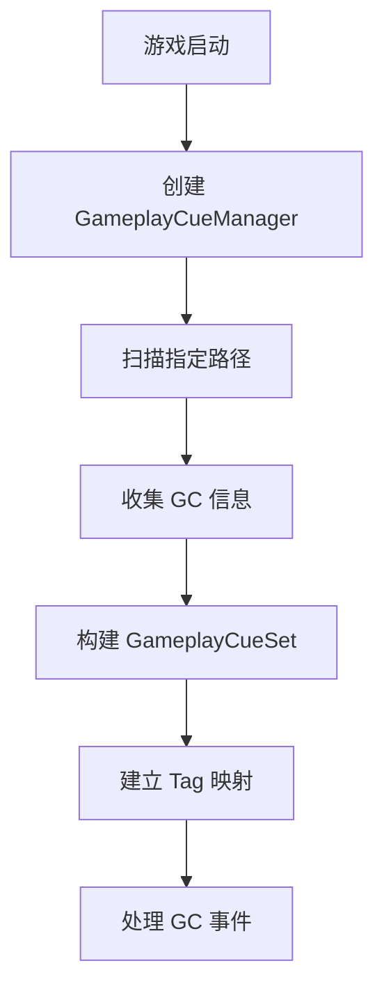
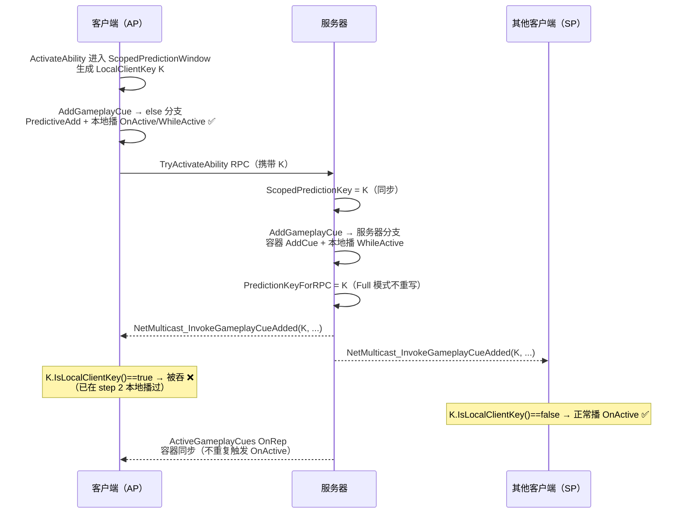
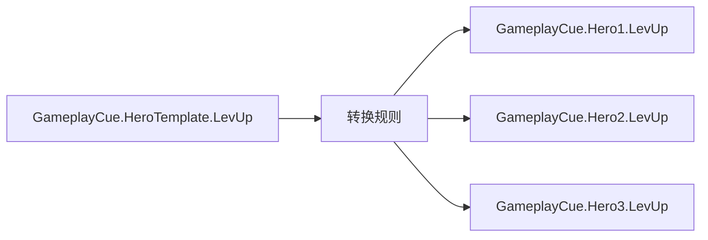
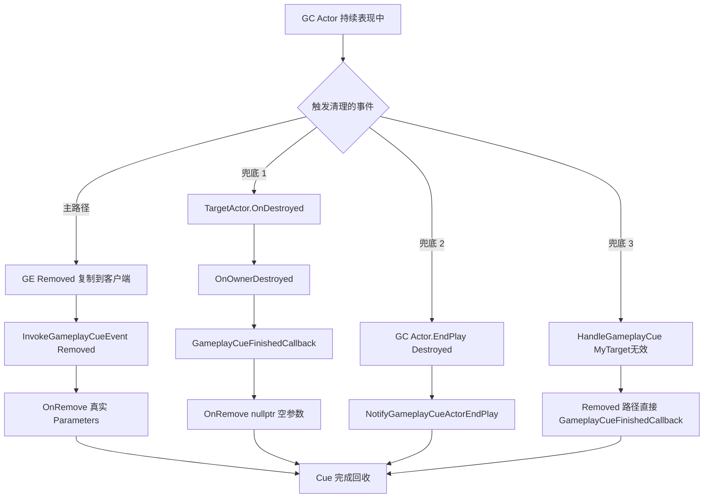
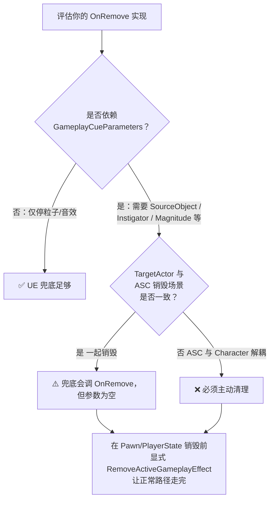

# GC运行时详解

> 💡 **本教程基于 UE5.7**，详细介绍 GameplayCue 的运行时机制。

## 概述

---

- `UGameplayCueManager` 是 GameplayCue 的管理器，游戏启动时会创建一个全局的管理器
- 创建 `UGameplayCueManager` 时会创建一个 `UGameplayCueSet` 实例用于存放所有收集到的 GameplayCue 信息
- `UGameplayCueSet` 承担了主要的管理逻辑，`UGameplayCueManager` 主要是负责与其他功能模块的对接

> 💡 GameplayCue 后续简称 GC

## 管理器 GameplayCueManager

---

游戏启动时会创建一个全局的 `UGameplayCueManager` 类型变量 `GlobalGameplayCueManager` 负责管理所有的 GameplayCue（存放在 `UAbilitySystemGlobals` 里）。

会扫描指定路径的所有 GameplayCue，将扫描到的信息收集整理放到 `UGameplayCueSet` 实例中。大部分管理执行逻辑会转发到 `UGameplayCueSet` 进行执行。

可以新建一个管理类继承自 `UGameplayCueManager`，方便根据需求对管理器进行定制化修改。需要修改在 `DefaultGame.ini` 的配置的 GameplayCue 管理器类型信息（C++ 类或者是一个蓝图）。



## 集合 GameplayCueSet

---

首次创建 `UGameplayCueManager` 时，会创建一个 `UGameplayCueSet` 对象，`UGameplayCueSet` 存放了所有的 GameplayCue 信息，并为 `FGameplayTag` 和 GameplayCue 建立映射表。

```cpp
// UE5.7 中的 UGameplayCueSet 数据结构
class GAMEPLAYABILITIES_API UGameplayCueSet : public UDataAsset
{
    // FGameplayCueNotifyData 对象数组
    // 存放了所有 GameplayTag 和 GameplayCue 的对应信息
    UPROPERTY()
    TArray<FGameplayCueNotifyData> GameplayCueData;

    // 根据 GameplayTag 快速查找到对应的 GameplayCue 建立的映射表
    TMap<FGameplayTag, int32> GameplayCueDataMap;
};
```

### GameplayCueData

`FGameplayCueNotifyData` 对象数组。`FGameplayCueNotifyData` 存放了一个 `FGameplayTag` 及其关联的 GameplayCue 信息。所有的 GameplayTag 和 GameplayCue 的对应信息都放在这个数组里。

`FGameplayCueNotifyData` 还有个字段 `ParentDataIdx`，这个索引值是指的当前 GameplayTag 的直接父级 GameplayTag 对应的 `FGameplayCueNotifyData` 在该数组里的索引。

```cpp
struct FGameplayCueNotifyData
{
    // 关联的 Tag
    UPROPERTY(EditAnywhere, Category = GameplayCue)
    FGameplayTag GameplayCueTag;

    // GameplayCue 类路径
    UPROPERTY(...)
    FSoftObjectPath GameplayCueNotifyObj;

    // 加载后的 GameplayCue 类
    UPROPERTY(transient)
    TObjectPtr<UClass> LoadedGameplayCueClass;

    // 父级 Tag 在 GameplayCueData 中的索引
    int32 ParentDataIdx;
};
```

> 💡 GameplayCue 支持通过子 Tag 触发直接父级 Tag 所管理的效果，比如 `Tag.A.A1` 支持同时触发 `Tag.A.A1` 关联的 GameplayCue 及其父级 `Tag.A` 关联的 GameplayCue。这里就得知道其父级 Tag 所对应的映射信息是哪个。

### GameplayCueDataMap

这是为了根据 GameplayTag 快速查找到对应的 GameplayCue 建立的一个映射表。

在初始化时开始通过 `UGameplayCueManager::InitializeRuntimeObjectLibrary()` 收集配置的 GameplayCue 资源。

```cpp
// UE5.7 中初始化对象库
void UGameplayCueManager::InitializeRuntimeObjectLibrary()
{
    RuntimeGameplayCueObjectLibrary.Paths = GetAlwaysLoadedGameplayCuePaths();
    
    if (RuntimeGameplayCueObjectLibrary.CueSet == nullptr)
    {
        RuntimeGameplayCueObjectLibrary.CueSet = 
            NewObject<UGameplayCueSet>(this, TEXT("GlobalGameplayCueSet"));
    }

    RuntimeGameplayCueObjectLibrary.bHasBeenInitialized = true;
    
    InitObjectLibrary(RuntimeGameplayCueObjectLibrary);
}
```

`GetAlwaysLoadedGameplayCuePaths` 获取在 `DefaultGame.ini` 配置 GameplayCue 默认加载路径，可以配置多个路径，**GameplayCue 必须放在这些指定的目录中，否则无法被加载**。

也可以通过代码去添加配置路径（`UGameplayCueManager::AddGameplayCueNotifyPath`），添加后需要触发 `InitializeRuntimeObjectLibrary()` 收集新增配置路径的 GameplayCue。

> 💡 如果 GameplayCue 配置在指定目录之外，会有提示是个无效的 GameplayCue 路径。

## 激活容器 ActiveGameplayCueContainer

---

- DS 上用于存放当前激活的**持续性表现**效果（GC）的容器
- `FActiveGameplayCueContainer` 类型，通过属性复制将容器复制到客户端
- 容器复制到客户端后再触发对应的 GC 事件

> 💡 对于那些存在生命周期的持续性表现效果（Add/Remove），会放入一个管理容器 `ActiveGameplayCueContainer` 中，这样就算在表现效果期间出现断线重连或者网络裁切导致客户端角色重建，也能通过容器中保存的表现效果在角色重建时恢复表现效果

## GC 执行流程

---

### 触发方式

**GE 配置 GameplayCue 关联的 GameplayTag**、**GA 调用对应的接口触发**、**调用对应静态函数触发**

### 多端触发机制

**在客户端直接添加播放 GC**：

```cpp
// 添加持续表现
void UGameplayCueManager::AddGameplayCue_NonReplicated(...)
{
    if (UAbilitySystemComponent* ASC =
        UAbilitySystemGlobals::GetAbilitySystemComponentFromActor(Target))
    {
        ASC->AddLooseGameplayTag(GameplayCueTag);
    }

    if (UGameplayCueManager* GCM = UAbilitySystemGlobals::Get().GetGameplayCueManager())
    {
        GCM->HandleGameplayCue(...EGameplayCueEvent::OnActive);
        GCM->HandleGameplayCue(...EGameplayCueEvent::WhileActive);
    }
}
```

**在 DS 端添加 GC 再通过网络播放**：

对于网络同步的持续表现效果，DS 端会维护一个激活效果容器 `ActiveGameplayCueContainer`。该容器支持网络复制。

```cpp
void UAbilitySystemComponent::AddGameplayCue_Internal(...)
{
    ...
    ForceReplication();
    // 添加到容器
    GameplayCueContainer.AddCue(...);
    
    // 激活事件 OnActive 单独通过广播 RPC 触发
    if (IAbilitySystemReplicationProxyInterface* ReplicationInterface =
        GetReplicationInterface())
    {
        ReplicationInterface->Call_InvokeGameplayCueAdded_WithParams(
            GameplayCueTag, PredictionKeyForRPC, GameplayCueParameters);
    }
    ...
}
```

> 💡 
> - OnActive 只会在加入 GC 容器时触发（广播 RPC）
> - WhileActive 则是在每次复制到客户端都会触发（不仅限于首次触发）
> - 对于持续性的表现效果，因为对应持续性表现效果的持续性 GE 也会通过网络复制到客户端（一般只复制到主控端），所以对于配置在持续性 GE 上的 GC，不需要再在 DS 上放到 GC 的激活容器中

### 预测 GA 触发 Add 类 Cue 的双播抑制与 ReplicationMode 差异

> ⚠️ **高频踩坑点**：在 `LocalPredicted` 类型的 GA 中调用 `ASC->AddGameplayCue(...)`，自主代理（控制者本人）有时**看不到 OnActive 表现**——根因不是 ReplicationMode 本身，而是 PredictionKey + 防双播过滤的组合行为。

#### 关键源码：广播 RPC 的过滤条件

`UAbilitySystemComponent::NetMulticast_InvokeGameplayCueAdded_WithParams_Implementation`（源码：`Engine/Plugins/Runtime/GameplayAbilities/Source/GameplayAbilities/Private/AbilitySystemComponent.cpp` L1637-L1648）：

```cpp
void UAbilitySystemComponent::NetMulticast_InvokeGameplayCueAdded_WithParams_Implementation(
    const FGameplayTag GameplayCueTag, FPredictionKey PredictionKey, FGameplayCueParameters Parameters)
{
    // 服务器生成的预测键 + 自主代理（本机控制玩家）→ 跳过；表现走 OnRep 容器路径
    bool bIsMixedReplicationFromServer =
        (ReplicationMode == EGameplayEffectReplicationMode::Mixed
         && PredictionKey.IsServerInitiatedKey()
         && AbilityActorInfo->IsLocallyControlledPlayer());

    if (IsOwnerActorAuthoritative()
        || (PredictionKey.IsLocalClientKey() == false && !bIsMixedReplicationFromServer))
    {
        InvokeGameplayCueEvent(GameplayCueTag, EGameplayCueEvent::OnActive, Parameters);
    }
}
```

把"客户端**不调用 OnActive**"的真值表展开：

| 接收端 | `IsOwnerActorAuthoritative()` | `PredictionKey.IsLocalClientKey()` | bIsMixedReplicationFromServer | 是否播 OnActive |
|---|---|---|---|---|
| 服务器 / Listen Server 自身 | true | — | — | ✅ |
| 自主代理 AP（**预测发起者本人**） | false | **true**（key 由本机生成） | — | ❌ **被吞** |
| 模拟代理 SP（其他客户端） | false | false（key 非本机生成） | — | ✅ |
| 自主代理 AP（Mixed 模式 + 服务器重写 key） | false | false | true | ❌ 被吞（不同分支） |

> 关键术语澄清：`FPredictionKey::IsLocalClientKey()` 不是"这个 key 是 client 类型"，而是"这个 key 是**当前进程**生成的本地预测 key"。同一个 key 在服务器是 false、在发起客户端是 true、在其他客户端是 false。

#### 为什么自主代理上必然是 `LocalClientKey`

源码 `AddGameplayCue_Internal`（`AbilitySystemComponent.cpp` L1486-L1546）的关键分支：

```cpp
void UAbilitySystemComponent::AddGameplayCue_Internal(... FActiveGameplayCueContainer& GameplayCueContainer)
{
    if (IsOwnerActorAuthoritative())            // —— 服务器分支
    {
        ForceReplication();
        GameplayCueContainer.AddCue(GameplayCueTag, ScopedPredictionKey, GameplayCueParameters);

        FPredictionKey PredictionKeyForRPC = ScopedPredictionKey; // ★ 默认带原始 key 走
        if (ReplicationMode == EGameplayEffectReplicationMode::Mixed) // ★ 只有 Mixed 进入补救
        {
            if (GameplayCueContainer.bMinimalReplication)
                PredictionKeyForRPC = FPredictionKey::CreateNewServerInitiatedKey(this);
            else if (ScopedPredictionKey.IsServerInitiatedKey())
                PredictionKeyForRPC = FPredictionKey();
        }
        ReplicationInterface->Call_InvokeGameplayCueAdded_WithParams(GameplayCueTag, PredictionKeyForRPC, GameplayCueParameters);

        if (!bWasInList)
            InvokeGameplayCueEvent(GameplayCueTag, EGameplayCueEvent::WhileActive, GameplayCueParameters);
    }
    else if (ScopedPredictionKey.IsLocalClientKey()) // —— 客户端预测分支
    {
        GameplayCueContainer.PredictiveAdd(GameplayCueTag, ScopedPredictionKey);
        InvokeGameplayCueEvent(GameplayCueTag, EGameplayCueEvent::OnActive,    GameplayCueParameters); // ★ 客户端立即本地播
        InvokeGameplayCueEvent(GameplayCueTag, EGameplayCueEvent::WhileActive, GameplayCueParameters);
    }
}
```

端到端时序（Full 模式 + LocalPredicted GA）：



#### 设计意图：消除自主代理上的双播

| ReplicationMode | 自主代理 OnActive 路径 | 双播抑制手段 |
|---|---|---|
| **Full** | 客户端 `PredictiveAdd` 已播 + 服务器侧容器 `OnRep` 同步到客户端 | 用 `IsLocalClientKey()` 直接过滤广播 RPC |
| **Mixed** | 自主代理走完整复制（同 Full），模拟代理只走 Minimal 容器 | 服务器把 key 重写成 `ServerInitiatedKey`，由 `bIsMixedReplicationFromServer` 过滤 |
| **Minimal** | 不适合 owner 自用（注释 L82：`does not work for Owned ASC`） | — |

**Full 模式下"吞广播"是有意为之**：引擎信任客户端"已经通过 else 分支播过"，再放进 RPC 会双播。问题只在于——**客户端实际上是否走了 else 分支**。

#### 故障定位：客户端 else 分支"没跑"的常见原因

要让 else 分支生效，必须同时满足：

1. GA 的 `NetExecutionPolicy` 是 `LocalPredicted` 或 `LocalOnly`——`ServerOnly` / `ServerInitiated` 客户端**根本不 Activate**
2. 调 `AddGameplayCue` 时 `ASC->ScopedPredictionKey.IsLocalClientKey() == true`
3. 调用点在 `FScopedPredictionWindow` 还有效的栈帧内（`ActivateAbility` 主体 OK；`CommitAbility` 同栈 OK；**AbilityTask 异步回调 / 帧后 Timer 通常已失效**）

> 💡 一个特别隐蔽的现象：同步路径调 `AddGameplayCue` 在自主代理看不到表现，**改成在 AbilityTask 回调里调反而能看到**。这是因为 Task 回调时已出预测窗口，`ScopedPredictionKey` 不是 LocalClientKey 了——客户端 else 分支条件不成立 = 不本地播；服务器照常发广播，自主代理收到的 key 不是 LocalClientKey → 走广播路径反而正常播。这种"诡异修复"实际上是绕开了预测，预测的撤销保护也丢了。

#### 推荐实现方式（按场景选）

| 场景 | 推荐方案 |
|---|---|
| 一次性 burst 表现（命中音、出招闪光） | **`ExecuteGameplayCue`**：客户端本地立即播 + 服务器广播被自家吞，不会双播。Lyra 武器命中音效采用此路径 |
| 持续 Add/Remove + Full 模式 + 必须预测 | 服务器调 `AddGameplayCue_MinimalReplication`，客户端 GA 内手动 `InvokeGameplayCueEvent(OnActive)` + `EndAbility` 手动 `InvokeGameplayCueEvent(OnRemove)` |
| Add/Remove + 项目允许 Mixed | 切到 `EGameplayEffectReplicationMode::Mixed`（**Lyra 默认**，详见 [[20-modules/cpp/ULyraAbilitySystemComponent]]） |
| 必须保留 Full + Add/Remove | 在 GA 内显式分支：`HasAuthority` 走 `AddGameplayCue`，否则手动 `InvokeGameplayCueEvent(OnActive/WhileActive)` 本地补播，并在预测拒绝回调里手动 `OnRemove` 撤销 |

详细排查决策树与完整方案对比见 [[80-gotchas/gas-predicted-add-cue-on-full-replication]]。

### GC 事件执行

**执行堆栈**：

1. 其他模块最终调用到 `UGameplayCueManager::HandleGameplayCue` 开始触发 GC 事件执行
2. `UGameplayCueManager` 再调用到 `UGameplayCueSet` 的 `HandleGameplayCueNotify_Internal`
   - 先根据 Tag 在 `UGameplayCueSet` 存放所有 GC 配置信息的数组中找到对应 GC 配置数据
   - 如果是 Static 类型的则直接使用 CDO 执行
   - 如果是 Actor 类型的，找到对应的 GC 实例
3. GC 事件最终执行的函数是 `HandleGameplayCue`（以 `AGameplayCueNotify_Actor` 为例），根据触发的事件类型调用对应的执行接口

```cpp
void AGameplayCueNotify_Actor::HandleGameplayCue(...)
{
    switch (EventType)
    {
    case EGameplayCueEvent::OnActive:
        OnActive(MyTarget, Parameters);
        break;
    case EGameplayCueEvent::WhileActive:
        WhileActive(MyTarget, Parameters);
        break;
    case EGameplayCueEvent::Executed:
        OnExecute(MyTarget, Parameters);
        break;
    case EGameplayCueEvent::Removed:
        OnRemove(MyTarget, Parameters);
        break;
    };
}
```

## Tag 转换 GameplayCueTranslationManager

---

GameplayCue 提供一套转换机制，可以将一个 GameplayTag 根据特定的规则自动转换成多个不同的 GameplayTag。

比如以下 Tag 分别对应不同英雄的升级表现：
- `GameplayCue.Hero1.LevUp`
- `GameplayCue.Hero2.LevUp`
- `GameplayCue.Hero3.LevUp`

常规操作是在播放表现时判定不同的英雄触发不同的 GameplayTag。还有一种通过 `GameplayCueTranslation` 机制实现的方式，就是定制一个转换规则，将一个指定的字符串根据转化规则映射成不同的字符串。



转换规则示例：

```cpp
class UGameplayCueTranslator_Test : public UGameplayCueTranslator
{
    GENERATED_BODY()

public:
    // 构建规则的映射关系（多个转换映射）
    virtual void GetTranslationNameSwaps(TArray<FGameplayCueTranslationNameSwap>& SwapList) const override
    {
        {
            FGameplayCueTranslationNameSwap Temp;
            Temp.FromName = FName(TEXT("HeroTemplate"));
            Temp.ToNames.Add(FName(TEXT("Hero1")));
            SwapList.Add(Temp);
        }
        // ... 添加更多映射
    }

    // 根据目标是哪个英雄决定使用哪个转换映射
    virtual int32 GameplayCueToTranslationIndex(AActor* TargetActor) const override
    {
        return GetTranslationIndexByHeroType(TargetActor);
    }

    // 是否启用该规则
    virtual bool IsEnabled() const override { return true; }
};
```

## UE5.7 更新内容

---

1. **对象池优化**：UE5.7 进一步优化了 GC Actor 的对象池管理机制，减少了内存碎片
2. **网络复制增强**：`FActiveGameplayCueContainer` 的复制逻辑更加高效
3. **Tag 转换性能提升**：`FGameplayCueTranslationManager` 的构建速度更快

## GC Actor 销毁兜底机制

---

> 💡 这是 GAS 实战中容易踩坑的边界场景：当 ASC 所在 Actor 或 GC 的 TargetActor 被销毁时，OnRemove 是否一定能执行？引擎给的答案是"**通过 Owner 销毁链路兜底**"，但有重要细节。

### Owner 关系 vs Attach 关系

`AGameplayCueNotify_Actor` 有两种与目标的关系，**必须分清**：

| 关系 | 字段 | 作用 |
|---|---|---|
| **Owner 关系**（逻辑归属） | `AActor::Owner`（通过 `SetOwner` 建立） | **决定销毁联动**——通过 `OnDestroyed` delegate 触发兜底 |
| **Attach 关系**（Transform） | `bAutoAttachToOwner`（默认 `false`） | **位置/旋转跟随**——不影响销毁联动 |

> ⚠️ **常见误解订正**：`AGameplayCueNotify_Actor` 的 `bAutoAttachToOwner` 与 `bAutoDestroyOnRemove` **构造函数默认值都是 `false`**（源码：`Engine/Plugins/Runtime/GameplayAbilities/Source/GameplayAbilities/Private/GameplayCueNotify_Actor.cpp` L42-L55）。Lyra 中是在具体子类配置上把它们打开的，并非引擎默认行为。

### Owner 是谁：始终是 TargetActor

`UGameplayCueManager::GetInstancedCueActor` 中 cue 的 Owner 设置：

```cpp
// 源码：Engine/Plugins/Runtime/GameplayAbilities/.../GameplayCueManager.cpp
// L505 复用路径
RecycledCue->SetOwner(TargetActor);

// L525 新建路径
SpawnParams.Owner = TargetActor;
```

**`TargetActor` 是 ASC 调用 `AddCue` / `InvokeGameplayCueEvent` 时传入的目标**，对 GE 关联的 cue 而言通常是 `ASC->GetAvatarActor()`（Lyra 中即 `ALyraCharacter`）。**不是** ASC 本身，**也不是** PlayerState。

### 兜底链：OnOwnerDestroyed → 强制 OnRemove

`AGameplayCueNotify_Actor::SetOwner` 在 owner 上注册了销毁回调：

```cpp
// GameplayCueNotify_Actor.cpp L170
void AGameplayCueNotify_Actor::SetOwner(AActor* InNewOwner)
{
    ClearOwnerDestroyedDelegate();
    Super::SetOwner(InNewOwner);
    if (AActor* NewOwner = GetOwner())
    {
        NewOwner->OnDestroyed.AddDynamic(this, &AGameplayCueNotify_Actor::OnOwnerDestroyed);
        AttachToOwnerIfNecessary();
    }
}
```

当 TargetActor 被销毁时：

```cpp
// GameplayCueNotify_Actor.cpp L319
void AGameplayCueNotify_Actor::OnOwnerDestroyed(AActor* DestroyedActor)
{
    if (bInRecycleQueue) { return; }
    GameplayCueFinishedCallback();
}

// GameplayCueNotify_Actor.cpp L361
void AGameplayCueNotify_Actor::GameplayCueFinishedCallback()
{
    ...
    // ⭐ 关键兜底：WhileActive 触发过、但 OnRemove 没触发过
    //    强制用 null 参数调一次 OnRemove，确保用户清理逻辑跑过
    if (bHasHandledWhileActiveEvent && !bHasHandledOnRemoveEvent)
    {
        bHasHandledOnRemoveEvent = true;
        OnRemove(nullptr, FGameplayCueParameters());  // ★ 兜底 OnRemove
    }
    UAbilitySystemGlobals::Get().GetGameplayCueManager()->NotifyGameplayCueActorFinished(this);
    // → 进对象池或销毁
}
```

### 三层兜底总览



| 兜底层 | 触发条件 | OnRemove 是否执行 | Parameters 完整性 |
|---|---|---|---|
| 主路径 | GE Remove FastArray delta 复制成功 | ✅ 执行 | ✅ 完整 |
| 兜底 1（Owner 销毁） | TargetActor 被销毁 | ✅ 执行（前提：WhileActive 已触发过） | ❌ **空参数** |
| 兜底 2（自身 EndPlay） | GC Actor 直接被销毁 | ❌ 不执行 OnRemove | — |
| 兜底 3（Removed + 无效 Target） | Removed 事件 + MyTarget 已无效 | ❌ 跳过 OnRemove | — |

### 各种销毁场景的兜底命中

| 场景 | TargetActor 销毁 | OnRemove 是否调用 | 备注 |
|---|---|---|---|
| Character 死亡，PlayerState 留存 | ✅ | ✅ 兜底（空参数） | GE 在 ASC 上继续走完 |
| PlayerState + Character 一起销毁（玩家离场） | ✅ | ✅ 兜底（空参数） | 最常见的离场场景 |
| 玩家断线 / 网络裁切 | ✅（客户端 Pawn destroy） | ✅ 兜底 | — |
| ASC 转移、Character 与 PlayerState 解耦 | ❌ | ❌ **可能漏调** | 真正的孤儿化场景 |
| 自定义 GameplayCueManager 改了 Owner 设置 | 视实现而定 | ⚠️ 需自查 | — |

### 是否需要工程介入：决策树



**关键结论**：

- ✅ **GC Actor 几乎不会泄漏**：Owner 销毁兜底 + 对象池回收的双保险，绝大多数场景下都能正确清理 GC Actor 实例。
- ⚠️ **OnRemove 的 Parameters 可能是空的**：兜底路径强制传 `nullptr` + `FGameplayCueParameters()`。如果你的 OnRemove 依赖 `Parameters.SourceObject`、`Instigator`、`AggregatedSourceTags`、`Magnitude` 做差异化清理，**这些信息全部丢失**。
- ❌ **GE Removed 事件本身没有兜底**：当 ASC 作为 SubObject 直接被 Iris 的 `Destroy` 路径销毁时，承载 GE 的 FastArray 不会广播 `PreReplicatedRemove`，因此走不到带完整 Parameters 的"主路径"。

### 工程实践

如果需要**完整 Parameters** 的 OnRemove，必须在 Pawn / PlayerState 销毁前主动清理 GE，让 Removed 事件先于 Actor 销毁通过 FastArray 复制送达客户端：

```cpp
// 服务器侧 Pawn 死亡入口（Lyra 风格）
void ALyraCharacter::OnDeathFinished(AActor* OwningActor)
{
    if (HasAuthority())
    {
        if (UAbilitySystemComponent* ASC = GetAbilitySystemComponent())
        {
            // 1. 显式移除关心的 GE，触发 FastArray Remove → Iris 复制 → 客户端 OnRemove
            ASC->RemoveActiveEffects(FGameplayEffectQuery());

            // 2. 显式清理 ActiveGameplayCueContainer（兜底处理 GE 之外的 Cue）
            ASC->RemoveAllGameplayCues();

            // 3. 强制立即 NetUpdate
            ASC->ForceReplication();
        }
    }
    DestroyDueToDeath();
}
```

**Iris 下的额外注意**：`ForceNetUpdate` 在 Iris 下只能影响 SendUpdate 调度优先级，**不能保证同帧发送**。如果在 `Destroy()` 同一调用栈中销毁 PlayerState，当帧 SendUpdate 阶段 dirty 数据可能尚未序列化对象就已被 detach。**最稳妥的方式是延迟一帧再销毁**：

```cpp
GetWorldTimerManager().SetTimerForNextTick([this]()
{
    Destroy();
});
```

详见知识库已知坑条目 `80-gotchas/gas-cue-cleanup-on-asc-destroy`（仅在项目 wiki 中可见）。

## 调试指令

---

```cpp
// 显示 GC 事件
int32 DisplayGameplayCues = 0;
static FAutoConsoleVariableRef CVarDisplayGameplayCues(
    TEXT("AbilitySystem.DisplayGameplayCues"),
    DisplayGameplayCues,
    TEXT("Display GameplayCue events in world as text."),
    ECVF_Default);

// 禁用所有 GC 事件
int32 DisableGameplayCues = 0;
static FAutoConsoleVariableRef CVarDisableGameplayCues(
    TEXT("AbilitySystem.DisableGameplayCues"),
    DisableGameplayCues,
    TEXT("Disables all GameplayCue events in the world."),
    ECVF_Default);

// 设置 GC 显示持续时间
float DisplayGameplayCueDuration = 5.f;
static FAutoConsoleVariableRef CVarDurationDisplayGameplayCues(
    TEXT("AbilitySystem.GameplayCue.DisplayDuration"),
    DisplayGameplayCueDuration,
    TEXT("Duration to display GameplayCue events."),
    ECVF_Default);
```

## 参考资料

---

- [UE5.7 GAS 官方文档](https://docs.unrealengine.com/5.7/en-US/)
- Lyra Starter Game 源码
- 原始教程：GC-2.0运行时详解.md

<!-- nav:auto -->

---

**导航**: ← [[30-tutorials/gas/20-GC简介与配置|20-GC简介与配置]] · [[30-tutorials/gas/22-AbilityTask详解|22-AbilityTask详解]] →

<!-- /nav:auto -->
