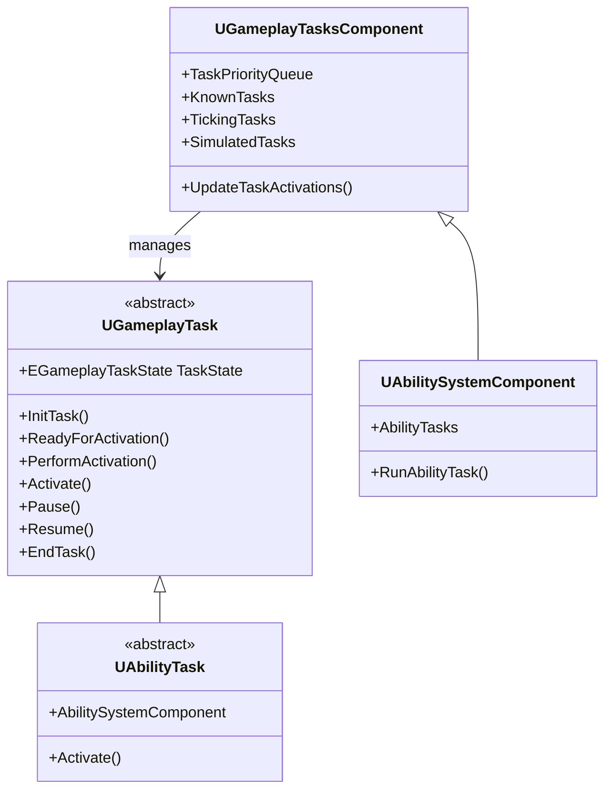
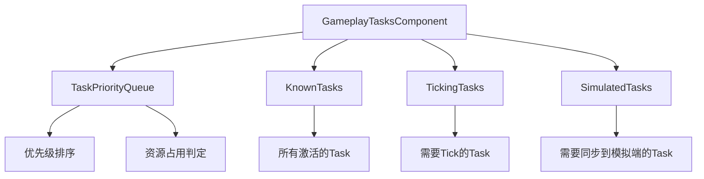

# AbilityTask详解

> 💡 **本教程基于 UE5.7**，详细介绍 AbilityTask 的机制与实现。

## 概述

---

UE 提供了一套 Task（任务）机制，可以通过 Task 机制管理一组游戏中定制的任务（行为）。比如 AI 行为树中的行为执行节点（AITask），GA 中使用的行为执行节点（AbilityTask）（GA 可以理解为一个或多个 Task 的集合）。

- `UGameplayTask` 是 Task 的基类
- `UGameplayTasksComponent` 是 Task 管理组件的基类
- `UAbilityTask` 继承自 `UGameplayTask`，是 GAS 模块专属 Task
- `UAbilitySystemComponent` 继承自 `UGameplayTasksComponent`，其功能之一就是管理 AbilityTask



**Task 的特性**：

- 可以添加、激活、取消
- 生命周期内会自动处理任务的开始、执行和结束
- 支持异步任务执行，允许任务在后台运行
- 通过状态管理任务的不同阶段（如等待激活、激活、暂停、完成）
- 支持回调机制，可以在任务完成或状态变化时通知其他系统或组件

## GameplayTask 执行流程

---

### NewTask：创建 Task 实例

```cpp
template <class T>
T* UGameplayTask::NewTask(IGameplayTaskOwnerInterface& TaskOwner, FName InstanceName)
{
    T* MyObj = NewObject<T>();
    MyObj->InstanceName = InstanceName;
    MyObj->InitTask(TaskOwner, TaskOwner.GetGameplayTaskDefaultPriority());
    return MyObj;
}
```

> 💡 AbilityTask 和 AITask 都有自己专属创建 Task 实例的接口，不要使用通用的 `NewTask` 来创建
> - AbilityTask 通过 `NewAbilityTask` 创建
> - AITask 通过 `NewAITask` 创建

### InitTask：初始化 Task

Task 状态置为 `AwaitingActivation`（等待激活），通知 Task 拥有者 Task 初始化完毕。

```cpp
void UGameplayTask::InitTask(UGameplayTaskOwnerInterface& InTaskOwner, 
    int32 InPriority, UObject* InChildTask = nullptr)
{
    ...
    // Task 状态置为 AwaitingActivation（等待激活）
    TaskState = EGameplayTaskState::AwaitingActivation;
    
    // 通知 Task 拥有者 Task 初始化完毕
    InTaskOwner.OnGameplayTaskInitialized(*this);
    ...
}
```

### ReadyForActivation：准备激活

有些 Task 需要考虑优先级或者资源占用要放入队列进行进一步判断，不需要考虑则直接执行激活。

```cpp
void UGameplayTask::ReadyForActivation()
{
    if (UGameplayTasksComponent* TasksPtr = TasksComponent.Get())
    {
        if (RequiresPriorityOrResourceManagement() == false)
        {
            // 不需要考虑则直接执行激活
            PerformActivation();
        }
        else
        {
            // 需要考虑优先级或者资源占用要放入队列就行进一步判断
            TasksPtr->AddTaskReadyForActivation(*this);
        }
    }
    else
    {
        EndTask();
    }
}
```

### PerformActivation：执行激活

状态置为激活，调用执行激活的具体行为逻辑接口 `Activate`，加入管理组件 Task 激活列表进行管理。

```cpp
void UGameplayTask::PerformActivation()
{
    ...
    TaskState = EGameplayTaskState::Active;
    
    // 执行激活的具体行为逻辑
    Activate();
    
    // 通知 Task 的管理组件 Task 激活了，放入 Task 激活列表（需要执行 Tick 还需要放入 Tick 列表）
    // 如果 Task 是一次性的，执行完了就结束了，则没必要再放入列表了
    if (IsFinished() == false)
    {
        TasksComponent->OnGameplayTaskActivated(*this);
    }
}
```

### Activate：执行激活的具体行为逻辑接口

各种 Task 根据自己需求重载，实现具体的行为逻辑。

### Pause：Task 的暂停（暂时失效）

状态置为 Paused，通知 Task 的管理组件 Task 暂时失效（停止 Tick 之类）。

```cpp
void UGameplayTask::Pause()
{
    TaskState = EGameplayTaskState::Paused;
    
    // 通知 Task 的管理组件 Task 暂时失效
    TasksComponent->OnGameplayTaskDeactivated(*this);
}
```

### Resume：Task 的恢复（重新生效）

状态置为 Resume，通知 Task 的管理组件 Task 被激活了（不会再次触发 Activate 接口）。

### EndTask：Task 结束，触发销毁 Task

```cpp
void UGameplayTask::EndTask()
{
    if (TaskState != EGameplayTaskState::Finished)
    {
        if (IsValid(this))
        {
            OnDestroy(false);
        }
    }
}
```

### OnDestroy：执行 Task 的销毁

```cpp
void UGameplayTask::OnDestroy(bool bInOwnerFinished)
{
    TaskState = EGameplayTaskState::Finished;
    if (UGameplayTasksComponent* TasksPtr = TasksComponent.Get())
    {
        TasksPtr->OnGameplayTaskDeactivated(*this);
    }
    MarkAsGarbage();
}
```

## 子任务机制

---

Task 可以绑定一个子任务 `ChildTask`，**可以在主任务中操作子任务**（比如跟随主任务一起启动、暂停、恢复之类的），**主任务结束会同时结束绑定的子任务**。

在创建一个 Task 时可以指定其 Owner 为另一个 Task。在初始化 Task 时会通知其 Owner 该 Task 已经初始化完成，如果 Owner 是一个 Task 则会将该新创建的 Task 设置为子任务 `ChildTask`。

```cpp
void UGameplayTask::InitTask(...)
{
    InTaskOwner.OnGameplayTaskInitialized(*this);
}

void UGameplayTask::OnGameplayTaskInitialized(UGameplayTask& Task)
{
    ...
    ChildTask = &Task;
    ...
}
```

## GameplayTasksComponent

---

`UGameplayTasksComponent` 是 Task 管理组件的基类，提供了 Task 的管理和常用操作。比如 Task 的启动入口 `RunGameplayTask`、Task 管理列表、Task 网络复制、Task 的 Tick 驱动等。

`UGameplayTasksComponent` 维护四个 Task 列表：

- 优先级列表 **TaskPriorityQueue**
- 已激活列表 **KnownTasks**
- Tick 列表 **TickingTasks**
- 模拟端列表 **SimulatedTasks**



### 优先级列表 TaskPriorityQueue

当一个 Task 准备激活（`ReadyForActivation`）时，有些 Task 需要考虑执行优先级或者资源占用的判定，这种 Task 会先放入 `UGameplayTasksComponent` 的一个优先级队列 `TaskPriorityQueue`（不需要考虑上述执行条件的则直接通过 `PerformActivation` 执行激活）。

优先级队列 `TaskPriorityQueue` 中 Task 在加入队列时会根据其配置的优先级找到对应的位置插入（**优先级越大越靠前，优先被执行**）。

优先级队列 `TaskPriorityQueue` 的 Task 可以配置激活必要的资源（`RequiredResources`）和激活后会持有的资源（`ClaimedResources`）。

- 当队列的 Task 被激活时，如果配置了持有资源，则会**标记当前这些资源被持有**
- 当队列中一个 Task **配置了必要的资源（RequiredResources）且激活时其中有资源被其他 Task 持有**，则无法被激活，激活了也会被暂停（低优先级 Task 持有资源不会阻碍高优先级的 Task）

> 💡 Task 用到的资源配置（`FGameplayResourceSet`）本质上就是一个 16 位 Bit 的标记，每个资源都会分配一个对应的资源 ID（0~15），对应的就是 uint16 中的 16 个 Bit 位。所以一类 Task 最多支持配置 16 种资源（比如 AITask 和 AbilityTask 属于不同类 Task，其资产类型可以分别定制）。

### 激活列表 KnownTasks & Tick 列表 TickingTasks

**KnownTasks** 是存放当前所有已激活 Task 的列表（激活后立即结束的 Task 不会放入）。

**TickingTasks** 是存放 KnownTasks 中所有需要执行 Tick 逻辑的 Task。

**KnownTasks、TickingTasks** 在 Task 激活和取消激活时添加、移除。

> 💡 只有在 Task 执行结束调用 `OnGameplayTaskDeactivated`（取消激活）才会从 KnownTasks 移除
> 暂停触发的 `OnGameplayTaskDeactivated` 不会从 KnownTasks 移除

### 模拟 Task 列表 SimulatedTasks

`SimulatedTasks` 是存放需要同步到模拟端的任务列表（模拟 Task），如果 Task 标记为需要同步到模拟端的则会放入该列表中，该列表支持网络复制（只复制到模拟端）。

> 💡 
> - `bSimulatedTask` 标记该 Task 是否需要在模拟端执行，为 True 说明该 Task 支持网络复制
> - `bIsSimulating` 标记该 Task 是在模拟端执行执行的模拟 Task

## AbilityTask

---

`UAbilityTask` 继承自 `UGameplayTask`，是 GAS 系统的专用 Task 的基类，提供了一些常用的 Task 的节点。

有些 AbilityTask 可能在主控端和 DS 端都需要执行，一般都是在双端各自创建 Task，然后再通过 ASC 提供的一套 RPC 接口进行内部事件同步。

AbilityTargetDataMap 是以 `AbilityHandle`、`PredictionKey` 作为 Key 的 Map，映射到一个处理事件的委托。通过上传的 `AbilityHandle`、`PredictionKey` 查找到对应的处理委托进行事件的触发。

比如等待技能按键的按下和松开，技能确认释放和取消释放事件（类似扔手雷之类的投掷操作按下技能按钮后可能需要确认投掷坐标再释放技能或者取消技能释放）。此类事件可能在主控端或者 DS 端都需要监听，但是收到事件触发的只在其中的一端，收到事件触发后就需要通过 RPC 转发下。

> 💡 模拟 Task 不支持此类操作，具体实现可以参看：
> - `UAbilityTask_WaitInputPress`
> - `UAbilityTask_WaitInputRelease`
> - `UAbilityTask_WaitCancel`
> - `UAbilityTask_WaitConfirm`

```cpp
// UE5.7 中 AbilityTask 的 RPC 同步机制
FGameplayAbilityReplicatedDataContainer AbilityTargetDataMap;

struct FGameplayAbilityReplicatedDataContainer
{
private:
    typedef TPair<FGameplayAbilitySpecHandleAndPredictionKey, TSharedRef<FAbilityReplicatedDataCache>> FKeyDataPair;
    TArray<FKeyDataPair> InUseData;
    TArray<TSharedRef<FAbilityReplicatedDataCache>> FreeData;
};

// 同步事件枚举
namespace EAbilityGenericReplicatedEvent
{
    enum Type : int
    {   
        GenericConfirm = 0,
        GenericCancel,
        InputPressed,	
        InputReleased,
        GenericSignalFromClient,
        GenericSignalFromServer,
        GameCustom1,
        GameCustom2,
        GameCustom3,
        GameCustom4,
        GameCustom5,
        GameCustom6,
        MAX
    };
}

// RPC 函数
UFUNCTION(Server, reliable, WithValidation)
void ServerSetReplicatedEvent(...);

UFUNCTION(Client, reliable)
void ClientSetReplicatedEvent(...);

bool InvokeReplicatedEvent(...);
```

## UE5.7 中的 Lyra 示例

---

Lyra 中常用的 AbilityTask：

```cpp
// Lyra 中使用 AbilityTask_WaitTargetData 等待目标数据
UAbilityTask_WaitTargetData* WaitTargetDataTask = 
    UAbilityTask_WaitTargetData::WaitTargetData(
        this, 
        NAME_None, 
        EGameplayTargetingConfirmation::Instant, 
        TargetClass
    );

WaitTargetDataTask->Activated.AddDynamic(this, &ThisClass::OnTargetDataReady);
WaitTargetDataTask->Cancelled.AddDynamic(this, &ThisClass::OnTargetDataCancelled);
WaitTargetDataTask->ReadyForActivation();
```

## 参考资料

---

- [UE5.7 GAS 官方文档](https://docs.unrealengine.com/5.7/en-US/)
- Lyra Starter Game 源码
- 原始教程：AbilityTask.md

<!-- nav:auto -->

---

**导航**: ← [[30-tutorials/gas/21-GC运行时详解|21-GC运行时详解]] · [[30-tutorials/gas/23-PredictionKey预判机制|23-PredictionKey预判机制]] →

<!-- /nav:auto -->
