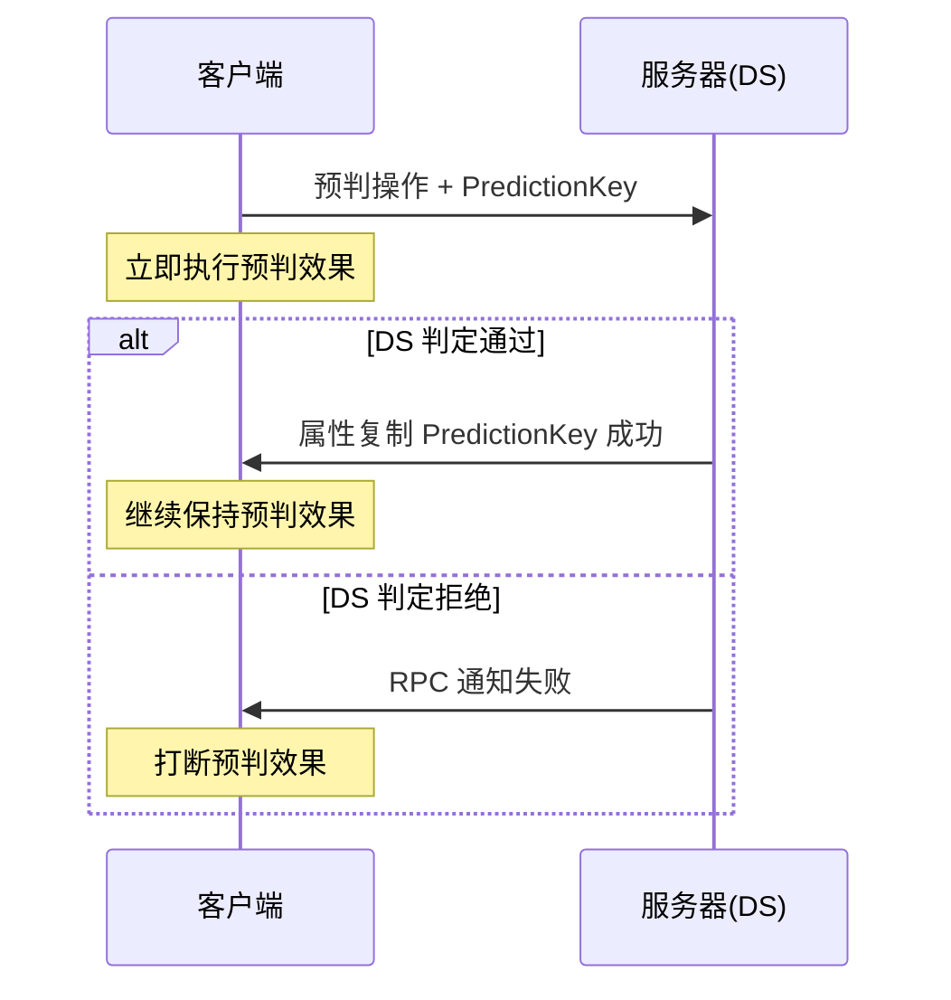

# PredictionKey预判机制

> 💡 **本教程基于 UE5.7**，详细介绍 GAS 的客户端预判机制。

## 概述

---

GAS 提供了一套客户端预判机制，可以在客户端先做判断，判断通过后直接执行效果，然后再发包给服务器，如果服务器判定也通过则正常执行，如果服务器判定不通过，则打断客户端提前执行的逻辑。

> 💡 比如客户端释放技能时，为了表现的流畅性，一般会在客户端释放时预先做些判定，判定通过后直接预先播放动画和特效之类的表现，而不是等 DS 端校验成功回包后再播放。如果 DS 端拒绝执行，则会通知客户端预判失败，打断预先播放的动作和特效表现。

GAS 的客户端预判机制实现的基本思路是为每个预判操作生成一个凭证（`FPredictionKey`，可以理解为一个自增编号），执行预判操作后发送给 DS 端时会附带预判的凭证。DS 端尝试执行操作时，会根据执行结果通知客户端预判操作是否能执行，如果被 DS 端拒绝了则需要打断客户端执行的预判操作。`FPredictionKey` 就是在客户端和 DS 端执行预判操作的凭证（关联两端的操作）。



## 预判凭证（PredictionKey）

---

在 `UAbilitySystemComponent` 中维护了一个 `FPredictionKey` 的实例 `ScopedPredictionKey`。`ScopedPredictionKey` 记录着执行预判操作时使用的预判凭证。

```cpp
class GAMEPLAYABILITIES_API UAbilitySystemComponent 
{
    FPredictionKey ScopedPredictionKey;
}

struct GAMEPLAYABILITIES_API FPredictionKey
{
    int16 Current;  // 当前凭证值（自增）
    int16 Base;      // 起始操作凭证值（操作链根部为0）
}
```

> 💡 `FPredictionKey` 的 `Base` 值记录的是起始操作凭证值，如果凭证就是起始操作，则 `Base` 值为就是 0（一个预判操作可能嵌套的其他预判操作，形成一个操作链）。`Current` 值是一个自增的全局数（每生成过一个凭证就 +1）。

## FScopedPredictionWindow

---

`ScopedPredictionKey` 的设置通过一个专门的结构 `FScopedPredictionWindow` 来设置，会在构造时设置 `ScopedPredictionKey` 新的值，并保留之前的值，在析构时还原之前的值。

这样做的目的是为了在 `FScopedPredictionWindow` 实例生效区块（Scope 代表函数或者代码块）设置一个新的操作凭证，在实例生效区域结束时（触发析构），自动恢复之前的凭证。

因为预判操作可能存在嵌套的情况，一个预判操作在执行过程中可能触发其他预判操作，形成一串预判操作链（Chain），当嵌套的预判操作执行完成，自然要恢复上一层的预判凭证，因为上一层的预判操作还要继续执行。

```cpp
FScopedPredictionWindow::~FScopedPredictionWindow()
{
    if (UAbilitySystemComponent* OwnerPtr = Owner.Get())
    {
        if (ClearScopedPredictionKey)
        {
            // 析构时恢复之前的凭证
            OwnerPtr->ScopedPredictionKey = RestoreKey;
        }
    }
}
```

> 💡 比如在客户端执行技能激活时，激活技能操作是一个预判操作需要生成一个预判操作凭证，在执行激活时，插入了一个新的预判操作需要新的凭证（比如下面的 `UAbilityTask_WaitInputPress`），但在新的预判操作执行完成时，需要恢复之前激活技能的预判操作凭证（因为其他地方可能需要继续用到这个激活技能的预判操作凭证）。

```cpp
bool UAbilitySystemComponent::InternalTryActivateAbility(...)
{
    if (Ability->GetNetExecutionPolicy() == 
        EGameplayAbilityNetExecutionPolicy::LocalPredicted)
    {
        // 激活技能是执行的预判操作
        FScopedPredictionWindow ScopedPredictionWindow(this, true);
        ActivationInfo.SetPredicting(ScopedPredictionKey);
    }
}
```

`FScopedPredictionWindow` 的构造预判凭证有两种方式：

1. **生成新的预判凭证**
2. **继承外部传入的凭证**

### FScopedPredictionWindow 生成新的预判凭证

客户端执行预判行为时，`FScopedPredictionWindow` 构造一般会生成一个新凭证，这个新生成的凭证一般需要通过 RPC 带给 DS，在 DS 对该操作凭证关联的操作进行判定。

```cpp
FScopedPredictionWindow::FScopedPredictionWindow(
    UAbilitySystemComponent* InAbilitySystemComponent, 
    bool bCanGenerateNewKey)
{
    ClearScopedPredictionKey = false;
    SetReplicatedPredictionKey = false;

    if (bCanGenerateNewKey)
    {
        ClearScopedPredictionKey = true;
        // 记录之前的凭证
        RestoreKey = InAbilitySystemComponent->ScopedPredictionKey;
        
        // 生成新的凭证
        InAbilitySystemComponent->ScopedPredictionKey.GenerateDependentPredictionKey();		
    }
}

void FPredictionKey::GenerateDependentPredictionKey()
{
    if (bIsServerInitiated)
    {
        // bIsServerInitiated 表示是服务器创建的凭证 
        // 不在这个接口创建，走 CreateNewServerInitiatedKey
        return;
    }

    // 一个预判操作在执行过程中可能会嵌套其他的预判操作，形成操作链
    // Current 值是一个自增的全局数（每生成过一个凭证就+1）
    // 操作链的生成起始操作凭证 Base 是 0 
    // 操作链的后续操作凭证 Base 值是操作链起始凭证的 Current 值
    KeyType Previous = Current;
    if (Base == 0)
    {
        Base = Current;
    }
    
    GenerateNewPredictionKey();

    // 当 Base 值和 Current 相差过大，说明操作链太长了，存在死循环风险
    ensureAlwaysMsgf((Base == 0) || (Current - Base < 20), 
        TEXT("Deep PredictionKey Chain Detected. It's likely there's circular logic that could stack overflow."));
}

void FPredictionKey::GenerateNewPredictionKey()
{
    static KeyType GKey = 1;
    // 自增的全局数（每生成过一个凭证就+1）
    Current = GKey++;
    if (GKey < 0)
    {
        GKey = 1;
    }
    bIsStale = false;
}
```

### FScopedPredictionWindow 继承外部传入的凭证

有些 `FScopedPredictionWindow` 构造不会生成新的操作凭证，因为这个操作不会触发 RPC 上报给 DS 进行判定，或者这个操作本身就是客户端上报给 DS 端。

> 💡 比如 GA 的执行会触发消耗，这个消耗是通过 GE 扣除某个属性值，这时候 GE 的 Apply 的操作也是客户端的预判操作，这个操作不会触发 RPC，所以这里 GE 的预判操作直接继承 GA 的操作凭证，当 DS 返回对 GA 操作凭证的处理时，会移除这个客户端附加的 GE 效果。这种通过客户端提前 Apply GE 提前扣除消耗的操作，可以让客户端的 GA 看起来执行没有延迟。

如果是在 DS 端使用 `FScopedPredictionWindow` 来使用客户端传入的操作凭证，`InSetReplicatedPredictionKey` 会被置为 true，在析构时触发操作凭证的属性复制通知客户端操作被成功执行。如果失败则一般通过 RPC 通知客户端，不会使用到 `FScopedPredictionWindow`。

```cpp
FScopedPredictionWindow::FScopedPredictionWindow(
    UAbilitySystemComponent* AbilitySystemComponent, 
    FPredictionKey InPredictionKey, 
    bool InSetReplicatedPredictionKey /*=true*/)
{
    if (AbilitySystemComponent == nullptr)
    {
        return;
    }

    // 继承外部传入的凭证（DS 端使用客户端凭证需要触发属性复制）
    if (AbilitySystemComponent->IsNetSimulating() == false)
    {
        Owner = AbilitySystemComponent;
        check(Owner.IsValid());
        RestoreKey = AbilitySystemComponent->ScopedPredictionKey;
        AbilitySystemComponent->ScopedPredictionKey = InPredictionKey;
        ClearScopedPredictionKey = true;
        SetReplicatedPredictionKey = InSetReplicatedPredictionKey;
    }
}

FScopedPredictionWindow::~FScopedPredictionWindow()
{
    if (UAbilitySystemComponent* OwnerPtr = Owner.Get())
    {
        if (SetReplicatedPredictionKey)
        {
            if (OwnerPtr->ScopedPredictionKey.IsValidKey())
            {
                const bool bServerInitiatedKey = 
                    OwnerPtr->ScopedPredictionKey.IsServerInitiatedKey();
                
                const bool bAllowAckServerInitiatedKey = 
                    UE::AbilitySystem::Private::CVarReplicateServerKeysAsAcknowledged > 0;
                
                if (!bServerInitiatedKey || bAllowAckServerInitiatedKey)
                {
                    // DS 端使用客户端凭证需要触发属性复制
                    OwnerPtr->ReplicatedPredictionKeyMap.ReplicatePredictionKey(
                        OwnerPtr->ScopedPredictionKey);
                }
            }
        }
        ...
    }
}
```

## FPredictionKeyDelegates

---

`FPredictionKeyDelegates` 为每个预判凭证 `PredictionKey` 绑定执行成功和失败的委托，在收到执行成功或者失败的反馈时可以做对应的处理。

```cpp
struct FPredictionKeyDelegates
{
public:
    // 绑定执行失败的委托
    static FPredictionKeyEvent& NewRejectedDelegate(FPredictionKey::KeyType Key);
    
    // 绑定执行成功的委托
    static FPredictionKeyEvent& NewCaughtUpDelegate(FPredictionKey::KeyType Key);
    
    // 执行失败的回调处理
    static void Reject(FPredictionKey::KeyType Key);
    
    // 执行成功的回调处理
    static void CatchUpTo(FPredictionKey::KeyType Key);
};
```

对应类似上面例子中在技能激活的预判操作中再插入一个 Task 的预判操作，Task 插入的操作是依赖于技能操作的，这种存在依赖关系的预判操作，会跟随被依赖的操作一同执行成功或者失败。

当技能预判的激活被拒绝时，依赖于这个操作的其他预判操作都会触发执行失败的回调，这样就可以将相关的操作自动终止。

在预判激活技能时预判执行动画或者 GameplayCue 播放特效之类的操作时，也可以直接用激活技能的预判凭证，而不生成新的凭证，将失败的处理绑定在激活技能的预判凭证上，当凭证被拒绝执行时，自动会调用对应的终止操作。

> 💡 对于多个操作形成的操作链（多个操作嵌套在起始操作内部），如果起始操作执行成功或失败都会影响到嵌套的操作执行。

```cpp
void FPredictionKey::GenerateDependentPredictionKey()
{
    ...
    KeyType Previous = Current;
    if (Base == 0)
    {
        Base = Current;
    }
    
    GenerateNewPredictionKey();

    // 操作链的后续嵌套操作依赖起始操作的成功或者失败
    if (Previous > 0)
    {
        FPredictionKeyDelegates::AddDependency(Current, Previous);
    }
}

// 对于多个操作形成的操作链（多个操作嵌套在起始操作内部）
// 如果起始操作执行成功或失败都会影响到嵌套的操作执行
void FPredictionKeyDelegates::AddDependency(...)
{
    NewRejectedDelegate(DependsOn).BindStatic(&FPredictionKeyDelegates::Reject, ThisKey);
    NewCaughtUpDelegate(DependsOn).BindStatic(&FPredictionKeyDelegates::CatchUpTo, ThisKey);
}
```

## 预判凭证的网络复制

---

大部分预判凭证（`FPredictionKey`）是由客户端生成，通过 RPC 上传到 DS，如果执行失败，则凭证会跟随通知执行失败的 RPC 下发给客户端，客户端根据凭证绑定的委托回调执行失败清理操作。如果执行成功则会统一走属性复制下发给客户端，客户端收到属性复制下发的凭证，凭证表示对应的操作执行成功了，可以根据绑定的委托回调执行对应的处理。

### 技能预判执行失败

会通过 RPC 通知客户端执行对应的回调处理：

```cpp
void UAbilitySystemComponent::InternalServerTryActivateAbility(...)
{
    ...
    if (InternalTryActivateAbility(...))
    {
        // 执行成功
    }
    else
    {
        // 执行失败通过 RPC 通知客户端端
        ClientActivateAbilityFailed(Handle, PredictionKey.Current);
        Spec->InputPressed = false;
        MarkAbilitySpecDirty(*Spec);
    }
    ...
}

UFUNCTION(Client, Reliable)
void ClientActivateAbilityFailed(...);

void UAbilitySystemComponent::ClientActivateAbilityFailed_Implementation(...)
{
    // 通知操作执行失败了
    if (PredictionKey > 0)
    {
        FPredictionKeyDelegates::BroadcastRejectedDelegate(PredictionKey);
    }
    
    // 终止技能的执行
    for (UGameplayAbility* Ability : Instances)
    {
        if (Ability->CurrentActivationInfo.GetActivationPredictionKey().Current == 
            PredictionKey)
        {
            Ability->CurrentActivationInfo.SetActivationRejected();
            Ability->K2_EndAbility();
        }
    }
}
```

### 技能执行成功

在 DS 端成功了，会在 `FScopedPredictionWindow` 通过 `ReplicatePredictionKey` 触发凭证的属性复制，客户端接受到属性复制后触发凭证对应的执行成功回调。

```cpp
bool UAbilitySystemComponent::InternalTryActivateAbility(...)
{
    if (NetMode == ROLE_Authority)
    {
        // 这里将技能附带的凭证信息设置到 ScopedPredictionKey
        if (InPredictionKey.IsValidKey())
        {
            ActivationInfo.ServerSetActivationPredictionKey(InPredictionKey);
        }
        
        FScopedPredictionWindow ScopedPredictionWindow(this, 
            ActivationInfo.GetActivationPredictionKey());
    }
}

// 在析构上面设置的凭证时，会触发一个网络复制 ReplicatedPredictionKeyMap
// 表明 DS 端完成了一个预判凭证的执行
FScopedPredictionWindow::~FScopedPredictionWindow()
{
    if (UAbilitySystemComponent* OwnerPtr = Owner.Get())
    {
        if (SetReplicatedPredictionKey)
        {
            if (OwnerPtr->ScopedPredictionKey.IsValidKey())
            {
                // 在 UAbilitySystemComponent 上有一个凭证容器 ReplicatedPredictionKeyMap
                // 存放着客户端上传的凭证
                // 这里用属性复制可以减少 RPC 的调用且可以一次下发多个凭证数据
                OwnerPtr->ReplicatedPredictionKeyMap.ReplicatePredictionKey(
                    OwnerPtr->ScopedPredictionKey);
            }
        }
    }
}

void FReplicatedPredictionKeyItem::OnRep()
{
    // 客户端接收到复制消息时，会触发凭证执行成功的回调
    FPredictionKeyDelegates::CatchUpTo(PredictionKey.Current);
}
```

## Server 生成的凭证

---

如果技能是由 DS 端发起的激活，也会生成一个 DS 端的凭证，作为 DS 发起该操作的一个凭证。这个凭证会有个标识来表示这个是 DS 端创建的凭证。

```cpp
bool UAbilitySystemComponent::InternalTryActivateAbility(...)
{
    if (NetMode == ROLE_Authority)
    {
        bool bCreateNewServerKey = NetMode == ROLE_Authority &&
            (!InPredictionKey.IsValidKey() ||
             (Ability->GetNetExecutionPolicy() == 
              EGameplayAbilityNetExecutionPolicy::ServerInitiated ||
              Ability->GetNetExecutionPolicy() == 
              EGameplayAbilityNetExecutionPolicy::ServerOnly));
              
        if (bCreateNewServerKey)
        {
            ActivationInfo.ServerSetActivationPredictionKey(
                FPredictionKey::CreateNewServerInitiatedKey(this));
        }
    }
}

FPredictionKey FPredictionKey::CreateNewServerInitiatedKey(...)
{
    FPredictionKey NewKey;
    
    if (OwningComponent->GetOwnerRole() == ROLE_Authority)
    {
        NewKey.GenerateNewPredictionKey();
        NewKey.bIsServerInitiated = true;
    }
    return NewKey;
}
```

## UE5.7 更新内容

---

1. **预判凭证网络复制优化**：`FReplicatedPredictionKeyMap` 的复制逻辑更加高效
2. **断线重连处理改进**：修复了断线重连时可能出现的凭证复用问题
3. **服务端凭证支持增强**：`bIsServerInitiated` 凭证的处理更加完善

## 参考资料

---

- [UE5.7 GAS 官方文档](https://docs.unrealengine.com/5.7/en-US/)
- Lyra Starter Game 源码
- 原始教程：GAS-预判机制(PredictionKey).md

<!-- nav:auto -->

---

**导航**: ← [[30-tutorials/gas/22-AbilityTask详解|22-AbilityTask详解]] · [[30-tutorials/gas/24-GE上下文信息|24-GE上下文信息]] →

<!-- /nav:auto -->
