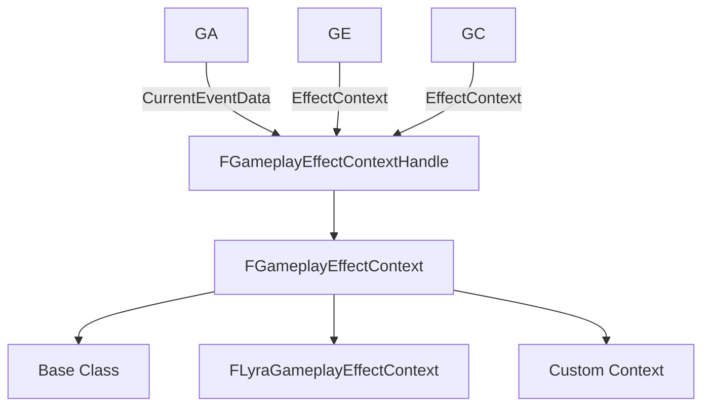

# GE上下文信息

> 💡 **本教程基于 UE5.7**，详细介绍 GAS 中的上下文信息传递机制。

## 概述

---

`FGameplayEffectContext` 是 GAS 体系中用于传递**上下文信息**的结构，提供必要的上下文和附加数据支持。**主要用于 GameplayAbility（GA）、GameplayEffect（GE）、GameplayCue（GC）的上下文信息传递**。

`FGameplayEffectContextHandle` 封装 `FGameplayEffectContext` 共享指针，通过 Handle 可以直接获取和操作 `FGameplayEffectContext` 实例。

```cpp
struct GAMEPLAYABILITIES_API FGameplayEffectContextHandle
{
    TSharedPtr<FGameplayEffectContext> Data;
}
```

`FGameplayEffectContextHandle` 在绝大多数情况下替代 `FGameplayEffectContext` 作为参数传递或者变量存放，因为内部包含的是实例的共享指针而且支持网络复制。内部封装 `FGameplayEffectContext` 共享指针，自然可以存放子类实例。**可以通过创建 `FGameplayEffectContext` 的子类来扩展上下文信息，附加额外的信息**。

一般用法是在触发时创建上下文信息 `FGameplayEffectContext`，在整个执行过程中可以通过 `FGameplayEffectContextHandle` 填充、修改、传递上下文信息。而 GA、GE 之间可以互相触发，GA 和 GE 都可以触发 GC，**所以上下文信息也可以通过 `FGameplayEffectContextHandle` 在 GA、GE、GC 之间传承下去**。



### GameplayAbility（GA）通过 FGameplayEffectContext 传递上下文信息

```cpp
struct GAMEPLAYABILITIES_API FGameplayEventData
{
    ...
    FGameplayEffectContextHandle ContextHandle;
    ...
}

class GAMEPLAYABILITIES_API UGameplayAbility 
{
    ...
    FGameplayEventData CurrentEventData;
    ...
}
```

> 💡 `FGameplayEventData` 是 GA 在尝试激活时可以传入的参数信息，激活成功后在 GA 的实例中保存了一份 `FGameplayEventData` 的数据。
> `FGameplayEventData` 包含了上下文信息 `FGameplayEffectContextHandle`。

### GameplayEffect（GE）通过 FGameplayEffectContext 传递上下文信息

```cpp
struct GAMEPLAYABILITIES_API FGameplayEffectSpec
{
    ...
    FGameplayEffectContextHandle EffectContext;
    ...
}
```

> 💡 GameplayEffect（GE）的运行时数据中 `FGameplayEffectSpec` 直接保存了一份 `FGameplayEffectContextHandle`。

### GameplayCue（GC）通过 FGameplayEffectContext 传递上下文信息

```cpp
virtual void InvokeGameplayCueExecuted(...
    FGameplayEffectContextHandle EffectContext);

struct GAMEPLAYABILITIES_API FGameplayCueParameters
{
    UPROPERTY(BlueprintReadWrite, Category=GameplayCue)
    FGameplayEffectContextHandle EffectContext;
}
```

> 💡 在 GameplayCue（GC）处理接口都附带了 `FGameplayEffectContextHandle` 数据。
> 有的是附带 `FGameplayCueParameters` 数据也包含了 `FGameplayEffectContextHandle`。

## Handle 的用法解析

---

UE 有很多 `XXXHandle` 的 Struct，Handle 一般称为句柄，本质上是可以通过其直接索引到关联的对象实例。

有些 Handle 只是简单的分配了一个全局唯一编号，分配后保存到关联的实例中。然后通过持有一个的编号去容器中查找匹配对应的实例。比如 `FGameplayAbilitySpecHandle`：

```cpp
struct FGameplayAbilitySpecHandle
{
private:
    UPROPERTY()
    int32 Handle;
}

void FGameplayAbilitySpecHandle::GenerateNewHandle()
{
    static int32 GHandle = 1;
    Handle = GHandle++;
}
```

有些 Handle 是包含一个实例的共享指针。这种 Handle 直接持有了实例的指针，可以直接访问关联的实例并且可以封装一些操作实例的接口。而且因为持有的是指针，自然也可以指向子类实例。**适用于那些需要在 Handle 关联的对象会因为定制化需求出现各种子类实例的情况**。

比如 `FGameplayEffectContextHandle` 通过 Handle 可以直接获取和操作其内部封装的实例，包括继承自 `FGameplayEffectContext` 子类实例。

```cpp
struct GAMEPLAYABILITIES_API FGameplayEffectContextHandle
{
    TSharedPtr<FGameplayEffectContext> Data;
}
```

此类 Handle 实例用于参数传递和其他数据结构中的变量，**具有多态特性**。（*实际上就是相当于一个基类指针，将子类实例赋给基类指针传递，使用时再转换成子类实例*）

> 💡 比如以下示例中 `FLyraGameplayEffectContext` 是继承自 `FGameplayEffectContext` 的子类，通过传入的 `FGameplayEffectContextHandle`，判定其内部是否封装的是子类 `FLyraGameplayEffectContext` 的实例，是的话直接从中提取出子类实例。

```cpp
FLyraGameplayEffectContext* FLyraGameplayEffectContext::ExtractEffectContext(...)
{
    FGameplayEffectContext* BaseEffectContext = Handle.Get();
    if ((BaseEffectContext != nullptr) && 
        BaseEffectContext->GetScriptStruct()->IsChildOf(FLyraGameplayEffectContext::StaticStruct()))
    {
        // 类型判定通过，直接强转
        return (FLyraGameplayEffectContext*)BaseEffectContext;
    }
    return nullptr;
}
```

继承自 `FGameplayEffectContext` 的子类需要重载虚函数 `GetScriptStruct`。这样可以基类指针通过调用 `GetScriptStruct` 获取实际类型信息。

```cpp
struct GAMEPLAYABILITIES_API FGameplayEffectContext
{
    virtual UScriptStruct* GetScriptStruct() const
    {
        return FGameplayEffectContext::StaticStruct();
    }
}

struct FLyraGameplayEffectContext : public FGameplayEffectContext
{
    virtual UScriptStruct* GetScriptStruct() const override
    {
        return FLyraGameplayEffectContext::StaticStruct();
    }
}
```

### 模板化版本

```cpp
template<typename T>
T* ExtractEffectContext(struct FGameplayEffectContextHandle Handle)
{
    FGameplayEffectContext* BaseEffectContext = Handle.Get();
    if ((BaseEffectContext != nullptr) && 
        BaseEffectContext->GetScriptStruct()->IsChildOf(T::StaticStruct()))
    {
        return (T*)BaseEffectContext;
    }

    return nullptr;
}
```

## 如何网络复制一个 F 类指针

---

为什么 `FGameplayEffectContext` 要封装成一个 Handle 结构而不是直接使用基类指针呢？因为涉及到了网络复制，F 类（结构体或者不继承自 UObject 的原生类）是无法通过指针进行网络复制的，所以将其封装成一个 Handle 结构体，再通过实现 Handle 结构体的自定义网络序列化 `NetSerialize` 来达到网络复制的目的。

```cpp
template<>
struct TStructOpsTypeTraits<FGameplayEffectContextHandle> :
    public TStructOpsTypeTraitsBase2<FGameplayEffectContextHandle>
{
    enum
    {
        WithCopy = true,
        WithNetSerializer = true,
        WithIdenticalViaEquality = true,
    };
};
```

> 💡 在 UE 中，Struct 类型元数据 `UScriptStruct` 提供了一种机制可以自定义结构体的一些特性。 
> `UScriptStruct` 有一个功能强大的接口 `ICppStructOps`，可以用来制定结构体在底层 C++ 代码中的操作。这些操作包括构造、析构、拷贝和序列化等。
> 也就是可以通过类似上述模板特化的代码，表明指定的结构体实现了自定义的构造、析构、复制和序列化。当执行此类操作时，会自动调用对应的自定义接口执行自定义行为。

- **WithNetSerializer = true**：表示定制了网络序列化。因为 F 类指针是无法直接网络复制的，网络序列化时会调用 `FGameplayEffectContextHandle` 实现的 `NetSerialize` 进行序列化和反序列化。

- **WithCopy = true**：启用了 WithCopy 结构体会使用 Unreal 的内置机制来确保在复制时正确处理复杂对象和智能指针，自动生成拷贝构造函数和赋值运算符（`FGameplayEffectContext` 有一个共享指针，启用 WithCopy 能保证共享指针的在结构体复制时能正确进行引用计数）。
  *不启用 WithCopy 时，结构体可能会缺乏合适的拷贝支持，尤其在涉及复杂类型时，可能会导致未定义的内存访问，特别是如果没有手动实现拷贝构造函数和赋值运算符。*

- **WithIdenticalViaEquality = true**：表示在通过 `Identical` 判定结构体是否发生修改时是通过 `==` 操作符进行判定。
  *网络复制时，会通过 `Identical` 接口判定结构体数据是否修改过。*
  （`FGameplayEffectContextHandle` 重载了 `==` 操作符）。

```cpp
bool operator==(FGameplayEffectContextHandle const& Other) const
{
    if (Data.IsValid() != Other.Data.IsValid())
    {
        return false;
    }
    if (Data.Get() != Other.Data.Get())
    {
        return false;
    }
    return true;
}
```

`FGameplayEffectContextHandle` 重载的 `==` 操作符表明只要 Handle 持有的指针未发生变化就视为 `FGameplayEffectContextHandle` 未发生修改，所以如果需要修改 `FGameplayEffectContext` 实例的内容且在修改完之后需要认为 `FGameplayEffectContextHandle` 发生了改变，或者需要创建一份新的 Handle 实例副本通过 `Duplicate` 执行深拷贝操作。

```cpp
FGameplayEffectContextHandle Duplicate() const
{
    if (IsValid())
    {
        FGameplayEffectContext* NewContext = Data->Duplicate();
        return FGameplayEffectContextHandle(NewContext);
    }
    else
    {
        return FGameplayEffectContextHandle();
    }
}

virtual FGameplayEffectContext* Duplicate() const
{
    FGameplayEffectContext* NewContext = new FGameplayEffectContext();
    *NewContext = *this;
    if (GetHitResult())
    {
        // Does a deep copy of the hit result
        NewContext->AddHitResult(*GetHitResult(), true);
    }
    return NewContext;
}
```

## FGameplayEffectContext 的网络序列化

---

有了上述基础之后，回归正题，要想将一个 F 类的实例指针进行网络序列化，需要**在接收端重新 new 一个对应的结构体实例**，然后再**将通过网络传输的序列化的数据反序列化填充到新创建的实例中**。

创建新的实例需要知道实例的类型（因为有可能是子类类型）。所以需要在传输的数据中附带实例类型，但是不可能直接将类型的元数据 `UScriptStruct` 直接带过去。UE 提供了一个全局的 `UAbilitySystemGlobals::Get().EffectContextStructCache` 会收集所有 `FGameplayEffectContext` 及其子类的类型信息，放入一个数组中（存放的是类型信息 `UScriptStruct` 指针）。客户端和 DS 端都执行相同的逻辑。这样在传输的数据中附带实例类型只需要附带 `EffectContextStructCache` 中的数组索引即可，只需要 1 个字节（uint8）即可在客户端还原类型信息。

收集 `FGameplayEffectContext` 及其子类的类型信息：

> 💡 这里还有一个 `TargetDataStructCache` 对应的是 `FGameplayAbilityTargetData`，跟 `FGameplayEffectContext` 是有同样的机制，同样也有个对应的 `FGameplayAbilityTargetDataHandle`。

```cpp
void UAbilitySystemGlobals::InitTargetDataScriptStructCache()
{
    TargetDataStructCache.InitForType(FGameplayAbilityTargetData::StaticStruct());
    EffectContextStructCache.InitForType(FGameplayEffectContext::StaticStruct());
}

void FNetSerializeScriptStructCache::InitForType(UScriptStruct* InScriptStruct)
{
    ScriptStructs.Reset();
    for (TObjectIterator<UScriptStruct> It; It; ++It)
    {
        if (It->IsChildOf(InScriptStruct))
        {
            ScriptStructs.Add(*It);
        }
    }
    
    // 按名字排序
    ScriptStructs.Sort([](const UScriptStruct& A, const UScriptStruct& B) { 
        return A.GetName().ToLower() < B.GetName().ToLower(); 
    });
}
```

网络序列化时，只需要找到类型的数组索引进行序列化即可：

```cpp
bool FNetSerializeScriptStructCache::NetSerialize(FArchive& Ar, UScriptStruct*& Struct)
{
    if (Ar.IsSaving())
    {
        int32 idx;
        if (ScriptStructs.Find(Struct, idx))
        {
            check(idx < (1 << 8));
            uint8 b = idx;
            Ar.SerializeBits(&b, 8);
            return true;
        }
        return false;
    }
    else
    {
        uint8 b = 0;
        Ar.SerializeBits(&b, 8);
        if (ScriptStructs.IsValidIndex(b))
        {
            Struct = ScriptStructs[b];
            return true;
        }
        return false;
    }
}
```

`FGameplayEffectContextHandle` 的网络复制序列化：

```cpp
bool FGameplayEffectContextHandle::NetSerialize(...)
{
    // 标记封装的实例是否是有效的，无效就是默认值了，不用处理
    bool ValidData = Data.IsValid();
    Ar.SerializeBits(&ValidData, 1);

    if (ValidData)
    {
        TCheckedObjPtr<UScriptStruct> ScriptStruct = Data.IsValid() ?
            Data->GetScriptStruct() : nullptr;
        
        // 序列化 FGameplayEffectContext 类型信息 
        // 本质就是查找类型在全局数组 EffectContextStructCache 的索引进行序列化即可
        UAbilitySystemGlobals::Get().EffectContextStructCache.
            NetSerialize(Ar, ScriptStruct.Get());

        if (ScriptStruct.IsValid())
        {
            if (Ar.IsLoading())
            {
                if (!Data.IsValid() || (Data->GetScriptStruct() != ScriptStruct.Get()))
                {
                    // 在反序列化时，根据类型信息创建新的封装实例
                    FGameplayEffectContext* NewData = (FGameplayEffectContext*)
                        FMemory::Malloc(ScriptStruct->GetStructureSize());
                    ScriptStruct->InitializeStruct(NewData);

                    Data = TSharedPtr<FGameplayEffectContext>(NewData, 
                        FGameplayEffectContextDeleter());
                }
            }

            // 将实例数据进行序列化与反序列化
            check(Data.IsValid());
            if (ScriptStruct->StructFlags & STRUCT_NetSerializeNative)
            {
                ScriptStruct->GetCppStructOps()->NetSerialize(Ar, Map, bOutSuccess, Data.Get());
            }
        }
    }

    bOutSuccess = true;
    return true;
}
```

解决了类型信息问题，就剩下填充 `FGameplayEffectContext` 及其子类实例数据了。所以 Handle 封装的 `FGameplayEffectContext` 及其子类也需要实现自定义网络序列化 `NetSerialize`，将其字段信息转换成二进制流进行传输然后被反序列化。

```cpp
struct GAMEPLAYABILITIES_API FGameplayEffectContext
{
    virtual bool NetSerialize(FArchive& Ar, class UPackageMap* Map, bool& bOutSuccess);
}

template<>
struct TStructOpsTypeTraits< FGameplayEffectContext > :
    public TStructOpsTypeTraitsBase2< FGameplayEffectContext >
{
    enum
    {
        WithNetSerializer = true,
        WithCopy = true		
    };
};
```

> 💡 `FGameplayEffectSpecHandle` 也跟 `FGameplayEffectContextHandle` 类似的包含了一个实例的共享指针，但是不支持网络复制（用不上机制也不支持，没有在全局缓存类型信息），所以其实现的自定义网络接口 `NetSerialize` 直接报错并且 Crash。如果通过网络复制 `FGameplayEffectSpecHandle` 会触发报错并且 Crash。

```cpp
bool FGameplayEffectSpecHandle::NetSerialize(...)
{
    ABILITY_LOG(Fatal, TEXT("FGameplayEffectSpecHandle should not be NetSerialized"));
    return false;
}
```

## FGameplayEffectContext 字段说明

---

```cpp
struct GAMEPLAYABILITIES_API FGameplayEffectContext
{
    // 派发 GE 的 Actor（具备派发 GE 能力，拥有 AbilitySystemComponent）
    TWeakObjectPtr<AActor> Instigator;

    // 导致本次 GE 触发的 Actor
    // 不一定具备派发 GE 的能力，比如武器或者子弹导致了一个伤害效果 
    // EffectCauser 是武器或者子弹
    // Instigator 是实际派发效果玩家（武器或者子弹的拥有者）
    UPROPERTY()
    TWeakObjectPtr<AActor> EffectCauser;

    // 触发 GA 的 CDO（ClassDefaultObject）
    UPROPERTY()
    TWeakObjectPtr<UGameplayAbility> AbilityCDO;

    // 触发 GA 的对象（不复制）
    UPROPERTY(NotReplicated)
    TWeakObjectPtr<UGameplayAbility> AbilityInstanceNotReplicated;

    // 触发 GA 等级
    UPROPERTY()
    int32 AbilityLevel;

    // 创建 GE 的 UObject
    UPROPERTY()
    TWeakObjectPtr<UObject> SourceObject;

    // Instigator 的 AbilitySystemComponent
    UPROPERTY(NotReplicated)
    TWeakObjectPtr<UAbilitySystemComponent> InstigatorAbilitySystemComponent;

    // 存放需要用到 Actor 参数
    UPROPERTY()
    TArray<TWeakObjectPtr<AActor>> Actors;

    // 存放需要用到的碰撞信息
    TSharedPtr<FHitResult> HitResult;
};
```

## UE5.7 中的 Lyra 示例

---

Lyra 中自定义了 `FLyraGameplayEffectContext` 来扩展上下文信息：

```cpp
struct FLyraGameplayEffectContext : public FGameplayEffectContext
{
    // 添加自定义字段
    TSharedPtr<FGameplayAbilityTargetData> TargetData;

    virtual bool NetSerialize(FArchive& Ar, class UPackageMap* Map, bool& bOutSuccess) override;
    
    virtual UScriptStruct* GetScriptStruct() const override
    {
        return FLyraGameplayEffectContext::StaticStruct();
    }
    
    virtual FGameplayEffectContext* Duplicate() const override;
};
```

## 参考资料

---

- [UE5.7 GAS 官方文档](https://docs.unrealengine.com/5.7/en-US/)
- Lyra Starter Game 源码
- 原始教程：GAS-上下文信息-GameplayEffectContext.md

<!-- nav:auto -->

---

**导航**: ← [[30-tutorials/gas/23-PredictionKey预判机制|23-PredictionKey预判机制]] · [[30-tutorials/gas/25-Attribute属性详解|25-Attribute属性详解]] →

<!-- /nav:auto -->
