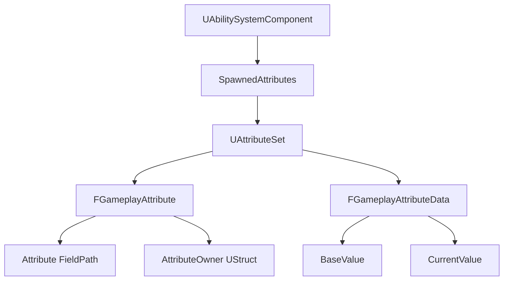

# Attribute属性详解

> 💡 **本教程基于 UE5.7**，详细介绍 GAS 中的 Attribute 属性系统。

## 概述

---

**属性集（AttributeSet）（AS）** 是 Gameplay Ability System（GAS）框架的核心组件之一，用于定义和管理游戏中的动态属性（如生命值、攻击力、移动速度等）。属性集通过 `UAttributeSet` 类实现，用于集中管理角色的所有游戏属性。每个属性（如 `Health`、`Stamina`）被定义为 `FGameplayAttribute` 类型。



## FGameplayAttribute 与 FGameplayAttributeData

---

```cpp
// 属性标识数据结构，标识属性是哪个属性集的哪个字段
struct GAMEPLAYABILITIES_API FGameplayAttribute
{
    UPROPERTY(Category = GameplayAttribute, EditAnywhere)
    TFieldPath<FProperty> Attribute;

    UPROPERTY(Category = GameplayAttribute, VisibleAnywhere)
    TObjectPtr<UStruct> AttributeOwner;
};

// 存放属性数值的主要数据结构
struct GAMEPLAYABILITIES_API FGameplayAttributeData
{
protected:
    UPROPERTY(BlueprintReadOnly, Category = "Attribute")
    float BaseValue;

    UPROPERTY(BlueprintReadOnly, Category = "Attribute")
    float CurrentValue;
};
```

从上面的数据结构定义可以看到，`FGameplayAttribute` 存放的是持有属性的属性集（`UAttributeSet`）信息和一个 `FProperty`，也就是标记了该属性是哪个属性集中的哪个字段（`FProperty`），而 `FGameplayAttributeData` 才是真正存放属性数值的地方，一个初始值（`BaseValue`），一个当前值（`CurrentValue`）。在属性集示例中也是通过 **FGameplayAttributeData** 定义存放属性数值的字段。

也就是说属性集定义的每个字段（任意类型的不仅限于 `FGameplayAttributeData`）都可以被视为一个 `FGameplayAttribute`。

```cpp
// 属性集定义属性字段示例（UE5.7）
class ULyraCombatSet : public ULyraAttributeSet
{
    GENERATED_BODY()

private:
    UPROPERTY(BlueprintReadOnly, ReplicatedUsing = OnRep_BaseDamage)
    FGameplayAttributeData BaseDamage;

    UPROPERTY(BlueprintReadOnly, ReplicatedUsing = OnRep_BaseHeal)
    FGameplayAttributeData BaseHeal;
};
```

> 💡 `GAMEPLAYATTRIBUTE_PROPERTY_GETTER` 是将属性集定义的字段转换成 `FGameplayAttribute` 对象。

我们主要是通过 `FGameplayAttributeData` 的字段来描述我们熟悉的攻击、防御、血量等属性，除此之外 int、float、double 之类的原生数值类型也可以用于属性数值的存放（实际上统一视为 float）。只是 `FGameplayAttributeData` 同时记录了当前值和初始值，更适合作为属性数值的存放结构，所以属性数值的存放主要是通过 `FGameplayAttributeData` 进行定义。

> 💡 其他类型虽然理论上可以视为 `FGameplayAttribute`，但没有实际意义，目前只支持上面的两种方式存放属性数值，其他类型不能作为属性的数值存放。

`FGameplayAttribute` 作为逻辑层标识，是一个中间封装层，不直接存储数值，`FGameplayAttributeData` 作为数据层容器，保存实际数值。这种分离增强了属性的可扩展性和复用性，理论上可以用多种方式存放属性数值。

`FGameplayAttribute` 目前提供了两个类型 `GameplayAttributeDataProperty` 和 `NumericProperty` 作为属性数值的存放结构。

> 💡 属性字段除了放在属性集 `UAttributeSet`，还有一种特殊的存放就是放在 `UAbilitySystemComponent` 上，被视为 `SystemAttribute`。

```cpp
bool FGameplayAttribute::IsSystemAttribute() const
{
    return GetAttributeSetClass()->IsChildOf(UAbilitySystemComponent::StaticClass());
}
```

### FGameplayAttribute 提供的接口

**设置属性当前值**：

```cpp
void FGameplayAttribute::SetNumericValueChecked(float& NewValue, UAttributeSet* Dest)
{
    check(Dest);
    
    const FNumericProperty* NumericProperty = CastField<FNumericProperty>(Attribute.Get());
    float OldValue = 0.f;
    if (NumericProperty)
    {
        // 原生数值类型（float）
        void* ValuePtr = NumericProperty->ContainerPtrToValuePtr<void>(Dest);
        OldValue = *static_cast<float*>(ValuePtr);
        Dest->PreAttributeChange(*this, NewValue);
        NumericProperty->SetFloatingPointPropertyValue(ValuePtr, NewValue);
        Dest->PostAttributeChange(*this, OldValue, NewValue);
        
        MARK_PROPERTY_DIRTY(Dest, NumericProperty);
    }
    else if (IsGameplayAttributeDataProperty(Attribute.Get()))
    {
        // FGameplayAttributeData
        const FStructProperty* StructProperty = CastField<FStructProperty>(Attribute.Get());
        
        FGameplayAttributeData* DataPtr = 
            StructProperty->ContainerPtrToValuePtr<FGameplayAttributeData>(Dest);
        
        check(DataPtr);
        OldValue = DataPtr->GetCurrentValue();
        Dest->PreAttributeChange(*this, NewValue);
        DataPtr->SetCurrentValue(NewValue);
        Dest->PostAttributeChange(*this, OldValue, NewValue);
        
        MARK_PROPERTY_DIRTY(Dest, StructProperty);
    }
    else
    {
        // 其他类型不支持
        check(false);
    }
}
```

**获取属性当前值**：

```cpp
float FGameplayAttribute::GetNumericValue(const UAttributeSet* Src) const
{
    const FNumericProperty* const NumericProperty = 
        CastField<FNumericProperty>(Attribute.Get());
    
    if (NumericProperty)
    {
        // 原生数值类型（float）
        const void* ValuePtr = NumericProperty->ContainerPtrToValuePtr<void>(Src);
        return NumericProperty->GetFloatingPointPropertyValue(ValuePtr);
    }
    else if (IsGameplayAttributeDataProperty(Attribute.Get()))
    {
        // FGameplayAttributeData
        const FStructProperty* StructProperty = CastField<FStructProperty>(Attribute.Get());
        check(StructProperty);
        const FGameplayAttributeData* DataPtr 
            = StructProperty->ContainerPtrToValuePtr<FGameplayAttributeData>(Src);
        
        if (ensure(DataPtr))
        {
            return DataPtr->GetCurrentValue();
        }
    }
    
    return 0.f;
}
```

### 获取所有属性集定义属性字段

遍历所有的属性集 Class，将其中的字段都查找出来，GE 和蓝图中 `FGameplayAttribute` 类型上列举出所有属性字段就是通过下面这个接口获取的。

> 💡
> - meta 字段 `HideInDetailsView`，可以在遍历时跳过
> - 属性集类的 `UCLASS` 标记就跳过整个属性集，字段 `UPROPERTY` 标记就跳过字段
> - 一些定义在属性集中但不想被视为属性字段的可以通过 `HideInDetailsView` 标记下

```cpp
void FGameplayAttribute::GetAllAttributeProperties(...)
{
    for (TObjectIterator<UClass> ClassIt; ClassIt; ++ClassIt)
    {
        UClass *Class = *ClassIt;
        if (Class->IsChildOf(UAttributeSet::StaticClass()))
        {
            if (UseEditorOnlyData)
            {
                #if WITH_EDITOR
                // 属性集标记 HideInDetailsView 跳过
                if (Class->HasMetaData(TEXT("HideInDetailsView")))
                {
                    continue;
                }
                #endif
            }
            
            // 遍历所有字段
            for (TFieldIterator<FProperty> PropertyIt(Class, EFieldIteratorFlags::ExcludeSuper); PropertyIt; ++PropertyIt)
            {
                FProperty* Property = *PropertyIt;
                
                if (UseEditorOnlyData)
                {
                    #if WITH_EDITOR
                    if (!FilterMetaStr.IsEmpty() && Property->HasMetaData(*FilterMetaStr))
                    {
                        continue;
                    }
                    
                    // 字段标记 HideInDetailsView 跳过
                    if (Property->HasMetaData(TEXT("HideInDetailsView")))
                    {
                        continue;
                    }
                    #endif
                }
                
                OutProperties.Add(Property);
            }
        }
    }
    
    // 遍历 UAbilitySystemComponent 上的 SystemGameplayAttribute
    #if WITH_EDITOR
    if (UseEditorOnlyData)
    {
        for (TFieldIterator<FProperty> PropertyIt(UAbilitySystemComponent::StaticClass(), EFieldIteratorFlags::ExcludeSuper); PropertyIt; ++PropertyIt)
        {
            FProperty* Property = *PropertyIt;
            
            // SystemAttributes have to be explicitly tagged
            if (Property->HasMetaData(TEXT("SystemGameplayAttribute")) == false)
            {
                continue;
            }
            OutProperties.Add(Property);
        }
    }
    #endif
}
```

在 `UAbilitySystemComponent` 存放的 `SystemGameplayAttribute`，目前只放了修正 GE 持续时长的字段（用于实现类似对自身发出的某个或者某类 GE 的持续时间提升 10%，或者对于接受到的某个或者某类 GE 效果的持续时间降低 10%）。

```cpp
class GAMEPLAYABILITIES_API UAbilitySystemComponent 
{
    UPROPERTY(meta=(SystemGameplayAttribute="true"))
    float OutgoingDuration;
    
    UPROPERTY(meta = (SystemGameplayAttribute = "true"))
    float IncomingDuration;
}
```

除了上面的 `GAMEPLAYATTRIBUTE_PROPERTY_GETTER`，还提供了 `Set` 和 `Init` 宏，可以根据需求进行扩展改造。

```cpp
#define ATTRIBUTE_ACCESSORS(ClassName, PropertyName) \
    GAMEPLAYATTRIBUTE_PROPERTY_GETTER(ClassName, PropertyName) \
    GAMEPLAYATTRIBUTE_VALUE_GETTER(PropertyName) \
    GAMEPLAYATTRIBUTE_VALUE_SETTER(PropertyName) \
    GAMEPLAYATTRIBUTE_VALUE_INITTER(PropertyName)

class ULyraCombatSet : public ULyraAttributeSet
{
    GENERATED_BODY()

public:
    ULyraCombatSet();

    ATTRIBUTE_ACCESSORS(ULyraCombatSet, BaseDamage);
    ATTRIBUTE_ACCESSORS(ULyraCombatSet, BaseHeal);
}
```

## 属性集 UAttributeSet

---

在 `UAbilitySystemComponent` 中有个属性集的数组，存放了当前拥有的所有属性集。可以根据需求将属性字段放到不同的属性集中，通过 `AddSpawnedAttribute` 添加属性集。

```cpp
class GAMEPLAYABILITIES_API UAbilitySystemComponent
{
    UPROPERTY(Replicated, ReplicatedUsing = OnRep_SpawnedAttributes, Transient)
    TArray<TObjectPtr<UAttributeSet>> SpawnedAttributes;
}
```

```cpp
void UAbilitySystemComponent::AddSpawnedAttribute(UAttributeSet* Attribute)
{
    if (!IsValid(Attribute))
    {
        return;
    }

    if (SpawnedAttributes.Find(Attribute) == INDEX_NONE)
    {
        if (IsUsingRegisteredSubObjectList() && IsReadyForReplication())
        {
            AddReplicatedSubObject(Attribute);
        }

        SpawnedAttributes.Add(Attribute);
        SetSpawnedAttributesListDirty();
    }
}
```

### 属性集的一些常用接口

```cpp
class GAMEPLAYABILITIES_API UAttributeSet : public UObject
{
    // 通过即时（Instant）GE 修正属性，修正前的回调处理
    // 即时修正改的是属性的 Base 值，比如改当前血量、当前体力之类的
    // 这里告诉属性集那个 GE 准备对哪个属性值进行修改操作，通过那个计算方式进行修正
    // 可以在这里做一些干预（是否允许修改、修改值是否需要做下限制之类的，传入的 Data 是可以被修改的）
    virtual bool PreGameplayEffectExecute(struct FGameplayEffectModCallbackData &Data) 
    { return true; }

    // 通过即时（Instant）GE 修正属性，修正之后的回调处理
    virtual void PostGameplayEffectExecute(const struct FGameplayEffectModCallbackData &Data)
    { }

    // 对属性当前值（CurrentValue）进行修改之前的回调
    // 如果要限制属性当前值的阈值（最大值、最小值），可以考虑在这里进行干预
    virtual void PreAttributeChange(const FGameplayAttribute& Attribute, float& NewValue) 
    { }

    // 对属性当前值（CurrentValue）进行修改之后的回调
    virtual void PostAttributeChange(const FGameplayAttribute& Attribute, float OldValue, float NewValue) 
    { }

    // 对属性基础值（BaseValue）进行修改之前的回调
    // 如果要限制属性基础值的阈值（最大值、最小值），可以考虑在这里进行干预
    virtual void PreAttributeBaseChange(const FGameplayAttribute& Attribute, float& NewValue) const 
    { }

    // 对属性基础值（BaseValue）进行修改之后的回调
    virtual void PostAttributeBaseChange(const FGameplayAttribute& Attribute, float OldValue, float NewValue) const 
    { }

    // 为属性创建聚合器（Aggregator）是的回调
    // 当属性被 GE 修正时，会为其分配一个聚合器，用于属性修正的计算
    // 这里如果要对聚合器做些操作（比如定制一些属性修正限制规则）可以在这里处理
    virtual void OnAttributeAggregatorCreated(const FGameplayAttribute& Attribute, 
        FAggregator* NewAggregator) const 
    { }
};
```

## 属性（Attribute）网络复制

---

在执行 `UAbilitySystemComponent` 网络复制时，会将所持有的属性集加进复制列表，属性集被视为一个可以支持网络复制的 SubObject，上面的属性字段可以通过网络复制传输到客户端。

```cpp
bool UAbilitySystemComponent::ReplicateSubobjects(...)
{
    for (const UAttributeSet* Set : GetSpawnedAttributes())
    {
        if (IsValid(Set))
        {
            WroteSomething |= Channel->ReplicateSubobject(
                const_cast<UAttributeSet*>(Set), *Bunch, *RepFlags);
        }
    }
}
```

> 💡 `UAttributeSet` 默认开启了网络复制。

```cpp
bool UAttributeSet::IsSupportedForNetworking() const
{
    return true;
}
```

## 属性数值修正

---

属性数值修正主要是通过 GE（GameplayEffect）进行操作。

详情参照 [GE-5.0 属性修正](./10-GE属性修正.md)

## UE5.7 中的 Lyra 示例

---

Lyra 中定义了多个自定义属性集：

```cpp
// Lyra 中的健康属性集
class ULyraHealthSet : public ULyraAttributeSet
{
    GENERATED_BODY()

public:
    ULyraHealthSet();

    ATTRIBUTE_ACCESSORS(ULyraHealthSet, Health);
    ATTRIBUTE_ACCESSORS(ULyraHealthSet, MaxHealth);
    ATTRIBUTE_ACCESSORS(ULyraHealthSet, Healing);

protected:
    UPROPERTY(BlueprintReadOnly, ReplicatedUsing = OnRep_Health)
    FGameplayAttributeData Health;
    
    UPROPERTY(BlueprintReadOnly, ReplicatedUsing = OnRep_MaxHealth)
    FGameplayAttributeData MaxHealth;
    
    UPROPERTY(BlueprintReadOnly, ReplicatedUsing = OnRep_Healing)
    FGameplayAttributeData Healing;

    virtual void PreAttributeChange(const FGameplayAttribute& Attribute, float& NewValue) override;
    virtual void PostAttributeChange(const FGameplayAttribute& Attribute, float OldValue, float NewValue) override;
};
```

Lyra 在 `PreAttributeChange` 中实现属性阈值的限制：

```cpp
void ULyraHealthSet::PreAttributeChange(const FGameplayAttribute& Attribute, float& NewValue)
{
    Super::PreAttributeChange(Attribute, NewValue);

    if (Attribute == GetHealthAttribute())
    {
        // 限制 Health 不超过 MaxHealth
        NewValue = FMath::Clamp(NewValue, 0.0f, GetMaxHealth());
    }
    else if (Attribute == GetMaxHealthAttribute())
    {
        // 限制 MaxHealth 在合理范围内
        NewValue = FMath::Clamp(NewValue, 1.0f, 9999.0f);
    }
}
```

## UE5.7 更新内容

---

1. **属性复制优化**：`UAttributeSet` 的复制逻辑更加高效，减少了带宽占用
2. **属性聚合器增强**：`FAggregator` 的计算逻辑优化，支持更复杂的属性修正链
3. **属性初始化改进**：属性集的初始化流程更加稳定

## 参考资料

---

- [UE5.7 GAS 官方文档](https://docs.unrealengine.com/5.7/en-US/)
- Lyra Starter Game 源码
- 原始教程：GAS-属性(Attribute).md

<!-- nav:auto -->

---

**导航**: ← [[30-tutorials/gas/24-GE上下文信息|24-GE上下文信息]] · [[30-tutorials/gas/26-Lyra综合案例死亡能力链|26-Lyra综合案例死亡能力链]] →

<!-- /nav:auto -->
