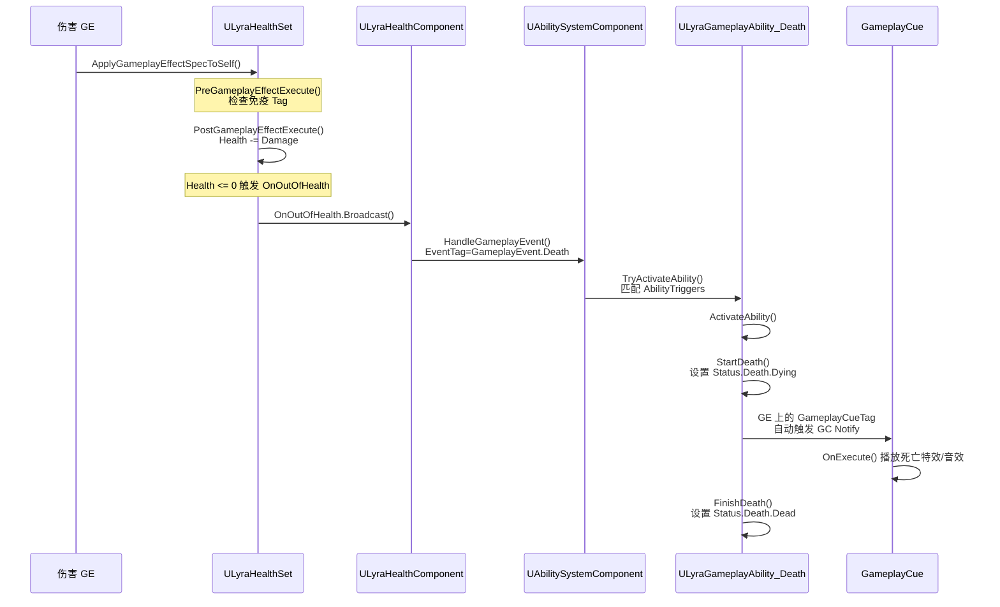

# Lyra综合案例死亡能力链

> 本篇是 GAS 教程系列的**综合案例**，串联讲解 **GA + GE + Tag + GC** 四大系统如何在 Lyra 中协同工作。
> 通过「死亡流程」这个完整案例，将前面分散的知识点串联成一条可跟踪的调用链。

## 为什么要学这个案例

死亡流程是 Lyra 中**调用链最长、涉及系统最多**的 GAS 场景之一：

```
伤害 GE 应用
    ↓
LyraHealthSet::PostGameplayEffectExecute() 血量归零
    ↓
LyraHealthComponent::OnOutOfHealth() 广播死亡事件
    ↓
UAbilitySystemComponent::HandleGameplayEvent()
    ↓
Death GA 激活（由 GameplayEvent.Death 触发）
    ↓
ULyraGameplayAbility_Death::ActivateAbility()
    ↓
设置 Status.Death.Dying Tag → GC 触发死亡表现
    ↓
FinishDeath() → 设置 Status.Death.Dead Tag
```

**学完本篇，你将理解**：
- GE 如何通过 `PostGameplayEffectExecute` 回调驱动后续逻辑
- `GameplayEvent` 如何桥接 GE 结果 → GA 激活
- Tag 如何在整个链中充当「状态信号」
- GC 如何被 GE 上的 `GameplayCueTag` 自动触发

---

## 完整调用链（先看懂这张图）



---

## 阶段 1：伤害 GE 应用与免疫检查

**文件**：`Source/LyraGame/AbilitySystem/Attributes/LyraHealthSet.cpp` L68-L106

伤害 GE 被应用时，**最先执行**的是 `PreGameplayEffectExecute`，这里可以拦截伤害：

```cpp
// LyraHealthSet.cpp L68-L106
bool ULyraHealthSet::PreGameplayEffectExecute(FGameplayEffectModCallbackData &Data)
{
    if (!Super::PreGameplayEffectExecute(Data))
        return false;

    // 只处理 Damage 属性
    if (Data.EvaluatedData.Attribute == GetDamageAttribute())
    {
        if (Data.EvaluatedData.Magnitude > 0.0f)
        {
            // 自毁伤害（坠落死亡）不受免疫影响
            const bool bIsDamageFromSelfDestruct =
                Data.EffectSpec.GetDynamicAssetTags()
                    .HasTagExact(TAG_Gameplay_DamageSelfDestruct);

            // ★ 关键：通过 Tag 实现伤害免疫
            if (Data.Target.HasMatchingGameplayTag(TAG_Gameplay_DamageImmunity)
                && !bIsDamageFromSelfDestruct)
            {
                Data.EvaluatedData.Magnitude = 0.0f;  // 免疫：伤害归零
                return false;  // 拦截，不继续执行
            }
        }
    }
    return true;  // 允许 GE 继续生效
}
```

**这段代码的教学要点**：
- `TAG_Gameplay_DamageImmunity` 是一个 `FGameplayTag`，Lyra 通过给 Actor 添加这个 Tag 来实现无敌状态
- `HasTagExact` vs `HasTag`：前者只匹配精确 Tag，后者匹配父子 Tag（如 `Status.Dead` 也匹配 `Status`）

---

## 阶段 2：血量归零 → 派发 Death 事件

**文件**：`Source/LyraGame/AbilitySystem/Attributes/LyraHealthSet.cpp` L108-L183

`PostGameplayEffectExecute` 在属性**已经被修改后**执行，是触发后续逻辑的入口：

```cpp
// LyraHealthSet.cpp L108-L183（核心片段）
void ULyraHealthSet::PostGameplayEffectExecute(
    const FGameplayEffectModCallbackData& Data)
{
    Super::PostGameplayEffectExecute(Data);

    // 处理 Damage：扣血并 Clamp
    if (Data.EvaluatedData.Attribute == GetDamageAttribute())
    {
        // ★ 通过 GameplayMessageSubsystem 广播伤害事件
        // 其他系统（UI、任务系统）可以监听这个 Message
        FLyraVerbMessage Message;
        Message.Verb = TAG_Lyra_Damage_Message;
        Message.Instigator = Data.EffectSpec.GetEffectContext().GetEffectCauser();
        Message.Target = GetOwningActor();
        Message.Magnitude = Data.EvaluatedData.Magnitude;

        UGameplayMessageSubsystem::Get(GetWorld())
            .BroadcastMessage(Message.Verb, Message);

        // ★ 核心：Health -= Damage，并 Clamp 到 [0, MaxHealth]
        SetHealth(FMath::Clamp(
            GetHealth() - GetDamage(), 0.0f, GetMaxHealth()));
        SetDamage(0.0f);
    }

    // ★ 检测死亡（Health <= 0）
    // OnOutOfHealth 是 ULyraHealthSet 自定义的多播委托
    // ULyraHealthComponent 绑定了这个委托
    if ((GetHealth() <= 0.0f) && !bOutOfHealth)
    {
        OnOutOfHealth.Broadcast(
            Instigator, Causer, &Data.EffectSpec,
            Data.EvaluatedData.Magnitude,
            HealthBeforeAttributeChange, GetHealth());
    }
}
```

**调用链走到这里时发生了什么**：
1. `OnOutOfHealth` 广播 → `ULyraHealthComponent` 收到通知
2. `ULyraHealthComponent::OnOutOfHealth()` 调用 `StartDeath()`
3. `StartDeath()` 通过 `UAbilitySystemComponent::HandleGameplayEvent()` 派发 `GameplayEvent.Death` 事件

> 💡 **为什么用 GameplayEvent 而不用 Tag 直接触发？**
> GameplayEvent 可以携带 `FGameplayEventData`（包含 Instigator、Causer、HitResult 等上下文），比单纯用 Tag 触发 GA 信息更丰富。

---

## 阶段 3：Death GA 被 GameplayEvent 触发

**文件**：`Source/LyraGame/AbilitySystem/Abilities/LyraGameplayAbility_Death.h` L15-L28

`ULyraGameplayAbility_Death` 是一个**由 GameplayEvent 触发**的 GA：

```cpp
// LyraGameplayAbility_Death.h L15-L28
/**
 * ULyraGameplayAbility_Death
 *
 *  Gameplay ability used for handling death.
 *  Ability is activated automatically via the "GameplayEvent.Death" ability trigger tag.
 */
UCLASS(Abstract)
class ULyraGameplayAbility_Death : public ULyraGameplayAbility
{
    GENERATED_BODY()

protected:
    // ★ 关键：AbilityTriggers 包含 GameplayEvent.Death
    // 当 HandleGameplayEvent() 收到这个 Tag 时，自动激活本 GA
    virtual void ActivateAbility(...) override;
};
```

**在 CDO 构造时注册触发器**（`LyraGameplayAbility_Death.cpp` L22-L30）：

```cpp
// LyraGameplayAbility_Death.cpp L22-L30
ULyraGameplayAbility_Death::ULyraGameplayAbility_Death(
    const FObjectInitializer& ObjectInitializer)
    : Super(ObjectInitializer)
{
    InstancingPolicy = EGameplayAbilityInstancingPolicy::InstancedPerActor;
    NetExecutionPolicy = EGameplayAbilityNetExecutionPolicy::ServerInitiated;

    if (HasAnyFlags(RF_ClassDefaultObject))
    {
        // ★ 注册触发器：GameplayEvent.Death → 激活本 GA
        FAbilityTriggerData TriggerData;
        TriggerData.TriggerTag = LyraGameplayTags::GameplayEvent_Death;
        TriggerData.TriggerSource = EGameplayAbilityTriggerSource::GameplayEvent;
        AbilityTriggers.Add(TriggerData);
    }
}
```

**调用链**：
```
HandleGameplayEvent(GameplayEvent.Death, EventData)
    → ASC 遍历 AbilityTriggers
    → 匹配到 ULyraGameplayAbility_Death
    → TryActivateAbility()
    → ActivateAbility()
```

---

## 阶段 4：Death GA 执行 → 设置 Tag → GC 触发

**文件**：`Source/LyraGame/AbilitySystem/Abilities/LyraGameplayAbility_Death.cpp` L70-L90

`ActivateAbility` 中调用 `StartDeath()`，进而设置 `Status.Death.Dying` Tag：

```cpp
// LyraGameplayAbility_Death.cpp L70-L90
void ULyraGameplayAbility_Death::StartDeath()
{
    if (ULyraHealthComponent* HealthComponent =
        ULyraHealthComponent::FindHealthComponent(GetAvatarActorFromActorInfo()))
    {
        if (HealthComponent->GetDeathState() == ELyraDeathState::NotDead)
        {
            // ★ 核心：通知 HealthComponent 开始死亡流程
            HealthComponent->StartDeath();

            // StartDeath() 内部会：
            // 1. 设置 Status.Death.Dying Tag（通过 ASC 的 SetLooseGameplayTag）
            // 2. 禁用输入、关闭碰撞、播放死亡动画
            // 3. GE 上配置的 GameplayCueTag 会自动触发 GC
        }
    }
}
```

**GC 是如何被触发的？**

`ULyraHealthSet::PostGameplayEffectExecute` 中应用的伤害 GE，其资产上配置了 `GameplayCueTags`：

```cpp
// 伪代码：伤害 GE 资产配置（在编辑器中配置，非 C++）
UGameplayEffect* DamageGE = ...;
DamageGE->GameplayCueTags.Add(TAG_GameplayCue_Character_DamageTaken);
```

当 GE **成功应用**时，GAS 系统自动调用：
```
UAbilitySystemComponent::ExecuteGameplayCue()
    → AGameplayCueNotify_Actor / UGameplayCueNotify_Static
    → OnExecute() / OnActive() 播放特效音效
```

**所以 GC 不是 Death GA 主动触发的，而是伤害 GE 应用时由 GAS 系统自动触发的**。

---

## 阶段 5：完成死亡 → 设置 Dead Tag

**文件**：`Source/LyraGame/AbilitySystem/Abilities/LyraGameplayAbility_Death.cpp` L81-L90

死亡动画/表现播放完毕后，`FinishDeath()` 被调用：

```cpp
// LyraGameplayAbility_Death.cpp L81-L90
void ULyraGameplayAbility_Death::FinishDeath()
{
    if (ULyraHealthComponent* HealthComponent =
        ULyraHealthComponent::FindHealthComponent(GetAvatarActorFromActorInfo()))
    {
        if (HealthComponent->GetDeathState() == ELyraDeathState::DeathStarted)
        {
            // ★ 核心：完成死亡，设置 Status.Death.Dead Tag
            HealthComponent->FinishDeath();

            // FinishDeath() 内部会：
            // 1. 移除 Status.Death.Dying Tag
            // 2. 设置 Status.Death.Dead Tag
            // 3. 销毁 Actor（可配置延迟）
        }
    }
}
```

---

## 本案例涉及的关键 Tag 清单

| Tag | 定义位置 | 作用 |
|-----|-----------|------|
| `Gameplay.Damage` | `LyraGameplayTags.h` | 标记伤害属性 |
| `Gameplay.DamageImmunity` | `LyraGameplayTags.h` | 伤害免疫 Tag |
| `Gameplay.Damage.SelfDestruct` | `LyraGameplayTags.h` | 自毁伤害（不受免疫影响） |
| `GameplayEvent.Death` | `LyraGameplayTags.h` | 触发 Death GA 的 GameplayEvent Tag |
| `Status.Death.Dying` | `LyraGameplayTags.h` | 死亡进行中（播放动画） |
| `Status.Death.Dead` | `LyraGameplayTags.h` | 死亡完成（可销毁） |
| `GameplayCue.Character.DamageTaken` | `LyraGameplayTags.h` | 触发受伤 GC |

**Tag 定义方式**（C++ 宏注册，自动加入 GAS 系统）：

```cpp
// LyraGameplayTags.h（声明，其他模块可 extern 引用）
UE_DECLARE_GAMEPLAY_TAG_EXTERN(TAG_Gameplay_Damage, "Gameplay.Damage");

// LyraGameplayTags.cpp（定义，注册到 GAS）
UE_DEFINE_GAMEPLAY_TAG(TAG_Gameplay_Damage, "Gameplay.Damage");
```

---

## 总结：四条系统如何协同

| 系统 | 在本案例中的角色 |
|------|----------------|
| **GE（GameplayEffect）** | 伤害的「执行者」：修改 Health 属性，携带 GameplayCueTag |
| **AttributeSet** | 属性的「守护者」：在 Pre/PostGameplayEffectExecute 中拦截或响应属性变化 |
| **Tag** | 系统和状态之间的「信号量」：Death.Dying / Dead 驱动状态机 |
| **GA（GameplayAbility）** | 死亡流程的「编排者」：响应 GameplayEvent，调用 StartDeath/FinishDeath |
| **GC（GameplayCue）** | 表现的「执行者」：由 GE 上的 Tag 自动触发，播放特效音效 |

**核心设计思想**：
> Lyra 不直接在 C++ 中硬编码「扣血 → 死亡 → 播特效」的流程，而是**全部通过 GAS 的 Tag / Event / GE / GA 机制解耦**。新增死亡表现只需配置新的 GC，新增死亡逻辑只需扩展 Death GA，不需要改 `LyraHealthSet`。

---

## 相关页面

- [[30-tutorials/gas/01-GA简介与配置]] - GA 配置与触发方式
- [[30-tutorials/gas/06-GE简介与配置]] - GE 配置与执行流
- [[30-tutorials/gas/08-GE数值修正]] - GE 数值修正（Damage 如何计算）
- [[30-tutorials/gas/15-Tag简介与配置]] - Tag 系统详解
- [[30-tutorials/gas/20-GC简介与配置]] - GC 系统详解

---
> 最后更新：2026-05-21

<!-- nav:auto -->

---

**导航**: ← [[30-tutorials/gas/25-Attribute属性详解|25-Attribute属性详解]]

<!-- /nav:auto -->
