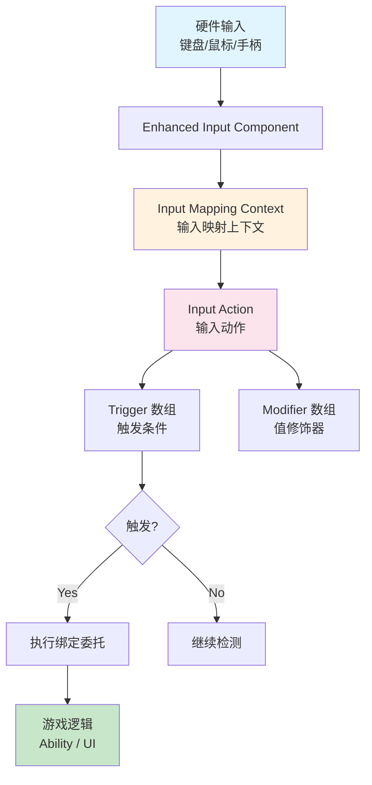

# UE5输入系统系列概览

> 系统学习 UE5 Enhanced Input 系统，从 Input Action、Mapping Context 到 Trigger、Modifier，以及在 Lyra 项目中的实践应用。

---

## 为什么要学输入系统？

输入是玩家与游戏交互的**唯一入口**。UE5 已经全面转向 **Enhanced Input** 插件，传统 `APlayerInput` 系统虽然仍保留，但新项目应优先使用 Enhanced Input。

随着项目规模增长，以下问题会频繁出现：

- 如何支持键盘、鼠标、手柄**同时输入**？
- 如何优雅地实现**组合键**（Ctrl+C）、**长按**、**双击**？
- 如何在不同游戏模式（战斗 / 菜单 / 载具）之间**动态切换**输入映射？
- Lyra 的 Ability 如何与输入系统**解耦联动**？

本系列从**怎么用**出发，配合引擎源码注释，帮助你建立完整的输入系统心智模型。

---

## 核心概念全景图



---

## 与 Lyra 项目的关系

Lyra 大量使用 Enhanced Input 系统来实现**数据驱动的输入配置**：

| Lyra 机制 | 使用的输入技术 | 本系列对应课程 |
|-----------|-------------------|---------------|
| `ULyraInputConfig` | `UInputAction` + GameplayTag 映射 | [[30-tutorials/input-system/02-InputActions与MappingContext配置详解|02 Input Actions 与 Mapping]] |
| `ULyraHeroComponent` | `UEnhancedInputComponent` 绑定 | [[30-tutorials/input-system/04-输入处理流程从硬件到游戏逻辑|04 输入处理流程]] |
| Ability 输入绑定 | InputTag → GAS 联动 | [[30-tutorials/input-system/05-Lyra实践InputTag与GAS联动详解|05 Lyra 实践]] |
| 不同 Experience | 动态 Add/Remove MappingContext | [[30-tutorials/input-system/03-Trigger与Modifier详解|03 Trigger 与 Modifier]] |
| 输入模式切换 | `FInputModeGameOnly` / `FInputModeUIOnly` | [[30-tutorials/input-system/06-高级主题多设备输入注入与调试|06 高级主题]] |

---

## 系列阅读指南

### 阶段一：基础概念（建议按顺序阅读）

| 课序 | 标题 | 核心内容 | 预计时间 |
|------|------|---------|---------|
| 00 | **本概览** | 全景图、与 Lyra 的映射 | 5 min |
| 01 | [[30-tutorials/input-system/01-EnhancedInput系统概览|Enhanced Input 概览]] | 系统架构、与传统 Input 对比 | 30 min |

### 阶段二：核心机制

| 课序 | 标题 | 核心内容 | 预计时间 |
|------|------|---------|---------|
| 02 | [[30-tutorials/input-system/02-InputActions与MappingContext配置详解|Input Actions 与 Mapping]] | InputAction、InputMappingContext、如何配置 | 40 min |
| 03 | [[30-tutorials/input-system/03-Trigger与Modifier详解|Trigger 与 Modifier]] | 所有内置 Trigger、Modifier 详解 | 45 min |
| 04 | [[30-tutorials/input-system/04-输入处理流程从硬件到游戏逻辑|输入处理流程]] | 从硬件到游戏逻辑的完整调用链 | 40 min |

### 阶段三：实战与进阶

| 课序 | 标题 | 核心内容 | 预计时间 |
|------|------|---------|---------|
| 05 | [[30-tutorials/input-system/05-Lyra实践InputTag与GAS联动详解|Lyra 实践]] | `ULyraInputConfig`、InputTag、与 GAS 联动 | 45 min |
| 06 | [[30-tutorials/input-system/06-高级主题多设备输入注入与调试|高级主题]] | 多设备输入、输入注入、调试技巧 | 30 min |

---

## 前置知识

| 知识 | 推荐来源 | 必需程度 |
|------|---------|---------|
| PlayerController 基础 | `[[30-tutorials/ue-framework/50-player-system/01-AController详解]]` | 推荐 |
| Gameplay Ability System | `[[30-tutorials/gas/00-GAS系统总览]]` | 第 05 课需要 |
| C++ 委托（Delegate） | 外部资料 | 必需 |
| 编辑器中创建 Data Asset | UE 官方文档 | 必需 |

---

## 源码引用说明

本系列教程所有技术断言均基于以下来源：

| 优先级 | 来源 | 用途 |
|--------|------|------|
| 1 | Lyra 项目源码（`Source/LyraGame/`） | Lyra 实践部分 |
| 2 | UE 5.7 引擎源码（`Plugins/EnhancedInput/`、`Engine/Source/`） | 引擎机制分析 |
| 3 | UE 官方文档 | 概念定义补充 |

文中代码片段标注格式（使用相对路径）：
```cpp
// 文件：Plugins/EnhancedInput/Source/EnhancedInput/Public/EnhancedInputComponent.h
// UE 5.7
```

---

## 相关页面

- [[30-tutorials/resource-management/00-UE5资源管理系列概览|资源管理系列]] — 相关：输入配置也是一种资源
- [[30-tutorials/ue-framework/50-player-system/01-AController详解|PlayerController 详解]] — 输入系统的宿主
- [[30-tutorials/gas/00-GAS系统总览|GAS 系列概览]] — 第 05 课前置知识

<!-- nav:auto -->

---

**导航**: [[30-tutorials/input-system/01-EnhancedInput系统概览|01-EnhancedInput系统概览]] →

<!-- /nav:auto -->
