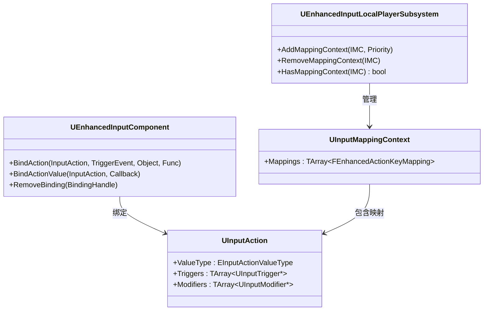

# EnhancedInput系统概览

> 理解 UE5 Enhanced Input 系统的核心架构，学会与传统 Input 系统的核心差异，掌握"数据驱动"的输入配置方法。

---

## 概述

UE5 的 **Enhanced Input** 插件是一套全新的输入处理框架，相比传统 `APlayerInput` 系统有以下核心优势：

1. **数据驱动**：`UInputAction` 和 `UInputMappingContext` 都是资产，可在编辑器中配置
2. **上下文栈**：通过 `MappingContext` 的 **Priority** 实现输入映射的动态切换
3. **Trigger 系统**：内置支持 Pressed、Held、Released、Tap、Chorded 等触发条件
4. **Modifier 系统**：内置死区、轴缩放、平滑等输入修饰器
5. **多设备支持**：键盘、鼠标、手柄、触摸板等可以同时作为输入源

本课学完，你将能够：
1. 理解 Enhanced Input 的整体架构
2. 区分 `UInputAction` 与 `UInputMappingContext` 的职责
3. 了解与传统 Input 系统的核心差异
4. 在项目中启用 Enhanced Input 插件

---

## 核心概念

### Enhanced Input 与传统 Input 对比

| 特性 | 传统 Input（`APlayerInput`） | Enhanced Input（`UEnhancedInputComponent`） |
|------|--------------------------------|------------------------------------|
| 配置方式 | `Config/Input.ini` 手写映射 | `UInputAction` / `UInputMappingContext` 资产 |
| 上下文管理 | 手动启用/禁用 `UInputComponent` | `AddMappingContext` / `RemoveMappingContext` |
| 组合键支持 | 手动检测 | `UInputTriggerChordedAction` 内置支持 |
| 死区/轴处理 | 手动在代码中处理 | `UInputModifierDeadZone` 等内置 Modifier |
| 多设备输入合并 | 不支持 | `EInputActionAccumulationBehavior` 支持 |
| 玩家按键自定义 | 需手动实现 | `UEnhancedInputUserSettings` 内置支持 |

### 核心类关系图



---

## 源码深度分析

### `UEnhancedInputComponent` 关键接口

**文件**：`Plugins/EnhancedInput/Source/EnhancedInput/Public/EnhancedInputComponent.h`

```cpp
// 绑定带参数的委托（推荐，支持传参）
// 文件：Plugins/EnhancedInput/Source/EnhancedInput/Public/EnhancedInputComponent.h
template<typename UserClass, typename... VarTypes>
FInputBindingHandle BindAction(
    const UInputAction* Action,
    ETriggerEvent TriggerEvent,
    UserClass* Object,
    void (UserClass::* Method)(VarTypes..., const FInputActionValue&, float),
    VarTypes... Vars);

// 按 Handle 移除绑定
void RemoveBinding(FInputBindingHandle Handle);
```

**关键理解**：`BindAction` 是 Enhanced Input 的**核心绑定接口**，与传统 `UInputComponent::BindAction` 不同——它绑定的是 `UInputAction` 资产，而不是 FKey。

### `UEnhancedInputLocalPlayerSubsystem` —— 上下文管理

**文件**：`Plugins/EnhancedInput/Source/EnhancedInput/Public/EnhancedInputLocalPlayerSubsystem.h`

```cpp
// 添加输入映射上下文（Priority 决定响应顺序，数字越大优先级越高）
void AddMappingContext(const UInputMappingContext* MappingContext, int32 Priority, FModifyContextOptions Options = FModifyContextOptions());

// 移除输入映射上下文
void RemoveMappingContext(const UInputMappingContext* MappingContext);

// 检查上下文是否已应用
bool HasMappingContext(const UInputMappingContext* MappingContext) const;
```

**Priority 规则**：
```
Priority 值越大 → 越先响应输入
例如：
  IMC_Default (Priority=0)    → 默认映射
  IMC_UI (Priority=1)        → UI 打开时添加，抢占输入
  IMC_Weapon (Priority=2)   → 武器装备时添加，最高优先级
```

---

## 实战：启用 Enhanced Input 并创建第一个 Input Action

### 步骤 1：启用 Enhanced Input 插件

1. 打开 **编辑 → 插件**
2. 搜索 **Enhanced Input**，勾选**启用**
3. 重启编辑器

### 步骤 2：配置 Project Settings

1. 打开 **项目设置 → 引擎 → 输入**
2. 将 **Default Input Component Class** 设置为 `EnhancedInputComponent`
3. 将 **Default Player Input Class** 设置为 `EnhancedPlayerInput`

### 步骤 3：创建第一个 Input Action

1. 在 Content Browser 右键 → **输入 → Input Action**
2. 命名为 `IA_Jump`
3. 打开 `IA_Jump`，设置：
   - **Value Type** = `Digital`（数字输入，按下/释放）
   - **Triggers** = `Default`（即 `UInputTriggerPressed`，按下时触发一次）

### 步骤 4：创建 Input Mapping Context

1. 在 Content Browser 右键 → **输入 → Input Mapping Context**
2. 命名为 `IMC_Default`
3. 打开 `IMC_Default`，添加映射：
   - **Action** = `IA_Jump`
   - **Key** = `Space Bar`

### 步骤 5：在 C++ 中绑定

```cpp
// MyPlayerController.h
#pragma once

#include "CoreMinimal.h"
#include "CommonPlayerController.h"
#include "MyPlayerController.generated.h"

class UEnhancedInputComponent;
class UEnhancedInputLocalPlayerSubsystem;

UCLASS()
class AMyPlayerController : public ACommonPlayerController
{
    GENERATED_BODY()

protected:
    virtual void OnPossess(APawn* InPawn) override;
    virtual void SetupInputComponent() override;

private:
    // 绑定 Jump 输入
    void HandleJump(const FInputActionValue& ActionValue, float ElapsedTime);

    // 保存子系统引用
    TWeakObjectPtr<UEnhancedInputLocalPlayerSubsystem> InputSubsystem;
};
```

```cpp
// MyPlayerController.cpp
#include "MyPlayerController.h"
#include "EnhancedInputComponent.h"
#include "EnhancedInputLocalPlayerSubsystem.h"
#include "InputAction.h"
#include "InputMappingContext.h"

void AMyPlayerController::OnPossess(APawn* InPawn)
{
    Super::OnPossess(InPawn);

    // 获取 Enhanced Input Subsystem
    if (ULocalPlayer* LocalPlayer = GetLocalPlayer())
    {
        InputSubsystem = UEnhancedInputLocalPlayerSubsystem::Get(LocalPlayer);
    }
}

void AMyPlayerController::SetupInputComponent()
{
    Super::SetupInputComponent();

    // 获取 Enhanced Input Component
    UEnhancedInputComponent* EnhancedIC = Cast<UEnhancedInputComponent>(InputComponent);
    check(EnhancedIC);

    // 加载 Input Mapping Context
    if (UInputMappingContext* IMC_Default = LoadObject<UInputMappingContext>(nullptr, TEXT("/Game/Input/Mappings/IMC_Default.IMC_Default")))
    {
        // 添加 Mapping Context（Priority = 0）
        if (UEnhancedInputLocalPlayerSubsystem* Subsystem = InputSubsystem.Get())
        {
            Subsystem->AddMappingContext(IMC_Default, 0);
        }

        // 绑定 Jump Action
        EnhancedIC->BindAction(
            LoadObject<UInputAction>(nullptr, TEXT("/Game/Input/Actions/IA_Jump.IA_Jump")),
            ETriggerEvent::Triggered,
            this,
            &AMyPlayerController::HandleJump
        );
    }
}

void AMyPlayerController::HandleJump(const FInputActionValue& ActionValue, float ElapsedTime)
{
    // ETriggerEvent::Triggered 触发时，已经确认按下了
    // Digital 类型不需要再检查值
    UE_LOG(LogTemp, Log, TEXT("Jump triggered!"));
    
    // 实际游戏中触发跳跃
    if (ACharacter* MyCharacter = GetPawn<ACharacter>())
    {
        MyCharacter->Jump();
    }
}
```

---

## 常见问题与陷阱

### 陷阱 1：`SetupInputComponent` 中 `InputComponent` 为空

**现象**：运行时 `InputComponent` 是 `nullptr`。

**原因**：`SetupInputComponent` 的调用时机在 `OnPossess` 之后，但 `InputComponent` 的创建由引擎内部管理。

**解决**：

```cpp
// 正确：在 SetupInputComponent 中获取
void AMyPlayerController::SetupInputComponent()
{
    Super::SetupInputComponent();

    // 此时 InputComponent 已创建
    UEnhancedInputComponent* EnhancedIC = Cast<UEnhancedInputComponent>(InputComponent);
    check(EnhancedIC);  // 确保项目设置正确
}
```

### 陷阱 2：`AddMappingContext` 后输入不响应

**现象**：`AddMappingContext` 调用成功，但按键无响应。

**原因**：
1. `UInputAction` 的 **Triggers** 配置错误（如 empty Triggers 列表 = 需要手动触发）
2. `MappingContext` 的 **Priority** 被更高优先级的 Context 覆盖

**排查**：

```cpp
// 检查 Context 是否已添加
if (Subsystem->HasMappingContext(IMC_Default))
{
    UE_LOG(LogTemp, Log, TEXT("IMC_Default is active!"));
}
```

### 陷阱 3：`FInputActionValue` 类型不匹配

**现象**：`ActionValue.Get<float>()` 崩溃或返回错误值。

**原因**：`FInputActionValue` 的类型由 `UInputAction::ValueType` 决定：

| Value Type | C++ 获取方式 |
|-----------|----------------|
| `Digital`（布尔） | `ActionValue.Get<bool>()` |
| `Axis1D`（单轴） | `ActionValue.Get<float>()` |
| `Axis2D`（双轴） | `ActionValue.Get<FVector2D>()` |
| `Axis3D`（三轴） | `ActionValue.Get<FVector>()` |

---

## 总结

| 要点 | 说明 |
|------|------|
| 核心类 | `UEnhancedInputComponent`（绑定）、`UEnhancedInputLocalPlayerSubsystem`（上下文管理） |
| 核心资产 | `UInputAction`（动作定义）、`UInputMappingContext`（映射上下文） |
| 绑定方式 | `BindAction(Action, TriggerEvent, Object, Method)` |
| 上下文切换 | `AddMappingContext` / `RemoveMappingContext` |
| Trigger | 控制"何时触发"（`Pressed`、`Held`、`Released` 等） |
| Modifier | 控制"值如何修饰"（`DeadZone`、`Scalar` 等） |

---

## 相关页面

- [[30-tutorials/input-system/00-UE5输入系统系列概览|← 00 系列概览]]
- [[30-tutorials/input-system/02-InputActions与MappingContext配置详解|02 Input Actions 与 Mapping →]]
- [[30-tutorials/ue-framework/50-player-system/01-AController详解|PlayerController 详解]]（前置知识）

<!-- nav:auto -->

---

**导航**: ← [[30-tutorials/input-system/00-UE5输入系统系列概览|00-UE5输入系统系列概览]] · [[30-tutorials/input-system/02-InputActions与MappingContext配置详解|02-InputActions与MappingContext配置详解]] →

<!-- /nav:auto -->
