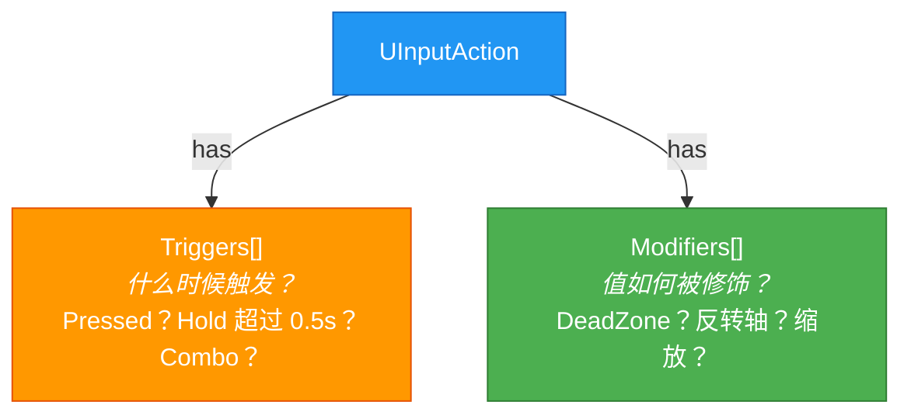

# Trigger与Modifier详解

> 学会使用 Enhanced Input 的 Trigger 系统（Pressed/Hold/Tap/Combo）和 Modifier 系统（DeadZone/Scalar/Negate），掌握复杂输入条件的配置方法。

---

## 概述

`UInputAction` 上挂的两个数组决定了输入如何被处理：



本课学完，你将能够：
1. 理解所有内置 Trigger 类型的触发条件和典型用途
2. 理解所有内置 Modifier 类型的作用和典型用途
3. 在编辑器中配置 Trigger 和 Modifier
4. 在 C++ 中自定义 Trigger / Modifier

---

## 核心概念

### Trigger："什么时候触发？"

`UInputTrigger` 继承自 `UObject`，每个 Trigger 对输入值进行一次**条件判断**，输出 `ETriggerState`：

| 状态 | 含义 |
|-------|------|
| `None` | 未触发 |
| `Triggered` | 已触发（一次性） |
| `Started` | 开始触发（准备中） |
| `Ongoing` | 持续触发中 |
| `Completed` | 已完成（释放） |

**两种组合模式**（在 `UInputAction::Triggers` 数组中配置）：

| 模式 | 规则 | 配置方式 |
|------|------|------------|
| **Explicit**（显式） | 至少一个 Trigger 触发即可 | 默认行为 |
| **Implicit**（隐式） | 所有 Implicit Trigger 都必须触发 | Trigger 的 `TriggerType = Implicit` |

---

## 源码深度分析：所有内置 Trigger 类型

### 文件：`Plugins/EnhancedInput/Source/EnhancedInput/Public/InputTriggers.h`

#### 1. `UInputTriggerPressed`（按下触发）

```cpp
// InputTriggers.h 第 252-264 行
UCLASS(MinimalAPI, meta=(DisplayName="Pressed"))
class UInputTriggerPressed : public UInputTrigger
{
    // 输入首次超过 ActuationThreshold 时触发一次
    // 保持按下不会重复触发
};
```

**典型用途**：跳跃、开火、确认按钮

---

#### 2. `UInputTriggerReleased`（释放触发）

```cpp
// InputTriggers.h 第 271-283 行
UCLASS(MinimalAPI, meta=(DisplayName="Released"))
class UInputTriggerReleased : public UInputTrigger
{
    // 输入从超过阈值降到阈值以下时触发一次
};
```

**典型用途**：松开按键触发（如释放蓄力）

---

#### 3. `UInputTriggerHold`（长按触发）

```cpp
// InputTriggers.h 第 291-314 行
UCLASS(MinimalAPI, meta=(DisplayName="Hold"))
class UInputTriggerHold : public UInputTriggerTimedBase
{
    // 输入保持超过 HoldTimeThreshold 秒后触发
    // bIsOneShot = true  → 只触发一次
    // bIsOneShot = false → 触发后持续 Ongoing

    UPROPERTY(EditAnywhere, Category="Settings")
    float HoldTimeThreshold = 1.0f;

    UPROPERTY(EditAnywhere, Category="Settings")
    bool bIsOneShot = false;
};
```

**典型用途**：长按技能、瞄准镜

---

#### 4. `UInputTriggerTap`（轻击触发）

```cpp
// InputTriggers.h 第 337-352 行
UCLASS(MinimalAPI, meta=(DisplayName="Tap"))
class UInputTriggerTap : public UInputTriggerTimedBase
{
    // 输入激活后必须在 TapReleaseTimeThreshold 秒内释放才触发
    // 超时释放 → 不触发

    UPROPERTY(EditAnywhere, Category="Settings")
    float TapReleaseTimeThreshold = 0.2f;
};
```

**典型用途**：轻击、快速点击

---

#### 5. `UInputTriggerRepeatedTap`（连击触发）

```cpp
// InputTriggers.h 第 359-409 行
UCLASS(MinimalAPI, meta=(DisplayName="Repeated Tap"))
class UInputTriggerRepeatedTap : public UInputTriggerTimedBase
{
    // 在规定时间内重复点击达到指定次数才触发
    // NumberOfTapsWhichTriggerRepeat = 2 → 双击

    UPROPERTY(EditAnywhere, Category="Settings")
    double RepeatDelay = 0.5;  // 两次点击的最大间隔

    UPROPERTY(EditAnywhere, Category="Settings")
    int32 NumberOfTapsWhichTriggerRepeat = 2;
};
```

**典型用途**：双击、三连击

---

#### 6. `UInputTriggerChordedAction`（和弦触发）

```cpp
// InputTriggers.h 第 452-473 行
UCLASS(MinimalAPI, meta=(DisplayName="Chorded Action"))
class UInputTriggerChordedAction : public UInputTrigger
{
    // 需要另一个 UInputAction 处于触发状态时才触发
    // 类型：Implicit（隐式），必须满足条件

    UPROPERTY(EditInstanceOnly, Category="Settings")
    TObjectPtr<const UInputAction> ChordAction;
};
```

**典型用途**：组合键（Ctrl+C、Shift+Click）

---

#### 7. `UInputTriggerCombo`（连招触发）

```cpp
// InputTriggers.h 第 529-569 行
UCLASS(MinimalAPI, meta=(DisplayName="Combo (Beta)"))
class UInputTriggerCombo : public UInputTrigger
{
    // 按顺序完成一系列 Action 后触发
    // 支持取消 Action（InputCancelActions）

    UPROPERTY(EditInstanceOnly, Category="Settings")
    TArray<FInputComboStepData> ComboActions;
};
```

**典型用途**：格斗游戏的连招、技能组合

---

## 源码深度分析：所有内置 Modifier 类型

### 文件：`Plugins/EnhancedInput/Source/EnhancedInput/Public/InputModifiers.h`

#### 1. `UInputModifierDeadZone`（死区）

```cpp
// InputModifiers.h 第 146-177 行
UCLASS(MinimalAPI, meta=(DisplayName="Dead Zone"))
class UInputModifierDeadZone : public UInputModifier
{
    // 输入在 [LowerThreshold, UpperThreshold] 内被映射到 0
    // 超出 UpperThreshold 的值被 Clamp 到 1

    UPROPERTY(EditInstanceOnly, Category="Settings")
    float LowerThreshold = 0.2f;

    UPROPERTY(EditInstanceOnly, Category="Settings")
    float UpperThreshold = 1.0f;

    UPROPERTY(EditInstanceOnly, Category="Settings")
    EDeadZoneType Type = EDeadZoneType::Radial;
};
```

`EDeadZoneType` 枚举：
- `Axial`：各轴独立处理（方形死区）
- `Radial`：同时处理所有轴（圆形死区，平滑过渡）
- `UnscaledRadial`：圆形死区但不平滑

**典型用途**：摇杆死区、防止漂移

---

#### 2. `UInputModifierScalar`（缩放）

```cpp
// InputModifiers.h 第 182-205 行
UCLASS(MinimalAPI, meta=(DisplayName="Scalar"))
class UInputModifierScalar : public UInputModifier
{
    // 按轴缩放输入值
    UPROPERTY(EditInstanceOnly, Category="Settings")
    FVector Scalar = FVector::OneVector;
};
```

**典型用途**：调整鼠标灵敏度、摇杆灵敏度

---

#### 3. `UInputModifierNegate`（反转）

```cpp
// InputModifiers.h 第 222-239 行
UCLASS(MinimalAPI, meta=(DisplayName="Negate"))
class UInputModifierNegate : public UInputModifier
{
    // 反转指定轴的输入方向
    UPROPERTY(EditInstanceOnly, Category="Settings")
    bool bX = true;
    UPROPERTY(EditInstanceOnly, Category="Settings")
    bool bY = true;
    UPROPERTY(EditInstanceOnly, Category="Settings")
    bool bZ = true;
};
```

**典型用途**：反转 Y 轴（FPS 鼠标）、左右反转

---

#### 4. `UInputModifierResponseCurveExponential`（指数响应曲线）

```cpp
// InputModifiers.h 第 274-286 行
UCLASS(MinimalAPI, meta=(DisplayName="Response Curve - Exponential"))
class UInputModifierResponseCurveExponential : public UInputModifier
{
    // 对输入值应用指数曲线：output = input ^ exponent
    UPROPERTY(EditInstanceOnly, Category="Settings")
    FVector CurveExponent = FVector::OneVector;
};
```

**典型用途**：非线性输入响应（如加速曲线）

---

#### 5. `UInputModifierSwizzleAxis`（轴重排）

```cpp
// InputModifiers.h 第 380-394 行
UCLASS(MinimalAPI, meta=(DisplayName="Swizzle Input Axis Values"))
class UInputModifierSwizzleAxis : public UInputModifier
{
    // 重排输入轴的顺序，例如把 X 和 Y 交换
    UPROPERTY(EditInstanceOnly, Category="Settings")
    EInputAxisSwizzle Order = EInputAxisSwizzle::YXZ;
};
```

`EInputAxisSwizzle` 枚举：`YXZ`（交换 X/Y）、`ZYX`、`XZY` 等。

**典型用途**：映射 1D 输入到 Y 轴

---

## 实战：在编辑器中配置 Trigger 和 Modifier

### 示例 1：配置"按下开火"（Pressed）

1. 打开 `IA_Weapon_Fire`（`UInputAction` 资产）
2. **Value Type** = `Digital`
3. **Triggers** 数组添加 `UInputTriggerPressed`
   - 无需额外配置（默认 `ActuationThreshold = 0.5`）


4. 在 `IMC_Default` 中映射 `Left Mouse Button` → `IA_Weapon_Fire`

---

### 示例 2：配置"长按瞄准"（Hold）

1. 打开 `IA_Aim`（`UInputAction` 资产）
2. **Value Type** = `Axis1D`
3. **Triggers** 数组添加 `UInputTriggerHold`
   - `HoldTimeThreshold` = `0.5`（按住 0.5 秒触发）
   - `bIsOneShot` = `false`（持续 Ongoing）


4. 在 C++ 中处理 Ongoing 状态：

```cpp
// 绑定到 Started（开始瞄准）和 Ongoing
EnhancedIC->BindAction(
    IA_Aim,
    ETriggerEvent::Started,
    this,
    &AMyPlayerController::OnAimStarted
);

EnhancedIC->BindAction(
    IA_Aim,
    ETriggerEvent::Ongoing,
    this,
    &AMyPlayerController::OnAimOngoing
);
```

---

### 示例 3：配置"摇杆死区"（DeadZone Modifier）

1. 打开 `IMC_Default`（`UInputMappingContext` 资产）
2. 找到移动映射条目（`IA_Move` + `WASD`）
3. 展开条目的 **Modifiers** 数组，添加 `UInputModifierDeadZone`
   - `LowerThreshold` = `0.25`（摇杆偏移超过 25% 才响应）
   - `Type` = `Radial`（圆形死区）

---

### 示例 4：配置"组合键"（Chorded Action Trigger）

1. 打开 `IA_Weapon_Special`（`UInputAction` 资产）
2. **Triggers** 数组添加 `UInputTriggerChordedAction`
   - `ChordAction` = `IA_Shift`（需要 Shift 键同时按住）
   - `TriggerType` = `Implicit`（必须满足条件）


3. 在 `IMC_Default` 中映射：
   - `Shift` → `IA_Shift`
   - `E` → `IA_Weapon_Special`

---

## Lyra 实践：Trigger 与 Modifier 在 Lyra 中的使用

### Lyra 的 `IA_Move`（移动输入）

**文件**：`Content/Input/Actions/IA_Move.uasset`（推测配置）

- **Value Type** = `Axis2D`
- **Modifiers** = `UInputModifierDeadZone`（防止摇杆漂移）
  - `LowerThreshold` = `0.2`
  - `Type` = `Radial`


---

### Lyra 的 `IA_Look_Mouse`（鼠标视角）

- **Value Type** = `Axis2D`
- **Modifiers** = `UInputModifierScalar`（灵敏度调整）
  - `Scalar` = `(X=1.0, Y=-1.0)`（反转 Y 轴）


---

### Lyra 的 `IA_Weapon_Fire`（开火输入）

- **Value Type** = `Digital`
- **Triggers** = `UInputTriggerPressed`（按下触发一次）
- **Triggers** += `UInputTriggerReleased`（释放时通知 Ability 结束）

C++ 绑定（在 `ULyraHeroComponent::InitializePlayerInput` 中间接完成）：

```cpp
// Lyra 使用 LyraInputConfig 配置，不是手动 BindAction
// 而是通过 InputTag → GAS Ability 自动路由
```

---

## 自定义 Trigger / Modifier（C++）

### 自定义 Trigger

```cpp
// MyTrigger_DoubleTap.h
UCLASS(MinimalAPI, meta=(DisplayName="Double Tap (Custom)"))
class UMyTrigger_DoubleTap : public UInputTrigger
{
    GENERATED_BODY()

public:
    UPROPERTY(EditAnywhere, Category="Settings")
    float DoubleTapThreshold = 0.3f;

    virtual ETriggerState Evaluate(const FInputActionValue& ForValue, float DeltaTime) override
    {
        // 自定义逻辑：检测短时间内两次按下
        // 返回 Triggered / None
    }
};
```

---

### 自定义 Modifier

```cpp
// MyModifier_Clamp.h
UCLASS(MinimalAPI, meta=(DisplayName="Clamp (Custom)"))
class UMyModifierClamp : public UInputModifier
{
    GENERATED_BODY()

public:
    UPROPERTY(EditAnywhere, Category="Settings")
    float MaxValue = 1.0f;

    virtual FInputActionValue ModifyRaw(
        const UEnhancedPlayerInput* PlayerInput,
        FInputActionValue CurrentValue,
        float DeltaTime) const override
    {
        // 自定义逻辑：Clamp 输入值
        return FInputActionValue(FMath::Clamp(CurrentValue.Get<float>(), 0.0f, MaxValue));
    }
};
```

---

## 常见问题与陷阱

### 陷阱 1：Trigger 数组中有多个 Explicit Trigger 时的行为

**现象**：添加了 `Pressed` 和 `Released`，结果按下和释放都触发了。

**原因**：默认 `TriggerType = Explicit`，**至少一个** Explicit Trigger 满足就触发。

**解决**：如果希望"按下 **且** 另一个条件满足，使用 `Implicit`：

```
Triggers[0]: UInputTriggerPressed   → TriggerType = Explicit (默认)
Triggers[1]: UInputTriggerChordedAction → TriggerType = Implicit
→ 必须 Pressed "且" ChordAction 满足条件才触发
```

---

### 陷阱 2：Modifier 在 Trigger 之前还是之后应用？

**执行顺序**：

```
硬件输入
  → [1] 应用 FEnhancedActionKeyMapping 中的 Modifiers（映射级）
  → [2] 应用 UInputAction 中的 Modifiers（Action 级）
  → [3] 评估 Triggers
  → [4] 触发委托
```

**关键**：Modifier **先**应用，Trigger **后**评估。所以 DeadZone 会影响 Pressed 的判定。

---

### 陷阱 3：Chorded Action 的 TriggerType 必须是 Implicit

**现象**：配置了 `ChordedAction`，但单独按主按键也触发了。

**原因**：`ChordedAction` 的 `TriggerType` 默认是 `Implicit`，但如果你手动改成了 `Explicit`，它就变成"可选条件"了。

**解决**：确保 `TriggerType = Implicit`（默认就是）。

---

## 总结

| 要点 | 说明 |
|------|------|
| Trigger | 控制"什么时候触发"（Pressed/Hold/Tap/Combo...） |
| Modifier | 控制"值如何被修饰"（DeadZone/Scalar/Negate...） |
| Explicit | 至少一个满足即触发 |
| Implicit | 所有 Implicit 必须满足才触发 |
| 执行顺序 | 先 Modifier，后 Trigger |
| Lyra 实践 | 通过 `LyraInputConfig` 数据驱动配置，不是手动 BindAction |

---

## 相关页面

- [[30-tutorials/input-system/02-InputActions与MappingContext配置详解|← 02 Input Actions 与 Mapping]]
- [[30-tutorials/input-system/04-输入处理流程从硬件到游戏逻辑|04 输入处理流程 →]]
- [[30-tutorials/gas/01-GA简介与配置|GAS 系列（理解 Ability 激活）]]

<!-- nav:auto -->

---

**导航**: ← [[30-tutorials/input-system/02-InputActions与MappingContext配置详解|02-InputActions与MappingContext配置详解]] · [[30-tutorials/input-system/04-输入处理流程从硬件到游戏逻辑|04-输入处理流程从硬件到游戏逻辑]] →

<!-- /nav:auto -->
