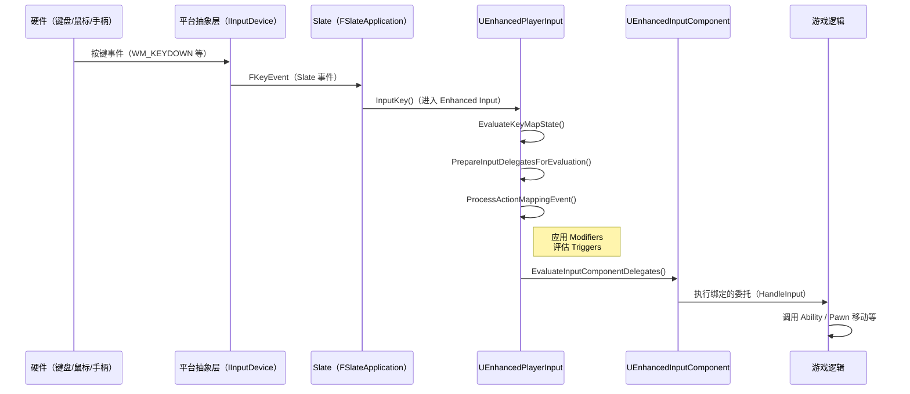

# 输入处理流程从硬件到游戏逻辑

> 深入理解 UE5 Enhanced Input 的底层处理流程，掌握在 C++ 中追踪输入问题的调试方法。

---

## 概述

理解输入处理流程对于**调试输入问题**和**自定义输入行为**至关重要。完整的链路是：

```
硬件输入 → 平台抽象层 → Slate → Enhanced Player Input → Enhanced Input Component → 游戏逻辑
```

本课学完，你将能够：
1. 描述从硬件按键到游戏逻辑的完整调用链
2. 在 C++ 源码中定位输入处理的每个阶段
3. 使用调试技巧追踪输入问题
4. 看懂 Lyra 的输入处理流程

---

## 核心概念

### 输入处理的 4 个阶段

| 阶段 | 职责 | 关键类/函数 |
|------|---------|---------------|
| **1. 平台抽象** | 将不同设备的输入统一为 `FKey` / `FKeyEvent` | `IInputDevice`、`FKeyState` |
| **2. Slate 转发** | 将平台事件转换为 Slate 事件，路由到焦点 Widget | `FSlateApplication::ProcessKeyDown/Up()` |
| **3. Enhanced Player Input** | 评估 Trigger / Modifier，决定"是否触发" | `UEnhancedPlayerInput::EvaluateKeyMapState()` |
| **4. Enhanced Input Component** | 执行绑定的委托，调用游戏逻辑 | `UEnhancedInputComponent::EvaluateInputComponentDelegates()` |

---

## 源码深度分析

### 阶段 1 & 2：平台抽象与 Slate 转发

**文件**：`Engine/Source/Runtime/Slate/Public/Framework/Application/SlateApplication.h`

Slate 是 UE 的 UI 框架，也负责把平台输入事件转发到游戏逻辑：

```cpp
// SlateApplication.h（简化）
class FSlateApplication
{
    // 处理按键按下（平台 → Slate）
    bool ProcessKeyDown(const TSharedPtr<FGenericWindow>& Window, const FKeyEvent& KeyEvent);

    // 处理按键释放
    bool ProcessKeyUp(const TSharedPtr<FGenericWindow>& Window, const FKeyEvent& KeyEvent);

    // 处理模拟输入（鼠标移动、摇杆）
    bool ProcessAnalogInput(const FAnalogInputEvent& InAnalogInput);
};
```

**关键点**：如果输入被 UI 消费了（如按 `Esc` 关闭菜单），就不会继续传递到游戏逻辑。

---

### 阶段 3：`UEnhancedPlayerInput` —— 核心评估逻辑

**文件**：`Plugins/EnhancedInput/Source/EnhancedInput/Private/EnhancedPlayerInput.cpp`

这是 Enhanced Input 的**最核心**部分，负责评估 Trigger 和 Modifier。

#### `EvaluateKeyMapState()`（第 ~300 行）

```cpp
// EnhancedPlayerInput.cpp（简化逻辑）
void UEnhancedPlayerInput::EvaluateKeyMapState(float DeltaTime)
{
    // [1] 准备状态：更新 Previous 状态
    for (FKeyState& KeyState : KeyStateMap)
    {
        KeyState.bDownPrevious = KeyState.bDown;
    }

    // [2] 调用父类评估（传统 Input 兼容）
    Super::EvaluateKeyMapState(DeltaTime);

    // [3] 准备 Enhanced 评估
    PrepareInputDelegatesForEvaluation(DeltaTime);
}
```

#### `PrepareInputDelegatesForEvaluation()`（核心，第 ~389 行）

```cpp
void UEnhancedPlayerInput::PrepareInputDelegatesForEvaluation(float DeltaTime)
{
    // [1] 遍历所有 Enhanced Action Mappings
    for (FEnhancedActionKeyMapping& Mapping : EnhancedActionMappings)
    {
        // [2] 对每个映射调用 ProcessActionMappingEvent()
        ProcessActionMappingEvent(Mapping, DeltaTime);
    }

    // [3] 处理注入输入（调试用）
    ProcessInjectedInput(DeltaTime);
}
```

#### `ProcessActionMappingEvent()`（Trigger 评估核心，第 ~157 行）

```cpp
// 注意：以下为简化伪代码，实际引擎实现会遍历 Modifiers 数组并调用 ModifyRaw()
void UEnhancedPlayerInput::ProcessActionMappingEvent(
    FEnhancedActionKeyMapping& Mapping,
    float DeltaTime)
{
    // [1] 获取或创建 FInputActionInstance
    FInputActionInstance& ActionInstance = GetActionInstance(Mapping.Action);

    // [2] 应用 Mapping 级 Modifiers（如果有）
    FInputActionValue ModifiedValue = OriginalValue;
    for (UInputModifier* Modifier : Mapping.Modifiers)
    {
        ModifiedValue = Modifier->ModifyRaw(PlayerInput, ModifiedValue, DeltaTime);
    }

    // [3] 应用 Action 级 Modifiers
    for (UInputModifier* Modifier : Mapping.Action->Modifiers)
    {
        ModifiedValue = Modifier->ModifyRaw(PlayerInput, ModifiedValue, DeltaTime);
    }

    // [4] 评估 Trigger 数组（核心！）
    ETriggerState TriggerResult = EvaluateTriggers(
        Mapping.Triggers,  // Mapping 级（覆盖 Action 级）
        ModifiedValue,
        DeltaTime);

    // [5] 根据结果更新 ActionInstance 状态
    if (TriggerResult == ETriggerState::Triggered)
    {
        ActionInstance.bTriggered = true;
        // 广播委托...
    }
}
```

---

### 阶段 4：`UEnhancedInputComponent` —— 委托执行

**文件**：`Plugins/EnhancedInput/Source/EnhancedInput/Private/EnhancedInputComponent.cpp`

```cpp
void UEnhancedInputComponent::EvaluateInputComponentDelegates(float DeltaTime)
{
    // [1] 调用父类（传统 Input Component 逻辑）
    Super::EvaluateInputComponentDelegates(DeltaTime);

    // [2] 遍历所有 Enhanced Action Event Bindings
    for (FEnhancedActionEventBinding& Binding : EnhancedActionEventBindings)
    {
        // [3] 检查 Binding 对应的 ActionInstance 状态
        FInputActionInstance& Instance = PlayerInput->GetActionInstance(Binding.Action);

        if (Instance.bTriggered && Binding.TriggerEvent == ETriggerEvent::Triggered)
        {
            // [4] 执行绑定的委托！
            Binding.Delegate.Excute(Binding.Action, Instance.Value, DeltaTime, Instance.TriggeredTime);
        }
    }
}
```

---

## 完整调用链总结



---

## Lyra 实践：输入处理流程

### `ULyraHeroComponent::InitializePlayerInput()`

**文件**：`Source/LyraGame/Character/LyraHeroComponent.cpp`（第 ~225 行）

Lyra 的输入初始化入口：

```cpp
void ULyraHeroComponent::InitializePlayerInput(UInputComponent* PlayerInputComponent)
{
    // [1] 获取 Enhanced Input Local Player Subsystem
    UEnhancedInputLocalPlayerSubsystem* Subsystem = ...;

    // [2] 清除所有现有 Mapping Contexts
    Subsystem->RemoveAllMappingContexts();

    // [3] 从 LyraPawnData 获取 InputConfig
    if (const ULyraPawnData* PawnData = GetPawnData())
    {
        if (ULyraInputConfig* InputConfig = PawnData->InputConfig)
        {
            // [4] 添加 Default Input Mappings
            for (FInputMappingContextAndPriority& Mapping : InputConfig->DefaultInputMappings)
            {
                Subsystem->AddMappingContext(Mapping.InputMapping, Mapping.Priority);
            }

            // [5] 绑定 Ability Actions（通过 InputTag → GAS）
            LyraIC->BindAbilityActions(InputConfig, this, ...);

            // [6] 绑定 Native Actions（直接在 C++ 处理）
            LyraIC->BindNativeAction(InputConfig, TAG_Input_Move, ...);
        }
    }
}
```

---

## 调试输入问题的技巧

### 技巧 1：使用 `ShowDebug EnhancedInput`

在编辑器或游戏中按 **Backquote（`）** 键（或控制台输入 `ShowDebug EnhancedInput`），可以实时看到：

- 当前激活的 Mapping Contexts
- 每个 Input Action 的当前值
- Trigger 的状态（Triggered / Ongoing / None）

---

### 技巧 2：在 C++ 中打断点追踪

| 想追踪的问题 | 断点位置 |
|---------------|------------|
| 输入完全没反应 | `UEnhancedPlayerInput::InputKey()` |
| Trigger 没触发 | `ProcessActionMappingEvent()` 中的 `EvaluateTriggers()` 调用 |
| 委托没执行 | `UEnhancedInputComponent::EvaluateInputComponentDelegates()` |
| 值不对（轴反转/死区） | `ProcessActionMappingEvent()` 中的 Modifier 应用部分 |

---

### 技巧 3：检查 Input Mapping Context 是否激活

```cpp
// 在游戏运行时执行：
UEnhancedInputLocalPlayerSubsystem* Subsystem = ...;
if (Subsystem->HasMappingContext(IMC_Default))
{
    UE_LOG(LogTemp, Log, TEXT("IMC_Default is active!"));
}
else
{
    UE_LOG(LogTemp, Error, TEXT("IMC_Default is NOT active!"));
}
```

---

## 常见问题与陷阱

### 陷阱 1：UI 消费了输入，游戏没响应

**现象**：菜单打开时，按 `WASD` 还能移动角色。

**原因**：输入处理顺序：`Slate → Enhanced Input`。如果 UI 没消费输入（没有 `FReply::Handled()`），输入会继续传递到游戏。

**解决**：在 UI Widget 中重写 `NativeOnKeyDown()` 并返回 `FReply::Handled()`。

---

### 陷阱 2：`ProcessActionMappingEvent()` 没被调用

**现象**：`InputKey()` 被调用了，但 Trigger 没触发。

**原因**：`EnhancedActionMappings` 数组是空的 → `IMC` 没被正确添加。

**排查**：在 `AddMappingContext()` 后检查 `EnhancedActionMappings.Num()` 是否 > 0。

---

### 陷阱 3：Modifier 应用顺序错误

**现象**：死区设置正确，但输入值还是异常。

**原因**：Modifier 在 Mapping 级**先**应用，然后 Action 级 Modifier **后**应用。如果两级 Modifier 冲突，结果会不符合预期。

**解决**：检查 `FEnhancedActionKeyMapping` 上的 `Modifiers` 数组，确保没有重复的 Modifier 类型。

---

## 总结

| 要点 | 说明 |
|------|------|
| **完整调用链** | 硬件 → 平台抽象 → Slate → EnhancedPlayerInput → EnhancedInputComponent → 游戏逻辑 |
| **核心评估函数** | `ProcessActionMappingEvent()`（应用 Modifier + 评估 Trigger） |
| **委托执行** | `EvaluateInputComponentDelegates()`（检查 ActionInstance 状态 → 执行委托） |
| **Lyra 初始化** | `ULyraHeroComponent::InitializePlayerInput()`（添加 IMC + 绑定 Action） |
| **调试技巧** | `ShowDebug EnhancedInput`、C++ 断点、`HasMappingContext()` 检查 |

---

## 相关页面

- [[30-tutorials/input-system/03-Trigger与Modifier详解|← 03 Trigger 与 Modifier]]
- [[30-tutorials/input-system/05-Lyra实践InputTag与GAS联动详解|05 Lyra 实践 →]]
- [[30-tutorials/gas/01-GA简介与配置|GAS 系列（理解 Ability 激活）]]

<!-- nav:auto -->

---

**导航**: ← [[30-tutorials/input-system/03-Trigger与Modifier详解|03-Trigger与Modifier详解]] · [[30-tutorials/input-system/05-Lyra实践InputTag与GAS联动详解|05-Lyra实践InputTag与GAS联动详解]] →

<!-- /nav:auto -->
