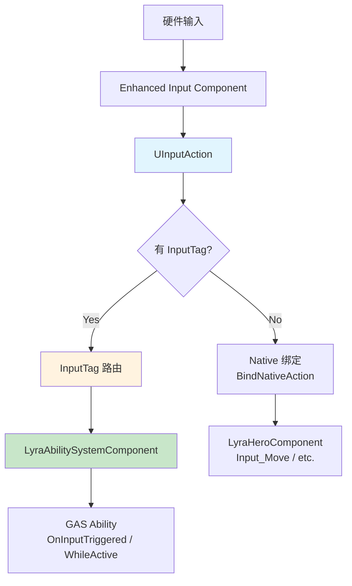
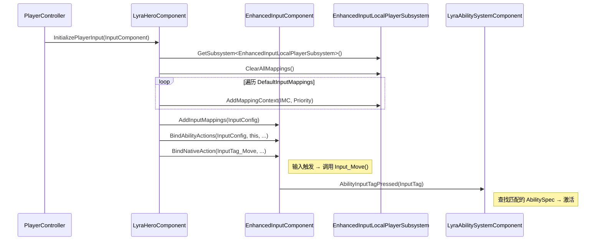
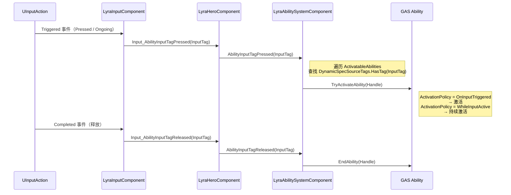

# Lyra实践InputTag与GAS联动详解

> 深入理解 Lyra 输入系统如何通过 `ULyraInputConfig` + `InputTag` 实现数据驱动的输入配置，以及与 GAS 的无缝联动。

---

## 概述

Lyra 的输入系统核心是**数据驱动** + **`InputTag` 路由**：

- `ULyraInputConfig`（Primary Asset）→ 配置所有输入映射
- `InputTag`（GameplayTag 子类）→ 将输入动作路由到 GAS Ability
- `ULyraHeroComponent` → 初始化 Enhanced Input，完成绑定

本课学完，你将能够：
1. 看懂 `ULyraInputConfig` 的结构和作用
2. 理解 `InputTag` 如何将输入路由到 GAS Ability
3. 掌握 Lyra 的输入初始化完整流程
4. 在自己的项目中复用 Lyra 的输入模式

---

## 核心架构

### Lyra 输入系统全景图



---

## 源码深度分析

### `ULyraInputConfig` —— 输入配置数据资产

**文件**：`Source/LyraGame/Input/LyraInputConfig.h`

`ULyraInputConfig` 继承自 `UPrimaryDataAsset`，是 Lyra 输入系统的**数据中心**：

```cpp
// LyraInputConfig.h
UCLASS(BlueprintType, Const)
class ULyraInputConfig : public UPrimaryDataAsset
{
    GENERATED_BODY()

public:
    // [1] 原生输入动作 —— 直接绑定到 C++ 函数
    UPROPERTY(EditDefaultsOnly, Category = "Input")
    TArray<FLyraInputAction> NativeInputActions;

    // [2] 能力输入动作 —— 通过 InputTag 路由到 GAS Ability
    UPROPERTY(EditDefaultsOnly, Category = "Input")
    TArray<FLyraInputAction> AbilityInputActions;
};
```

**`FLyraInputAction` 结构体**（关键！）：

```cpp
// LyraInputConfig.h
USTRUCT(BlueprintType)
struct FLyraInputAction
{
    GENERATED_BODY()

    // 对应的 UInputAction 资产
    UPROPERTY(EditDefaultsOnly, Category = "Input")
    TObjectPtr<const UInputAction> InputAction;

    // 关联的 InputTag（GameplayTag 子类）
    // 用于路由到 GAS Ability
    UPROPERTY(EditDefaultsOnly, Category = "Input", Meta = (Categories = "InputTag"))
    FGameplayTag InputTag;
};
```

**两种输入动作的区别**：

| 类型 | 绑定方式 | 典型用途 |
|------|---------|-----------|
| **NativeInputActions** | `BindNativeAction()` → C++ 函数 | 移动、视角、蹲下、自动奔跑 |
| **AbilityInputActions** | `BindAbilityActions()` → InputTag → GAS | 跳跃、Dash、Heal、武器开火 |

---

### `ULyraHeroComponent` —— 输入初始化核心

**文件**：`Source/LyraGame/Character/LyraHeroComponent.cpp`（第 ~225 行）

这是 Lyra 输入初始化的**核心入口**：



**关键代码解读**（`LyraHeroComponent.cpp` 第 ~282 行）：

```cpp
void ULyraHeroComponent::InitializePlayerInput(UInputComponent* PlayerInputComponent)
{
    // [1] 获取 Enhanced Input Local Player Subsystem
    UEnhancedInputLocalPlayerSubsystem* Subsystem = ...;
    check(Subsystem);

    // [2] 清除所有现有映射（切换 Experience 时调用）
    Subsystem->ClearAllMappings();

    // [3] 从 LyraPawnData 获取 InputConfig
    if (const ULyraPawnData* PawnData = GetPawnData<ULyraPawnData>())
    {
        if (ULyraInputConfig* InputConfig = PawnData->InputConfig)
        {
            // [4] 添加 DefaultInputMappings 中定义的 IMC
            for (const FLyraInputMappingContextAndPriority& Mapping : InputConfig->DefaultInputMappings)
            {
                if (UInputMappingContext* IMC = Mapping.InputMapping.LoadSynchronous())
                {
                    // 注册到用户设置（支持按键自定义）
                    if (UEnhancedInputUserSettings* Settings = Subsystem->GetUserSettings())
                    {
                        Settings->RegisterInputMappingContext(IMC);
                    }

                    // 添加到玩家的 Input Mapping 栈
                    Subsystem->AddMappingContext(IMC, Mapping.Priority);
                }
            }

            // [5] 使用 LyraInputComponent 绑定输入
            ULyraInputComponent* LyraIC = Cast<ULyraInputComponent>(PlayerInputComponent);
            if (LyraIC)
            {
                // 5.1 绑定能力输入动作（通过 InputTag 路由）
                LyraIC->BindAbilityActions(
                    InputConfig,
                    this,
                    &ThisClass::Input_AbilityInputTagPressed,
                    &ThisClass::Input_AbilityInputTagReleased
                );

                // 5.2 绑定原生输入动作
                LyraIC->BindNativeAction(
                    InputConfig,
                    FLyraGameplayTags::Get().InputTag_Move,
                    ETriggerEvent::Triggered,
                    this,
                    &ThisClass::Input_Move
                );

                // 同上：Look_Mouse、Look_Stick、Crouch、AutoRun
            }
        }
    }

    // [6] 标记输入已准备好
    bReadyToBindInputs = true;

    // [7] 通知其他组件
    UGameFrameworkComponentManager::SendGameFrameworkComponentExtensionEvent(
        GetController<APlayerController>(),
        NAME_BindInputsNow
    );
}
```

---

## `InputTag` 与 GAS 联动机制

### 完整联动流程



---

### `ULyraAbilitySystemComponent` 中的处理

**文件**：`Source/LyraGame/AbilitySystem/LyraAbilitySystemComponent.cpp`

#### 按下时 → `AbilityInputTagPressed()`

```cpp
void ULyraAbilitySystemComponent::AbilityInputTagPressed(const FGameplayTag& InputTag)
{
    if (InputTag.IsValid())
    {
        for (FGameplayAbilitySpec& AbilitySpec : ActivatableAbilities.Items)
        {
            // 查找 DynamicSpecSourceTags 包含该 InputTag 的 Ability
            if (AbilitySpec.Ability && AbilitySpec.GetDynamicSpecSourceTags().HasTagExact(InputTag))
            {
                // 记录到 InputPressedSpecHandles（等待激活）
                InputPressedSpecHandles.AddUnique(AbilitySpec.Handle);
                // 同时记录到 InputHeldSpecHandles（持续激活用）
                InputHeldSpecHandles.AddUnique(AbilitySpec.Handle);
            }
        }
    }
}
```

#### Tick 中处理 → `ProcessAbilityInput()`

```cpp
void ULyraAbilitySystemComponent::ProcessAbilityInput(float DeltaTime, bool bGamePaused)
{
    // [1] 处理持续激活的 Ability（WhileInputActive）
    for (FGameplayAbilitySpecHandle Handle : InputHeldSpecHandles)
    {
        if (FGameplayAbilitySpec* AbilitySpec = FindAbilitySpecFromHandle(Handle))
        {
            if (AbilitySpec->Ability && AbilitySpec->Ability->CanActivateAbility(Handle, ...))
            {
                // ActivationPolicy = WhileInputActive → 持续激活
                TryActivateAbility(Handle);
            }
        }
    }

    // [2] 处理单次触发的 Ability（OnInputTriggered）
    for (FGameplayAbilitySpecHandle Handle : InputPressedSpecHandles)
    {
        if (FGameplayAbilitySpec* AbilitySpec = FindAbilitySpecFromHandle(Handle))
        {
            // ActivationPolicy = OnInputTriggered → 按下时激活一次
            TryActivateAbility(Handle);
        }
    }

    // [3] 清空 Pressed（下次触发需要重新按下）
    InputPressedSpecHandles.Reset();
}
```

#### 释放时 → `AbilityInputTagReleased()`

```cpp
void ULyraAbilitySystemComponent::AbilityInputTagReleased(const FGameplayTag& InputTag)
{
    // 从 InputHeldSpecHandles 移除 → 停止持续激活
    for (FGameplayAbilitySpecHandle Handle : InputHeldSpecHandles)
    {
        if (FGameplayAbilitySpec* AbilitySpec = FindAbilitySpecFromHandle(Handle))
        {
            if (AbilitySpec->Ability->GetDynamicSourceTags().HasTagExact(InputTag))
            {
                // 结束 Ability
                AbilitySpec->Ability->EndAbility(Handle, ...);
            }
        }
    }
}
```

---

## 实战：看懂 Lyra 的 InputConfig 资产

### 步骤 1：找到 Lyra 的 InputConfig

在编辑器中：
1. 打开 **Content Browser**
2. 搜索 `**InputData_Hero**`
3. 打开 `InputData_Hero`（ULyraInputConfig 类型）

### 步骤 2：理解配置内容

| 字段 | Lyra 的配置示例 | 说明 |
|------|------------------|------|
| **NativeInputActions** | `IA_Move` → `InputTag.Move` | 移动，绑定到 C++ |
|  | `IA_Look_Mouse` → `InputTag.Look.Mouse` | 鼠标视角 |
|  | `IA_Crouch` → `InputTag.Crouch` | 蹲下 |
| **AbilityInputActions** | `IA_Ability_Dash` → `InputTag.Ability.Dash` | Dash 技能 |
|  | `IA_Ability_Heal` → `InputTag.Ability.Heal` | 治疗技能 |
| **DefaultInputMappings** | `IMC_Default`（Priority=0） | 默认映射上下文 |

### 步骤 3：追踪一次输入触发

以 `IA_Ability_Dash` 为例：

```
玩家按下绑定到 IA_Ability_Dash 的按键
  ↓
UEnhancedInputComponent 触发 Triggered 事件
  ↓
ULyraInputComponent::Input_AbilityInputTagPressed(InputTag.Ability.Dash)
  ↓
ULyraAbilitySystemComponent::AbilityInputTagPressed(InputTag.Ability.Dash)
  ↓
遍历 ActivatableAbilities，找到 DynamicSourceTags 包含 Ability.Dash 的 AbilitySpec
  ↓
TryActivateAbility(Handle) → Dash Ability 激活！
```

---

## Lyra 实践总结

### 核心设计思想

| 设计点 | 说明 |
|--------|------|
| **数据驱动** | 所有输入配置在 `ULyraInputConfig` 中，不硬编码 |
| **InputTag 路由** | Input Action → InputTag → GAS Ability，完全解耦 |
| **Experience 驱动** | 切换 Experience 时加载不同的 InputConfig |
| **Enhanced Input** | 使用 `UEnhancedInputComponent`，支持 Trigger / Modifier |

### 在自己项目中复用

```cpp
// MyInputConfig.h（仿 LyraInputConfig）
UCLASS(BlueprintType, Const)
class UMyInputConfig : public UPrimaryDataAsset
{
    GENERATED_BODY()

public:
    UPROPERTY(EditDefaultsOnly, Category = "Input")
    TArray<FMyInputAction> NativeInputActions;

    UPROPERTY(EditDefaultsOnly, Category = "Input")
    TArray<FMyInputAction> AbilityInputActions;
};

// 在 PawnData 中引用 InputConfig
UCLASS()
class UMyPawnData : public UPrimaryDataAsset
{
    GENERATED_BODY()

    UPROPERTY(EditDefaultsOnly, Category = "Input")
    TObjectPtr<UMyInputConfig> InputConfig;
};
```

---

## 常见问题与陷阱

### 陷阱 1：InputTag 没匹配到 Ability

**现象**：按下按键，但 Ability 没激活。

**原因**：Ability 的 `DynamicSourceTags` 没有包含对应的 `InputTag`。

**解决**：

```
在编辑器中打开你的 Gameplay Ability（如 GA_Dash）
→ 找到 Dynamic Source Tags
→ 添加 InputTag.Ability.Dash
```

---

### 陷阱 2：`bReadyToBindInputs` 为 false

**现象**：`InitializePlayerInput()` 没被调用。

**原因**：`ULyraHeroComponent` 的初始化有顺序依赖。

**解决**：确保在 `OnRep_Pawn()` 或 `SetupPlayerInput()` 之后调用。

---

## 总结

| 要点 | 说明 |
|------|------|
| `ULyraInputConfig` | 输入配置数据中心，分 Native 和 Ability 两类 |
| `InputTag` | GameplayTag 子类，将输入路由到 GAS Ability |
| `ULyraHeroComponent` | 输入初始化入口，绑定所有输入动作 |
| 联动流程 | InputTagPressed → ASC 查找匹配的 AbilitySpec → 激活 |
| 复制要点 | InputConfig 作为 Primary Asset，随 Experience 动态加载 |

---

## 相关页面

- [[30-tutorials/input-system/04-输入处理流程从硬件到游戏逻辑|← 04 输入处理流程]]
- [[30-tutorials/input-system/06-高级主题多设备输入注入与调试|06 高级主题 →]]
- [[30-tutorials/gas/01-GA简介与配置|GAS 系列（理解 Ability 激活）]]

<!-- nav:auto -->

---

**导航**: ← [[30-tutorials/input-system/04-输入处理流程从硬件到游戏逻辑|04-输入处理流程从硬件到游戏逻辑]] · [[30-tutorials/input-system/06-高级主题多设备输入注入与调试|06-高级主题多设备输入注入与调试]] →

<!-- /nav:auto -->
