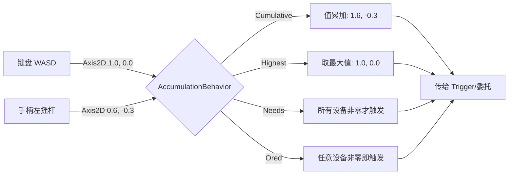
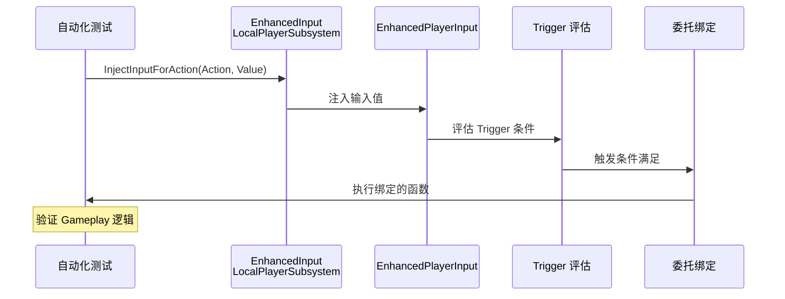
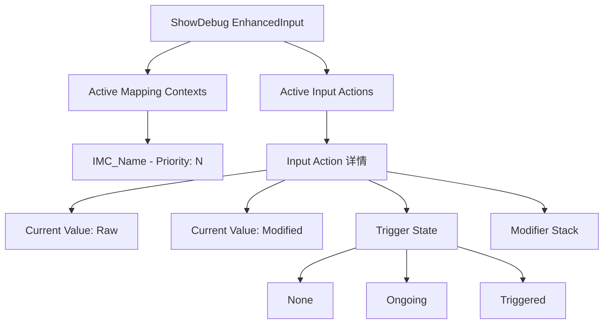

# 高级主题多设备输入注入与调试

> 掌握 Enhanced Input 的高级用法，包括多设备输入合并、输入注入（调试用）、ShowDebug 命令，以及 Lyra 中输入模式切换的完整实践。

---

## 概述

前两课覆盖了"能用"，本课前置知识完成后，深入探讨：

1. **多设备输入**：键盘+手柄同时使用，输入值如何合并
2. **输入注入**：在 C++ 中模拟输入（调试/自动化测试）
3. **调试技巧**：`ShowDebug EnhancedInput`、Common UI（UE 的 UI 框架）输入模式
4. **性能优化**：减少 Tick、优化 Trigger 评估
5. **Lyra 实践**：输入模式切换、Game/UI 双模式

---

## 核心概念

### `EInputActionAccumulationBehavior`（多设备输入合并）

**文件**：`Plugins/EnhancedInput/Source/EnhancedInput/Public/InputAction.h`（~127 行）

| 枚举值 | 行为 | 典型用途 |
|---------|------|-----------|
| `Cumulative` | 所有设备输入值**累加** | 双摇杆、多人同键盘 |
| `Highest` | 仅保留**最大值** | 取"最激烈"的输入 |
| `Needs` | 需要**所有设备都非零**才触发 | 双键同按 |
| `Ored` | **任意设备**非零即触发 | 键盘或手柄均可 |

**配置位置**：`UInputAction::AccumulationBehavior`（在编辑器中设置）

---

## 多设备输入详解

### 多设备输入合并流程



### 场景：键盘 + 手柄同时控制移动

```
Keyboard (WASD) → Axis2D (X=1.0, Y=0.0)
Gamepad (Left Stick) → Axis2D (X=0.6, Y=-0.3)
                                        ↓ 根据 AccumulationBehavior 合并
                          最终输入值（传给 Trigger/委托）
```

#### `Cumulative`（累加）

```cpp
// 键盘 W(1.0) + 手柄 Stick(0.6) → 合并为 (1.6, 0.0)
// 注意：需要在 Modifier 中 Clamp，否则会超 1.0
```

**典型用途**：双摇杆载具、多人同一键盘

---

#### `Highest`（取最大）

```cpp
// 键盘 W(1.0) + 手柄 Stick(0.6) → 取 (1.0, 0.0)
```

**典型用途**：防止"双重输入"导致过快移动

---

#### `Needs`（所有设备都非零）

```cpp
// 键盘 W(1.0) + 手柄 Stick(0.0) → 不触发（Stick 为零）
// 键盘 W(1.0) + 手柄 Stick(0.8) → 触发
```

**典型用途**：需要"确认键" + "方向键"同时按下

---

## 输入注入（Input Injection）

### 输入注入调用链



### 用途

| 场景 | 说明 |
|------|------|
| **自动化测试** | 模拟玩家输入，测试 Gameplay Ability（GAS 技能） |
| **回放系统** | 记录输入后回放 |
| **调试** | 强制触发某个 Input Action |

---

### `InjectInputForAction()`（一次性注入）

**文件**：`Plugins/EnhancedInput/Source/EnhancedInput/Public/EnhancedInputSubsystemInterface.h`（~147 行）

```cpp
// [1] 注入一次输入值（下一帧重置）
void InjectInputForAction(
    const UInputAction* Action,    // [2] 目标 Input Action
    const FInputActionValue& Value, // [3] 输入值（Digital/Axis1D/Axis2D/Axis3D）
    const TArray<UInputModifier*>& Modifiers = {}, // [4] 可选 Modifier 列表
    const TArray<UInputTrigger*>& Triggers = {}   // [5] 可选 Trigger 列表
);
```

**使用示例**（自动化测试，可运行示例）：

```cpp
// [1] 在自动化测试中模拟按下跳跃键
void AMyGameMode::TestJump()
{
    [2] if (UEnhancedInputLocalPlayerSubsystem* Subsystem = ...)
    {
        [3] // 注入 Digital = true（按下）
        FInputActionValue PressedValue(true);
        [4] Subsystem->InjectInputForAction(
            IA_Jump,
            PressedValue
        );

        [5] // 下一帧注入释放
        FTimerHandle TimerHandle;
        [6] GetWorldTimerManager().SetTimerForNextTick(
            [this]()
            {
                [7] FInputActionValue ReleasedValue(false);
                [8] Subsystem->InjectInputForAction(IA_Jump, ReleasedValue);
            },
            this,
            TimerHandle
        );
    }
}
```

---

### `StartContinuousInputInjectionForAction()`（持续注入）

**文件**：`Plugins/EnhancedInput/Source/EnhancedInput/Public/EnhancedInputSubsystemInterface.h`（~194 行）

```cpp
// [1] 开始持续注入（每帧生效，直到调用 Stop）
FDelegateHandle StartContinuousInputInjectionForAction(
    const UInputAction* Action,                  // [2] 目标 Input Action
    const TFunction<FInputActionValue()>& ValueGenerator, // [3] 值生成器（每帧调用）
    const TArray<UInputModifier*>& Modifiers = {},       // [4] 可选 Modifier
    const TArray<UInputTrigger*>& Triggers = {}          // [5] 可选 Trigger
);
```

**使用示例**（模拟摇杆持续输入，可运行示例）：

```cpp
// [1] 持续注入"向右移动"
FDelegateHandle InjectionHandle = Subsystem->StartContinuousInputInjectionForAction(
    IA_Move,
    []() -> FInputActionValue
    {
        [2] return FInputActionValue(FVector2D(1.0f, 0.0f));  // 持续右移
    }
);

// [3] 5 秒后停止注入
FTimerHandle TimerHandle;
GetWorldTimerManager().SetTimerForNextTick(
    [this, InjectionHandle, Subsystem]()
    {
        [4] Subsystem->StopContinuousInputInjectionForAction(InjectionHandle);
    },
    this,
    TimerHandle
);
```

---

## 调试技巧

### `ShowDebug EnhancedInput`

在游戏控制台（按 <code>`</code> 键）输入：

```
ShowDebug EnhancedInput
```

**ShowDebug 输出结构**：



**显示内容**：

| 信息 | 说明 |
|------|------|
| **Active Mapping Contexts** | 当前激活的所有 IMC 及其 Priority |
| **Active Input Actions** | 当前所有 Input Action 的状态 |
| **Current Value** | 每个 Action 的当前输入值（Raw + Modified） |
| **Trigger State** | 每个 Trigger 的当前状态（None/Triggered/Ongoing） |
| **Modifier Stack** | 已应用的 Modifier 链 |

**快捷键**（当 `ShowDebug` 激活时）：

| 按键 | 功能 |
|------|------|
| `Page Up/Page Down` | 滚动显示的 Action 列表 |
| `Home/End` | 跳转列表顶部/底部 |

---

### C++ 断点调试关键位置

| 想追踪的问题 | 断点位置 |
|----------------|------------|
| 输入完全没反应 | `UEnhancedPlayerInput::InputKey()` |
| Trigger 没触发 | `UEnhancedPlayerInput::ProcessActionMappingEvent()` 中的 `EvaluateTriggers()` 调用 |
| 委托没执行 | `UEnhancedInputComponent::EvaluateInputComponentDelegates()` |
| 值不对（轴反转/死区） | `ProcessActionMappingEvent()` 中的 Modifier 应用部分 |

---

### 日志命令

```cpp
// 在 Console 中输入（需要 -LogCmds）：
Log EnhancedInput Verbose

// 会打印：
// - InputKey() 被调用
// - ProcessActionMappingEvent() 的 Trigger 评估结果
// - 每个 Input Action 的值变化
```

---

## Lyra 实践：输入模式切换

### Lyra 如何管理 Game / UI 输入模式？

Lyra 使用 **Common UI** 插件，它通过 `UCommonActivatableWidget` 自动管理输入模式：

```
打开 UI（如武器菜单）
  ↓
  UCommonActivatableWidget::Activate()
  ↓
  自动调用 APlayerController::SetInputMode(FInputModeUIOnly)
  ↓
  Enhanced Input 的 Delegate 仍然可以响应（如果 IMC Priority > 0）
```

---

### 手动切换输入模式（推荐方式）

```cpp
// [1] MyPlayerController.cpp - 可运行示例（需包含相应头文件）
#include "Components/InputComponent.h"
#include "GameFramework/InputSettings.h"

void AMyPlayerController::EnterMenuMode()
{
    [2] // 方式 1：使用 FInputModeUIOnly（Common UI 会自动管理，无需手动调用）
    FInputModeUIOnly InputMode;
    [3] InputMode.SetWidgetToFocus(MenuWidget);
    [4] SetInputMode(InputMode);

    [5] // 方式 2：直接移除游戏 IMC（更精细控制）
    if (UEnhancedInputLocalPlayerSubsystem* Subsystem = ...)
    {
        [6] Subsystem->RemoveMappingContext(IMC_Default);
    }
}

void AMyPlayerController::ExitMenuMode()
{
    [7] // 恢复游戏输入
    FInputModeGameOnly InputMode;
    [8] SetInputMode(InputMode);

    [9] if (UEnhancedInputLocalPlayerSubsystem* Subsystem = ...)
    {
        [10] Subsystem->AddMappingContext(IMC_Default, /*Priority=*/ 0);
    }
}
```

---

### Lyra 的 `ULyraHeroComponent::InitializePlayerInput()` 回顾

**文件**：`Source/LyraGame/Character/LyraHeroComponent.cpp`（~225 行）

关键设计：

1. **每次 Possess 时 ClearAllMappings()** → 确保干净状态
2. **从 LyraPawnData 读取 InputConfig** → 数据驱动
3. **BindAbilityActions()** → InputTag → GAS 自动路由
4. **BindNativeAction()** → 移动/视角等直接绑定到 C++

---

## 性能优化

### 优化 1：减少 `UInputTrigger` 的 Tick

问题：`UInputTriggerHold`、`UInputTriggerPulse` 等需要每帧评估 → 增加 CPU 开销。

**优化方式**：

```cpp
// [1] 在 UInputTrigger 子类中：
virtual bool ShouldTick() const override
{
    [2] // 仅在输入 nonzero 时才 Tick
    return GetModifiedValue().GetMagnitude() > 0.0f;
}
```

---

### 优化 2：使用 `bShouldAlwaysTick = false`（默认）

大部分 Trigger **不应该每帧 Tick**。`bShouldAlwaysTick = true` 仅用于：
- `UInputTriggerHold`（需要计时）
- `UInputTriggerPulse`（需要间隔触发）

**性能提示**：
- IMC 切换（`AddMappingContext` / `RemoveMappingContext`）有开销，避免在 Tick 中频繁调用
- 输入委托绑定（`BindAction`）在 `SetupPlayerInputComponent` 中执行一次即可，无需每帧绑定
- 对于高频输入（如移动），优先使用 `Axis` 而非 `Action`，减少委托调用次数

---

### 优化 3：限制 `ShowDebug` 在 Shipping 构建中

```cpp
// [1] 在 Shipping 构建中，ShowDebug 命令应该被禁用
#if !UE_BUILD_SHIPPING
    [2] // 允许 ShowDebug EnhancedInput
#endif
```

---

## 常见问题与陷阱

### 陷阱 1：`AccumulationBehavior` 导致输入值超过 1.0

**现象**：键盘和手柄同时输入，角色移动速度翻倍。

**原因**：`Cumulative` 会累加所有设备输入值。

**解决**：

```cpp
// [1] 在 IMC 的 Mapping 中添加 UInputModifierClamp
// [2] 确保输出值 Clamp 到 [0, 1]
UPROPERTY(EditInstanceOnly)  // [3]
UInputModifierClamp* ClampModifier;
```

---

### 陷阱 2：注入输入后 Trigger 没触发

**现象**：调用 `InjectInputForAction()`，但绑定的委托没执行。

**原因**：注入的输入**不经过 `UInputTrigger` 评估（除非显式传递 Trigger 列表）。

**解决**：

```cpp
// [1] 传递 Trigger 列表，让注入的输入也会触发
TArray<UInputTrigger*> Triggers;
[2] Triggers.Add(NewObject<UInputTriggerPressed>(GetTransientPackage()));

[3] Subsystem->InjectInputForAction(
    IA_Jump,
    FInputActionValue(true),
    {},
    Triggers  // [4] ← 显式传递
);
```

---

### 陷阱 3：UI 打开后游戏输入仍然响应

**现象**：打开菜单后，按 WASD 仍然移动角色。

**原因**：IMC 的 Priority 太高，UI 没消费输入。

**解决**：

```cpp
// [1] 确保游戏 IMC 的 Priority < UI IMC 的 Priority
[2] Subsystem->AddMappingContext(IMC_UI, /*Priority=*/ 100);  // UI 高优先级
[3] Subsystem->AddMappingContext(IMC_Default, /*Priority=*/ 0);   // 游戏低优先级
```

---

## 总结

| 要点 | 说明 |
|------|------|
| **AccumulationBehavior** | 控制多设备输入如何合并（Cumulative/Highest/Needs/Ored） |
| **InjectInputForAction** | 一次性注入，用于测试/回放 |
| **StartContinuousInjection** | 持续注入，每帧生效 |
| **ShowDebug EnhancedInput** | 实时显示输入状态、Trigger、Modifier |
| **Lyra 模式切换** | Common UI 自动管理，或手动 Add/Remove IMC |
| **性能优化** | 减少 Trigger Tick、限制 ShowDebug |

---

## 相关页面

- [[30-tutorials/input-system/05-Lyra实践InputTag与GAS联动详解|← 05 Lyra 实践]]
- [[30-tutorials/gas/01-GA简介与配置|GAS 系列（理解 Ability 激活）]]
- [[30-tutorials/ue-framework/50-player-system/01-AController详解|PlayerController 详解]]

<!-- nav:auto -->

---

**导航**: ← [[30-tutorials/input-system/05-Lyra实践InputTag与GAS联动详解|05-Lyra实践InputTag与GAS联动详解]]

<!-- /nav:auto -->
