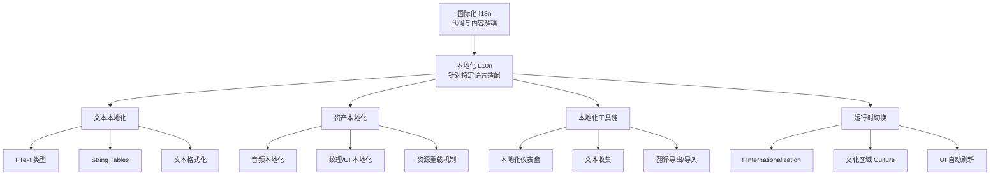
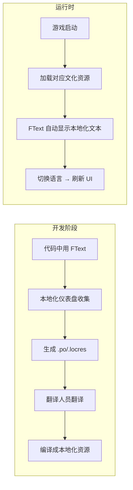

# UE本地化与国际化概览

> 从概念到实践，系统掌握 UE 多语言支持的全套机制。

## 概述

**本地化（Localization, L10n）** 和 **国际化（Internationalization, I18n）** 是游戏全球化发布的两大支柱。

- **国际化**是"让代码能支持多语言"——开发阶段预留扩展能力，不修改代码即可适配不同区域。
- **本地化**是"针对特定语言做适配"——翻译文本、替换音频、调整 UI 布局。

UE 提供了一套完整的本地化系统，覆盖从文本收集、翻译管理、资源替换到运行时切换的全流程。本系列将系统讲解这套系统，并结合 **Lyra 项目**的真实实现，让你不仅"知道怎么做"，还知道"为什么这样做"。

## 核心概念全景图

## UE 本地化系统架构

## 与 Lyra 项目的关系

Lyra 是一个真正的多语言项目，已内置支持 **13 种语言**：

| 语言代码 | 语言名称 | Lyra 中的体现 |
|---------|---------|--------------|
| `en` | 英语（默认） | 原始文本 |
| `zh-Hans` | 简体中文 | 完整翻译 |
| `ja` | 日语 | 完整翻译 |
| `ko` | 韩语 | 完整翻译 |
| `de` | 德语 | 完整翻译 |
| `fr` | 法语 | 完整翻译 |
| `es` | 西班牙语 | 完整翻译 |
| `it` | 意大利语 | 完整翻译 |
| `ru` | 俄语 | 完整翻译 |
| `pt-BR` | 葡萄牙语（巴西） | 完整翻译 |
| `tr` | 土耳其语 | 完整翻译 |
| `ar` | 阿拉伯语 | 完整翻译（RTL） |
| `pl` | 波兰语 | 完整翻译 |
| `es-419` | 拉丁美洲西班牙语 | 完整翻译 |

Lyra 的本地化实现分布在：
- **配置层**：`Config/Localization/Game_*.ini` — 本地化目标配置
- **资源层**：`Content/Localization/Game/` — 各语言翻译文件
- **代码层**：`Source/LyraGame/Settings/CustomSettings/LyraSettingValueDiscrete_Language.cpp` — 运行时语言切换

## 系列阅读指南

### 阶段一：基础概念（推荐 1-2 小时）

| 课时 | 标题 | 学习重点 |
|------|------|---------|
| 00-overview（本课） | UE 本地化与国际化概览 | 全景图、系列导航 |
| 01-i18n-vs-l10n | 国际化 vs 本地化：概念与区别 | I18n/L10n 区别、UE 实现策略 |

**学完能达到**：理解本地化和国际化的基本概念，知道 UE 本地化系统的整体架构。

### 阶段二：文本本地化（推荐 2-3 小时）

| 课时 | 标题 | 学习重点 |
|------|------|---------|
| 02-text-localization | 文本本地化深入：FText 与 String Tables | FText、String Table、文本格式化 |
| 03-localization-dashboard | 本地化仪表盘与工作流 | 配置本地化目标、收集文本、管理翻译 |

**学完能达到**：掌握文本本地化的完整工作流，能独立配置和收集项目文本。

### 阶段三：高级主题与实战（推荐 3-4 小时）

| 课时 | 标题 | 学习重点 |
|------|------|---------|
| 04-asset-localization | 资产本地化：音频、纹理与多媒体 | 资产本地化、资源重载、打包策略 |
| 05-runtime-language-switch | 运行时语言切换 | 动态切换、UI 刷新、文化区域管理 |
| 06-lyra-localization-practice | Lyra 本地化实践案例 | Lyra 配置分析、代码实现、最佳实践 |

**学完能达到**：掌握完整的本地化系统，能参考 Lyra 的实现为自己的项目添加多语言支持。

## 学习建议

1. **按顺序学习**：本系列由浅入深，建议按顺序阅读
2. **动手实践**：每课都有可操作的步骤，建议跟着做
3. **对照 Lyra**：学完理论后，打开 Lyra 项目对照查看真实实现
4. **重点关注 FText**：FText 是 UE 本地化的核心，务必掌握

## 相关页面

- [[30-tutorials/ue-framework/00-UE框架概述|UE 框架基础]] — 前置知识：UObject、编辑器基础
- [[30-tutorials/umg/00-UMG系列概览|UI 与 UMG 系列]] — 相关：本地化 UI 文本
- [UE 官方文档：Localization Overview](https://dev.epicgames.com/documentation/unreal-engine/localization-overview-for-unreal-engine)
- [UE 官方文档：Localizing Content](https://dev.epicgames.com/documentation/unreal-engine/localizing-content-in-unreal-engine)

<!-- nav:auto -->

---

**导航**: ← [[30-tutorials/localization-i18n/00-UE本地化与国际化教程系列|00-UE本地化与国际化教程系列]] · [[30-tutorials/localization-i18n/01-国际化vs本地化概念与区别|01-国际化vs本地化概念与区别]] →

<!-- /nav:auto -->
