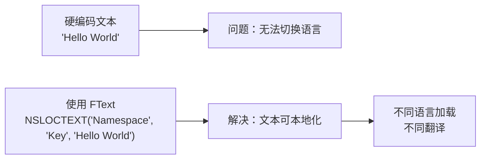
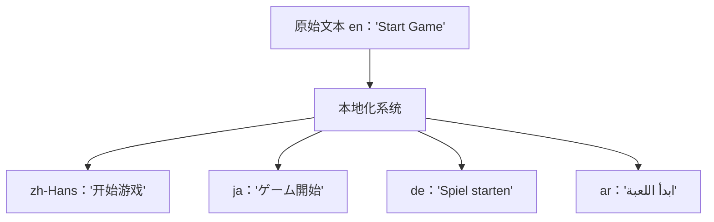
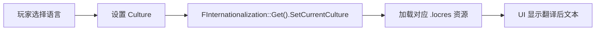

# 国际化vs本地化概念与区别

> 澄清 I18n 和 L10n 的区别，理解 UE 如何实现代码和内容的解耦。

## 概述

在游戏全球化发布中，**国际化（Internationalization, I18n）** 和 **本地化（Localization, L10n）** 是两个密切相关但本质不同的概念。理解它们的区别，是正确使用 UE 本地化系统的前提。

本课将讲解：
- I18n 和 L10n 的定义与区别
- UE 如何实现国际化（代码解耦）
- UE 如何实现本地化（资源管理）
- 实际开发中的最佳实践

## 核心概念

### 什么是国际化（I18n）

**国际化**是在**开发阶段**就让代码具备支持多语言、多区域的能力。

核心思想：**代码和内容分离**。



国际化的关键做法：
- 所有用户可见文本使用 `FText` 而非 `FString`
- 文本通过**命名空间 + 键**引用，而非硬编码
- UI 布局考虑不同语言文本长度差异
- 日期、数字、货币使用区域化格式

### 什么是本地化（L10n）

**本地化**是在**发布阶段**针对特定语言/区域进行的具体适配工作。

本地化包括但不限于：
- 翻译文本内容
- 重新录制语音（音频本地化）
- 替换纹理、图标（资产本地化）
- 调整 UI 布局（RTL 语言、文本长度）
- 适配区域法规（隐私、审查）



### 对比总结

| 维度 | 国际化（I18n） | 本地化（L10n） |
|------|----------------|----------------|
| **阶段** | 开发阶段 | 发布阶段 |
| **目标** | 让代码支持多语言 | 针对特定语言做适配 |
| **操作者** | 程序员、技术策划 | 翻译人员、本地化专员 |
| **产出** | 可本地化的代码架构 | 翻译文件、本地化资源 |
| **UE 工具** | FText、String Table | 本地化仪表盘、PO 文件 |
| **是否改代码** | 是（解耦文本） | 否（只改资源） |

## UE 中的实现策略

### 文本国际化：FText 的使用

UE 的核心类型是 `FText`，它原生支持本地化。

**错误示例（未国际化）**：
```cpp
// 错误：硬编码字符串，无法本地化
FString Message = "Hello World";
TextBlock->SetText(FText::FromString(Message));
```

**正确示例（已国际化）**：
```cpp
// 正确：使用 NSLOCTEXT 宏，文本可被本地化系统收集
FText Message = NSLOCTEXT("MyNamespace", "HelloWorld", "Hello World");
TextBlock->SetText(Message);
```

`NSLOCTEXT` 的三个参数：
1. **Namespace**：命名空间，用于逻辑分组
2. **Key**：键名，唯一标识这段文本
3. **Default Text**：默认文本（通常是源语言，如英语）

### 内容本地化：Culture 机制

UE 使用 **Culture（文化区域）** 来标识不同的语言/区域组合。

**Culture 命名规则**：`语言[_地区]`
- `en` — 英语（通用）
- `en-US` — 英语（美国）
- `zh-Hans` — 简体中文
- `zh-Hant` — 繁体中文
- `ar` — 阿拉伯语（RTL 从右到左）



### Lyra 中的实践

从 `LyraSettingValueDiscrete_Language.cpp` 可以看到 Lyra 的实现：

```cpp
// 文件：Source/LyraGame/Settings/CustomSettings/LyraSettingValueDiscrete_Language.cpp
// 行号：约 L26-L33（基于 UE 5.7）

void ULyraSettingValueDiscrete_Language::OnInitialized()
{
    Super::OnInitialized();

    // [1] 获取所有已本地化的文化名称
    const TArray<FString> AllCultureNames = 
        FTextLocalizationManager::Get().GetLocalizedCultureNames(ELocalizationLoadFlags::Game);
    
    // [2] 过滤出允许的文化
    for (const FString& CultureName : AllCultureNames)
    {
        if (FInternationalization::Get().IsCultureAllowed(CultureName))
        {
            AvailableCultureNames.Add(CultureName);
        }
    }

    // [3] 在列表开头插入"系统默认"选项
    AvailableCultureNames.Insert(TEXT(""), SettingSystemDefaultLanguageIndex);
}
```

**关键点解读**：
- `[1]` `FTextLocalizationManager` 是本地化资源管理器，负责加载/卸载翻译资源
- `[2]` `IsCultureAllowed` 检查该文化是否在项目的本地化配置中
- `[3]` 允许用户选择"系统默认"，即跟随操作系统的语言设置

## 常见误区

### 误区 1：I18n 和 L10n 是同一件事

**错误**：认为"做了本地化就等于做了国际化"  
**正确**：必须先做国际化（代码解耦），才能做本地化（翻译资源）。如果代码里全是硬编码字符串，本地化系统无能为力。

### 误区 2：只有文本才需要本地化

**错误**：只翻译 UI 文本  
**正确**：完整的本地化还包括：
- 音频（对话、音效）
- 纹理（标志、文字图片）
- UI 布局（RTL 支持、文本长度）
- 日期/数字格式
- 法律合规（隐私政策、用户协议）

### 误区 3：运行时切换语言很简单

**错误**：认为调用一个函数就能立即切换所有文本  
**正确**：UE 支持运行时切换，但需要注意：
- 已创建的 UI 控件需要手动刷新或重新创建
- 某些资源（如纹理）可能需要在切换时重新加载
- Lyra 的做法是**提示玩家重启游戏**以确保所有本地化生效（见 `OnApply()` 函数）

## 总结与要点

| 要点 | 说明 |
|------|------|
| **I18n 是前提** | 开发阶段就用 FText，不要硬编码字符串 |
| **L10n 是执行** | 针对具体语言翻译文本、替换资源 |
| **Culture 标识语言** | 使用标准 Culture 代码（如 zh-Hans） |
| **FText 是核心** | 所有用户可见文本都用 FText |
| **Lyra 已实践** | 参考 LyraSettingValueDiscrete_Language.cpp |

## 相关页面

- [[30-tutorials/localization-i18n/00-UE本地化与国际化概览|← 上一课：UE 本地化与国际化概览]]
- [[30-tutorials/localization-i18n/02-文本本地化深入FText与StringTables|下一课：文本本地化深入：FText 与 String Tables →]]
- [UE 官方文档：Localization Overview](https://dev.epicgames.com/documentation/unreal-engine/localization-overview-for-unreal-engine)

<!-- nav:auto -->

---

**导航**: ← [[30-tutorials/localization-i18n/00-UE本地化与国际化概览|00-UE本地化与国际化概览]] · [[30-tutorials/localization-i18n/02-文本本地化深入FText与StringTables|02-文本本地化深入FText与StringTables]] →

<!-- /nav:auto -->
