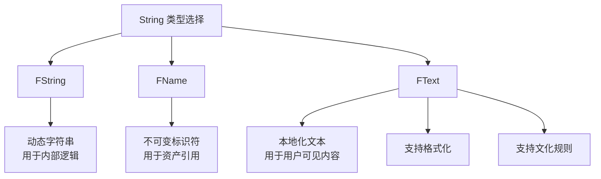
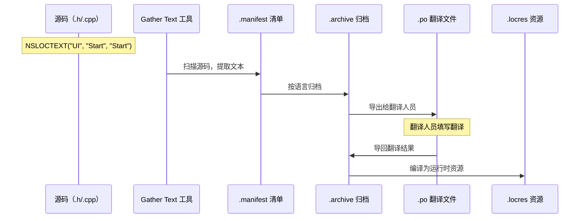

# 文本本地化深入FText与StringTables

> 掌握 UE 文本本地化的核心机制：FText 类型、String Table、文本格式化。

## 概述

文本本地化是 UE 本地化系统最核心的部分。本课将深入讲解：
- 为什么必须用 `FText` 而非 `FString`
- `FText` 的三种创建方式（LOCTEXT、NSLOCTEXT、Text Formatter）
- String Table（字符串表）的高级用法
- 文本格式化与参数替换
- 复数形式处理

学完本课后，你将能正确地在代码中处理所有用户可见文本。

## FText vs FString vs FName

UE 有三种字符串类型，用途完全不同：



| 特性 | FString | FName | FText |
|------|---------|-------|-------|
| **本地化支持** | ❌ 无 | ❌ 无 | ✅ 原生支持 |
| **格式化支持** | 需手动拼接 | ❌ | ✅ 内置格式化 |
| **文化规则** | ❌ | ❌ | ✅ 数字/日期格式 |
| **性能** | 中等 | 最快（哈希） | 较慢（需查表） |
| **典型用途** | 内部逻辑 | 资产名、标识符 | 用户可见文本 |

**结论**：所有用户可见的文本，必须用 `FText`。

## FText 的三种创建方式

### 1. LOCTEXT —— 最快但易冲突

```cpp
// 文件：任意 .cpp（需在 LOCTEXT_NAMESPACE 定义后）
#define LOCTEXT_NAMESPACE "MyNamespace"

FText Text1 = LOCTEXT("Hello", "Hello World");
FText Text2 = LOCTEXT("Hello", "Hello World");  // 相同 Key，自动去重

#undef LOCTEXT_NAMESPACE
```

**优点**：写法简洁  
**缺点**：`LOCTEXT_NAMESPACE` 是文件级宏，容易在不同文件中意外冲突

### 2. NSLOCTEXT —— 推荐方式

```cpp
// 文件：任意 .cpp 或 .h
FText Text = NSLOCTEXT("UI", "StartGame", "Start Game");
//                ^^^^        ^^^^^^^^^^    ^^^^^^^^^^^
//                命名空间      Key          默认文本（英语）
```

**优点**：
- 命名空间和 Key 同时指定，不会冲突
- 可在头文件中使用
- 本地化系统会收集这些文本用于翻译

**推荐**：项目中的首选方式。

### 3. FText::FromString —— 仅用于调试

```cpp
// ❌ 错误：无法本地化
FText Text = FText::FromString("Hello World");

// ✅ 正确：如果确实需要动态文本
FText Text = FText::AsNumber(Score);  // 数字格式化（支持文化规则）
```

**注意**：`FText::FromString` 创建的是**不可本地化**的 FText。只有直接写死字符串时才用。

## 文本收集机制

当你使用 `LOCTEXT` 或 `NSLOCTEXT` 时，UE 的 **Gather Text** 工具可以自动扫描并收集这些文本。



**关键点**：
- 只有使用 `LOCTEXT` / `NSLOCTEXT` 的文本才能被收集
- 如果直接用 `FText::FromString("Hello")`，本地化系统**看不到**这段文本

## String Table（字符串表）

当项目有大量文本（如 RPG 的物品描述、任务文本）时，硬编码在代码中不现实。**String Table** 提供了外部化的文本管理方案。

### 创建 String Table

在编辑器中：
1. 右键 Content Browser → Miscellaneous → **String Table**
2. 打开资产，添加 Key（如 `Item_Sword_Name`）
3. 为每个 Key 填写各语言的文本

### C++ 中访问 String Table

```cpp
// 文件：Source/YourGame/YourClass.cpp
// 行号：示例基于 UE 5.7 API

// [1] 获取 String Table 引用
FStringTableConstPtr StringTable = 
    FStringTableRegistry::Get().FindStringTable(FName("GameText"));

if (StringTable)
{
    // [2] 查找指定 Key 的条目
    FStringTableEntryConstPtr Entry = StringTable->FindEntry(TEXT("Item_Sword_Name"));
    
    if (Entry)
    {
        // [3] 获取本地化后的 FText
        FText LocalizedText = Entry->GetText();
        
        // [4] 使用文本（如设置 UI）
        TextBlock->SetText(LocalizedText);
    }
}
```

**关键点解读**：
- `[1]` `FStringTableRegistry` 是 String Table 的全局注册表
- `[2]` `FindEntry` 按 Key 查找，返回的是当前 Culture 对应的翻译
- `[3]` `GetText()` 返回的是 `FText`，支持后续格式化

### 蓝图中使用 String Table

在蓝图中，使用节点 **Get String Table Entry**：

```
[String Table Asset] → [Get String Table Entry (Key)] → [Return Value: FText]
```

## 文本格式化

动态文本（如"获得 10 金币"）需要参数替换。UE 提供两种格式化方式。

### 有序参数（Positional Arguments）

```cpp
// 文件：示例
FFormatOrderedArguments Args;
Args.Add(10);   // {0}
Args.Add(5);    // {1}

FText Text = FText::Format(
    NSLOCTEXT("UI", "Reward", "获得{0}金币，等级{1}"),
    Args
);
// 结果（中文环境）：获得10金币，等级5
```

### 命名参数（Named Arguments）—— 推荐

```cpp
// 文件：示例
FFormatNamedArguments Args;
Args.Add(TEXT("Count"), 10);      // {Count}
Args.Add(TEXT("Level"), 5);       // {Level}

FText Text = FText::Format(
    NSLOCTEXT("UI", "Reward", "获得{Count}金币，等级{Level}"),
    Args
);
// 优点：参数含义明确，不怕顺序错
```

### 高级格式化

```cpp
// 数字格式化（支持文化规则）
FNumberFormattingOptions NumberFormat;
NumberFormat.SetUseGrouping(true);  // 千位分隔符（1,000 vs 1000）

FText MoneyText = FText::AsNumber(1234567, &NumberFormat);
// 美式英语：1,234,567
// 德语：1.234.567

// 日期格式化
FText DateText = FText::AsDate(FDateTime::Now(), EDateTimeStyle::Default);
// 自动适配当前 Culture 的日期格式
```

## 复数形式处理

不同语言的复数规则不同：
- 英语：`1 item` / `2 items`（单复数）
- 俄语：3 种复数形式
- 阿拉伯语：6 种复数形式

UE 通过 **String Table** 的复数规则支持：

```cpp
// 在 String Table 中配置复数形式
Key: "ItemCount"
    en: "{Num} item"     // N=1
    en: "{Num} items"    // N≠1
    ru: "{Num} предмет"  // N=1
    ru: "{Num} предмета" // N=2-4
    ru: "{Num} предметов" // N=5+
```

## Lyra 中的文本处理

Lyra 大量使用 `NSLOCTEXT` 和 `FText`：

```cpp
// 文件：Source/LyraGame/Settings/CustomSettings/LyraSettingValueDiscrete_Language.cpp
// 行号：约 L49-L51

// 使用 LOCTEXT 定义 UI 文本
LOCTEXT("WarningLanguage_Title", "Language Changed")
LOCTEXT("WarningLanguage_Message", "You will need to restart the game completely for all language related changes to take effect.")
```

这些文本会被本地化系统收集，并在 `Content/Localization/Game/` 下生成对应语言的翻译文件。

## 常见问题与陷阱

### 陷阱 1：在循环中使用 LOCTEXT

```cpp
// ❌ 错误：每次循环都创建新 FText，影响性能
for (int32 i = 0; i < 1000; i++)
{
    FText Text = LOCTEXT("Item", "Item");  // 每次都查表
}

// ✅ 正确：在循环外创建，循环内复用
FText ItemText = LOCTEXT("Item", "Item");
for (int32 i = 0; i < 1000; i++)
{
    // 使用 ItemText
}
```

### 陷阱 2：忘记配置 Gather 路径

如果文本没有被收集到 `.manifest` 中，检查：
1. 项目设置 → Localization → **Gather from Packages** 是否包含你的 Content 目录
2. **Gather from Source** 是否包含你的 Source 目录

### 陷阱 3：FText::FromString 用于用户可见文本

```cpp
// ❌ 无法本地化
FText DisplayText = FText::FromString(PlayerName);

// ✅ 如果 PlayerName 本身需要本地化，应在输入时就用 FText
// 如果 PlayerName 是玩家自定义名称，不需要本地化，用 FText::FromString 是可以的
```

## 总结与要点

| 要点 | 说明 |
|------|------|
| **用 FText** | 所有用户可见文本都必须用 FText |
| **NSLOCTEXT 是首选** | 命名空间 + Key，避免冲突 |
| **String Table 管大量文本** | 物品、任务等批量文本用 String Table |
| **文本格式化用命名参数** | `FText::Format` + `FFormatNamedArguments` |
| **复数形式用 String Table** | 配置不同语言的复数规则 |

## 相关页面

- [[30-tutorials/localization-i18n/01-国际化vs本地化概念与区别|← 上一课：国际化 vs 本地化]]
- [[30-tutorials/localization-i18n/03-本地化仪表盘与工作流|下一课：本地化仪表盘与工作流 →]]
- [UE 官方文档：Localizing Content](https://dev.epicgames.com/documentation/unreal-engine/localizing-content-in-unreal-engine)

<!-- nav:auto -->

---

**导航**: ← [[30-tutorials/localization-i18n/01-国际化vs本地化概念与区别|01-国际化vs本地化概念与区别]] · [[30-tutorials/localization-i18n/03-本地化仪表盘与工作流|03-本地化仪表盘与工作流]] →

<!-- /nav:auto -->
