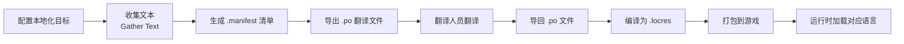
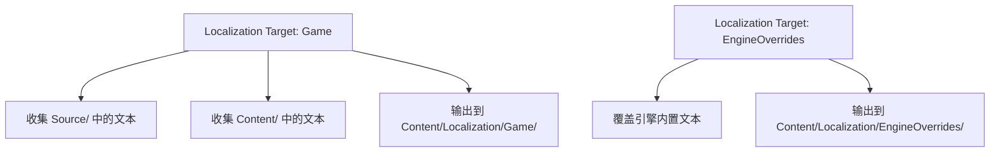
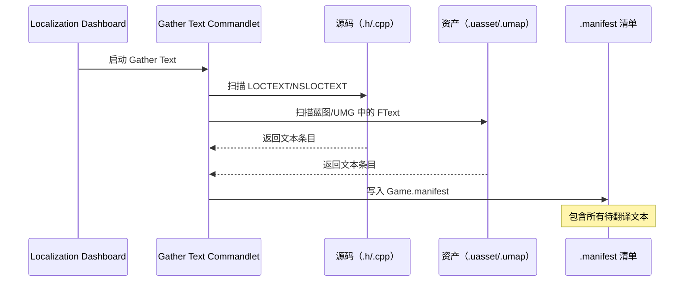

# 本地化仪表盘与工作流

> 掌握 UE 编辑器中的本地化工具：配置本地化目标、收集文本、管理翻译。

## 概述

UE 提供了一个可视化的 **Localization Dashboard（本地化仪表盘）**，让你无需手写配置文件即可完成本地化的核心工作流。

本课将讲解：
- 打开本地化仪表盘
- 配置本地化目标（Localization Target）
- 收集文本（Gather Text）
- 导出/导入翻译（PO 文件）
- 编译本地化资源（.locres）
- Lyra 项目的本地化配置分析

## 本地化工作流全景



## 打开本地化仪表盘

**路径**：`Window` → `Localization Dashboard`

仪表盘主界面包含：
1. **Localization Targets（本地化目标列表）** — 左侧，管理多个目标
2. **Settings（设置面板）** — 中间，配置当前目标
3. **Actions（操作按钮）** — 右侧，执行收集/导出/编译等操作

## 配置本地化目标

### 什么是 Localization Target？

**Localization Target（本地化目标）** 是本地化资源的逻辑分组。典型的分组策略：
- `Game` — 游戏主文本
- `EngineOverrides` — 引擎文本的覆盖翻译
- `UI` — UI 专用文本（可选）
- `Dialogue` — 对话文本（可选）



### 创建新的本地化目标

1. 在 Localization Dashboard 中点击 **New Target**
2. 设置目标名称（如 `Game`）
3. 配置以下关键选项：

| 设置项 | 说明 | 推荐值 |
|--------|------|--------|
| **Native Culture** | 源语言（开发语言） | `en`（英语） |
| **Cultures to Generate** | 需要支持的目标语言 | `zh-Hans`, `ja`, `ko` 等 |
| **Source Path** | 收集的源码目录 | `Source/` |
| **Destination Path** | 输出的本地化资源目录 | `Content/Localization/Game` |
| **Manifest Dependencies** | 依赖的其他 manifest | `Engine.manifest` |

### Lyra 的本地化目标配置

从 `Config/Localization/Game_Gather.ini` 可以看到 Lyra 的配置：

```ini
; 文件：Config/Localization/Game_Gather.ini
; 行号：约 L3-L24（基于 UE 5.7）

[CommonSettings]
; [1] 依赖引擎的 manifest（可以覆盖引擎文本）
ManifestDependencies=../../../Engine/Content/Localization/Engine/Engine.manifest
ManifestDependencies=../../../Engine/Content/Localization/Editor/Editor.manifest

; [2] 输入输出路径
SourcePath=Content/Localization/Game
DestinationPath=Content/Localization/Game

; [3] 源语言是英语
NativeCulture=en

; [4] 支持的目标语言（13 种）
CulturesToGenerate=en
CulturesToGenerate=ar
CulturesToGenerate=fr
; ...（省略其他语言）
```

**关键点解读**：
- `[1]` Lyra 依赖引擎的 manifest，允许覆盖引擎内置文本（如"OK"、"Cancel"按钮）
- `[3]` `NativeCulture=en` 表示源语言是英语
- `[4]` `CulturesToGenerate` 列出了所有需要生成翻译文件的语言

## 收集文本（Gather Text）

配置完成后，点击 **Gather Text** 按钮，UE 会执行以下流程：



### 收集规则配置

在 `Game_Gather.ini` 中，收集规则分为三步：

**Step 0：从源码收集**
```ini
; 文件：Config/Localization/Game_Gather.ini
; 行号：约 L26-L40

[GatherTextStep0]
CommandletClass=GatherTextFromSource
; [1] 扫描目录
SearchDirectoryPaths=Source
SearchDirectoryPaths=Config
SearchDirectoryPaths=Plugins

; [2] 排除目录（不需要本地化的内容）
ExcludePathFilters=Config/Localization/*
ExcludePathFilters=Source/LyraEditor/*

; [3] 文件类型
FileNameFilters=*.h
FileNameFilters=*.cpp
```

**Step 1：从资产收集**
```ini
; 行号：约 L42-L56

[GatherTextStep1]
CommandletClass=GatherTextFromAssets
; [1] 包含 Content 目录
IncludePathFilters=Content/*
IncludePathFilters=%LOCPROJECTROOT%Plugins/GameFeatures/*

; [2] 排除本地化资源本身（避免循环）
ExcludePathFilters=Content/Localization/*

; [3] 资产类型
PackageFileNameFilters=*.umap
PackageFileNameFilters=*.uasset
```

**Step 2-3：生成清单和归档**
```ini
; 行号：约 L58-L69

[GatherTextStep2]
CommandletClass=GenerateGatherManifest

[GatherTextStep3]
CommandletClass=GenerateGatherArchive
```

## 导出和导入翻译（PO 文件）

收集完成后，`.manifest` 包含了所有待翻译的文本。下一步是导出为 `.po` 文件给翻译人员。

### 导出 PO 文件

在 Localization Dashboard 中：
1. 点击 **Export Translations**
2. 选择目标语言（如 `zh-Hans`）
3. 选择导出路径（默认在 `Content/Localization/Game/zh-Hans/`）

生成的文件：
```
Content/Localization/Game/zh-Hans/Game.po
```

PO 文件格式示例：
```po
#: Source:Source/LyraGame/UI/Widgets/LyraHUD.Widget.cs:15
msgctx "UI"
msgid "StartGame"
msgstr "开始游戏"

#: Source:Source/LyraGame/UI/Widgets/LyraHUD.Widget.cs:20
msgctx "UI"
msgid "Settings"
msgstr "设置"
```

### 导入翻译

翻译完成后：
1. 将翻译好的 `.po` 文件放回原路径
2. 在 Localization Dashboard 中点击 **Import Translations**
3. UE 会读取 `.po` 文件并更新 `.archive`

## 编译本地化资源（.locres）

翻译就绪后，需要编译为运行时可用的 `.locres` 文件：

1. 在 Localization Dashboard 中点击 **Compile Texts**
2. UE 会将 `.archive` 编译为 `.locres`

生成的文件：
```
Content/Localization/Game/zh-Hans/Game.locres
```

`.locres` 是二进制格式，运行时加载速度快。

## 命令行自动化

本地化可以集成到 CI/CD 流水线中：

```bash
# 收集文本
UnrealEditor-Cmd.exe MyProject.uproject -run=GatherText -config=Config/Localization/Game_Gather.ini

# 编译本地化资源
UnrealEditor-Cmd.exe MyProject.uproject -run=CompileText -config=Config/Localization/Game_Compile.ini
```

Lyra 的配置文件已经包含了这些命令行工具的配置（`Game_Gather.ini`、`Game_Compile.ini` 等）。

## 常见问题与陷阱

### 问题 1：收集后 .manifest 为空

**原因**：Gather 路径配置错误  
**解决**：检查 `SearchDirectoryPaths` 和 `IncludePathFilters` 是否包含你的代码/资产目录

### 问题 2：蓝图中的文本没有被收集

**原因**：蓝图中的文本需要使用 `FText` 变量，且标记为"Localizable"  
**解决**：在蓝图中，将 Text 变量的 **Localizable** 勾选

### 问题 3：翻译后游戏中仍然显示英语

**原因**：
1. `.locres` 没有正确编译
2. 游戏没有加载对应 Culture 的资源

**解决**：
1. 检查 `Content/Localization/Game/zh-Hans/Game.locres` 是否存在
2. 检查游戏设置中是否设置了正确的 Culture

## 总结与要点

| 要点 | 说明 |
|------|------|
| **Localization Target 分组管理** | 按功能模块拆分，便于维护 |
| **Gather Text 两步收集** | 源码（.h/.cpp）+ 资产（.uasset） |
| **PO 文件是翻译桥梁** | 导出给翻译人员，导入回 UE |
| **编译为 .locres** | 运行时加载的二进制格式 |
| **Lyra 已配置 13 种语言** | 参考其配置文件学习最佳实践 |

## 相关页面

- [[30-tutorials/localization-i18n/02-文本本地化深入FText与StringTables|← 上一课：文本本地化深入]]
- [[30-tutorials/localization-i18n/04-资产本地化音频纹理与多媒体|下一课：资产本地化 →]]
- [UE 官方文档：Localization Dashboard](https://dev.epicgames.com/documentation/unreal-engine/localization-dashboard-in-unreal-engine)

<!-- nav:auto -->

---

**导航**: ← [[30-tutorials/localization-i18n/02-文本本地化深入FText与StringTables|02-文本本地化深入FText与StringTables]] · [[30-tutorials/localization-i18n/04-资产本地化音频纹理与多媒体|04-资产本地化音频纹理与多媒体]] →

<!-- /nav:auto -->
