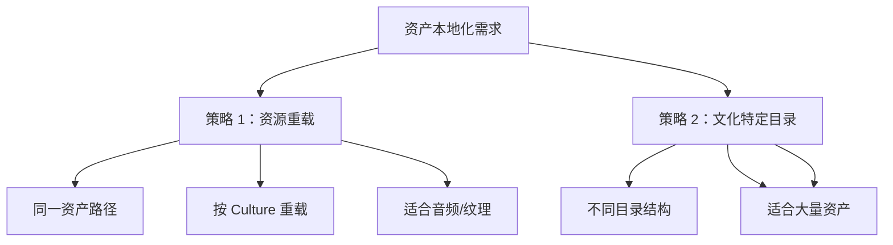
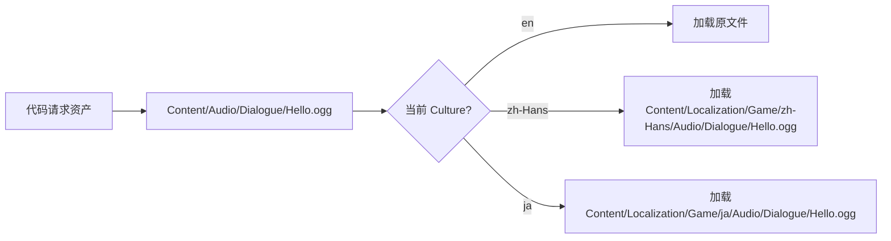

# 资产本地化音频纹理与多媒体

> 超越文本：音频、纹理、动画等资产的本地化机制。

## 概述

本地化不仅仅是翻译文本。完整的本地化还包括：
- **音频本地化**：不同语言的语音对话
- **纹理本地化**：带有文字的图标、标志
- **动画本地化**：手势、口型同步
- **UI 布局调整**：RTL 语言（阿拉伯语、希伯来语）

本课将讲解 UE 的**资产本地化机制**，让你能为不同语言提供不同的资产。

## 资产本地化策略对比

UE 提供两种主要的资产本地化策略：



| 策略 | 原理 | 优点 | 缺点 | 适用场景 |
|------|------|------|------|---------|
| **资源重载** | 同路径，按 Culture 自动替换 | 代码无需修改 | 需要配置重载规则 | 音频、纹理 |
| **文化特定目录** | 不同 Culture 加载不同路径 | 灵活、可大规模管理 | 需要管理多套资产 | 完整语言包 |

## 策略 1：资源重载（Asset Override）

这是 UE 最常用、最简便的资产本地化方式。

### 工作原理



### 配置步骤

**步骤 1**：在正常路径创建原始资产（源语言）
```
Content/Audio/Dialogue/Hello.ogg  (英语语音)
```

**步骤 2**：在本地化目录中放置对应语言的资产
```
Content/Localization/Game/zh-Hans/Audio/Dialogue/Hello.ogg  (中文语音)
Content/Localization/Game/ja/Audio/Dialogue/Hello.ogg      (日语语音)
```

**步骤 3**：UE 会自动根据当前 Culture 加载对应资产

无需修改代码！`LoadAsset("/Game/Audio/Dialogue/Hello")` 会自动加载对应语言的版本。

### 示例：音频本地化

```cpp
// 文件：示例
// 行号：基于 UE 5.7

// [1] 加载音频（自动本地化）
FSoftObjectPath AudioPath(TEXT("/Game/Audio/Dialogue/Hello"));

// [2] 异步加载
AsyncLoadObject(AudioPath, FStreamableDelegate::CreateLambda([=]()
{
    USoundBase* Sound = LoadObject<USoundBase>(nullptr, *AudioPath.ToString());
    if (Sound)
    {
        UGameplayStatics::PlaySound2D(GetWorld(), Sound);
        // 自动播放当前语言的版本！
    }
}));
```

**关键点**：不需要写任何本地化相关代码，UE 的资产加载系统会自动处理。

## 策略 2：文化特定目录（Culture-Specific Directories）

当需要为不同语言提供**完全不同的内容**（如不同的 UI 布局）时，可以使用文化特定目录。

### 目录结构

```
Content/
├── UI/
│   └── MainMenu.umg          # 默认（英语）UI
├── L10N/
│   ├── zh-Hans/
│   │   └── UI/
│   │       └── MainMenu.umg  # 中文 UI（可能布局不同）
│   └── ar/
│       └── UI/
│           └── MainMenu.umg  # 阿拉伯语 UI（RTL 布局）
```

### 配置方法

在项目设置中：
1. **Project Settings** → **Localization** → **Localization Path`
2. 添加 `Content/L10N/` 作为本地化搜索路径

## Lyra 的音频本地化实践

Lyra 使用**资源重载策略**进行音频本地化。

查看 Lyra 的目录结构：
```
Content/Localization/Game/zh-Hans/
├── Audio/
│   └── ... （中文语音文件）

Content/Localization/Game/ja/
├── Audio/
│   └── ... （日语语音文件）
```

当当前 Culture 是 `zh-Hans` 时，所有音频加载会自动指向中文版本。

## RTL 语言支持（阿拉伯语、希伯来语）

阿拉伯语和希伯来语是从右到左（RTL）书写的语言，需要特殊处理。

### UI 布局翻转

```cpp
// 文件：示例
// 检测当前 Culture 是否为 RTL

FCulturePtr CurrentCulture = FInternationalization::Get().GetCurrentCulture();
if (CurrentCulture->GetKeyboardLayoutName().Contains(TEXT("Arabic")) ||
    CurrentCulture->GetKeyboardLayoutName().Contains(TEXT("Hebrew")))
{
    // RTL 语言：翻转 UI 布局
    MyWidget->SetFlowDirection(EFlowDirectionPreference::RightToLeft);
}
```

### UMG 中的 RTL 支持

在 UMG Widget 中：
1. 选择根 Panel
2. 设置 **Flow Direction** 为 **Automatic**
3. UE 会根据当前 Culture 自动选择合适的方向

## 打包策略

### 分包（Split per Culture）

UE 支持将不同语言的资源打包到不同的 PAK 文件中：

```ini
; 文件：Config/DefaultGame.ini

[/Script/UnrealEd.ProjectPackagingSettings]
; [1] 启用按 Culture 分包
bUseCultureAwarePakFile=True

; [2] 每个语言生成独立的 PAK
; 结果：
;   Game.pak        （代码和共享资产）
;   Game_zh-Hans.pak （中文资源）
;   Game_ja.pak      （日语资源）
```

**优点**：
- 玩家只下载自己语言的 PAK，减少下载量
- 方便后续追加新语言（只发布新的 PAK）

## 常见问题与陷阱

### 陷阱 1：忘记将本地化资产添加到打包列表

**问题**：本地化资产没有被打包到最终游戏  
**解决**：确保 `Content/Localization/` 目录被包含在打包列表中

### 陷阱 2：音频本地化后仍然播放英语

**原因**：音频文件没有放在正确的重载路径  
**检查**：
1. 路径是否完全匹配（包括子目录）
2. 文件名是否完全一致
3. 本地化资源是否已编译（`.locres`）

### 陷阱 3：RTL 布局在某些 Widget 中不生效

**原因**：某些 Widget 没有设置 `Flow Direction` 为 `Automatic`  
**解决**：确保所有根 Panel 都正确配置了流向

## 总结与要点

| 要点 | 说明 |
|------|------|
| **资源重载是首选** | 同路径自动替换，代码无需修改 |
| **目录结构要一致** | 本地化资产的路径必须与原始资产完全匹配 |
| **RTL 需要特殊处理** | 阿拉伯语、希伯来语要翻转 UI 布局 |
| **分包减少包体** | 按 Culture 分包，玩家只下载需要的语言 |
| **Lyra 已实践** | 参考其 `Content/Localization/Game/` 目录结构 |

## 相关页面

- [[30-tutorials/localization-i18n/03-本地化仪表盘与工作流|← 上一课：本地化仪表盘]]
- [[30-tutorials/localization-i18n/05-运行时语言切换|下一课：运行时语言切换 →]]
- [UE 官方文档：Localizing Assets](https://dev.epicgames.com/documentation/unreal-engine/localizing-assets-in-unreal-engine)

<!-- nav:auto -->

---

**导航**: ← [[30-tutorials/localization-i18n/03-本地化仪表盘与工作流|03-本地化仪表盘与工作流]] · [[30-tutorials/localization-i18n/05-运行时语言切换|05-运行时语言切换]] →

<!-- /nav:auto -->
