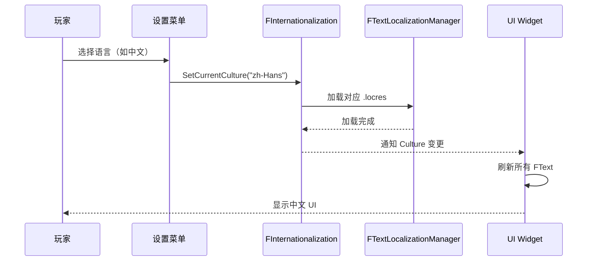

# 运行时语言切换

> 让玩家在游戏中动态切换语言，无需重启。

## 概述

优秀的游戏允许玩家在设置中**动态切换语言**。UE 支持运行时切换 Culture，但需要注意一些关键点。

本课将讲解：
- `FInternationalization` 类的使用
- 切换语言的完整流程
- UI 刷新的最佳实践
- Lyra 的语言切换实现分析
- 遇到的问题和解决方案

## 运行时切换语言的基本流程



## FInternationalization 核心 API

`FInternationalization` 是 UE 国际化系统的核心类。

### 获取单例

```cpp
// 文件：示例
// 行号：基于 UE 5.7

// [1] 获取 FInternationalization 单例
FInternationalization& I18N = FInternationalization::Get();
```

### 设置当前 Culture

```cpp
// [2] 切换语言
FInternationalization::Get().SetCurrentCulture(TEXT("zh-Hans"));

// [3] 验证是否设置成功
FCulturePtr CurrentCulture = FInternationalization::Get().GetCurrentCulture();
if (CurrentCulture.IsValid())
{
    FString CultureName = CurrentCulture->GetName();  // "zh-Hans"
}
```

### 获取可用 Culture 列表

```cpp
// [4] 获取所有已安装的 Culture
TArray<FString> AvailableCultures;
FInternationalization::Get().GetCulturesWithAvailableLocalization(
    TArray<FString>(),  // 空数组 = 所有
    AvailableCultures,
    false
);

// [5] 转换为用户友好的显示名称
for (const FString& CultureName : AvailableCultures)
{
    FCulturePtr Culture = FInternationalization::Get().GetCulture(CultureName);
    FString DisplayName = Culture->GetDisplayName();  // "Chinese (Simplified)"
    FString NativeName = Culture->GetNativeName();    // "中文（简体）"
}
```

## 完整的语言切换实现

### 步骤 1：应用新的 Culture

```cpp
// 文件：示例
// 行号：基于 UE 5.7

void UMyGameSettings::ApplyCulture(const FString& CultureName)
{
    // [1] 设置当前 Culture
    FInternationalization::Get().SetCurrentCulture(CultureName);

    // [2] 保存到配置文件（下次启动自动生效）
    GConfig->SetString(
        TEXT("/Script/Engine.Settings"),
        TEXT("Culture"),
        *CultureName,
        GGameUserSettingsIni
    );
    GConfig->Flush(false, GGameUserSettingsIni);

    // [3] 触发 UI 刷新
    BroadcastOnCultureChanged();
}
```

### 步骤 2：刷新 UI

切换 Culture 后，已创建的 UI Widget **不会自动更新**。需要手动刷新。

**方法 1：重新创建 Widget（推荐）**

```cpp
// 文件：示例

void UMyGameSettings::BroadcastOnCultureChanged()
{
    // [1] 关闭所有已打开的 UI
    if (UIManager)
    {
        UIManager->CloseAllWidgets();
    }

    // [2] 重新打开主菜单（会自动加载新语言的文本）
    UIManager->OpenMainMenu();
}
```

**方法 2：手动刷新 FText**

```cpp
// 文件：示例

// 在 Widget 中绑定事件
void UMyWidget::OnCultureChanged()
{
    // [1] 重新设置所有 FText 绑定
    TextBlock_Title->SetText(LOCTEXT("Title", "Game Title"));
    
    // [2] 如果使用了委托绑定，需要手动重新设置文本
    // 注意：BindDynamic 是蓝图宏，C++ 中应使用 SetText 直接重新设置
    if (TextBlock_Health)
    {
        TextBlock_Health->SetText(UMyWidget::GetHealthText());
    }
}
```

## Lyra 的语言切换实现

Lyra 在 `LyraSettingValueDiscrete_Language.cpp` 中实现了语言切换。

### 初始化：获取可用语言列表

```cpp
// 文件：Source/LyraGame/Settings/CustomSettings/LyraSettingValueDiscrete_Language.cpp
// 行号：约 L22-L36

void ULyraSettingValueDiscrete_Language::OnInitialized()
{
    Super::OnInitialized();

    // [1] 获取所有已本地化的 Culture 名称
    const TArray<FString> AllCultureNames = 
        FTextLocalizationManager::Get().GetLocalizedCultureNames(ELocalizationLoadFlags::Game);
    
    // [2] 过滤出允许的语言
    for (const FString& CultureName : AllCultureNames)
    {
        if (FInternationalization::Get().IsCultureAllowed(CultureName))
        {
            AvailableCultureNames.Add(CultureName);
        }
    }

    // [3] 在列表开头插入"系统默认"选项
    AvailableCultureNames.Insert(TEXT(""), SettingSystemDefaultLanguageIndex);
}
```

### 应用：提示重启

```cpp
// 文件：Source/LyraGame/Settings/CustomSettings/LyraSettingValueDiscrete_Language.cpp
// 行号：约 L43-L54

void ULyraSettingValueDiscrete_Language::OnApply()
{
    if (UCommonMessagingSubsystem* Messaging = LocalPlayer->GetSubsystem<UCommonMessagingSubsystem>())
    {
        // [1] 显示确认对话框，提示需要重启
        Messaging->ShowConfirmation(
            UCommonGameDialogDescriptor::CreateConfirmationOk(
                LOCTEXT("WarningLanguage_Title", "Language Changed"),
                LOCTEXT("WarningLanguage_Message", 
                    "You will need to restart the game completely for all language related changes to take effect.")
                )
        );
    }
}
```

**Lyra 的策略**：不尝试运行时热切换，而是**提示玩家重启游戏**。这是最稳健的方案。

### 获取当前选项索引

```cpp
// 文件：Source/LyraGame/Settings/CustomSettings/LyraSettingValueDiscrete_Language.cpp
// 行号：约 L87-L130

int32 ULyraSettingValueDiscrete_Language::GetDiscreteOptionIndex() const
{
    if (const ULyraSettingsShared* Settings = CastChecked<ULyraLocalPlayer>(LocalPlayer)->GetSharedSettings())
    {
        // [1] 检查是否使用系统默认
        if (Settings->ShouldResetToDefaultCulture())
        {
            return SettingSystemDefaultLanguageIndex;  // 返回 0
        }

        // [2] 获取待定 Culture（用户选择的，但未应用）
        FString PendingCulture = Settings->GetPendingCulture();
        if (PendingCulture.IsEmpty())
        {
            // [3] 如果没有待定，使用当前 Culture
            PendingCulture = FInternationalization::Get().GetCurrentCulture()->GetName();
        }

        // [4] 尝试精确匹配
        const int32 ExactMatchIndex = AvailableCultureNames.IndexOfByKey(PendingCulture);
        if (ExactMatchIndex != INDEX_NONE)
        {
            return ExactMatchIndex;
        }

        // [5] 尝试优先级匹配（如 "en-US" 匹配 "en"）
        const TArray<FString> PrioritizedPendingCultures = 
            FInternationalization::Get().GetPrioritizedCultureNames(PendingCulture);
        for (int32 i = 0; i < AvailableCultureNames.Num(); ++i)
        {
            if (PrioritizedPendingCultures.Contains(AvailableCultureNames[i]))
            {
                return i;
            }
        }
    }

    return 0;
}
```

## 最佳实践与陷阱

### 最佳实践 1：优先使用"重启生效"策略

运行时热切换语言听起来很酷，但实践中会遇到很多问题：
- 已加载的音频/纹理不会自动释放
- 某些 UI 状态会丢失
- 蓝图中的缓存可能导致文本不更新

**推荐**：像 Lyra 一样，提示玩家重启游戏。

### 最佳实践 2：使用 FText 而非 FString

```cpp
// ❌ 错误：硬编码字符串，切换语言后不会更新
TextBlock->SetText(FText::FromString("Hello"));

// ✅ 正确：使用 FText，切换语言后会自动更新（如果 Widget 重新创建）
TextBlock->SetText(LOCTEXT("Hello", "Hello"));
```

### 陷阱 1：切换语言后 UI 没有更新

**原因**：Widget 没有重新创建，FText 绑定没有刷新  
**解决**：
1. 重新创建 Widget（推荐）
2. 或者手动调用 `SetText` 重新设置

### 陷阱 2：打包后语言切换不生效

**原因**：对应语言的 PAK 文件没有打包进去  
**解决**：检查打包设置，确保 `Content/Localization/` 目录被包含

### 陷阱 3：某些语言显示方框（字体缺失）

**原因**：字体不支持该语言的字符集  
**解决**：使用支持多语言的字体（如 Noto Sans、Microsoft YahHei）

## 总结与要点

| 要点 | 说明 |
|------|------|
| **FInternationalization::Get()** | 核心类，用于获取/设置当前 Culture |
| **SetCurrentCulture()** | 切换语言，但 UI 不会自动刷新 |
| **Lyra 的策略最稳健** | 提示重启，避免热切换的复杂问题 |
| **FText 会自动更新** | 前提是对应的 Widget 重新创建 |
| **字体要支持多语言** | 避免方框问题 |

## 相关页面

- [[30-tutorials/localization-i18n/04-资产本地化音频纹理与多媒体|← 上一课：资产本地化]]
- [[30-tutorials/localization-i18n/06-Lyra本地化实践案例|下一课：Lyra 本地化实践案例 →]]
- [UE 官方文档：Runtime Localization](https://dev.epicgames.com/documentation/unreal-engine/localization-overview-for-unreal-engine)

<!-- nav:auto -->

---

**导航**: ← [[30-tutorials/localization-i18n/04-资产本地化音频纹理与多媒体|04-资产本地化音频纹理与多媒体]] · [[30-tutorials/localization-i18n/06-Lyra本地化实践案例|06-Lyra本地化实践案例]] →

<!-- /nav:auto -->
