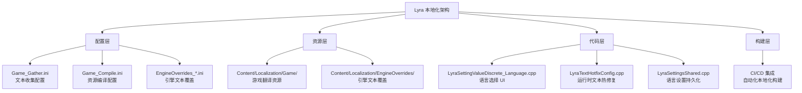
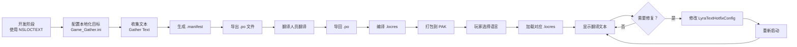

# Lyra本地化实践案例

> 深入分析 Lyra 项目的完整本地化实现，提炼可复用的最佳实践。

## 概述

Lyra 是一个真正的**多语言项目**，内置支持 **13 种语言**，是学习 UE 本地化系统的最佳参考。

本课将：
- 分析 Lyra 的本地化架构
- 解读关键配置文件（Game_Gather.ini、Game_Compile.ini）
- 分析关键代码实现（语言设置、热修复配置）
- 提炼可复用的最佳实践
- 指导如何将这些实践应用到自己的项目

## Lyra 本地化架构全景



## 配置文件深度分析

### 1. Game_Gather.ini — 文本收集配置

```ini
; 文件：Config/Localization/Game_Gather.ini
; 行号：约 L1-L69（基于 UE 5.7）

; ========== 基础设置 ==========
[CommonSettings]
; [1] 依赖引擎的 manifest（允许覆盖引擎文本）
ManifestDependencies=../../../Engine/Content/Localization/Engine/Engine.manifest
ManifestDependencies=../../../Engine/Content/Localization/Editor/Editor.manifest

; [2] 输入/输出路径
SourcePath=Content/Localization/Game
DestinationPath=Content/Localization/Game

; [3] 源语言是英语
NativeCulture=en

; [4] 支持 13 种目标语言
CulturesToGenerate=en
CulturesToGenerate=ar
; ...（省略其他语言）

; ========== Step 0：从源码收集 ==========
[GatherTextStep0]
CommandletClass=GatherTextFromSource
; [5] 扫描目录
SearchDirectoryPaths=Source
SearchDirectoryPaths=Config
SearchDirectoryPaths=Plugins
; [6] 排除不需要本地化的目录
ExcludePathFilters=Config/Localization/*
ExcludePathFilters=Source/LyraEditor/*
```

**关键点解读**：
- `[1]` 依赖引擎 manifest 允许 Lyra 覆盖"OK"、"Cancel"等引擎内置文本
- `[5]` 扫描 `Source/`、`Config/`、`Plugins/` 三个目录
- `[6]` 排除本地化配置本身，避免循环收集

### 2. Game_Compile.ini — 资源编译配置

```ini
; 文件：Config/Localization/Game_Compile.ini
; 行号：约 L1-L31（基于 UE 5.7）

[CommonSettings]
; [1] 输入/输出路径
SourcePath=Content/Localization/Game
DestinationPath=Content/Localization/Game

; [2] 资源文件名
ManifestName=Game.manifest
ArchiveName=Game.archive
ResourceName=Game.locres

; [3] 验证设置
bValidateFormatPatterns=true   ; 验证文本格式化模式
bValidateSafeWhitespace=false  ; 不验证安全空白字符

; [4] 源语言和目标语言
NativeCulture=en
CulturesToGenerate=en
CulturesToGenerate=ar
; ...（省略其他语言）

; ========== 编译步骤 ==========
[GatherTextStep0]
CommandletClass=GenerateTextLocalizationResource
```

**关键点解读**：
- `[2]` `ResourceName=Game.locres` 是运行时加载的二进制资源
- `[3]` `bValidateFormatPatterns=true` 会在编译时检查 `{0}`、`{Count}` 等格式化占位符是否匹配

## 代码实现深度分析

### 1. LyraSettingValueDiscrete_Language.cpp — 语言选择

这是 Lyra **设置菜单中语言选择**的实现。

#### 初始化：获取可用语言列表

```cpp
// 文件：Source/LyraGame/Settings/CustomSettings/LyraSettingValueDiscrete_Language.cpp
// 行号：约 L22-L36

void ULyraSettingValueDiscrete_Language::OnInitialized()
{
    Super::OnInitialized();

    // [1] 获取所有已本地化的 Culture 名称（从 .archive 文件读取）
    const TArray<FString> AllCultureNames = 
        FTextLocalizationManager::Get().GetLocalizedCultureNames(ELocalizationLoadFlags::Game);
    
    // [2] 过滤出允许的语言（检查 IsCultureAllowed）
    for (const FString& CultureName : AllCultureNames)
    {
        if (FInternationalization::Get().IsCultureAllowed(CultureName))
        {
            AvailableCultureNames.Add(CultureName);
        }
    }

    // [3] 在列表开头插入"系统默认"选项（空字符串）
    AvailableCultureNames.Insert(TEXT(""), SettingSystemDefaultLanguageIndex);
}
```

**关键点解读**：
- `[1]` `FTextLocalizationManager::Get().GetLocalizedCultureNames()` 从已编译的 `.archive` 文件中读取所有可用语言
- `[2]` `IsCultureAllowed()` 检查该 Culture 是否在项目的本地化配置中启用
- `[3]` 插入空字符串作为"系统默认"选项，索引为 0

#### 获取显示选项：本地化语言名称

```cpp
// 文件：Source/LyraGame/Settings/CustomSettings/LyraSettingValueDiscrete_Language.cpp
// 行号：约 L132-L168

TArray<FText> ULyraSettingValueDiscrete_Language::GetDiscreteOptions() const
{
    TArray<FText> Options;

    for (const FString& CultureName : AvailableCultureNames)
    {
        if (CultureName == TEXT(""))
        {
            // [1] "系统默认"选项：显示系统默认语言
            const FCulturePtr SystemDefaultCulture = 
                FInternationalization::Get().GetDefaultCulture();
            if (ensure(SystemDefaultCulture))
            {
                const FString& DefaultCultureDisplayName = SystemDefaultCulture->GetDisplayName();
                FText LocalizedSystemDefault = FText::Format(
                    LOCTEXT("SystemDefaultLanguage", "System Default ({0})"),
                    FText::FromString(DefaultCultureDisplayName)
                );
                Options.Add(MoveTemp(LocalizedSystemDefault));
            }
        }
        else
        {
            // [2] 具体语言选项：显示"原生名称（本地化名称）"
            FCulturePtr Culture = FInternationalization::Get().GetCulture(CultureName);
            if (ensureMsgf(Culture, TEXT("Unable to find Culture '%s'!"), *CultureName))
            {
                const FString CultureDisplayName = Culture->GetDisplayName();  // "Chinese (Simplified)"
                const FString CultureNativeName = Culture->GetNativeName();    // "中文（简体）"

                // [3] 如果原生名称和显示名称不同，显示两者
                FString Entry = (!CultureNativeName.Equals(CultureDisplayName, ESearchCase::CaseSensitive))
                    ? FString::Printf(TEXT("%s (%s)"), *CultureNativeName, *CultureDisplayName)
                    : CultureNativeName;

                Options.Add(FText::FromString(Entry));
                // 结果示例："中文（简体） (Chinese (Simplified))"
            }
        }
    }

    return Options;
}
```

**关键点解读**：
- `[1]` "系统默认"选项会根据操作系统的语言显示（如中文系统显示"System Default (中文（简体）)"）
- `[2]` `GetNativeName()` 返回语言的原生名称（如"中文（简体）"），`GetDisplayName()` 返回当前 Culture 下的本地化名称（如英语环境下显示"Chinese (Simplified)"）
- `[3]` 如果两个名称不同，同时显示（方便玩家理解）

#### 应用：提示重启

```cpp
// 文件：Source/LyraGame/Settings/CustomSettings/LyraSettingValueDiscrete_Language.cpp
// 行号：约 L43-L54

void ULyraSettingValueDiscrete_Language::OnApply()
{
    if (UCommonMessagingSubsystem* Messaging = LocalPlayer->GetSubsystem<UCommonMessagingSubsystem>())
    {
        // [1] 显示确认对话框，提示需要重启
        Messaging->ShowConfirmation(
            UCommonGameDialogDescriptor::CreateConfirmationOk(
                LOCTEXT("WarningLanguage_Title", "Language Changed"),
                LOCTEXT("WarningLanguage_Message", 
                    "You will need to restart the game completely for all language related changes to take effect.")
                )
        );
    }
}
```

**Lyra 的策略**：不尝试运行时热切换，而是**提示玩家重启游戏**。这是最稳健的方案。

### 2. LyraTextHotfixConfig.cpp — 运行时文本热修复

Lyra 提供了一个强大的功能：**无需重新打包即可修复文本**。

```cpp
// 文件：Source/LyraGame/Hotfix/LyraTextHotfixConfig.cpp
// 行号：约 L14-L17

void ULyraTextHotfixConfig::ApplyTextReplacements() const
{
    // [1] 注册 Polyglot 文本数据（运行时替换）
    FTextLocalizationManager::Get().RegisterPolyglotTextData(TextReplacements);
}
```

**PolyglotTextData 是什么？**

`FPolyglotTextData` 允许你在**运行时**替换文本内容，无需重新打包。

**使用场景**：
- 发现翻译错误，需要在线修复
- A/B 测试不同的文本
- 根据服务器配置动态调整文本

**配置方法**（在编辑器中）：
1. 打开 `LyraTextHotfixConfig` 资产（DefaultGame.ini 中指定）
2. 添加 `TextReplacements` 条目
3. 指定 Namespace、Key、替换文本

## Lyra 本地化的完整工作流



## 最佳实践总结

基于 Lyra 的实践，提炼出以下最佳实践：

| 实践 | 说明 | Lyra 中的体现 |
|------|------|----------------|
| **使用 NSLOCTEXT** | 所有用户可见文本用 NSLOCTEXT | 大量使用，可被 Gather Text 收集 |
| **配置多个本地化目标** | Game + EngineOverrides | Game_Gather.ini + EngineOverrides_Gather.ini |
| **排除不需要本地化的内容** | 避免收集测试内容、编辑器内容 | ExcludePathFilters 配置 |
| **验证格式化模式** | 编译时检查占位符 | bValidateFormatPatterns=true |
| **提示重启而非热切换** | 避免复杂的状态管理 | OnApply() 显示确认对话框 |
| **提供热修复机制** | 无需重新打包修复文本 | LyraTextHotfixConfig |
| **支持"系统默认"选项** | 跟随操作系统语言 | AvailableCultureNames.Insert(TEXT(""), 0) |

## 如何应用到自己的项目

### 步骤 1：启用本地化

1. 打开 **Localization Dashboard**（`Window` → `Localization Dashboard`）
2. 创建新的 Localization Target（如 `Game`）
3. 设置 `Native Culture` 为 `en`（或你的源语言）

### 步骤 2：配置文本收集

参考 Lyra 的 `Game_Gather.ini`，配置：
- 扫描目录（`SearchDirectoryPaths`）
- 排除目录（`ExcludePathFilters`）
- 目标语言（`CulturesToGenerate`）

### 步骤 3：替换所有用户可见文本

```cpp
// ❌ 修改前
TextBlock->SetText(FText::FromString("Start Game"));

// ✅ 修改后
TextBlock->SetText(NSLOCTEXT("UI", "StartGame", "Start Game"));
```

### 步骤 4：收集并翻译

1. 点击 **Gather Text**
2. 点击 **Export Translations**，导出 `.po` 文件
3. 交给翻译人员翻译
4. 导入翻译好的 `.po` 文件
5. 点击 **Compile Texts**

### 步骤 5：实现语言设置 UI

参考 `LyraSettingValueDiscrete_Language.cpp`，实现：
- 获取可用语言列表
- 显示友好的语言名称
- 应用语言设置（提示重启）

## 总结与要点

| 要点 | 说明 |
|------|------|
| **Lyra 是完整的参考** | 13 种语言、完整配置、代码实现 |
| **配置驱动** | .ini 文件定义收集/编译规则 |
| **代码解耦** | 使用 FText，避免硬编码 |
| **热修复机制** | PolyglotTextData 运行时替换 |
| **稳健的重启策略** | 提示重启，避免热切换问题 |

## 相关页面

- [[30-tutorials/localization-i18n/05-运行时语言切换|← 上一课：运行时语言切换]]
- [Lyra 项目源码](https://github.com/EpicGames/UnrealEngine/tree/5.7/Samples/Games/Lyra)
- [UE 官方文档：Localization Overview](https://dev.epicgames.com/documentation/unreal-engine/localization-overview-for-unreal-engine)

<!-- nav:auto -->

---

**导航**: ← [[30-tutorials/localization-i18n/05-运行时语言切换|05-运行时语言切换]]

<!-- /nav:auto -->
