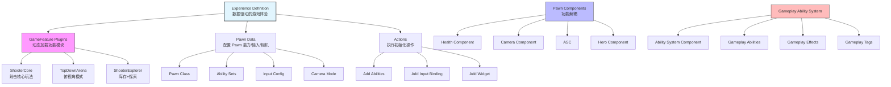

# Lyra项目架构与实战

> 从架构到实战，系统讲解 Lyra 项目如何组织代码、管理游戏状态、实现模块化游戏玩法。

## 概述

LyraStarterGame 是 Epic Games 提供的 **UE5 官方示例项目**，展示了 UE5 的最佳实践和核心功能。它不是一个简单的 Demo，而是一个**完整的游戏架构参考实现**。

### 为什么要学习 Lyra 的架构？

| 理由 | 说明 |
|------|------|
| **最佳实践** | Epic 的工程师如何组织大型 UE 项目的代码 |
| **模块化设计** | Experience System + GameFeature + Modular Gameplay 的组合 |
| **GAS 集成** | 如何在真实项目中正确使用 Gameplay Ability System |
| **网络同步** | 大型多人游戏的同步策略和性能优化 |
| **可扩展性** | 如何通过数据驱动和组件化支持多种游戏模式 |

### 本系列能帮你什么？

- **理解 Lyra 的架构设计**：为什么 Experience System 是核心创新？
- **掌握模块化游戏开发**：如何设计可复用、低耦合的游戏功能
- **实战能力**：基于 Lyra 框架创建自己的游戏模式
- **性能优化**：学习 Lyra 中的 CPU、GPU、内存、网络优化技巧

---

## 核心概念全景图

---

## 与 Lyra 项目的关系

本系列教程将 Lyra 项目分解为可学习的模块：

| 模块 | 对应 Lyra 源码 | 本系列位置 |
|------|----------------|-------------|
| **体验系统** | `Source/LyraGame/GameModes/LyraExperienceDefinition.h` | 第 02 篇 |
| **GameFeature 架构** | `Plugins/GameFeatures/` 目录 | 第 03 篇 |
| **角色与组件** | `Source/LyraGame/Character/LyraCharacter.h` | 第 04 篇 |
| **GAS 集成** | `Source/LyraGame/AbilitySystem/` | 第 05 篇 |
| **输入系统** | `Source/LyraGame/Input/` | 第 06 篇 |
| **UI 框架** | `Source/LyraUI/` | 第 07 篇 |
| **网络同步** | `Source/LyraGame/Replication/` | 第 08 篇 |

---

## 系列阅读指南

### 第 1 阶段：基础架构（适合初学者）

| 课程序号 | 标题 | 学习目标 |
|---------|------|---------|
| 00 | [Lyra 项目概览](#)（当前） | 了解 Lyra 是什么、为什么要学、系列结构 |
| 01 | [Lyra 架构总览](#) | 理解模块化、Experience System、组件化三大理念 |
| 02 | [Experience 系统详解](#) | 掌握数据驱动的游戏体验配置 |

### 第 2 阶段：核心系统（进阶）

| 课程序号 | 标题 | 学习目标 |
|---------|------|---------|
| 03 | [GameFeature 与 Modular GamePlay](#) | 理解 UE5 模块化架构、动态加载机制 |
| 04 | [Pawn 与组件系统](#) | 掌握 Lyra 的角色设计和组件生命周期 |
| 05 | [GAS 集成详解](#) | 理解 Lyra 如何扩展 GAS、Ability 授予流程 |

### 第 3 阶段：输入与 UI（中级）

| 课程序号 | 标题 | 学习目标 |
|---------|------|---------|
| 06 | [输入系统](#) | 理解 EnhancedInput、InputTag、InputConfig |
| 07 | [UI 框架](#) | 掌握 CommonUI 集成、Widget Stack、HUD 配置 |

### 第 4 阶段：网络同步（高级）

| 课程序号 | 标题 | 学习目标 |
|---------|------|---------|
| 08 | [网络同步](#) | 理解 Lyra 的同步架构、ReplicationGraph、性能优化 |

### 第 5 阶段：实战与高级主题（高级）

| 课程序号 | 标题 | 学习目标 |
|---------|------|---------|
| 09 | [实战：创建新游戏模式](#) | 完整流程：从 Experience 到 Pawn 配置到测试 |
| 10 | [高级主题与性能优化](#) | 性能分析、常见陷阱、扩展点、未来展望 |

---

## 前置知识

本系列假设读者已经了解：

- **UE 框架基础**：GameInstance、World、Level、GameMode、Pawn、Controller（推荐先读 `30-tutorials/ue-framework/` 系列）
- **C++ 基础知识**：类继承、虚函数、UPROPERTY、UFUNCTION
- **UE 反射系统基础**：UCLASS、UPROPERTY、UFUNCTION 宏（推荐先读 `30-tutorials/ue-reflection/` 系列）
- **GAS 基础概念**（第 05 篇前置）：Ability、Effect、Tag、Attribute（推荐先读 `30-tutorials/gas/` 系列）

---

## 相关页面

- [[30-tutorials/ue-framework/00-UE框架概述]] - UE 框架系列（前置知识）
- [[30-tutorials/game-feature/00-GameFeature系统从入门到实战]] - GameFeature 系统系列（深入参考）
- [[30-tutorials/modular-gameplay/00-ModularGameplay系统教程系列]] - Modular Gameplay 系列（深入参考）
- [[30-tutorials/gas/00-GAS系统总览]] - GAS 系列（前置知识）
- [[30-tutorials/input-system/00-UE5输入系统系列概览]] - 输入系统系列（前置知识）
- [[30-tutorials/umg/00-UMG系列概览]] - UMG 系列（UI 参考）

---

> 最后更新：2026-05-19

<!-- nav:auto -->

---

**导航**: [[30-tutorials/lyra-practical/01-Lyra架构总览|01-Lyra架构总览]] →

<!-- /nav:auto -->
