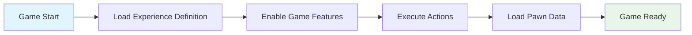
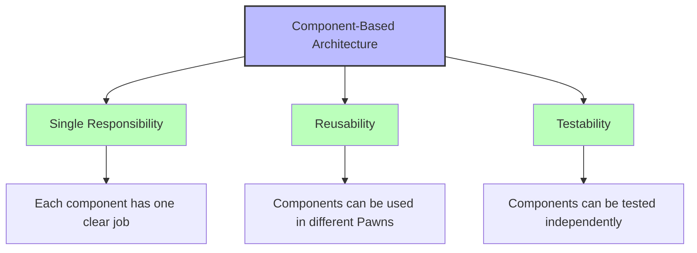
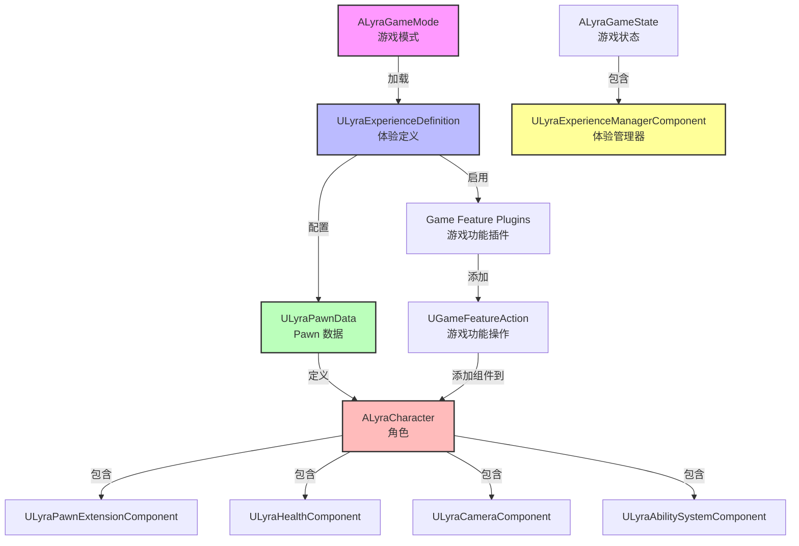
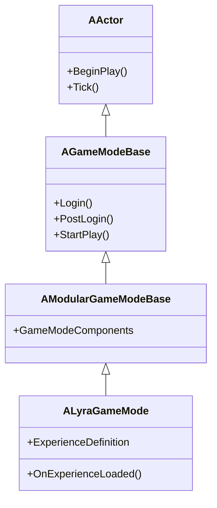
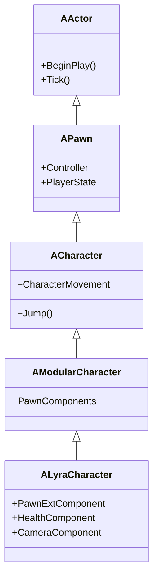
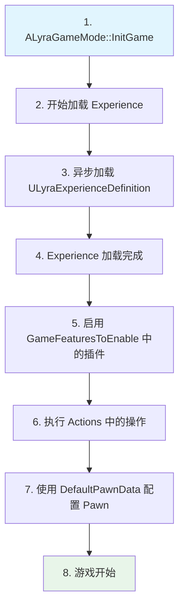
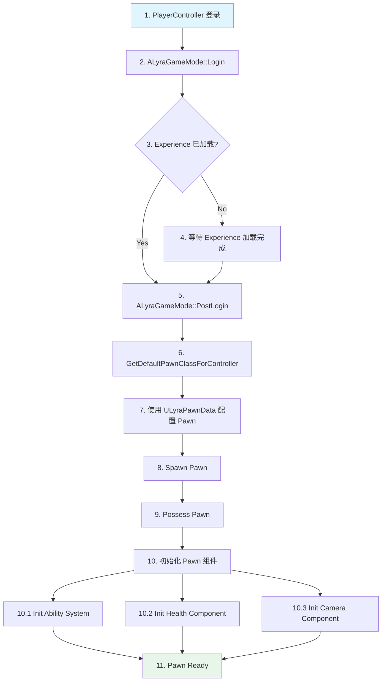
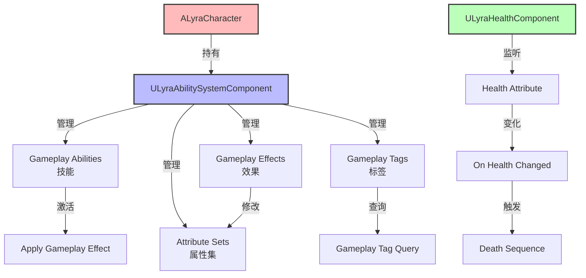

# Lyra架构总览

> 本课程介绍 Lyra 项目的三大核心架构理念，帮助您理解 Lyra 为什么这样设计，以及这些设计带来的优势。

---

## 概述

本课程将带领您了解 Lyra 项目的三大架构理念：**模块化游戏玩法（Modular Gameplay）**、**体验系统（Experience System）**和**组件化架构（Component-Based）**。学完本课后，您将理解 Lyra 为什么选择这些设计，以及它们如何协同工作来创建一个灵活、可扩展的游戏框架。

---

## 1. Lyra 三大架构理念

### 1.1 模块化游戏玩法（Modular Gameplay）

#### 概念：组合优于继承

传统游戏开发中，我们经常会创建很深的继承链：

```
ACharacter → AMyBaseCharacter → AMyWarriorCharacter → AMyHeroCharacter
```

**问题**：
- 功能固化在继承链中，难以复用
- 修改基类可能影响所有子类
- 难以在运行时动态添加/移除功能

**Lyra 的解决方案**：使用 **Modular Gameplay** 框架，将功能分解为可复用的组件，通过**组合**而不是继承来构建游戏对象。

#### Lyra 的实现

Lyra 的核心类都继承自 Modular 版本：

```cpp
// 文件：Source/LyraGame/GameModes/LyraGameMode.h
// 继承链：AActor → AGameModeBase → AModularGameModeBase → ALyraGameMode
class ALyraGameMode : public AModularGameModeBase
{
    // ...
};

// 文件：Source/LyraGame/Character/LyraCharacter.h:97-98
// 继承链：AActor → APawn → ACharacter → AModularCharacter → ALyraCharacter
class ALyraCharacter : public AModularCharacter, 
                      public IAbilitySystemInterface,
                      public IGameplayCueInterface,
                      public IGameplayTagAssetInterface,
                      public ILyraTeamAgentInterface
{
    // ...
};
```

**Modular 类的作用**：
- `AModularGameModeBase`：支持动态添加 GameMode 组件
- `AModularCharacter`：支持动态添加 Pawn 组件
- `AModularGameStateBase`：支持动态添加 GameState 组件

#### 优势

| 优势 | 说明 | 示例 |
|------|------|------|
| **功能解耦** | 每个功能独立为组件 | 生命值、相机、技能系统各自独立 |
| **易于扩展** | 添加新功能只需新组件 | 新增 "魔法值" 组件，不影响现有代码 |
| **动态添加/移除** | 运行时动态组装功能 | 不同职业的角色可以共享基础类，通过不同组件组合实现差异 |

---

### 1.2 体验系统（Experience System）

#### 概念：数据驱动游戏配置

**问题**：传统方式中，游戏模式、角色、技能等配置都硬编码在代码中，难以调整和复用。

**Lyra 的解决方案**：引入 **Experience Definition**（体验定义），将游戏配置**数据化**，通过 Data Asset 定义游戏的完整体验。

#### 核心类：ULyraExperienceDefinition

```cpp
// 文件：Source/LyraGame/GameModes/LyraExperienceDefinition.h:16-52
UCLASS(BlueprintType, Const)
class ULyraExperienceDefinition : public UPrimaryDataAsset
{
    GENERATED_BODY()

public:
    // 要启用的游戏功能插件列表
    UPROPERTY(EditDefaultsOnly, Category = "Gameplay")
    TArray<FString> GameFeaturesToEnable;

    /** The default pawn class to spawn for players */
    UPROPERTY(EditDefaultsOnly, Category = "Gameplay")
    TObjectPtr<const ULyraPawnData> DefaultPawnData;

    // 加载/激活/停用/卸载时执行的操作列表
    UPROPERTY(EditDefaultsOnly, Instanced, Category = "Actions")
    TArray<TObjectPtr<UGameFeatureAction>> Actions;

    // 附加操作集
    UPROPERTY(EditDefaultsOnly, Category = "Gameplay")
    TArray<TObjectPtr<ULyraExperienceActionSet>> ActionSets;
};
```

#### 关键属性说明

| 属性 | 类型 | 作用 |
|------|------|------|
| `GameFeaturesToEnable` | `TArray<FString>` | 指定此体验需要启用的 Game Feature 插件 |
| `DefaultPawnData` | `ULyraPawnData*` | 定义 Pawn 的配置（外观、技能、输入等） |
| `Actions` | `TArray<UGameFeatureAction*>` | 定义加载/激活时要执行的操作（添加 Ability、Input Binding 等） |
| `ActionSets` | `TArray<ULyraExperienceActionSet*>` | 可复用的操作集，可以多个 Experience 共享 |

#### 工作流程



**步骤详解**：
1. **加载 Experience Definition**：游戏启动时，GameMode 异步加载指定的 Experience
2. **启用 Game Features**：根据 `GameFeaturesToEnable` 列表，动态加载插件
3. **执行 Actions**：执行 `Actions` 和 `ActionSets` 中定义的操作（如添加 Ability、绑定输入、创建 UI 等）
4. **加载 Pawn Data**：使用 `DefaultPawnData` 配置 Player 的 Pawn

---

### 1.3 组件化架构（Component-Based）

#### 概念：功能分解为独立组件

Lyra 将角色的功能分解为多个独立的组件，每个组件负责一个特定功能。这种设计遵循 **单一职责原则（SRP）**。

#### Lyra 的 Pawn 组件

```cpp
// 文件：Source/LyraGame/Character/LyraCharacter.h
protected:
    // Pawn 扩展基础组件
    UPROPERTY(VisibleAnywhere, BlueprintReadOnly, Category = "Lyra|Character")
    TObjectPtr<ULyraPawnExtensionComponent> PawnExtComponent;

    // 生命值组件
    UPROPERTY(VisibleAnywhere, BlueprintReadOnly, Category = "Lyra|Character")
    TObjectPtr<ULyraHealthComponent> HealthComponent;

    // 相机组件
    UPROPERTY(VisibleAnywhere, BlueprintReadOnly, Category = "Lyra|Character")
    TObjectPtr<ULyraCameraComponent> CameraComponent;
```

**完整的组件列表**：

| 组件 | 职责 | 所在文件 |
|------|------|----------|
| `ULyraPawnExtensionComponent` | Pawn 扩展基础组件，提供统一的初始化接口 | `LyraPawnExtensionComponent.h` |
| `ULyraHealthComponent` | 生命值管理，处理伤害、死亡逻辑 | `LyraHealthComponent.h` |
| `ULyraCameraComponent` | 相机控制，管理视角 | `LyraCameraComponent.h` |
| `ULyraAbilitySystemComponent` | 游戏能力系统（GAS） | `LyraAbilitySystemComponent.h` |
| `ULyraHeroComponent` | 英雄角色特有功能 | `LyraHeroComponent.h` |
| `ULyraEquipmentManagerComponent` | 装备管理 | `LyraEquipmentManagerComponent.h` |
| `ULyraInventoryManagerComponent` | 库存管理 | `LyraInventoryManagerComponent.h` |

#### 优势



| 优势 | 说明 | 示例 |
|------|------|------|
| **单一职责** | 每个组件只负责一个功能 | `HealthComponent` 只管生命值，不管相机 |
| **可复用** | 组件可以在不同 Pawn 间复用 | `HealthComponent` 可用于玩家、敌人、NPC |
| **易测试** | 组件可以独立测试 | 可以单独测试 `HealthComponent` 的伤害计算 |

---

## 2. 模块依赖关系

以下图表展示了 Lyra 核心模块之间的依赖关系：



**依赖关系解读**：

1. **GameMode → Experience Definition**：GameMode 负责加载 Experience
2. **Experience Definition → PawnData**：Experience 定义使用哪个 PawnData
3. **PawnData → Character**：PawnData 配置 Character 的属性和组件
4. **Character → Components**：Character 包含多个功能组件
5. **GameState → Experience Manager**：GameState 持有 Experience 管理器，监控加载状态

---

## 3. 核心类说明

### 3.1 ALyraGameMode

#### 职责

`ALyraGameMode` 定义了游戏的**规则和流程**，是游戏的"裁判"。

#### 继承链



#### 关键功能

| 功能 | 说明 |
|------|------|
| **加载 Experience** | 在 `InitGame()` 中开始异步加载 Experience Definition |
| **管理 Player 登录** | 重写 `Login()` 和 `PostLogin()`，等待 Experience 加载完成 |
| **Pawn 生成** | 重写 `GetDefaultPawnClassForController()`，返回 Experience 中定义的 Pawn 类 |
| **管理游戏开始/结束** | 在 Experience 加载完成后，才允许游戏开始 |

---

### 3.2 ALyraCharacter

#### 职责

`ALyraCharacter` 是玩家的**角色 Pawn**，负责**发送事件到各个 Pawn 组件**，而不是直接实现功能。

#### 继承链



#### 实现的接口

```cpp
// 文件：Source/LyraGame/Character/LyraCharacter.h:98
class ALyraCharacter : public AModularCharacter, 
                      public IAbilitySystemInterface,       // 能力系统接口
                      public IGameplayCueInterface,        // GameplayCue 接口
                      public IGameplayTagAssetInterface,   // GameplayTag 接口
                      public ILyraTeamAgentInterface       // 团队代理接口
{
    // ...
};
```

| 接口 | 作用 |
|------|------|
| `IAbilitySystemInterface` | 提供 `GetAbilitySystemComponent()`，让 GAS 能找到角色的 ASC |
| `IGameplayCueInterface` | 处理 GameplayCue 事件（如受击特效、声音） |
| `IGameplayTagAssetInterface` | 提供 `GetOwnedGameplayTags()`，让 GAS 能查询角色的 Tag |
| `ILyraTeamAgentInterface` | 提供团队功能，用于区分友军/敌军 |

---

### 3.3 ULyraExperienceDefinition

#### 职责

`ULyraExperienceDefinition` 定义了游戏的**完整体验**，包括使用哪个 GameMode、Pawn、哪些技能、哪些 UI 等。

#### 关键属性（已验证源码）

```cpp
// 文件：Source/LyraGame/GameModes/LyraExperienceDefinition.h:36-51
class ULyraExperienceDefinition : public UPrimaryDataAsset
{
public:
    // 要启用的游戏功能插件列表
    UPROPERTY(EditDefaultsOnly, Category = "Gameplay")
    TArray<FString> GameFeaturesToEnable;           // ✅ 已验证

    /** The default pawn class to spawn for players */
    UPROPERTY(EditDefaultsOnly, Category = "Gameplay")
    TObjectPtr<const ULyraPawnData> DefaultPawnData; // ✅ 已验证

    // 加载/激活/停用/卸载时执行的操作列表
    UPROPERTY(EditDefaultsOnly, Instanced, Category = "Actions")
    TArray<TObjectPtr<UGameFeatureAction>> Actions;  // ✅ 已验证

    // 附加操作集
    UPROPERTY(EditDefaultsOnly, Category = "Gameplay")
    TArray<TObjectPtr<ULyraExperienceActionSet>> ActionSets; // ✅ 已验证
};
```

#### 使用流程



---

## 4. 数据流

### 4.1 玩家登录流程

以下流程图展示了从 PlayerController 登录到 Pawn 组件初始化的完整流程：



**关键步骤说明**：

| 步骤 | 函数 | 说明 |
|------|------|------|
| 1 | `PlayerController::Login()` | Player 连接服务器 |
| 2 | `ALyraGameMode::Login()` | GameMode 处理登录请求 |
| 3-4 | `ULyraExperienceManagerComponent::LoadExperience()` | 等待 Experience 加载完成 |
| 5 | `ALyraGameMode::PostLogin()` | 登录后处理 |
| 6 | `GetDefaultPawnClassForController()` | 获取 Experience 中定义的 Pawn 类 |
| 7 | `ULyraPawnData::ConfigurePawn()` | 使用 PawnData 配置 Pawn |
| 8 | `SpawnActor()` | 生成 Pawn |
| 9 | `Possess()` | Controller 控制 Pawn |
| 10 | `PawnExtComponent::OnPawnReadyToInitialize()` | 初始化所有 Pawn 组件 |

---

### 4.2 GAS 集成数据流

Lyra 深度集成了 **Gameplay Ability System（GAS）**，以下图表展示了 Character 与 GAS 的数据流：



**数据流说明**：

1. **Character 持有 ASC**：`ALyraCharacter` 通过 `IAbilitySystemInterface` 提供 `GetAbilitySystemComponent()`
2. **ASC 管理技能和效果**：`ULyraAbilitySystemComponent` 负责管理所有的 Gameplay Ability、Gameplay Effect、Gameplay Tag 和 Attribute Set
3. **组件监听属性变化**：`ULyraHealthComponent` 监听 Health Attribute 的变化，触发死亡序列

---

## 5. 总结与要点

| 要点 | 说明 |
|------|------|
| **模块化游戏玩法** | 使用组合优于继承，功能分解为可复用的组件，支持动态添加/移除 |
| **体验系统** | 数据驱动游戏配置，通过 `ULyraExperienceDefinition` 定义游戏的完整体验 |
| **组件化架构** | 功能分解为独立组件，遵循单一职责原则，易于复用和测试 |
| **依赖关系** | GameMode → Experience → PawnData → Character → Components，层次清晰 |
| **数据流** | 玩家登录 → 加载 Experience → 启用插件 → 配置 Pawn → 初始化组件 |

**核心设计理念回顾**：

1. **组合优于继承**：Lyra 使用 Modular Gameplay 框架，通过组件组合构建游戏对象
2. **数据驱动**：使用 Experience Definition 将游戏逻辑从代码中解耦
3. **功能解耦**：每个功能独立为组件，易于维护和扩展

---

## 6. 相关页面

### 内部链接

- [[30-tutorials/lyra-practical/02-ExperienceSystem详解]] - Experience 系统详解
- [[30-tutorials/modular-gameplay/01-ModularGameplay是什么]] - 模块化游戏玩法详解

### 外部参考

- [UE5 Modular Gameplay 官方文档](https://docs.unrealengine.com/5.0/en-US/modular-gameplay-in-unreal-engine/)
- [UE5 Game Feature 官方文档](https://docs.unrealengine.com/5.0/en-US/game-features-and-modular-gameplay-in-unreal-engine/)

---

> 最后更新：2026-05-19

<!-- nav:auto -->

---

**导航**: ← [[30-tutorials/lyra-practical/00-Lyra项目架构与实战|00-Lyra项目架构与实战]] · [[30-tutorials/lyra-practical/02-ExperienceSystem详解|02-ExperienceSystem详解]] →

<!-- /nav:auto -->
