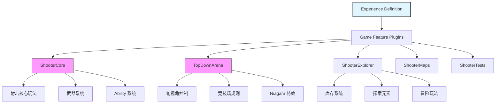
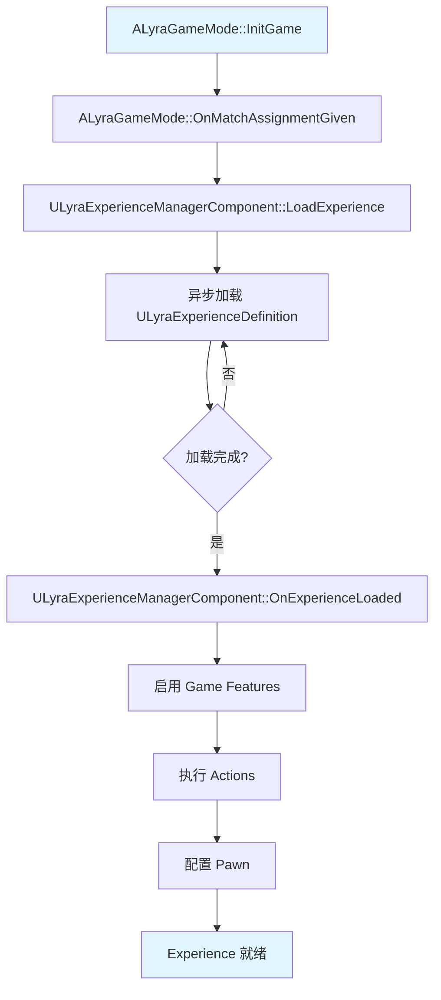

# ExperienceSystem详解

> **学习目标**：理解 Lyra 的核心创新 —— Experience System，掌握如何通过数据驱动方式配置游戏体验。

## 概述

本课将带你深入理解 Lyra 的 **Experience System（体验系统）**，这是 Lyra 架构中最核心的创新之一。

### 本课你将学到什么？

- **Experience 是什么**：为什么它取代了传统的 GameMode？
- **核心概念**：Experience Definition、Game Features、Pawn Data、Actions
- **Lyra 预设体验**：前端菜单、射击模式、俯视角竞技场是如何配置的
- **工作流程**：Experience 从加载到激活的完整流程
- **实战操作**：如何创建自定义 Experience

### 学完你能理解什么？

- 如何通过**数据驱动**的方式配置游戏体验（而不是写死在代码里）
- 为什么 Experience System 是 Lyra 模块化架构的基石
- 如何基于 Lyra 框架快速创建新的游戏模式

---

## 2.1 Experience System 核心概念

### 2.1.1 什么是 Experience？

**Experience（体验）** 是 Lyra 中定义游戏模式的**数据资产（Data Asset）**。它封装了一个完整游戏体验所需的所有配置：

| 传统 GameMode | Lyra Experience System |
|--------------|----------------------|
| 代码驱动（C++ 硬编码） | 数据驱动（Data Asset 配置） |
| 修改需要重新编译 | 修改只需编辑资产 |
| 难以复用和组合 | 通过 Game Feature 插件化复用 |
| 一个 GameMode = 一种游戏模式 | 一个 Experience = 一种游戏体验（可动态切换） |

**核心作用**：
1. **启用 Game Features**：指定此体验需要加载哪些 Game Feature 插件
2. **配置 Pawn Data**：定义玩家角色的能力、输入、相机等
3. **执行 Actions**：在加载/激活/停用/卸载时执行操作（添加 Ability、Widget 等）

### 2.1.2 ULyraExperienceDefinition 核心属性（源码验证）

**源码位置**：`Source/LyraGame/GameModes/LyraExperienceDefinition.h`

```cpp
UCLASS(BlueprintType, Const)
class ULyraExperienceDefinition : public UPrimaryDataAsset
{
    // 要启用的游戏功能插件列表
    UPROPERTY(EditDefaultsOnly, Category = Gameplay)
    TArray<FString> GameFeaturesToEnable;
    
    // 默认 Pawn 数据
    UPROPERTY(EditDefaultsOnly, Category = Gameplay)
    TObjectPtr<const ULyraPawnData> DefaultPawnData;
    
    // 加载/激活/停用/卸载时执行的操作列表
    UPROPERTY(EditDefaultsOnly, Instanced, Category = "Actions")
    TArray<TObjectPtr<UGameFeatureAction>> Actions;
    
    // 附加操作集（可复用）
    UPROPERTY(EditDefaultsOnly, Category = Gameplay)
    TArray<TObjectPtr<ULyraExperienceActionSet>> ActionSets;
};
```

**属性说明**：

| 属性 | 类型 | 作用 |
|------|------|------|
| `GameFeaturesToEnable` | `TArray<FString>` | 需要启用的 Game Feature 插件名称列表 |
| `DefaultPawnData` | `ULyraPawnData*` | 默认 Pawn 数据（定义角色能力、输入、相机等） |
| `Actions` | `TArray<UGameFeatureAction*>` | 直接绑定的操作列表（添加 Ability、Widget 等） |
| `ActionSets` | `TArray<ULyraExperienceActionSet*>` | 可复用的操作集（多个 Experience 共享） |

---

## 2.2 Lyra 预设体验系统（实例分析）

Lyra 项目预设了多个 Experience，展示了不同游戏类型的实现方式。通过分析它们，你可以快速理解 Experience System 的实际应用。

### 2.2.1 B_LyraFrontEnd_Experience（前端菜单）

**路径**：`Content/System/FrontEnd/B_LyraFrontEnd_Experience.uasset`

**用途**：游戏启动时的主菜单界面

**配置详情**：

| 配置项 | 值 | 说明 |
|--------|-----|------|
| **Game Features** | `CommonUI`、`CommonGame` | 启用 UI 框架和通用游戏框架 |
| **Pawn Data** | 无 | 菜单界面不需要 Pawn |
| **Actions** | 添加 UI Widget、配置输入 | 显示菜单界面，支持鼠标/键盘导航 |

**关键洞察**：
- 前端菜单不需要 Pawn，因此 `DefaultPawnData` 为空
- 通过 `Actions` 添加菜单 Widget 和配置输入（鼠标导航）

### 2.2.2 B_LyraDefaultExperience（默认射击模式）

**路径**：`Content/System/Experiences/B_LyraDefaultExperience.uasset`

**用途**：默认的游戏体验（第三人称射击模式）

**配置详情**：

| 配置项 | 值 | 说明 |
|--------|-----|------|
| **Game Features** | `ShooterCore`、`ShooterMaps`、`CommonUI`、`EnhancedInput` | 射击核心玩法、地图、UI、输入 |
| **Pawn Data** | `B_LyraPawnData_Default` | 默认 Pawn 数据（包含射击能力、输入配置等） |
| **Actions** | 添加射击 Ability、Input Binding、HUD Widget | 授予射击、换弹、瞄准等能力；绑定输入；显示 HUD |

**关键洞察**：
- `ShooterCore` 是射击玩法的核心 Game Feature，封装了武器系统、弹药物理等
- `DefaultPawnData` 定义了角色的所有能力（Ability Sets）、输入配置（Input Config）、相机模式（Camera Mode）

### 2.2.3 B_TopDownArenaExperience（俯视角竞技场）

**路径**：`Plugins/GameFeatures/TopDownArena/Content/System/Experiences/B_TopDownArenaExperience.uasset`

**用途**：俯视角竞技场游戏模式

**配置详情**：

| 配置项 | 值 | 说明 |
|--------|-----|------|
| **Game Features** | `TopDownArena`、`GameplayAbilities`、`Niagara`、`LyraExampleContent` | 俯视角玩法、技能系统、粒子效果 |
| **Pawn Data** | `B_TopDownPawnData` | 俯视角 Pawn 数据（包含俯视角控制、相机等） |
| **Actions** | 添加俯视角控制 Ability、相机、HUD | 授予俯视角控制能力；设置俯视角相机；显示竞技场 HUD |

**关键洞察**：
- 这是 Game Feature 插件化的典型案例：`TopDownArena` 是一个独立的插件，可以在其他项目中复用
- 不同的 Pawn Data（`B_TopDownPawnData` vs `B_LyraPawnData_Default`）定义了不同的游戏体验

---

## 2.3 Game Feature 插件架构

Lyra 采用**模块化的 Game Feature 插件架构**，每个插件封装独立的功能模块。Experience 通过 `GameFeaturesToEnable` 指定需要加载的插件。



**插件详细说明**：

| 插件名称 | 描述 | 依赖 | 用途 |
|---------|------|------|------|
| **ShooterCore** | 射击游戏核心玩法系统 | GameplayAbilities, ModularGameplay, CommonUI, EnhancedInput | 提供射击、换弹、瞄准等核心功能 |
| **TopDownArena** | 俯视角竞技场玩法 | GameplayAbilities, Niagara | 提供俯视角控制、竞技场规则 |
| **ShooterExplorer** | 射击+冒险探索 | ShooterCore | 扩展 ShooterCore，添加库存、探索元素 |
| **ShooterMaps** | 射击游戏地图 | ShooterCore | 提供预设地图和场景 |
| **ShooterTests** | 测试套件 | ShooterCore, CQTest | 提供自动化测试 |

---

## 2.4 Experience 工作流程

Experience 的加载和激活是一个**异步流程**，理解这个流程对于调试和扩展非常重要。

### 2.4.1 加载 Experience 流程图



### 2.4.2 流程详解

#### 步骤 1：加载 Experience

**调用链**：
```
ALyraGameMode::InitGame()
  → ALyraGameMode::OnMatchAssignmentGiven()
    → ULyraExperienceManagerComponent::LoadExperience()
      → 异步加载 ULyraExperienceDefinition
        → ULyraExperienceManagerComponent::OnExperienceLoaded()
```

**关键点**：
- Experience 是**异步加载**的，需要处理加载完成前的状态
- 使用 `AsyncAction_ExperienceReady` 等待 Experience 加载完成

#### 步骤 2：启用 Game Features

Experience Definition 中的 `GameFeaturesToEnable` 列出了需要启用的 Game Feature 插件：

```cpp
// ULyraExperienceDefinition
UPROPERTY(EditDefaultsOnly, Category = Gameplay)
TArray<FString> GameFeaturesToEnable;
```

**示例**：
```cpp
GameFeaturesToEnable.Add("ShooterCore");
GameFeaturesToEnable.Add("TopDownArena");
```

**关键点**：
- Game Feature 插件是**按需加载**的，只在需要时启用
- 插件的加载也是异步的，需要等待所有插件加载完成

#### 步骤 3：执行 Actions

Experience Definition 中的 `Actions` 列出了要执行的操作：

```cpp
// ULyraExperienceDefinition
UPROPERTY(EditDefaultsOnly, Instanced, Category = "Actions")
TArray<TObjectPtr<UGameFeatureAction>> Actions;
```

**内置的 Action 类型**：

| Action 类型 | 功能 |
|-------------|------|
| `UGameFeatureAction_AddAbilities` | 添加 Ability（技能） |
| `UGameFeatureAction_AddInputBinding` | 添加 Input Binding（输入绑定） |
| `UGameFeatureAction_AddWidget` | 添加 Widget（UI） |
| `UGameFeatureAction_AddGameplayCuePath` | 添加 GameplayCue 路径 |
| `UGameFeatureAction_SplitscreenConfig` | 配置分屏 |

#### 步骤 4：配置 Pawn

Experience Definition 中的 `DefaultPawnData` 定义了 Pawn 的数据：

```cpp
// ULyraPawnData
UCLASS()
class ULyraPawnData : public UPrimaryDataAsset
{
    // 默认 Pawn 类
    UPROPERTY(EditDefaultsOnly, Category = "Pawn")
    TSubclassOf<APawn> PawnClass;
    
    // 要应用的 Ability Sets
    UPROPERTY(EditDefaultsOnly, Category = "Abilities")
    TArray<TObjectPtr<ULyraAbilitySet>> AbilitySets;
    
    // 输入配置
    UPROPERTY(EditDefaultsOnly, Category = "Input")
    TObjectPtr<ULyraInputConfig> InputConfig;
    
    // 相机模式
    UPROPERTY(EditDefaultsOnly, Category = "Camera")
    TSubclassOf<ULyraCameraMode> DefaultCameraMode;
};
```

**关键点**：
- `PawnClass` 定义了 Pawn 的 C++ 类（如 `ALyraCharacter`）
- `AbilitySets` 定义了要授予的 Ability Set（如射击、换弹、瞄准）
- `InputConfig` 定义了输入配置（如 WASD 移动、鼠标射击等）
- `DefaultCameraMode` 定义了默认相机模式（如第三人称、第一人称、俯视角）

---

## 2.5 实战：创建自定义 Experience

> **本实战整合自** `Docs/40-runbooks/how-to-create-new-experience.md`，提供了创建自定义 Experience 的完整流程。

### 2.5.1 Step 1：创建 Experience Definition 资产

1. **在内容浏览器中创建资产**：
   - 右键 → **Miscellaneous** → **Data Asset**
   - 选择父类为 `ULyraExperienceDefinition`
   - 命名（例如：`B_MyCustomExperience`）
   - 保存到合适目录（例如：`Content/System/Experiences/`）

2. **验证创建成功**：
   - 打开资产，确认可以看到 `GameFeaturesToEnable`、`DefaultPawnData`、`Actions`、`ActionSets` 等属性

### 2.5.2 Step 2：配置 Experience

打开刚创建的 Experience Definition 资产，配置以下属性：

| 属性 | 说明 | 示例值 |
|------|------|--------|
| **GameFeaturesToEnable** | 需要加载的 Game Feature 插件 | `ShooterCore`、`CommonUI` |
| **DefaultPawnData** | 默认 Pawn 数据资产 | `B_LyraPawnData_Default` |
| **Actions** | 初始化时执行的 Action | 添加 Ability、Input Binding、Widget |
| **ActionSets** | 批量 Action 集合（可复用） | `ActionSet_WeaponSystem` |

**配置示例（射击游戏模式）**：

```
GameFeaturesToEnable:
  - ShooterCore
  - ShooterMaps
  - CommonUI
  - EnhancedInput

DefaultPawnData: B_LyraPawnData_Default

Actions:
  - AddAbilities（射击、换弹、瞄准）
  - AddInputBinding（WASD移动、鼠标射击等）
  - AddWidget（准星、血量、弹药）

ActionSets:
  - ActionSet_Movement（移动、跳跃、冲刺）
```

### 2.5.3 Step 3：在 Game Mode 中使用

1. **打开 Game Mode**：
   - Lyra 的 Game Mode 通常位于：`Content/Lyra/GameModes/B_LyraGameMode.uasset`

2. **配置 Default Experience**：
   - 打开 Game Mode 蓝图
   - 找到 **Default Experience** 属性
   - 选择刚创建的 Experience Definition 资产

**注意**：通常在生产环境中，Experience 是通过 `ULyraExperienceManagerComponent` **动态加载**的，而不是硬编码在 Game Mode 中。

**动态加载示例（C++）**：

```cpp
// 获取 ExperienceManagerComponent
ULyraExperienceManagerComponent* ExperienceManager = GetGameState()->FindComponentByClass<ULyraExperienceManagerComponent>();

// 动态加载 Experience
ExperienceManager->LoadExperience(TSoftClassPtr<ULyraExperienceDefinition>(FSoftObjectPath(TEXT("/Game/System/Experiences/B_MyCustomExperience.B_MyCustomExperience_C"))));
```

**动态加载示例（Blueprint）**：
- 调用 `Load Experience` 节点，传入 Experience Definition 资产

### 2.5.4 验证步骤

完成上述步骤后，进行以下验证：

1. **启动编辑器**，打开地图
2. **检查 Game Feature 加载**：
   - 打开 **Output Log**
   - 搜索：`LogGameFeatures: Display: Loaded Game Feature Plugin: ShooterCore`
3. **检查 Pawn 生成**：
   - PIE（Play In Editor）
   - 确认 Pawn 使用正确的 Pawn Data
   - 检查 Ability 是否正确授予
4. **测试功能**：
   - 测试所有 Action 是否按预期执行
   - 验证 UI Widget 是否正确显示

---

## 2.6 最佳实践

### 2.6.1 模块化设计

- **将可复用的逻辑放到 ActionSet 中**：
  - 例如：移动、跳跃、冲刺等基础能力可以放到 `ActionSet_Movement` 中
  - 多个 Experience 可以共享同一个 ActionSet

- **使用 Game Feature 插件封装独立功能**：
  - 例如：射击核心玩法、俯视角控制、库存系统等
  - 插件可以在多个项目中复用

- **避免在 Experience Definition 中硬编码逻辑**：
  - Experience 应该是纯数据配置
  - 逻辑应该放到 Game Feature 插件或 Action 中

### 2.6.2 数据驱动

- **尽量通过数据配置游戏逻辑**：
  - 例如：Ability、Input Binding、Widget 等都可以通过 Actions 配置
  - 减少 C++ 代码中的硬编码

- **使用软引用（`TSoftClassPtr`、`TSoftObjectPtr`）**：
  - 避免硬编码路径
  - 支持异步加载

### 2.6.3 异步加载

- **Experience 是异步加载的**，需要处理加载完成前的状态：
  - 使用 `AsyncAction_ExperienceReady` 等待 Experience 加载完成
  - 在 UI 中显示加载进度

- **Game Feature 插件也是异步加载的**：
  - 需要等待所有插件加载完成
  - 使用 `UGameFeaturesSubsystem::LoadAndActivateGameFeaturePlugin` 的委托

---

## 2.7 总结与要点

| 要点 | 说明 |
|------|------|
| **Experience 是数据驱动的游戏模式定义** | 通过 Data Asset 配置，而不是硬编码在 C++ 中 |
| **核心属性：GameFeaturesToEnable、DefaultPawnData、Actions、ActionSets** | 这四个属性定义了完整的游戏体验 |
| **Game Feature 插件是模块化架构的基石** | 每个插件封装独立功能，可按需加载和复用 |
| **Experience 加载是异步的** | 需要使用 `AsyncAction_ExperienceReady` 等待加载完成 |
| **ActionSet 提高复用性** | 将可复用的逻辑放到 ActionSet 中，多个 Experience 共享 |

**关键洞察**：
- Experience System 是 Lyra 架构的核心创新，它实现了**数据驱动**和**模块化**
- 通过 Experience，你可以快速创建新的游戏模式，而无需修改 C++ 代码
- 理解 Experience System 是理解 Lyra 架构的关键

---

## 2.8 相关页面

### 内部链接

- [[30-tutorials/lyra-practical/02-ExperienceSystem详解]] - Experience System 架构详解（深入参考）
- [[30-tutorials/modular-gameplay/01-ModularGameplay是什么]] - 模块化游戏玩法（相关子系统）
- [[30-tutorials/game-feature/00-GameFeature系统从入门到实战]] - GameFeature 系统系列（深入参考）
- [[30-tutorials/modular-gameplay/00-ModularGameplay系统教程系列]] - Modular Gameplay 系列（深入参考）

### 外部参考

- [Unreal Engine 5 官方文档 - Game Feature 插件](https://docs.unrealengine.com/5.0/zh-CN/game-features-in-unreal-engine/)
- [Lyra 示例项目说明](https://docs.unrealengine.com/5.0/zh-CN/lyra-sample-game-in-unreal-engine/)

---

> 最后更新：2026-05-19

<!-- nav:auto -->

---

**导航**: ← [[30-tutorials/lyra-practical/01-Lyra架构总览|01-Lyra架构总览]] · [[30-tutorials/lyra-practical/03-GameFeature与ModularGameplay模块化架构|03-GameFeature与ModularGameplay模块化架构]] →

<!-- /nav:auto -->
