# GameFeature与ModularGameplay模块化架构

> 学习 Lyra 如何通过 GameFeature 插件系统和 Modular Gameplay 框架实现真正的模块化游戏架构，支持动态加载和功能解耦。

## 1. 概述

### 本课学什么

本课深入讲解 UE5 引入的两大模块化架构：**GameFeature 系统**和 **Modular Gameplay 框架**，以及它们在 Lyra 项目中如何协同工作。

**核心内容**：
- GameFeature 系统：动态加载/卸载游戏功能插件
- Modular Gameplay 框架：基于组件组合替代深层继承
- 两者协同机制：GameFeature 动态添加组件 + Modular Gameplay 接收管理
- Lyra 实践案例：ShooterCore、TopDownArena 等插件分析

### 学完能理解什么

- Lyra 如何实现**动态加载**和**功能解耦**
- 为什么 Lyra 的 Pawn 类没有几千行代码（Modular 的威力）
- Experience Definition 如何串联 GameFeature 实现不同游戏模式切换
- 如何设计自己的 GameFeature 插件

### 前置知识

- 已完成 [[30-tutorials/lyra-practical/02-ExperienceSystem详解|第 2 课：Experience 系统]]
- 了解 UE 基础 GamePlay 框架（Actor、Pawn、Character）
- 可选：[[30-tutorials/game-feature/00-GameFeature系统从入门到实战|GameFeature 系统概览]]

---

## 2. GameFeature 系统详解

### 2.1 传统游戏架构的痛点

在 GameFeature 出现之前，UE 游戏开发面临以下典型问题：

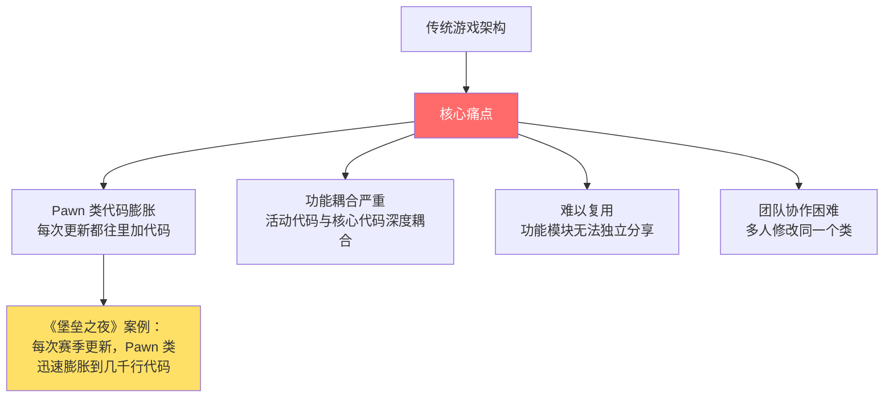

**具体表现**：
- **代码膨胀**：所有功能都往 Pawn/Character 类里加，一个类几千行
- **耦合严重**：节日活动代码和核心玩法代码耦合，无法动态开关
- **难以复用**：想在其他项目用某个功能，只能复制粘贴代码
- **协作困难**：团队成员都要修改核心类，容易冲突

### 2.2 GameFeature 架构演进

UE 的游戏架构经历了以下演进历程：

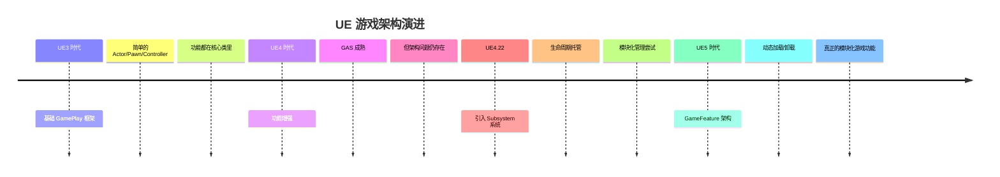

**关键里程碑**：
- **UE4.22**：Subsystem 系统引入，提供生命周期托管
- **UE5**：GameFeature 架构正式推出，支持运行时动态加载/卸载

### 2.3 GameFeature 核心机制

#### 核心概念

| 概念 | 说明 |
|------|------|
| **GameFeaturePlugin** | 特殊插件，放在 `Plugins/GameFeatures/` 目录 |
| **GameFeatureData** | 定义要执行的操作列表（Actions） |
| **GameFeatureAction** | 具体操作：AddComponent、AddAbilities、AddInputBinding、AddWidget |

#### GameFeatureData 配置

每个 GameFeature 插件必须有一个同名的 GameFeatureData 资产，定义激活时要执行的操作：

```cpp
// 内置 GameFeatureAction 类型
UCLASS()
class UGameFeatureAction_AddComponents : public UGameFeatureAction
{
    // 向 Actor 添加组件
    TArray<FGameFeatureComponentEntry> ComponentList;
};

UCLASS()
class UGameFeatureAction_AddAbilities : public UGameFeatureAction
{
    // 添加 GameplayAbility
    TArray<TSoftClassPtr<UGameplayAbility>> AbilitiesToGrant;
};

UCLASS()
class UGameFeatureAction_AddInputBinding : public UGameFeatureAction
{
    // 添加输入绑定
    TArray<FInputConfig> InputConfigs;
};
```

#### 生命周期

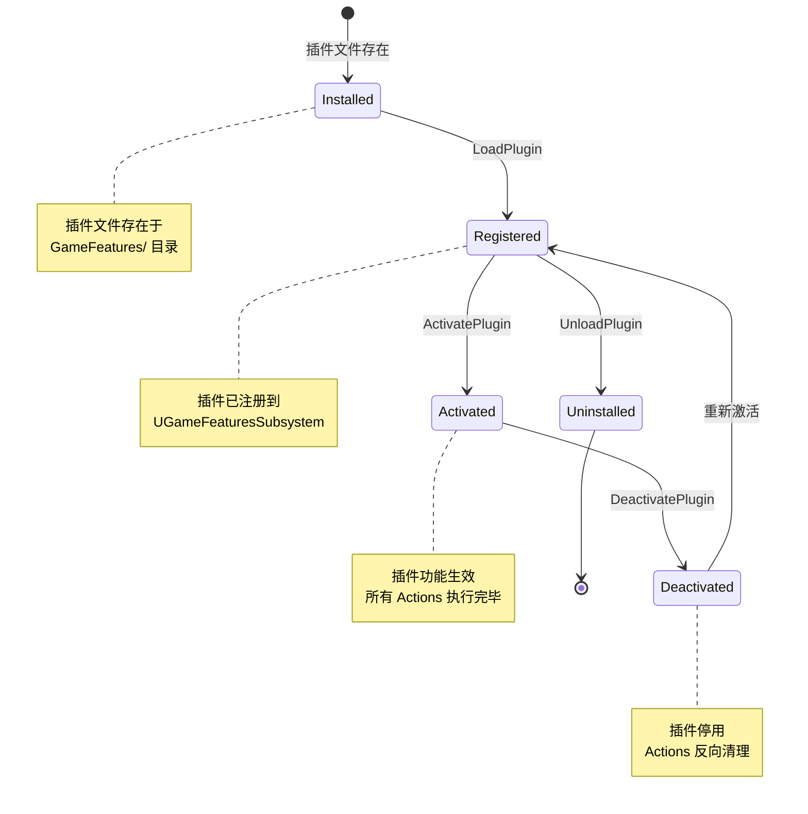

**状态说明**：
1. **Installed**：插件文件存在，但未加载
2. **Registered**：插件已注册到 `UGameFeaturesSubsystem`，模块加载
3. **Activated**：插件激活，所有 Actions 执行完毕，功能生效
4. **Deactivated**：插件停用，所有 Actions 反向清理

### 2.4 加载流程

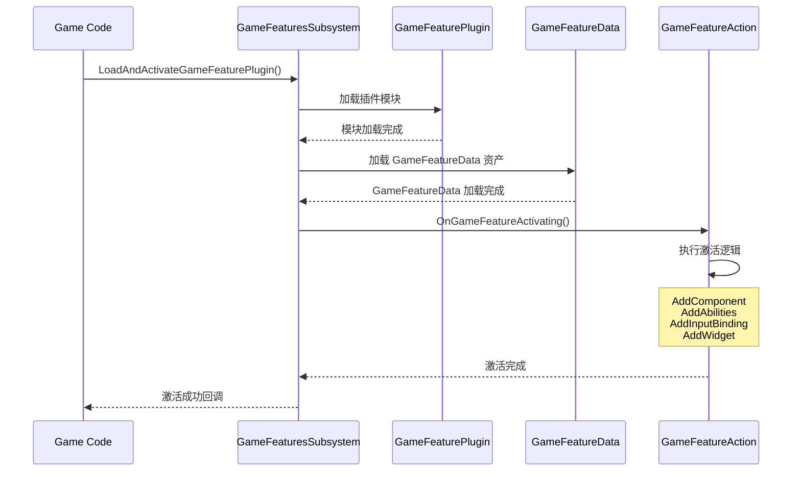

**关键 API**（C++）：
```cpp
// 加载并激活 GameFeature
UGameFeaturesSubsystem::Get().LoadAndActivateGameFeaturePlugin(
    TEXT("ShooterCore"),
    FGameFeaturePluginLoadComplete::CreateLambda([](const UE::GameFeatures::FResult& Result){
        if (Result.HasValue())
            UE_LOG(LogTemp, Log, TEXT("GameFeature 激活成功！"));
        else
            UE_LOG(LogTemp, Error, TEXT("GameFeature 激活失败：%s"), *Result.GetError());
    })
);

// 停用 GameFeature
UGameFeaturesSubsystem::Get().DeactivateGameFeaturePlugin(TEXT("ShooterCore"));
```

**控制台命令**：
```
LoadGameFeaturePlugin ShooterCore
UnloadGameFeaturePlugin ShooterCore
```

---

## 3. Modular Gameplay 框架

### 3.1 核心理念：组合优于继承

#### 传统方式的问题

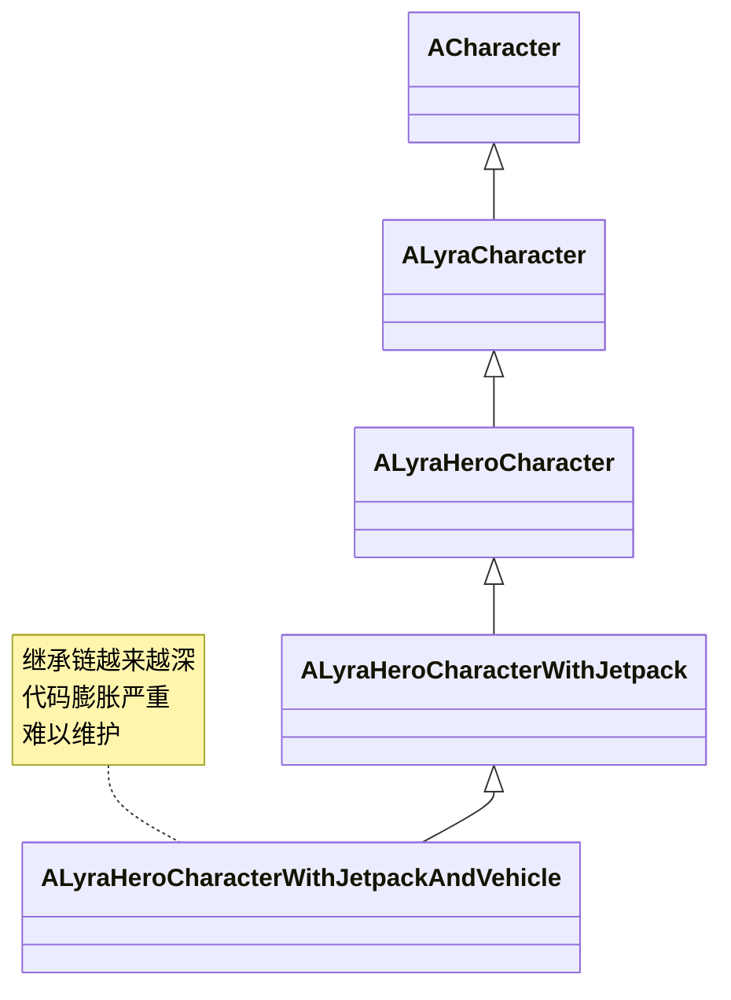

**传统方式痛点**：
- 每加一个功能就要继承出新类
- 继承链越来越深，代码膨胀
- 功能难以复用（不能把 Jetpack 功能单独拿出来用）
- 修改基类影响所有子类

#### Modular 方式的优势

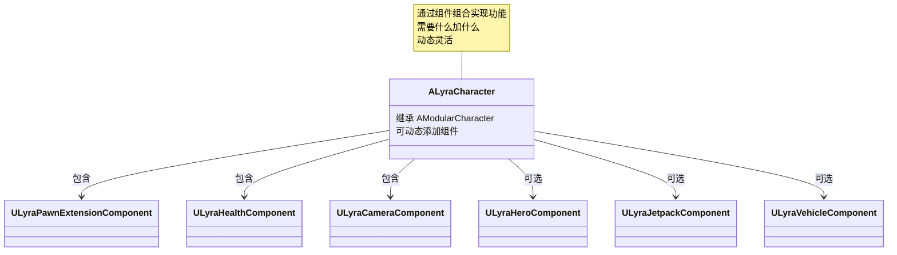

**Modular 方式优势**：
- **组合优于继承**：需要什么功能就加什么组件
- **功能解耦**：每个组件独立开发、测试、维护
- **动态组装**：运行时动态添加/移除组件
- **易于复用**：组件可以在多个 Pawn 之间复用

### 3.2 ModularCharacter / ModularGameMode / ModularGameState

UE5 提供了三个 Modular 基类：

#### AModularCharacter

```cpp
UCLASS()
class AModularCharacter : public ACharacter
{
    // 支持动态添加 Pawn Components
    TArray<UPawnComponent*> PawnComponents;
    
    // 注册为 Receiver，接收 GameFeature 添加的组件
    void RegisterComponentInitCallback(...);
};
```

**Lyra 中的使用**：
```cpp
UCLASS()
class ALyraCharacter : public AModularCharacter, 
                      public IAbilitySystemInterface, 
                      public IGameplayCueInterface
{
    // Lyra 角色基类，支持动态添加组件
};
```

#### AModularGameMode

```cpp
UCLASS()
class AModularGameModeBase : public AGameModeBase
{
    // 支持动态加载 GameFeature
    // 管理 Game Mode Components
};
```

**Lyra 中的使用**：
```cpp
UCLASS()
class ALyraGameMode : public AModularGameModeBase
{
    // 负责加载 Experience、管理游戏流程
};
```

#### AModularGameState

```cpp
UCLASS()
class AModularGameStateBase : public AGameStateBase
{
    // 支持动态注册 Game State Components
    // 管理全局游戏状态
};
```

**Lyra 中的使用**：
```cpp
UCLASS()
class ALyraGameState : public AModularGameStateBase, 
                       public IAbilitySystemInterface
{
    // 包含 ULyraExperienceManagerComponent
};
```

### 3.3 Pawn Component 生命周期

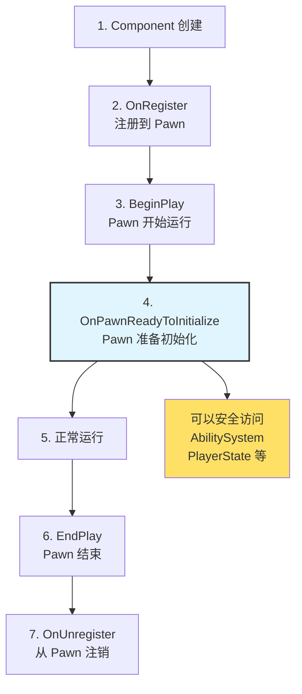

**关键回调**（ULyraPawnExtensionComponent 提供）：
```cpp
UCLASS()
class ULyraPawnExtensionComponent : public UPawnComponent
{
    // Pawn 准备初始化时调用（可以安全访问 AbilitySystem、PlayerState）
    virtual void OnPawnReadyToInitialize();
    
    // Controller 变化时调用
    virtual void HandleControllerChanged();
    
    // Player State 变化时调用
    virtual void HandlePlayerStateChanged();
    
    // Input 配置变化时调用
    virtual void HandleInputConfigChanged();
};
```

**为什么需要 OnPawnReadyToInitialize？**

在 `BeginPlay()` 时，Pawn 的 `AbilitySystemComponent`、`PlayerState` 等可能还未初始化完成。 `OnPawnReadyToInitialize()` 确保所有依赖都就绪后再执行初始化逻辑。

---

## 4. GameFeature + Modular Gameplay 协同工作（核心）

### 4.1 协同机制

GameFeature 的 `AddComponent` Action 需要配合 Modular Gameplay 的 **Receiver 机制**才能工作：

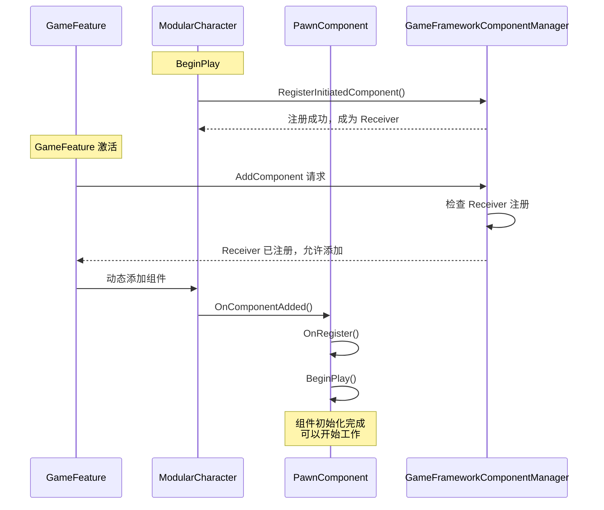

**关键步骤解析**：

1. **Actor 注册为 Receiver**（在 BeginPlay）：
   ```cpp
   // AModularCharacter 自动完成注册
   void AModularCharacter::BeginPlay()
   {
       Super::BeginPlay();
       
       // 注册为 Receiver
       UGameFrameworkComponentManager::GetForActor(this)->RegisterInitiatedComponent(
           this, 
           FComponentInitDelegate::CreateUObject(this, &ThisClass::OnComponentInitialized)
       );
   }
   ```

2. **GameFeature 激活时添加组件**：
   - GameFeature 的 `AddComponent` Action 通过 `GameFrameworkComponentManager` 添加组件
   - Manager 检查目标 Actor 是否注册为 Receiver
   - 如果已注册，则允许添加；否则忽略

3. **组件初始化**：
   - 组件添加后，会经历 `OnRegister()` → `BeginPlay()` → `OnPawnReadyToInitialize()`
   - 在 `OnPawnReadyToInitialize()` 中可以安全访问 Pawn 的所有功能

### 4.2 Lyra 中的实际协同（以 ShooterCore 为例）

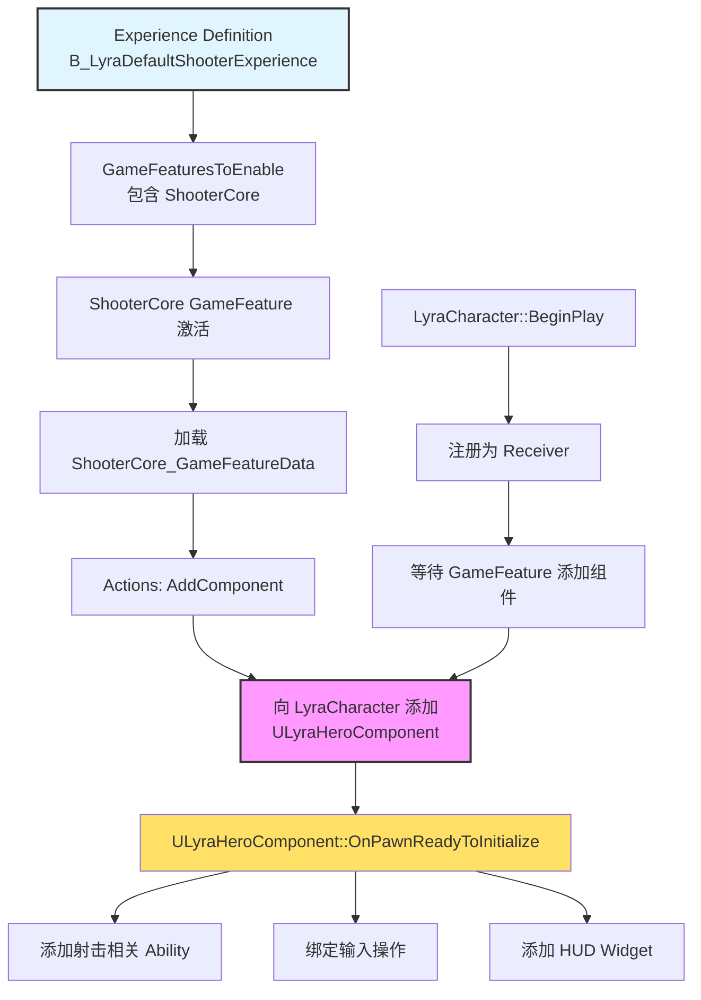

**详细流程**：

1. **Experience Definition** 启用 `ShooterCore`：
   ```cpp
   // ULyraExperienceDefinition
   TArray<FString> GameFeaturesToEnable;
   // 包含 "ShooterCore"
   ```

2. **LyraGameMode** 加载 Experience 时，自动激活 `ShooterCore`

3. **ShooterCore** 的 GameFeatureData 配置 `AddComponent` Action：
   - 目标 Actor 类：`ALyraCharacter`
   - 要添加的组件：`ULyraHeroComponent`

4. **LyraCharacter** 在 BeginPlay 注册为 Receiver：
   - `AModularCharacter` 自动完成注册
   - 可以接收 GameFeature 动态添加的组件

5. **GameFeature 激活**时，动态添加 `ULyraHeroComponent`

6. **ULyraHeroComponent** 初始化后：
   - 添加射击相关 Ability（射击、换弹、瞄准）
   - 绑定输入操作（鼠标左键射击、R 换弹等）
   - 添加 HUD Widget（准星、弹药计数）

---

## 5. Lyra 中的 GameFeature 实践

### 5.1 插件列表

Lyra 项目在 `Plugins/GameFeatures/` 目录下提供了多个 GameFeature 插件：

| 插件名称 | 路径 | 功能描述 | 依赖 |
|---------|------|---------|------|
| **ShooterCore** | `Plugins/GameFeatures/ShooterCore/` | 射击游戏核心玩法（武器、射击、换弹等） | - |
| **TopDownArena** | `Plugins/GameFeatures/TopDownArena/` | 俯视角竞技场模式 | ShooterCore |
| **ShooterExplorer** | `Plugins/GameFeatures/ShooterExplorer/` | 射击+探索混合模式（库存系统） | ShooterCore |
| **ShooterMaps** | `Plugins/GameFeatures/ShooterMaps/` | 射击游戏地图资源 | ShooterCore |
| **ShooterTests** | `Plugins/GameFeatures/ShooterTests/` | 自动化测试套件 | ShooterCore |

**插件与 Experience 的对应关系**：

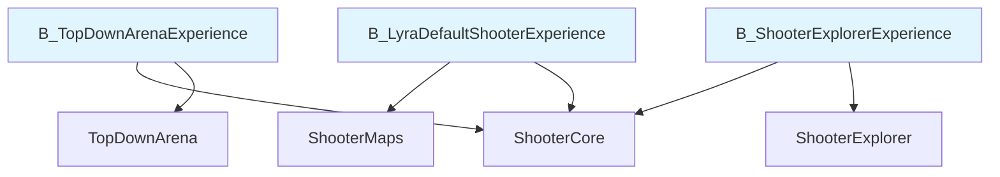

### 5.2 动态加载流程实例（以 TopDownArena 为例）

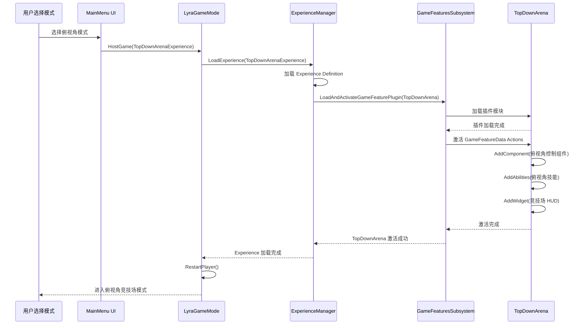

**关键步骤**：

1. **用户选择俯视角模式**：通过 UI 触发 `HostGame(TopDownArenaExperience)`

2. **LyraGameMode** 调用 `ExperienceManager` 加载 Experience`

3. **ExperienceManager** 读取 `TopDownArenaExperience` 的 `GameFeaturesToEnable` 列表
   - 包含 `TopDownArena` 和 `ShooterCore`

4. **GameFeaturesSubsystem** 依次激活这些插件`

5. **TopDownArena** 激活时，执行 GameFeatureData 中的 Actions：
   - `AddComponent`：添加俯视角控制组件
   - `AddAbilities`：添加俯视角技能（移动、射击等）
   - `AddWidget`：添加竞技场 HUD（小地图、分数等）

6. **Experience 加载完成**，`LyraGameMode` 重启 Player，进入游戏`

---

## 6. 最佳实践与常见陷阱

### 6.1 最佳实践

#### 1. 合理划分 GameFeature

- **单一职责**：每个 GameFeature 只负责一个独立功能
  - ✅ 好的划分：`ShooterCore`（射击核心）、`TopDownArena`（俯视角控制）
  - ❌ 坏的划分：`GameplayFeatures`（包含所有玩法功能）

- **低耦合**：避免 GameFeature 之间的相互依赖
  - 如果必须依赖，明确声明依赖

<!-- nav:auto -->

---

**导航**: ← [[30-tutorials/lyra-practical/02-ExperienceSystem详解|02-ExperienceSystem详解]] · [[30-tutorials/lyra-practical/04-Pawn与组件系统|04-Pawn与组件系统]] →

<!-- /nav:auto -->
