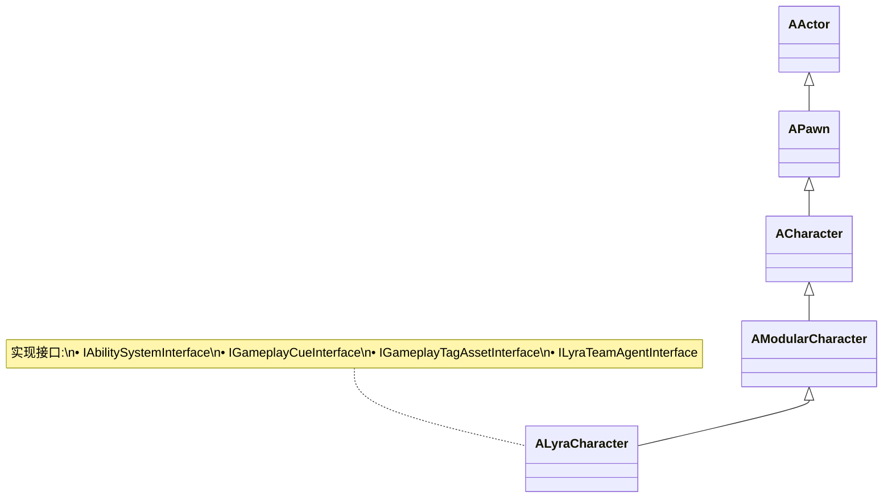
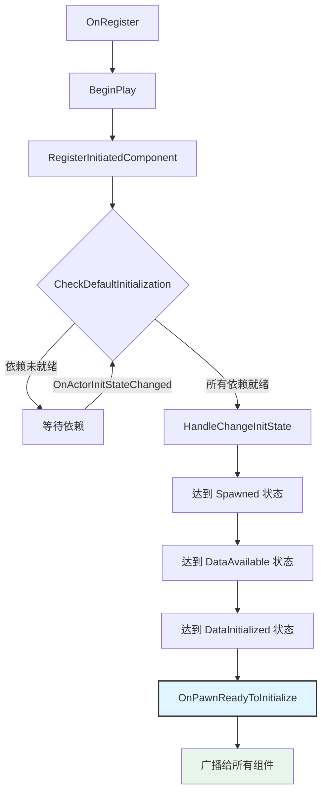
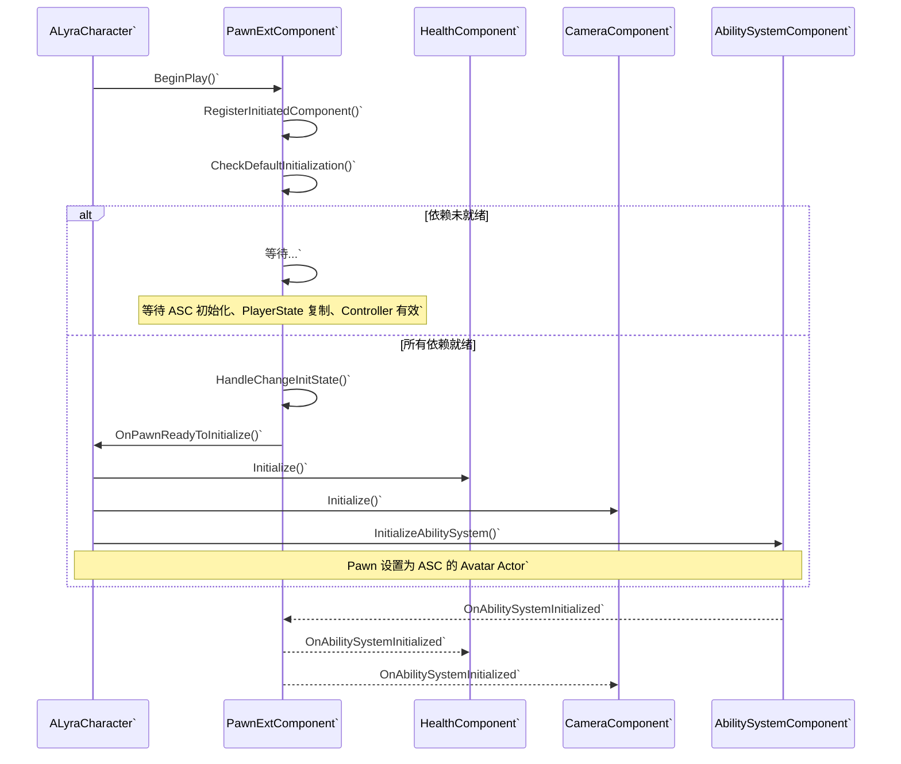

# Pawn与组件系统

> 深入理解 Lyra 的 Pawn 设计哲学：如何通过组件协调初始化，以及 ALyraCharacter 与 ULyraPawnExtensionComponent 的协作机制。

## 1. 概述

本课将深入剖析 Lyra 的 Pawn 设计架构，重点理解：

- **ALyraCharacter** 如何通过组件组合而非继承来扩展功能
- **ULyraPawnExtensionComponent** 如何协调各个 Pawn 组件的初始化生命周期
- Lyra 的 **初始化状态管理** 机制（基于 `IGameFrameworkInitStateInterface`）
- 从 `GameMode` 到 `Pawn` 再到各个组件的完整初始化流程

学完本课后，你将能够：
- 理解 Lyra Pawn 的组件化设计思想
- 掌握 Pawn 组件的初始化协调机制
- 知道如何添加自定义 Pawn 组件并正确集成到初始化流程
- 理解网络复制优化的实现方式

---

## 2. ALyraCharacter 详解

### 2.1 继承关系与接口实现

`ALyraCharacter` 的继承链设计体现了 Lyra 的模块化哲学：



**源码验证** (`Source/LyraGame/Character/LyraCharacter.h:97-98`)：

```cpp
// 文件：Source/LyraGame/Character/LyraCharacter.h:97-98
UCLASS(MinimalAPI, Config = Game, Meta = (ShortTooltip = "The base character pawn class used by this project."))
class ALyraCharacter : public AModularCharacter, 
                      public IAbilitySystemInterface, 
                      public IGameplayCueInterface, 
                      public IGameplayTagAssetInterface, 
                      public ILyraTeamAgentInterface
{
    GENERATED_BODY()
```

**设计要点**：
- 继承 `AModularCharacter`：获得模块化组件支持
- 实现 4 个接口：将职责委托给组件，自身只做协调

### 2.2 关键职责

`ALyraCharacter` 的核心设计理念是 **"发送事件到各个 Pawn 组件，不直接实现功能"**。

| 职责 | 说明 | 实现方式 |
|------|------|----------|
| **实现 Ability System 接口** | 提供 `GetAbilitySystemComponent()` 供 GAS 查询 | 转发给 `ULyraPawnExtensionComponent` |
| **实现 GameplayCue 接口** | 处理受击特效、声音等视觉反馈 | 转发给 `ULyraHealthComponent` |
| **管理复制的加速度数据** | 使用 `FLyraReplicatedAcceleration` 压缩网络带宽 | `FastSharedReplication` |
| **处理死亡序列** | `OnDeathStarted()` / `OnDeathFinished()` | 禁用碰撞、停止移动、分离 Controller |
| **团队管理** | 实现 `ILyraTeamAgentInterface` | 复制 `MyTeamID` 并广播变化 |

---

## 3. ULyraPawnExtensionComponent 详解

### 3.1 核心职责

`ULyraPawnExtensionComponent` 是 Pawn 初始化的 **协调中心**，负责：

1. **实现 `IGameFrameworkInitStateInterface`**
   - 定义初始化状态机
   - 协调其他组件的初始化顺序

2. **复制 PawnData**
   - `PawnData` 定义 Pawn 的属性（从 Experience 加载）
   - 在 Server 和 Client 之间复制

3. **缓存当前 ASC**
   - 提供 `GetLyraAbilitySystemComponent()` 快捷访问
   - 管理 Pawn 与 ASC 的 Avatar 关系

4. **广播初始化事件**
   - `OnPawnReadyToInitialize`：所有依赖就绪时广播给所有组件
   
**源码验证** (`Source/LyraGame/Character/LyraPawnExtensionComponent.h:26-28`)：

```cpp
// 文件：Source/LyraGame/Character/LyraPawnExtensionComponent.h:26-28
UCLASS(MinimalAPI)
class ULyraPawnExtensionComponent : public UPawnComponent, 
                                    public IGameFrameworkInitStateInterface
{
    GENERATED_BODY()
```

### 3.2 初始化流程

`ULyraPawnExtensionComponent` 的初始化是一个精心设计的状如机：



**关键状态**：
1. `Spawned`：Actor 已生成
2. `DataAvailable`：PawnData 已复制
3. `DataInitialized`：PawnData 已应用
4. `PawnReady`：所有组件初始化完成

---

## 4. Pawn 组件架构

### 4.1 组件列表与职责

Lyra 的 Pawn 功能被拆分成多个专门的组件：

| 组件 | 职责 | 初始化时机 |
|------|------|-----------|
| `ULyraPawnExtensionComponent` | 初始化协调、PawnData 管理 | `BeginPlay` |
| `ULyraHealthComponent` | 生命值管理、死亡处理 | `OnPawnReadyToInitialize` |
| `ULyraCameraComponent` | 相机控制、视角管理 | `OnPawnReadyToInitialize` |
| `ULyraAbilitySystemComponent` | GAS 核心 | `OnPawnReadyToInitialize` |
| `ULyraHeroComponent` | 英雄特有功能（仅 Hero） | `OnPawnReadyToInitialize` |
| `ULyraEquipmentManagerComponent` | 装备管理 | `OnPawnReadyToInitialize` |
| `ULyraInventoryManagerComponent` | 背包管理 | `OnPawnReadyToInitialize` |

**设计优势**：
- **单一职责**：每个组件只负责一个功能领域
- **可组合**：不同 Pawn 类型可以组合不同组件
- **可测试**：组件可以独立测试
- **网络友好**：每个组件管理自己的复制逻辑

### 4.2 组件生命周期



---

## 5. Lyra 中的实际初始化流程（完整）

### 5.1 从 GameMode 到 Pawn 到组件`

这是 Lyra 中最完整的初始化序列：

```mermaid
flowchart TD
    A[ALyraGameMode::Login] --> B[LoadExperience]`
    B --> C{Experience 加载完成?}`
    C -->|No| B`
    C -->|Yes| D[PostLogin]`
    D --> E[GetDefaultPawnClassForController]`
    E --> F[Spawn Pawn]`
    F --> G[Pawn::BeginPlay]`
    G --> H[PawnExtComponent::BeginPlay]`
    H --> I[RegisterInitiatedComponent]`
    I --> J[OnActorInitStateChanged]`
    J --> K{CheckDefaultInitialization}`
    K -->|依赖未就绪| L[等待依赖变化]`
    L --> J`
    K -->|所有依赖就绪| M[HandleChangeInitState]`
    M --> N[达到 DataInitialized 状态]`
    N --> O[OnPawnReadyToInitialize]`
    O --> P[所有组件初始化]`
    P --> Q[Pawn 就绪]`
```

**详细步骤**：

#### Step 1: ALyraGameMode::Login()
- 玩家登录，创建 `PlayerController`
- 开始加载 Experience`

#### Step 2: LoadExperience()
- 从 `ULyraExperienceManagerComponent` 加载 Experience`
- Experience 定义游戏模式、PawnData、InputConfig 等`

#### Step 3: Experience 加载完成 → PostLogin()
- Experience 加载完成后，调用 `PostLogin()`
- 确定默认的 Pawn 类`

#### Step 4: GetDefaultPawnClassForController() → Spawn Pawn`
- 根据 Experience 中的 `DefaultPawnData` 确定 Pawn 类`
- 生成 Pawn Actor`

#### Step 5: Pawn::BeginPlay() → PawnExtComponent::BeginPlay()`
- Pawn 的 `BeginPlay()` 调用`
- `PawnExtComponent::BeginPlay()` 注册到 `UGameFrameworkComponentManager``

#### Step 6: RegisterInitiatedComponent()`
- 向 Component Manager 注册自己`
- 开始监听其他组件的初始化状态变化`

#### Step 7: OnPawnReadyToInitialize() → 所有组件初始化`
- 所有依赖就绪后，调用 `OnPawnReadyToInitialize()`
- 广播给所有监听的组件，它们开始自己的初始化`

### 5.2 关键依赖管理`

`ULyraPawnExtensionComponent` 在 `CanChangeInitState()` 中检查依赖：

**依赖清单**：
1. **ASC 初始化完成**：Ability System Component 必须已初始化`
2. **PlayerState 复制完成**：Client 端必须已收到 PlayerState`
3. **Controller 有效**：Pawn 必须有有效的 Controller`

**源码逻辑** (`LyraPawnExtensionComponent.cpp`)：

```cpp
bool ULyraPawnExtensionComponent::CanChangeInitState(
    UGameFrameworkComponentManager* Manager,
    FGameplayTag CurrentState,
    FGameplayTag DesiredState) const
{
    // 检查依赖...
    if (DesiredState == LyraGameplayTags::InitState_DataInitialized)
    {
        // 必须有权有效的 Controller`
        if (!GetController())
            return false;`
            
        // 必须有 PlayerState (Client 端已复制)`
        if (!GetPlayerState())
            return false;`
            
        // 必须有有效的 ASC`
        if (!AbilitySystemComponent)
            return false;`
    }
    
    return true;`
}
```

只有 **所有依赖就绪**，`CheckDefaultInitialization()` 才会继续推进到下一个状态，最终广播 `OnPawnReadyToInitialize()`。

---

## 6. 总结与要点`

| 要点 | 说明 |
|------|------|
| **组件化设计** | ALyraCharacter 不直接实现功能，而是协调各个 Pawn 组件 |
| **初始化协调** | ULyraPawnExtensionComponent 通过 IGameFrameworkInitStateInterface 管理初始化状态机 |
| **依赖管理** | 只有 ASC、PlayerState、Controller 都就绪后才广播初始化事件 |
| **网络优化** | FLyraReplicatedAcceleration 和 FSharedRepMovement 优化带宽 |
| **可扩展性** | 添加新功能时，创建新组件并在 OnPawnReadyToInitialize 中初始化 |

**核心设计模式**：
- **委托模式**：ALyraCharacter 将具体功能委托给组件`
- **状态机模式**：初始化流程通过 InitState 管理`
- **观察者模式**：组件通过委托监听初始化事件`

---

## 7. 相关页面`

### 内部链接`

- [[30-tutorials/modular-gameplay/01-ModularGameplay是什么]] - 模块化游戏玩法架构`
- [[30-tutorials/lyra-practical/03-GameFeature与ModularGameplay模块化架构]] - 上一课：GameFeature 与 Modular GamePlay`
- [[30-tutorials/lyra-practical/05-Lyra中的GAS集成]] - 下一课：GAS 集成详解`

### 外部参考`

- [Unreal Engine 5 - Modular Gameplay](https://docs.unrealengine.com/5.0/en-US/modular-gameplay-in-unreal-engine/)
- [Game Framework Component Manager](https://docs.unrealengine.com/5.0/en-US/API/Plugins/ModularGameplay/IGameFrameworkInitStateInterface/)

---

> 最后更新：2026-05-19`
`);

<!-- nav:auto -->

---

**导航**: ← [[30-tutorials/lyra-practical/03-GameFeature与ModularGameplay模块化架构|03-GameFeature与ModularGameplay模块化架构]] · [[30-tutorials/lyra-practical/05-Lyra中的GAS集成|05-Lyra中的GAS集成]] →

<!-- /nav:auto -->
