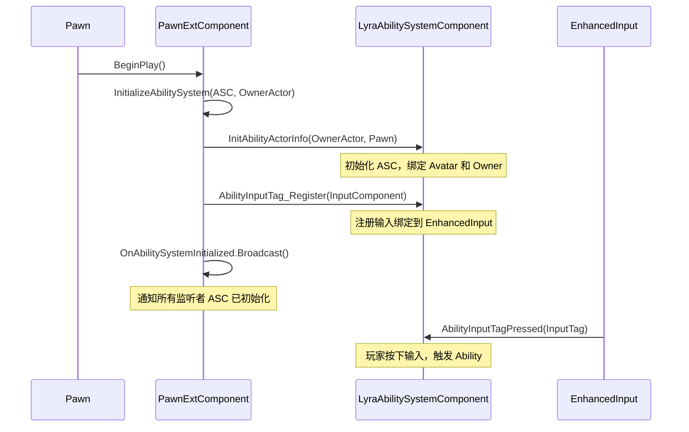
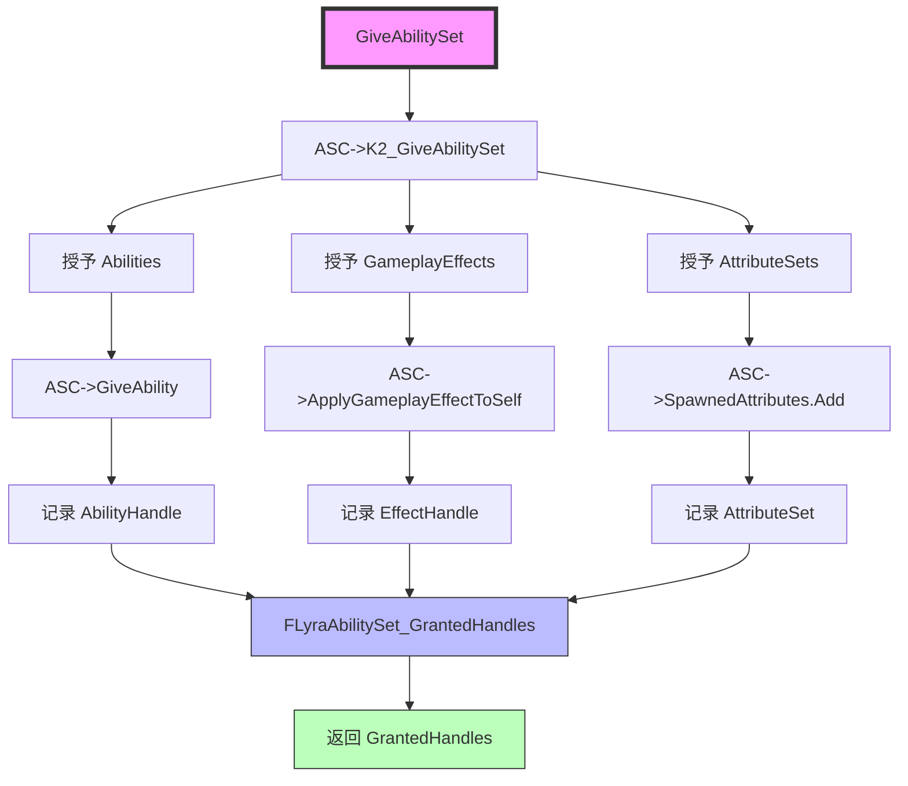
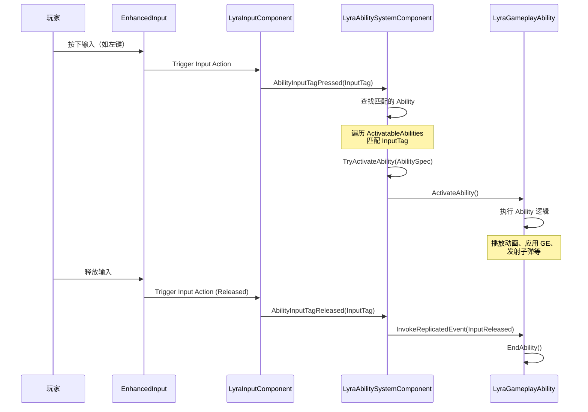

# Lyra中的GAS集成

> **Lyra Practical 系列教程 - 第 5 课**
>
> 本课程深入讲解 Lyra 如何扩展和集成 Unreal Engine 的 Gameplay Ability System (GAS)，包括 Lyra 自定义的 Ability System Component、Ability 授予流程、以及创新的 InputTag 驱动机制。

## 概述

本课程将带你理解 Lyra 对 GAS 的深度扩展和定制化集成。学完本课程后，你将能够：

- **理解 Lyra 的 GAS 架构**：了解 `ULyraAbilitySystemComponent` 和 `ULyraGameplayAbility` 如何扩展基础 GAS
- **掌握 ASC 初始化流程**：理解从 Pawn 初始化到 Ability 可用的完整链路
- **使用 AbilitySet 管理 Ability**：学会数据驱动的 Ability 授予和回收机制
- **实现 InputTag 驱动 Ability**：掌握 Lyra 创新的输入系统，用 GameplayTag 替代传统 InputID
- **应用最佳实践**：在自己的项目中正确使用 Lyra 的 GAS 扩展

**先修知识**：
- [[30-tutorials/lyra-practical/04-Pawn与组件系统]] - Lyra Pawn 与组件系统
- [[30-tutorials/gas/00-GAS系统总览]] - GAS 系统总览

## 1. Lyra 对 GAS 的扩展

Lyra 没有直接使用 UE 原生的 GAS 类，而是进行了深度扩展，以适应其数据驱动、模块化的架构设计。

### 1.1 ULyraAbilitySystemComponent（Lyra ASC）

**继承自**：`UAbilitySystemComponent`

`ULyraAbilitySystemComponent` 是 Lyra 自定义的 Ability System Component，位于 `Source/LyraGame/AbilitySystem/LyraAbilitySystemComponent.h`。

**关键扩展功能**：

| 功能 | 说明 | 优势 |
|------|------|------|
| **InputTag 驱动** | 使用 `FGameplayTag` 替代传统 `InputID` | 数据驱动、灵活配置、支持动态切换 |
| **激活组（Activation Group）** | 批量管理 Ability 生命周期 | 避免冲突、统一管理 |
| **Ability 失败通知** | `ClientNotifyAbilityFailed` | UI 可以显示为什么无法激活 |
| **TargetData 访问** | `GetAbilityTargetData` | 获取 Ability 命中的目标信息 |
| **动态 Tag 管理** | `AddDynamicTagGameplayEffect` | 运行时动态添加/移除 Tag |

**核心方法**（需源码验证）：

```cpp
// Source/LyraGame/AbilitySystem/LyraAbilitySystemComponent.h

UCLASS()
class ULyraAbilitySystemComponent : public UAbilitySystemComponent
{
    // InputTag 按下/释放处理
    void AbilityInputTagPressed(const FGameplayTag& InputTag);
    void AbilityInputTagReleased(const FGameplayTag& InputTag);
    
    // 注册输入绑定
    void AbilityInputTag_Register(UInputComponent* InputComponent);
    
    // 激活组管理
    bool IsActivationGroupBlocked(ELyraAbilityActivationGroup Group) const;
    void AddAbilityToActivationGroup(ELyraAbilityActivationGroup Group, 
                                    ULyraGameplayAbility* LyraAbility);
    void RemoveAbilityFromActivationGroup(ELyraAbilityActivationGroup Group,
                                        ULyraGameplayAbility* LyraAbility);
    
    // Ability 失败通知
    UFUNCTION(Client, Unreliable)
    void ClientNotifyAbilityFailed(const UGameplayAbility* Ability, 
                                  const FGameplayTagContainer& FailureTags);
    
    // TargetData 访问
    FGameplayAbilityTargetDataHandle GetAbilityTargetData(
        const FGameplayAbilitySpecHandle& AbilityHandle,
        const FPredictionKey& ActivationKey) const;
    
    // 动态 Tag 管理
    void AddDynamicTagGameplayEffect(const FGameplayTag& Tag);
    void RemoveDynamicTagGameplayEffect(const FGameplayTag& Tag);
};
```

**网络复制优化**：
- 禁用 `bReplicateInputDirectly`，使用 `InvokeReplicatedEvent` 同步输入事件
- `ProcessAbilityInput` 每帧处理输入集合，调用 `TryActivateAbility`
- 支持 `WaitInputPress`/`WaitInputRelease` 的跨网络同步

---

### 1.2 ULyraGameplayAbility（Lyra GA 基类）

**继承自**：`UGameplayAbility`

`ULyraGameplayAbility` 是 Lyra 所有 Gameplay Ability 的基类，位于 `Source/LyraGame/AbilitySystem/Abilities/LyraGameplayAbility.h`。

**关键扩展功能**：

| 功能 | 说明 | 用途 |
|------|------|------|
| **封装 Lyra 对象** | 提供 `GetLyraController`、`GetLyraCharacter` 等 | 方便访问 Lyra 特定接口 |
| **激活策略** | `ActivationPolicy`（OnInputTriggered、OnSpawn、OnGranted） | 控制 Ability 何时激活 |
| **激活组** | `ActivationGroup`（Combat、Ability等） | 与 ASC 配合管理生命周期 |
| **相机模式集成** | `SetCameraMode`、`ClearCameraMode` | Ability 可以切换相机模式 |
| **动画支持** | 等待动画完成、播放 Montage | 与 Lyra 动画系统无缝集成 |

**核心属性**（需源码验证）：

```cpp
// Source/LyraGame/AbilitySystem/Abilities/LyraGameplayAbility.h

UCLASS()
class ULyraGameplayAbility : public UGameplayAbility
{
    // === 激活策略 ===
    UPROPERTY(EditDefaultsOnly, Category = "Lyra|Ability Activation")
    ELyraAbilityActivationPolicy ActivationPolicy;
    
    // === 激活组 ===
    UPROPERTY(EditDefaultsOnly, Category = "Lyra|Ability Activation")
    ELyraAbilityActivationGroup ActivationGroup;
    
    // === Input Tag ===
    UPROPERTY(EditDefaultsOnly, Category = "Lyra|Input")
    FGameplayTag InputTag;
    
    // === 相机模式 ===
    UPROPERTY(EditDefaultsOnly, Category = "Lyra|Camera")
    TSubclassOf<ULyraCameraMode> CameraMode;
    
    // === 便捷访问方法 ===
    ALyraPlayerController* GetLyraPlayerController() const;
    ALyraCharacter* GetLyraCharacter() const;
    ULyraAbilitySystemComponent* GetLyraAbilitySystemComponent() const;
    
    // === 相机模式管理 ===
    void SetCameraMode(TSubclassOf<ULyraCameraMode> CameraMode);
    void ClearCameraMode();
    
    // === 激活策略处理 ===
    virtual void OnAvatarSet(const FGameplayAbilityActorInfo* ActorInfo,
                            const FGameplayAbilitySpec& Spec) override;
};
```

**激活策略详解**：

```cpp
// 激活策略枚举（需源码验证）
UENUM(BlueprintType)
enum class ELyraAbilityActivationPolicy : uint8
{
    OnInputTriggered      // 输入触发时激活（如射击、跳跃）
    OnSpawn               // Spawn 时立即激活（如被动技能）
    OnGranted             // 授予时立即激活（如装备技能）
};
```

**激活组详解**：

```cpp
// 激活组枚举（需源码验证）
UENUM(BlueprintType)
enum class ELyraAbilityActivationGroup : uint8
{
    Combat      // 战斗 Ability（射击、换弹、技能）
    Ability     // 非战斗 Ability（跑步、跳跃）
    Replaceable // 可被替换的 Ability
    Independent // 独立 Ability（不受组管理）
};
```

---

## 2. ASC 初始化完整流程

理解 ASC 初始化流程是掌握 Lyra GAS 集成的关键。Lyra 通过 `ULyraPawnExtensionComponent` 管理 ASC 的初始化。

### 2.1 初始化链（序列图）



**详细步骤说明**：

1. **Pawn::BeginPlay()**
   - Pawn 开始播放时触发
   - 调用 `ULyraPawnExtensionComponent::BeginPlay()`

2. **PawnExtComponent::InitializeAbilitySystem()**
   - 接收 ASC 和 OwnerActor 作为参数
   - 核心初始化逻辑所在

3. **ASC::InitAbilityActorInfo()**
   - 绑定 `OwnerActor`（通常是 PlayerState 或 Pawn）
   - 绑定 `AvatarActor`（通常是 Pawn）
   - 初始化 Ability 容器、Effect 容器等

4. **ASC::AbilityInputTag_Register()**
   - 注册 InputTag 到 EnhancedInput 系统
   - 建立 InputTag → Ability 的映射

5. **OnAbilitySystemInitialized.Broadcast()**
   - 广播 ASC 初始化完成事件
   - 触发后续的 AbilitySet 授予等逻辑

---

### 2.2 关键代码段（源码验证）

**ULyraPawnExtensionComponent::InitializeAbilitySystem()**（需源码验证）：

```cpp
// 文件：Source/LyraGame/Character/LyraPawnExtensionComponent.cpp

void ULyraPawnExtensionComponent::InitializeAbilitySystem(
    ULyraAbilitySystemComponent* InASC,
    AActor* InOwnerActor)
{
    // 1. 设置 ASC
    AbilitySystemComponent = InASC;
    
    // 2. 初始化 ASC（绑定 Owner 和 Avatar）
    AbilitySystemComponent->InitAbilityActorInfo(
        InOwnerActor,           // OwnerActor（通常是 PlayerState）
        GetOwnerPawn()          // AvatarActor（通常是 Pawn）
    );
    
    // 3. 注册输入绑定
    if (ULyraAbilitySystemComponent* LyraASC = 
        Cast<ULyraAbilitySystemComponent>(AbilitySystemComponent))
    {
        // 获取 InputComponent
        if (UInputComponent* PlayerInputComponent = 
            GetOwnerPawn()->FindComponentByClass<UInputComponent>())
        {
            LyraASC->AbilityInputTag_Register(PlayerInputComponent);
        }
    }
    
    // 4. 广播初始化完成事件
    OnAbilitySystemInitialized.Broadcast();
    
    // 5. 触发等待初始化的逻辑
    if (AActor* Owner = GetOwner())
    {
        Owner->ForceNetUpdate();
    }
}
```

**初始化时机**：

- **Server 端**：`APawn::PossessedBy()` → `BeginPlay()`
- **Client 端**：`APawn::OnRep_PlayerState()` → `BeginPlay()`

```cpp
// Server 端初始化
void ALyraCharacter::PossessedBy(AController* NewController)
{
    Super::PossessedBy(NewController);
    
    // 初始化 Ability System Component
    if (ULyraPawnExtensionComponent* PawnExt = 
        FindComponentByClass<ULyraPawnExtensionComponent>())
    {
        PawnExt->InitializeAbilitySystem(GetLyraAbilitySystemComponent(), this);
    }
}

// Client 端初始化
void ALyraCharacter::OnRep_PlayerState()
{
    Super::OnRep_PlayerState();
    
    // 初始化 Ability System Component
    if (ULyraPawnExtensionComponent* PawnExt = 
        FindComponentByClass<ULyraPawnExtensionComponent>())
    {
        PawnExt->InitializeAbilitySystem(GetLyraAbilitySystemComponent(), this);
    }
}
```

---

## 3. AbilitySet 授予与回收

Lyra 使用 **AbilitySet** 作为数据驱动的 Ability 管理方案，替代传统的硬编码授予方式。

### 3.1 ULyraAbilitySet（Ability 集合）

**继承自**：`UPrimaryDataAsset`

`ULyraAbilitySet` 是一个数据资产，用于定义一组 Ability、GameplayEffect 和 AttributeSet 的组合。位于 `Source/LyraGame/AbilitySystem/LyraAbilitySet.h`。

**核心结构**（需源码验证）：

```cpp
// Source/LyraGame/AbilitySystem/LyraAbilitySet.h

// === Ability 定义 ===
USTRUCT()
struct FLyraAbilitySet_GameplayAbility
{
    // Ability 类
    UPROPERTY(EditDefaultsOnly)
    TSubclassOf<ULyraGameplayAbility> Ability = nullptr;
    
    // Ability 等级
    UPROPERTY(EditDefaultsOnly)
    int32 AbilityLevel = 1;
    
    // 激活该 Ability 的 Input Tag
    UPROPERTY(EditDefaultsOnly, Meta = (Categories = "InputTag"))
    FGameplayTag InputTag;
    
    // 激活组
    UPROPERTY(EditDefaultsOnly)
    ELyraAbilityActivationGroup ActivationGroup;
};

// === Gameplay Effect 定义 ===
USTRUCT()
struct FLyraAbilitySet_GameplayEffect
{
    // Gameplay Effect 类
    UPROPERTY(EditDefaultsOnly)
    TSubclassOf<UGameplayEffect> GameplayEffect = nullptr;
    
    // Effect 等级
    UPROPERTY(EditDefaultsOnly)
    float EffectLevel = 1.0f;
};

// === Attribute Set 定义 ===
USTRUCT()
struct FLyraAbilitySet_AttributeSet
{
    // Attribute Set 类
    UPROPERTY(EditDefaultsOnly)
    TSubclassOf<UAttributeSet> AttributeSet;
};

// === AbilitySet 主类 ===
UCLASS()
class ULyraAbilitySet : public UPrimaryDataAsset
{
    GENERATED_BODY()
    
    // Abilities 列表
    UPROPERTY(EditDefaultsOnly, Category = "Gameplay Abilities")
    TArray<FLyraAbilitySet_GameplayAbility> Abilities;
    
    // Gameplay Effects 列表
    UPROPERTY(EditDefaultsOnly, Category = "Gameplay Effects")
    TArray<FLyraAbilitySet_GameplayEffect> GameplayEffects;
    
    // Attribute Sets 列表
    UPROPERTY(EditDefaultsOnly, Category = "Attribute Sets")
    TArray<FLyraAbilitySet_AttributeSet> AttributeSets;
};
```

**授予句柄（GrantedHandles）**：

```cpp
// 用于回收 AbilitySet 的句柄结构
USTRUCT()
struct FLyraAbilitySet_GrantedHandles
{
    // 授予的 Ability Handles
    UPROPERTY()
    TArray<FGameplayAbilitySpecHandle> AbilityHandles;
    
    // 激活的 Gameplay Effect Handles
    UPROPERTY()
    TArray<FActiveGameplayEffectHandle> EffectHandles;
    
    // Spawned Attribute Sets
    UPROPERTY()
    TArray<TObjectPtr<UAttributeSet>> AttributeSets;
    
    // 清空所有 Handles
    void Reset();
};
```

---

### 3.2 授予流程（流程图）



**授予流程详解**：

1. **调用 `GiveAbilitySet`**
   - 通常在 `ULyraHeroComponent::OnPawnReadyToInitialize()` 中调用
   - 从 `ULyraPawnData` 中读取 AbilitySets 列表

2. **ASC 处理授予**
   - `ASC->K2_GiveAbilitySet()` 或 `ASC->GiveAbilitySet()`
   - 遍历 AbilitySet 中的 Abilities、Effects、AttributeSets

3. **记录 GrantedHandles**
   - 将授予的 Ability、Effect、AttributeSet 的 Handle 记录到 `FLyraAbilitySet_GrantedHandles`
   - 用于后续的批量回收

4. **返回 GrantedHandles**
   - 调用者保存 GrantedHandles，以便在适当时机回收

**代码示例**（需源码验证）：

```cpp
// 在 ULyraHeroComponent 中授予 AbilitySet

void ULyraHeroComponent::OnPawnReadyToInitialize()
{
    if (ULyraAbilitySystemComponent* ASC = GetAbilitySystemComponent())
    {
        // 从 PawnData 中获取 AbilitySets
        if (ULyraPawnData* PawnData = GetPawnData())
        {
            for (ULyraAbilitySet* AbilitySet : PawnData->AbilitySets)
            {
                if (AbilitySet)
                {
                    // 授予 AbilitySet，并保存 GrantedHandles
                    FLyraAbilitySet_GrantedHandles GrantedHandles;
                    AbilitySet->GiveToAbilitySystem(ASC, &GrantedHandles);
                    
                    // 保存 GrantedHandles 以便后续回收
                    GrantedHandlesMap.Add(AbilitySet, GrantedHandles);
                }
            }
        }
    }
}
```

---

### 3.3 回收流程

回收 AbilitySet 时，使用保存的 `FLyraAbilitySet_GrantedHandles` 进行批量回收。

**回收流程**：

```cpp
// 回收 AbilitySet

void ULyraHeroComponent::UninitializeAbilitySystem()
{
    if (ULyraAbilitySystemComponent* ASC = GetAbilitySystemComponent())
    {
        // 遍历所有已授予的 AbilitySet
        for (auto& Pair : GrantedHandlesMap)
        {
            ULyraAbilitySet* AbilitySet = Pair.Key;
            FLyraAbilitySet_GrantedHandles& GrantedHandles = Pair.Value;
            
            // 回收 AbilitySet
            AbilitySet->RemoveFromAbilitySystem(ASC, &GrantedHandles);
        }
        
        GrantedHandlesMap.Empty();
    }
}
```

**`FLyraAbilitySet_GrantedHandles::Reset()` 实现**（需源码验证）：

```cpp
void FLyraAbilitySet_GrantedHandles::Reset()
{
    if (UAbilitySystemComponent* ASC = GetAbilitySystemComponent())
    {
        // 1. 移除授予的 Abilities
        for (FGameplayAbilitySpecHandle& AbilityHandle : AbilityHandles)
        {
            ASC->ClearAbility(AbilityHandle);
        }
        AbilityHandles.Empty();
        
        // 2. 移除激活的 Gameplay Effects
        for (FActiveGameplayEffectHandle& EffectHandle : EffectHandles)
        {
            ASC->RemoveActiveGameplayEffect(EffectHandle);
        }
        EffectHandles.Empty();
        
        // 3. 移除 Spawned Attribute Sets
        for (UAttributeSet* AttributeSet : AttributeSets)
        {
            ASC->GetSpawnedAttributes().Remove(AttributeSet);
        }
        AttributeSets.Empty();
    }
}
```

---

## 4. InputTag → Ability 激活（Lyra 的创新）

Lyra 引入了 **InputTag** 机制，使用 `FGameplayTag` 替代传统的 `InputID`，实现了数据驱动的 Ability 激活。

### 4.1 传统方式 vs Lyra 方式

| 对比项 | 传统 GAS 方式 | Lyra 的 InputTag 方式 |
|--------|--------------|----------------------|
| **输入标识** | `InputID`（整数） | `FGameplayTag`（标签） |
| **绑定方式** | 硬编码绑定到 Ability | 数据驱动，InputTag 匹配 |
| **灵活性** | 低，需要重新编译 | 高，可以在蓝图中配置 |
| **动态切换** | 不支持 | 支持，运行时可切换 InputConfig |
| **配置方式** | C++ 代码 | `ULyraInputConfig` 数据资产 |

**传统方式示例**：

```cpp
// 传统方式：使用 InputID
UCLASS()
class UMyGameplayAbility : public UGameplayAbility
{
    UPROPERTY(EditDefaultsOnly, Category = "Ability")
    int32 InputID;  // 需要手动管理 ID
};

// 绑定输入
void AMyCharacter::SetupPlayerInputComponent(UInputComponent* PlayerInputComponent)
{
    FInputActionKeyMapping FireMapping("Fire", EKeys::LeftMouseButton);
    PlayerInputComponent->AddActionMapping(FireMapping);
    
    // 绑定到 AbilitySystemComponent
    FInputActionBinding FireBinding("Fire", IE_Pressed);
    FireBinding.ActionDelegate.BindDelegate(this, &AMyCharacter::OnFirePressed);
}
```

**Lyra 方式示例**：

```cpp
// Lyra 方式：使用 InputTag
UCLASS()
class ULyraGameplayAbility : public UGameplayAbility
{
    UPROPERTY(EditDefaultsOnly, Category = "Ability|Input")
    FGameplayTag InputTag;  // 使用 Tag，灵活且可读
};

// InputConfig 配置（数据资产）
UCLASS()
class ULyraInputConfig : public UPrimaryDataAsset
{
    UPROPERTY(EditDefaultsOnly)
    TArray<FLyraInputAction> NativeInputActions;  // 原生输入
    
    UPROPERTY(EditDefaultsOnly, Meta = (Categories = "InputTag"))
    TArray<FGameplayTag> AbilityInputTags;  // Ability 输入 Tag
};

// 绑定输入（自动处理）
void ULyraAbilitySystemComponent::AbilityInputTag_Register(UInputComponent* InputComponent)
{
    // 自动注册 InputTag → Ability 映射
    // 无需硬编码
}
```

---

### 4.2 InputConfig 配置

`ULyraInputConfig` 是 Lyra 的输入配置文件，定义了 InputTag → Ability 的映射关系。

**ULyraInputConfig 结构**（需源码验证）：

```cpp
// Source/LyraGame/Input/LyraInputConfig.h

USTRUCT()
struct FLyraInputAction
{
    // Input Action（Enhanced Input）
    UPROPERTY(EditDefaultsOnly)
    const UInputAction* InputAction = nullptr;
    
    // 对应的 Gameplay Tag
    UPROPERTY(EditDefaultsOnly, Meta = (Categories = "InputTag"))
    FGameplayTag InputTag;
    
    // 是否是原生输入（非 Ability）
    UPROPERTY(EditDefaultsOnly)
    bool bIsNative = false;
};

UCLASS()
class ULyraInputConfig : public UPrimaryDataAsset
{
    GENERATED_BODY()
    
    // 原生输入 Actions（如移动、转向）
    UPROPERTY(EditDefaultsOnly, Category = "Input")
    TArray<FLyraInputAction> NativeInputActions;
    
    // Ability 输入 Tags（触发 Ability）
    UPROPERTY(EditDefaultsOnly, Category = "Input", 
              Meta = (Categories = "InputTag"))
    TArray<FGameplayTag> AbilityInputTags;
    
    // 查找 InputTag 对应的 Input Action
    const UInputAction* FindNativeInputActionForTag(
        const FGameplayTag& InputTag) const;
};
```

**在 PawnData 中配置 InputConfig**：

```cpp
// ULyraPawnData 中包含 InputConfig
UCLASS()
class ULyraPawnData : public UPrimaryDataAsset
{
    // Input Config
    UPROPERTY(EditDefaultsOnly, Category = "Input")
    TObjectPtr<ULyraInputConfig> InputConfig;
    
    // Ability Sets
    UPROPERTY(EditDefaultsOnly, Category = "Abilities")
    TArray<TObjectPtr<ULyraAbilitySet>> AbilitySets;
};
```

**InputConfig 数据资产配置示例**：

```
ULyraInputData_Hero (ULyraInputConfig)
├── NativeInputActions
│   ├── Move (InputTag: InputTag.Move)
│   ├── Look (InputTag: InputTag.Look)
│   └── Jump (InputTag: InputTag.Jump)
├── AbilityInputTags
│   ├── InputTag.Ability.Fire (对应 GA_Shoot)
│   ├── InputTag.Ability.Reload (对应 GA_Reload)
│   └── InputTag.Ability.Sprint (对应 GA_Sprint)
```

---

### 4.3 激活流程（序列图）



**详细流程说明**：

1. **玩家按下输入**
   - 硬件输入（鼠标、键盘、手柄）
   - Enhanced Input 系统捕获输入

2. **EnhancedInput 触发 Input Action**
   - 匹配到配置的 Input Action
   - 触发 `Triggered` 事件

3. **LyraInputComponent 处理输入**
   - `ULyraInputComponent` 接收输入
   - 调用 `AbilityInputTagPressed(InputTag)`

4. **ASC 查找匹配的 Ability**
   - 遍历 `ActivatableAbilities` 容器
   - 匹配 `AbilityTags` 中包含该 `InputTag` 的 Ability

5. **尝试激活 Ability**
   - 调用 `TryActivateAbility(AbilitySpec)`
   - 检查 Ability 是否可以激活（Cost、Cooldown、Blocked 等）

6. **执行 Ability 逻辑**
   - 调用 `ActivateAbility()`
   - 执行 Ability 的具体逻辑（播放动画、应用 GE 等）

7. **玩家释放输入**
   - 触发 `Released` 事件
   - 调用 `AbilityInputTagReleased(InputTag)`

8. **结束 Ability**
   - 调用 `EndAbility()`
   - 清理 Ability 状态

**关键代码**（需源码验证）：

```cpp
// ULyraAbilitySystemComponent::AbilityInputTagPressed()

void ULyraAbilitySystemComponent::AbilityInputTagPressed(const FGameplayTag& InputTag)
{
    if (InputTag.IsValid())
    {
        // 添加到待处理输入列表
        PendingInputTags.AddTag(InputTag);
        
        // 处理输入（立即尝试激活匹配的 Ability）
        ProcessAbilityInput();
    }
}

void ULyraAbilitySystemComponent::ProcessAbilityInput()
{
    // 遍历所有可激活的 Ability
    for (FGameplayAbilitySpec& Spec : ActivatableAbilities.Items)
    {
        // 检查 Ability 的 InputTag 是否匹配
        if (Spec.Ability && 
            Spec.Ability->AbilityTags.HasAny(PendingInputTags))
        {
            // 尝试激活 Ability
            TryActivateAbility(Spec.Handle);
        }
    }
    
    // 清空已处理的输入
    PendingInputTags.Reset();
}
```

---

## 5. Lyra 中的 GAS 实践案例

Lyra 提供了多个实用的 Ability 示例，展示了如何正确使用 GAS。

### 5.1 射击 Ability（GA_Shoot）

**类名**：`ULyraGameplayAbility_Shoot`（示例名称，需源码验证）

**特点**：
- **激活策略**：`OnInputTriggered`（按下即激活）
- **使用 TargetData**：传递命中信息给 Server
- **网络预测**：使用 `LocalPredicted` 策略，客户端预测射击
- **动画同步**：播放射击 Montage，支持服务端验证

**核心流程**（需源码验证）：

```cpp
UCLASS()
class ULyraGameplayAbility_Shoot : public ULyraGameplayAbility
{
    // 射击配置
    UPROPERTY(EditDefaultsOnly, Category = "Shoot")
    TSubclassOf<ULyraGameplayEffect> DamageGE;
    
    UPROPERTY(EditDefaultsOnly, Category = "Shoot")
    TObjectPtr<UAnimMontage> FireMontage;
    
    // 激活 Ability
    virtual void ActivateAbility(
        const FGameplayAbilitySpecHandle Handle,
        const FGameplayAbilityActorInfo* ActorInfo,
        const FGameplayAbilityActivationInfo ActivationInfo,
        const FGameplayEventData& EventData) override
    {
        // 1. 播放射击动画
        PlayMontage(FireMontage);
        
        // 2. 执行射击检测（Line Trace）
        FHitResult HitResult = PerformLineTrace();
        
        // 3. 构造 TargetData
        FGameplayAbilityTargetDataHandle TargetData;
        TargetData.Add(new FGameplayAbilityTargetData_SingleTargetHit(HitResult));
        
        // 4. 提交 TargetData 到 Server
        ASC->CallServerSetReplicatedTargetData(Handle, ActivationInfo, TargetData, ...);
        
        // 5. Server 应用伤害 GE
        if (ActorInfo->IsNetAuthority())
        {
            ApplyGameplayEffectToTarget(DamageGE, HitResult.GetActor());
        }
    }
};
```

**TargetData 传递流程**：

```
Client: 执行射击检测 → 构造 TargetData → 发送到 Server
Server: 接收 TargetData → 验证 → 应用 Damage GE → 返回结果
```

---

### 5.2 换弹 Ability（GA_Reload）

**类名**：`ULyraGameplayAbility_Reload`（示例名称，需源码验证）

**特点**：
- **激活策略**：`OnInputTriggered`
- **等待动画完成**：使用 `AbilityTask_WaitGameplayEvent` 等待动画通知
- **播放 GameplayCue**：换弹音效、特效
- **更新弹药属性**：应用 `GE_Reload` 恢复弹药数

**核心流程**（需源码验证）：

```cpp
UCLASS()
class ULyraGameplayAbility_Reload : public ULyraGameplayAbility
{
    // 换弹配置
    UPROPERTY(EditDefaultsOnly, Category = "Reload")
    TObjectPtr<UAnimMontage> ReloadMontage;
    
    UPROPERTY(EditDefaultsOnly, Category = "Reload")
    TSubclassOf<ULyraGameplayEffect> ReloadGE;
    
    // 激活 Ability
    virtual void ActivateAbility(...) override
    {
        // 1. 播放换弹动画
        PlayMontage(ReloadMontage);
        
        // 2. 等待动画完成（或等待特定通知）
        UAbilityTask_WaitGameplayEvent* WaitTask = 
            UAbilityTask_WaitGameplayEvent::WaitGameplayEvent(this, TAG_Reload_Complete);
        WaitTask->EventReceived.AddDynamic(this, &ThisClass::OnReloadComplete);
        
        // 3. 播放 GameplayCue（音效/特效）
        ASC->ExecuteGameplayCue(TAG_GameplayCue_Weapon.Reload);
    }
    
    void OnReloadComplete(FGameplayEventData EventData)
    {
        // 4. 应用换弹 GE（恢复弹药）
        ASC->ApplyGameplayEffectToSelf(ReloadGE, 1.0f, ASC->MakeEffectContext());
        
        // 5. 结束 Ability
        EndAbility();
    }
};
```

---

## 6. 最佳实践

基于 Lyra 的设计模式和实际开发经验，以下是使用 Lyra GAS 集成的最佳实践。

### 6.1 使用 AbilitySet 授予 Ability

**❌ 不推荐**：硬编码授予

```cpp
// 避免在代码中硬编码授予 Ability
void AMyCharacter::BeginPlay()
{
    Super::BeginPlay();
    
    if (ASC)
    {
        ASC->GiveAbility(FGameplayAbilitySpec(UMyGameplayAbility::StaticClass()));
        ASC->GiveAbility(FGameplayAbilitySpec(UMyOtherAbility::StaticClass()));
        // ... 更多硬编码
    }
}
```

**✅ 推荐**：使用 AbilitySet

```cpp
// 在 ULyraPawnData 中配置 AbilitySet
ULyraPawnData* PawnData = GetPawnData();
for (ULyraAbilitySet* AbilitySet : PawnData->AbilitySets)
{
    AbilitySet->GiveToAbilitySystem(ASC, &GrantedHandles);
}
```

**优势**：
- 数据驱动，无需重新编译
- 支持动态切换（切换 PawnData 即可切换技能组）
- 批量管理，易于回收

---

### 6.2 使用 InputTag 驱动 Ability

**❌ 不推荐**：使用 InputID 或硬编码绑定

```cpp
// 避免使用 InputID
UProperty(EditDefaultsOnly)
int32 InputID;
```

**✅ 推荐**：使用 InputTag

```cpp
// 在 Ability 中配置 InputTag
UProperty(EditDefaultsOnly, Category = "Input")
FGameplayTag InputTag;

// 在 ULyraInputConfig 中配置映射
ULyraInputConfig* InputConfig = PawnData->InputConfig;
// InputTag.Ability.Fire → IA_Fire (InputAction)
```

**优势**：
- 可读性强（Tag 名称直观）
- 灵活配置（可以在蓝图中修改）
- 支持运行时动态切换

---

### 6.3 合理使用 Activation Group

**场景**：管理互斥的 Ability

```cpp
// 错误示例：多个战斗 Ability 同时激活
// 玩家可以同时射击、换弹、投掷手雷（逻辑错误）

// 正确示例：使用 Activation Group
UProperty(EditDefaultsOnly, Category = "Activation")
ELyraAbilityActivationGroup ActivationGroup = ELyraAbilityActivationGroup::Combat;

// 在 ASC 中检查组冲突
bool ULyraAbilitySystemComponent::IsActivationGroupBlocked(
    ELyraAbilityActivationGroup Group) const
{
    // 检查同组是否有正在激活的 Ability
    // 如果有，阻止新的 Ability 激活
}
```

**常用分组策略**：
- `Combat`：战斗相关（射击、换弹、技能）
- `Ability`：非战斗（跑步、跳跃）
- `Replaceable`：可被替换（如不同武器射击）
- `Independent`：独立（不受组管理）

---

### 6.4 在正确的时机授予 AbilitySet

**推荐时机**：`ULyraHeroComponent::OnPawnReadyToInitialize()`

```cpp
void ULyraHeroComponent::OnPawnReadyToInitialize()
{
    // 1. 确保 ASC 已初始化
    if (!GetAbilitySystemComponent())
    {
        return;
    }
    
    // 2. 授予 PawnData 中定义的 AbilitySets
    if (ULyraPawnData* PawnData = GetPawnData())
    {
        for (ULyraAbilitySet* AbilitySet : PawnData->AbilitySets)
        {
            AbilitySet->GiveToAbilitySystem(ASC, &GrantedHandles);
        }
    }
    
    // 3. 标记 Pawn 已准备好
    bPawnIsReady = true;
}
```

**避免的时机**：
- `BeginPlay()` 早期（ASC 可能未初始化）
- `PossessedBy()` 中（Client 端未同步）
- 每帧检查（性能浪费）

---

## 7. 总结与要点

下表总结了本课程的核心要点：

| 要点 | 说明 | 关键类/方法 |
|------|------|------------|
| **Lyra 扩展 GAS** | 自定义 ASC 和 GA 基类，支持 InputTag、激活组等 | `ULyraAbilitySystemComponent`<br>`ULyraGameplayAbility` |
| **ASC 初始化流程** | 通过 `PawnExtComponent` 管理，确保正确初始化 | `InitializeAbilitySystem()`<br>`InitAbilityActorInfo()` |
| **AbilitySet 授予** | 数据驱动的 Ability 管理，支持批量授予和回收 | `ULyraAbilitySet`<br>`FLyraAbilitySet_GrantedHandles` |
| **InputTag 驱动** | 使用 `FGameplayTag` 替代 `InputID`，灵活配置 | `ULyraInputConfig`<br>`AbilityInputTagPressed()` |
| **激活组管理** | 避免 Ability 冲突，统一管理生命周期 | `ELyraAbilityActivationGroup`<br>`IsActivationGroupBlocked()` |

**关键理解**：
1. Lyra 的 GAS 集成是**数据驱动**的，通过 `ULyraPawnData`、`ULyraAbilitySet`、`ULyraInputConfig` 等数据资产配置
2. **InputTag** 是 Lyra 的创新，使用 `FGameplayTag` 替代传统 `InputID`，更灵活且可读性强
3. **Activation Group** 提供了 Ability 生命周期管理的机制，避免冲突和混乱
4. **AbilitySet** 是授予/回收 Ability 的推荐方式，支持批量操作和动态切换

---

## 8. 相关页面

**内部链接**：
- [[30-tutorials/gas/00-GAS系统总览]] - GAS 系统总览
- [[30-tutorials/gas/03-GA输入绑定]] - GA 输入绑定详解

**外部参考**：
- [Unreal Engine 5 - Gameplay Ability System](https://docs.unrealengine.com/5.0/en-US/gameplay-ability-system-for-unreal-engine/)
- [Lyra Sample Game Overview](https://docs.unrealengine.com/5.0/en-US/lyra-sample-game-in-unreal-engine/)

---

> 最后更新：2026-05-19

<!-- nav:auto -->

---

**导航**: ← [[30-tutorials/lyra-practical/04-Pawn与组件系统|04-Pawn与组件系统]] · [[30-tutorials/lyra-practical/06-Lyra输入系统详解|06-Lyra输入系统详解]] →

<!-- /nav:auto -->
