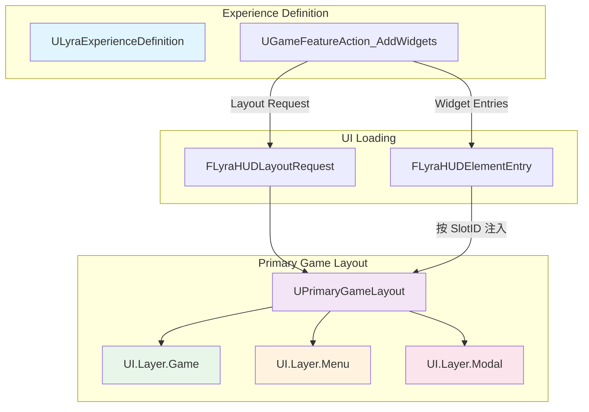
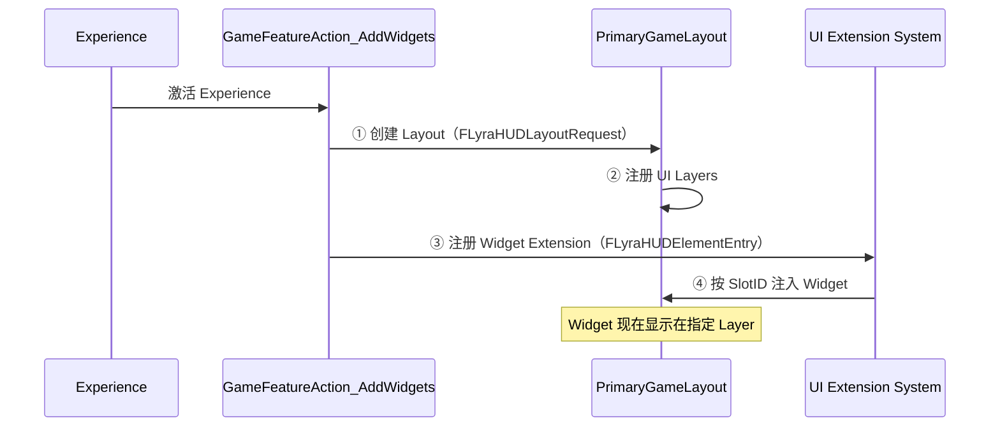
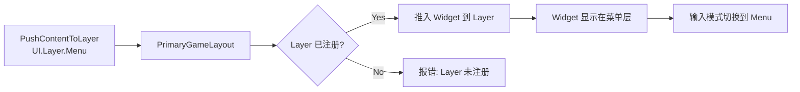
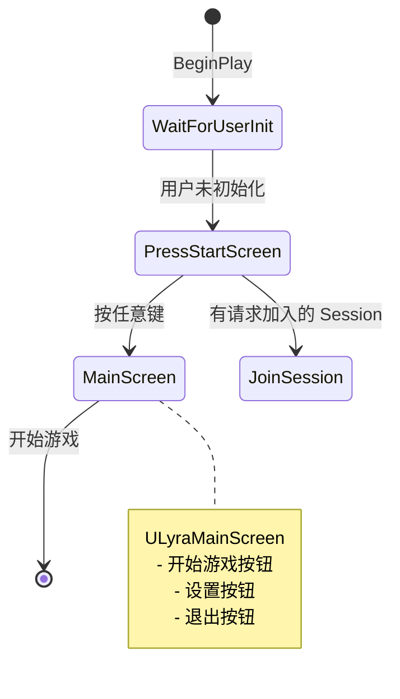

# LyraUI框架详解

> 深入理解 Lyra 如何基于 CommonUI 和 Experience 系统实现数据驱动的 UI 架构。

---

## 概述

Lyra 的 UI 架构与默认 UMG 用法有显著区别：

- **CommonUI 集成**：使用 `UCommonActivatableWidget` 替代原生 `UUserWidget`
- **Experience-driven UI 加载**：通过 `UGameFeatureAction_AddWidgets` 在 Experience 中声明 UI
- **UI Layer 系统**：使用 `UPrimaryGameLayout` 和 GameplayTag 管理 UI 层级
- **ControlFlow 前端**：使用 `FControlFlow` 管理前端 UI 状态切换

本课学完，你将能够：
1. 理解 Lyra UI 架构的核心设计
2. 掌握 Experience-driven UI 加载机制
3. 理解 UI Layer 系统的工作原理
4. 掌握 CommonUI 在 Lyra 中的实践
5. 理解前端流程的管理方式

---

## 核心架构

### Lyra UI 架构全景图



### Lyra UI 系统的核心创新

| 创新点 | 传统 UMG | Lyra UI 框架 |
|--------|----------|----------------|
| **Widget 基类** | `UUserWidget` | `UCommonActivatableWidget` |
| **UI 加载方式** | 硬编码创建 | Experience 声明式加载 |
| **层级管理** | Z-Order 手动管理 | GameplayTag Layer 系统 |
| **输入模式** | 手动设置 | 自动管理输入模式 |
| **前端流程** | 自定义逻辑 | ControlFlow 驱动 |

---

## Experience-driven UI 加载

### 核心机制

Lyra 通过 `UGameFeatureAction_AddWidgets` 在 Experience 中声明需要加载的 UI 元素。

**文件**：`Source/LyraGame/GameFeatures/GameFeatureAction_AddWidget.h`

#### `FLyraHUDLayoutRequest` 结构体

定义要创建的 HUD Layout：

```cpp
// Source/LyraGame/GameFeatures/GameFeatureAction_AddWidget.h (L14-26)
struct FLyraHUDLayoutRequest
{
    // 要生成的 Layout Widget（通常是 UPrimaryGameLayout 子类）
    TSoftClassPtr<UCommonActivatableWidget> LayoutClass;

    // 注入的 Layer ID（使用 GameplayTag 标识）
    FGameplayTag LayerID;
};
```

#### `FLyraHUDElementEntry` 结构体

定义要注入到 Layout 的 Widget：

```cpp
// Source/LyraGame/GameFeatures/GameFeatureAction_AddWidget.h (L29-41)
struct FLyraHUDElementEntry
{
    // 要生成的 Widget
    TSoftClassPtr<UUserWidget> WidgetClass;

    // 注入的 Slot ID（决定 Widget 在 Layout 中的位置）
    FGameplayTag SlotID;
};
```

### 加载流程



### 实战：在 Experience 中配置 UI

1. 打开 Experience Definition 资产
2. 在 **Actions** 或 **Action Sets** 中添加 `ULyraExperienceAction_AddWidgets`
3. 配置 **Layout Request**：
   - `LayoutClass`：`W_ShooterHUDLayout`（UPrimaryGameLayout 子类）
   - `LayerID`：`UI.Layer.Game`
4. 配置 **Widget Entries**：
   - `WidgetClass`：`W_QuickBar`（快捷栏）
   - `SlotID`：`UI.Slot.QuickBar`

---

## UI Layer 系统

### Layer 定义

Lyra 使用 GameplayTag 标识 UI 层：

| GameplayTag | 用途 | 示例 Widget |
|-------------|------|--------------|
| `UI.Layer.Game` | HUD 层（游戏中进行时） | `W_ShooterHUDLayout` |
| `UI.Layer.Menu` | 菜单层（暂停、设置） | `W_EscapeMenu` |
| `UI.Layer.Modal` | 模态层（弹出框） | `W_ConfirmationDialog` |

### `UPrimaryGameLayout` 管理 Layer Stack

**文件**：`Engine/Plugins/Runtime/CommonUI/Source/CommonUI/Public/PrimaryGameLayout.h`

```cpp
UCLASS()
class UPrimaryGameLayout : public UCommonActivatableWidget
{
    GENERATED_BODY()

public:
    // 将 Widget 推入指定 Layer
    UFUNCTION(BlueprintCallable, Category="Layout")
    UCommonActivatableWidget* PushContentToLayer(
        FGameplayTag LayerTag,
        TSubclassOf<UCommonActivatableWidget> WidgetClass
    );

    // 注册 Layer（在 Widget Blueprint 中调用）
    UFUNCTION(BlueprintCallable, Category="Layout")
    void RegisterLayer(FGameplayTag LayerTag);
};
```

### Layer 工作流程



---

## `ULyraHUDLayout` — HUD 布局管理

**文件**：`Source/LyraGame/UI/LyraHUDLayout.h`

`ULyraHUDLayout` 是 Lyra 的 HUD 布局基类，管理：
- **Escape 菜单触发**：监听 "UI_Menu" 输入动作
- **Controller 断连检测**：处理控制器断开时的 UI 显示

### Escape 菜单触发

```cpp
// Source/LyraGame/UI/LyraHUDLayout.h (L82-83)
/** The menu to be displayed when the user presses "Escape" */
UPROPERTY(EditDefaultsOnly)
TSoftClassPtr<UCommonActivatableWidget> EscapeMenuClass;
```

**触发流程**：

```cpp
// Source/LyraGame/UI/LyraHUDLayout.cpp
void ULyraHUDLayout::HandleEscapeAction()
{
    if (EscapeMenuClass)
    {
        // 将 Escape 菜单推入 Menu 层
        UPrimaryGameLayout* RootLayout = UPrimaryGameLayout::GetPrimaryGameLayoutForPlayer(GetOwningLocalPlayer());
        if (RootLayout)
        {
            RootLayout->PushContentToLayer(
                TAG_UI_LAYER_MENU,  // GameplayTag: "UI.Layer.Menu"
                EscapeMenuClass
            );
        }
    }
}
```

### Controller 断连处理

```cpp
// Source/LyraGame/UI/LyraHUDLayout.h (L41)
void HandleInputDeviceConnectionChanged(
    EInputDeviceConnectionState NewConnectionState,
    FPlatformUserId PlatformUserId,
    FInputDeviceId InputDeviceId
);
```

当所有控制器断开时，显示 `ControllerDisconnectedScreen`：

```cpp
// Source/LyraGame/UI/LyraHUDLayout.h (L88-89)
/** The widget displayed when all controllers are disconnected */
UPROPERTY(EditDefaultsOnly, Category="Controller Disconnect Menu")
TSubclassOf<ULyraControllerDisconnectedScreen> ControllerDisconnectedScreen;
```

---

## CommonUI 集成实践

### `ULyraActivatableWidget` — 输入模式管理

**文件**：`Source/LyraGame/UI/LyraActivatableWidget.h`

Lyra 所有可激活 Widget 的基类，核心功能是管理输入模式。

#### 输入模式枚举

```cpp
// Source/LyraGame/UI/LyraActivatableWidget.h (L11-18)
UENUM(BlueprintType)
enum class ELyraWidgetInputMode : uint8
{
    Default,      // 不修改输入模式
    GameAndMenu,  // 游戏和菜单输入都接收
    Game,         // 仅游戏输入
    Menu          // 仅菜单输入
};
```

#### 配置属性

```cpp
// Source/LyraGame/UI/LyraActivatableWidget.h (L40-46)
/** The desired input mode to use while this UI is activated */
UPROPERTY(EditDefaultsOnly, Category = Input)
ELyraWidgetInputMode InputConfig = ELyraWidgetInputMode::Default;

/** The desired mouse behavior when the game gets input */
UPROPERTY(EditDefaultsOnly, Category = Input)
EMouseCaptureMode GameMouseCaptureMode = EMouseCaptureMode::CapturePermanently;
```

### `ULyraButtonBase` — 统一按钮样式

**文件**：`Source/LyraGame/UI/LyraButtonBase.h`

Lyra 使用 `ULyraButtonBase` 统一所有按钮的视觉样式。

#### 核心特性

- 支持多种按钮样式（Primary、Secondary、Destructive 等）
- 集成 `UCommonButton` 的交互特性
- 支持 Icon + Text 组合

```cpp
// Source/LyraGame/UI/LyraButtonBase.h
UCLASS()
class ULyraButtonBase : public UCommonButton
{
    GENERATED_BODY()

public:
    // 设置按钮样式（从 DataTable 读取）
    UFUNCTION(BlueprintCallable, Category="Lyra|UI")
    void SetButtonStyle(FName StyleRowName);

protected:
    // 按钮图标
    UPROPERTY(BlueprintReadOnly, meta=(BindWidget))
    TObjectPtr<UImage> IconImage;

    // 按钮文本
    UPROPERTY(BlueprintReadOnly, meta=(BindWidget))
    TObjectPtr<UCommonTextBlock> LabelText;
};
```

### `ULyraActionWidget` — Enhanced Input Action 图标

**文件**：`Source/LyraGame/UI/LyraActionWidget.h`

显示 Enhanced Input Action 的按键图标。

```cpp
// Source/LyraGame/UI/LyraActionWidget.h
UCLASS()
class ULyraActionWidget : public UCommonUserWidget
{
    GENERATED_BODY()

public:
    // 要显示的 Input Action
    UPROPERTY(EditAnywhere, BlueprintReadOnly, Category="Input")
    TObjectPtr<const UInputAction> InputAction;

    // 当 Input Action 变化时更新图标
    UFUNCTION(BlueprintCallable, Category="Lyra|UI")
    void UpdateActionIcon();
};
```

---

## 前端流程管理

### `ULyraFrontendStateComponent` — 前端状态管理

**文件**：`Source/LyraGame/UI/Frontend/LyraFrontendStateComponent.h`

Lyra 使用 `UGameStateComponent` 管理前端流程。

```cpp
// Source/LyraGame/UI/Frontend/LyraFrontendStateComponent.h (L23-25)
UCLASS(Abstract)
class ULyraFrontendStateComponent : public UGameStateComponent, public ILoadingProcessInterface
{
    GENERATED_BODY()
```

#### ControlFlow 驱动

```cpp
// Source/LyraGame/UI/Frontend/LyraFrontendStateComponent.h (L47-50)
void FlowStep_WaitForUserInitialization(FControlFlowNodeRef SubFlow);
void FlowStep_TryShowPressStartScreen(FControlFlowNodeRef SubFlow);
void FlowStep_TryJoinRequestedSession(FControlFlowNodeRef SubFlow);
void FlowStep_TryShowMainScreen(FControlFlowNodeRef SubFlow);
```

#### 前端流程



#### 关键属性

```cpp
// Source/LyraGame/UI/Frontend/LyraFrontendStateComponent.h (L54-58)
/** Press Start 屏幕 Widget Class */
UPROPERTY(EditAnywhere, Category = UI)
TSoftClassPtr<UCommonActivatableWidget> PressStartScreenClass;

/** 主屏幕 Widget Class */
UPROPERTY(EditAnywhere, Category = UI)
TSoftClassPtr<UCommonActivatableWidget> MainScreenClass;
```

---

## 移动端触控支持

Lyra 在 `Content/UI/Hud/` 中提供了移动端触控按钮和摇杆。

### 移动端控件

| Widget | 功能 |
|--------|------|
| `W_TouchJoystick` | 虚拟摇杆 |
| `W_TouchButton` | 触控按钮 |
| `W_MobileHUD` | 移动端 HUD 布局 |

### 触控按钮实现要点

```cpp
// 使用 UCommonButton 作为基类
// 监听 Touch 事件而非 Mouse 事件
// 支持多点触控（多个按钮同时按下）
```

---

## Lyra UI 架构设计优势

### 设计优势

1. **Experience-driven**：UI 加载与 Experience 绑定，支持动态切换
2. **Layer 系统**：清晰的 UI 层级管理，避免 Z-Order 混乱
3. **CommonUI 集成**：统一的输入模式管理、焦点管理
4. **ControlFlow 前端**：可预测的前端流程，易于扩展
5. **数据驱动**：所有 UI 配置在 Experience 中声明，不硬编码

### 可复用设计模式

**模式 1：Experience + GameFeatureAction 加载 UI**

```text
Experience Definition
    └── GameFeatureActions
            └── UGameFeatureAction_AddWidgets
                    ├── Layout[0]: HUD Layout → UI.Layer.Game
                    └── Widgets[0]: QuickBar → UI.Slot.QuickBar
```

**模式 2：Activatable Widget + InputConfig**

```text
UCommonActivatableWidget
    ├── GetDesiredInputConfig() → 设置输入模式
    ├── GetDesiredFocusTarget() → 设置焦点 Widget
    └── bIsBackHandler → 处理返回操作
```

**模式 3：PrimaryGameLayout + Layer Tag**

```text
W_OverallUILayout (UPrimaryGameLayout)
    ├── Layer: UI.Layer.Game → W_ShooterHUDLayout
    ├── Layer: UI.Layer.Menu → W_EscapeMenu
    └── Layer: UI.Layer.Modal → W_ConfirmationDialog
```

---

## 实战：创建自定义 UI 并注入到 Experience

### 步骤 1：创建自定义 Widget

1. 在编辑器中创建新的 Widget Blueprint
2. 选择父类为 `ULyraActivatableWidget`
3. 设计 UI 布局
4. 配置输入模式（`InputConfig = ELyraWidgetInputMode::Menu`）

### 步骤 2：在 Experience 中注册 Widget

1. 打开 Experience Definition
2. 添加 `ULyraExperienceAction_AddWidgets` 到 Actions
3. 在 **Widget Entries** 中添加新条目：
   - `WidgetClass`：你的自定义 Widget
   - `SlotID`：`UI.Slot.MyCustomWidget`

### 步骤 3：在运行时推入 Widget

```cpp
// C++ 示例
UPrimaryGameLayout* RootLayout = UPrimaryGameLayout::GetPrimaryGameLayoutForPlayer(PlayerController->GetLocalPlayer());
if (RootLayout)
{
    RootLayout->PushContentToLayer(
        TAG_UI_LAYER_MENU,
        MyCustomWidgetClass
    );
}
```

---

## 常见问题与陷阱

### 陷阱 1：Widget 没有显示在正确位置

**现象**：Widget 创建了，但显示在屏幕左上角。

**原因**：没有注册到正确的 Layer，或者 Layer 没有在 Layout 中定义。

**解决**：
1. 确保 Layout Widget 中调用了 `RegisterLayer(LayerTag)`
2. 确保 `SlotID` 与 Layout 中定义的 Layer 匹配

### 陷阱 2：输入模式没有正确切换

**现象**：打开 UI 后，游戏仍然接收输入。

**原因**：Widget 没有正确设置 `InputConfig`。

**解决**：
1. 确保 Widget 继承自 `UCommonActivatableWidget`
2. 在 Widget Blueprint 中设置 `Input Config` 属性

### 陷阱 3：Escape 菜单没有响应

**现象**：按 Escape 键没有打开菜单。

**原因**：`ULyraHUDLayout` 没有正确配置 `EscapeMenuClass`。

**解决**：
1. 打开 HUD Layout Widget
2. 设置 `Escape Menu Class` 属性

---

## 总结

| 要点 | 说明 |
|------|------|
| **Experience-driven** | 通过 `UGameFeatureAction_AddWidgets` 声明式加载 UI |
| **UI Layer 系统** | 使用 `UPrimaryGameLayout` 和 GameplayTag 管理层级 |
| **CommonUI 集成** | `UCommonActivatableWidget` 管理输入模式和焦点 |
| **ControlFlow 前端** | `ULyraFrontendStateComponent` 驱动前端流程 |
| **可扩展性** | 支持动态切换 Experience，加载不同 UI 配置 |

---

## 相关页面

- [[30-tutorials/lyra-practical/06-Lyra输入系统详解|← 06 输入系统]]
- [[30-tutorials/lyra-practical/08-Lyra网络同步详解|08 网络同步 →]]
- [[30-tutorials/umg/08-Lyra项目UMG实战|Lyra UMG 实践（详细版）]]

<!-- nav:auto -->

---

**导航**: ← [[30-tutorials/lyra-practical/06-Lyra输入系统详解|06-Lyra输入系统详解]] · [[30-tutorials/lyra-practical/08-Lyra网络同步详解|08-Lyra网络同步详解]] →

<!-- /nav:auto -->
