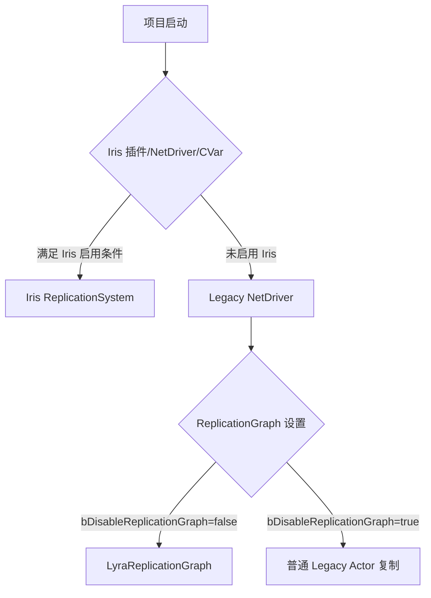
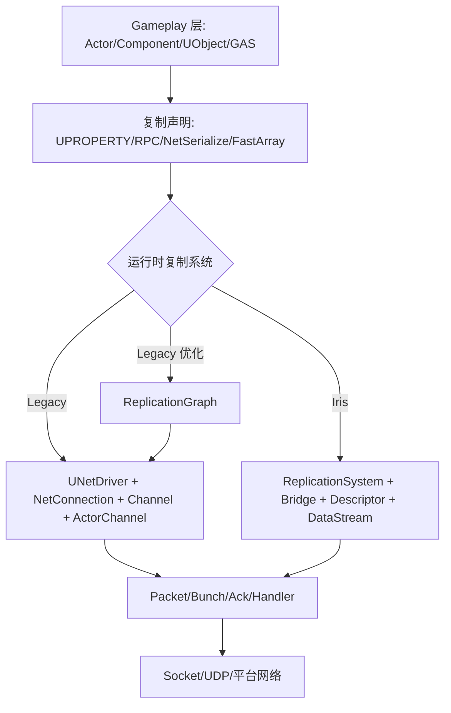
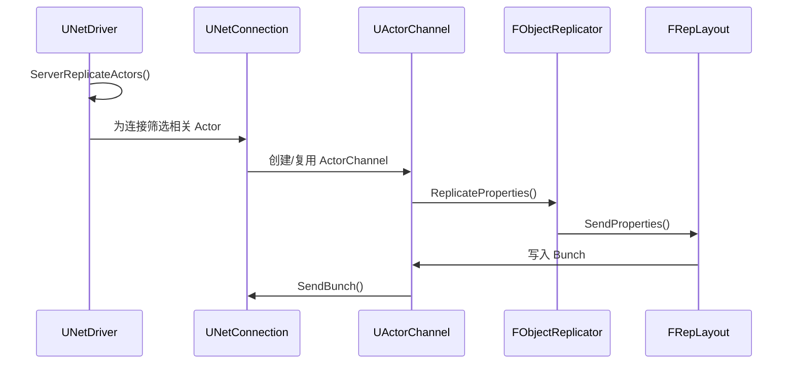
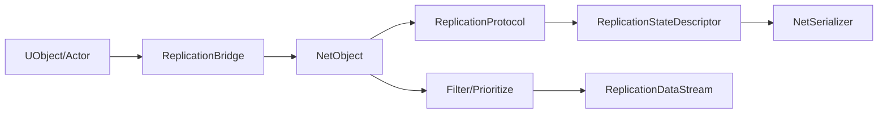
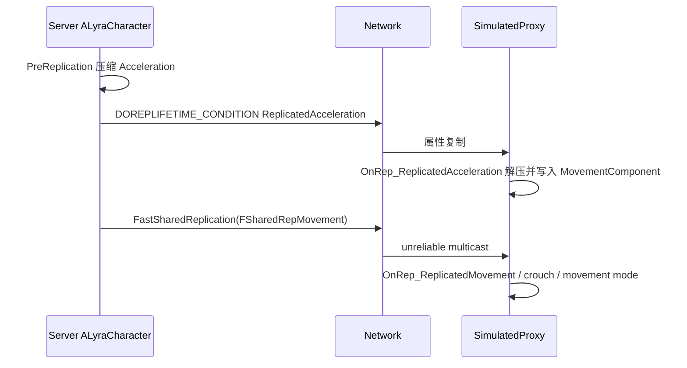
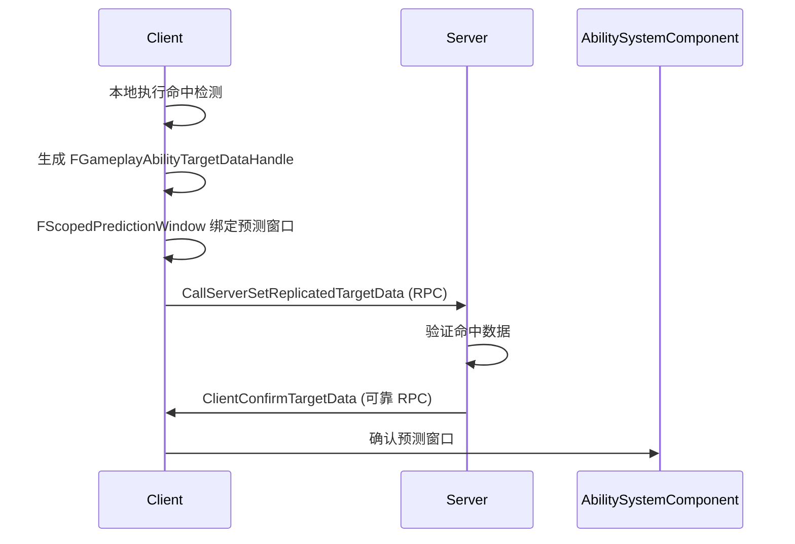

# Lyra网络同步详解

> 深入理解 Lyra 项目的网络同步架构，包括 Legacy 复制、ReplicationGraph、Iris 三套方案，以及与 GAS 的联动。

---

## 概述

Lyra 的网络同步系统是一个**混合状态项目**，同时包含多种网络方案：

- **Legacy Replication**：传统 ActorChannel / RepLayout / ObjectReplicator 路径
- **ReplicationGraph**：Legacy 路径上的 Actor 相关性与频率优化框架（默认禁用）
- **Iris**：UE5 新一代复制系统，重构底层状态描述、序列化、过滤与 DataStream（插件已启用）

本课学完，你将能够：
1. 理解 Lyra 网络同步的当前状态
2. 掌握 Legacy 和 Iris 两种复制路径
3. 理解 Lyra Character 的网络优化技巧
4. 掌握 FastArray 在 Inventory/Equipment 中的应用
5. 理解 GAS 网络预测与 TargetData 机制

---

## Lyra 网络同步现状

### 配置事实

| 项 | 当前状态 | 依据 |
|---|---|---|
| Iris 插件 | 已启用 | `LyraStarterGame.uproject` 中 `Iris` 插件 `Enabled=true` |
| Iris 构建支持 | 已启用 | `Source/LyraGame/LyraGame.Build.cs` 调用 `SetupIrisSupport(Target)` |
| Iris Descriptor 配置 | 已配置 | `DefaultEngine.ini` 的 `[/Script/IrisCore.ReplicationStateDescriptorConfig]` |
| Iris Bridge Filter | 已配置 | `DefaultEngine.ini` 的 `[/Script/IrisCore.ObjectReplicationBridgeConfig]` |
| ReplicationGraph | 有代码与配置，但默认禁用 | `DefaultGame.ini` 中 `bDisableReplicationGraph=True` |
| GameplayTag 快速复制 | 已启用 | `DefaultGameplayTags.ini` 中 `FastReplication=True` |
| SubObject registered list | 默认启用 | `DefaultEngine.ini` 中 `net.SubObjects.DefaultUseSubObjectReplicationList=1` |

### 运行时路径判断



**重要**：不能只根据"代码存在"判断运行路径，必须结合 NetDriver 定义、启动参数、CVar 与 PIE/DS 启动日志验证。

---

## UE 网络同步总览

### 总体分层



### 两类网络问题

1. **连接与传输**：连接建立、握手、控制消息、Packet、Bunch、Ack、丢包与可靠性
2. **对象状态复制**：Actor/Component/SubObject 的属性、RPC、对象引用、优先级与相关性

---

## Legacy 路径详解

### Legacy 路径关键对象

| 对象 | 职责 |
|---|---|
| `UNetDriver` | 网络驱动总入口，负责连接、收包发包、复制调度、RPC 路由 |
| `UNetConnection` | 一个远端连接的状态，维护 Channel、包序号、Ack、发送队列 |
| `UChannel` | 连接上的逻辑通道，ControlChannel / ActorChannel 等 |
| `UActorChannel` | Legacy Actor 复制核心通道，负责 Actor 初始创建、属性块、RPC、SubObject |
| `FObjectReplicator` | 某个 UObject/Actor 在某连接上的属性复制状态 |
| `FRepLayout` | Legacy 属性复制布局，描述哪些字段如何比较和序列化 |
| `UPackageMapClient` | UObject 引用与 `FNetworkGUID` 的映射与导出 |

### Legacy Actor 复制典型链路



---

## Iris 路径详解

### Iris 路径关键对象

| 对象 | 职责 |
|---|---|
| `UReplicationSystem` | Iris 复制系统总控，调度对象注册、状态轮询、过滤、优先级、发送接收 |
| `UObjectReplicationBridge` | Gameplay UObject/Actor 与 Iris NetObject 之间的桥接 |
| `FReplicationStateDescriptor` | 描述一个状态的字段、条件、NetSerializer、ChangeMask 等 |
| `FReplicationProtocol` | 一个对象类型的复制协议，由若干状态和 fragment 组成 |
| `FReplicationFragment` | 对象实例与复制状态之间的数据收集/应用单元 |
| `FNetSerializer` | Iris 类型序列化、量化、反量化、差量序列化的核心接口 |
| `FNetToken` | 稳定数据（如名称、Tag、字符串等）的 token 化压缩机制 |

### Iris 核心变化

Iris 的核心变化是把"ActorChannel 驱动复制"转向"对象状态驱动复制"：



---

## Lyra Character 同步优化

### 核心优化技术

`ALyraCharacter` 是 Lyra 最重要的 Actor 复制样例：

| 技术 | 说明 | 文件位置 |
|------|------|----------|
| `ReplicatedAcceleration` | 只复制给模拟代理（`COND_SimulatedOnly`），压缩到 3 字节 | `LyraCharacter.h:97-98` |
| `PreReplication` | 复制前压缩当前加速度，避免直接复制完整浮点向量 | `LyraCharacter.cpp` |
| `FSharedRepMovement` | 自定义 `NetSerialize`，用于快速共享移动快照 | `LyraCharacter.h` |
| `FastSharedReplication` | `NetMulticast, unreliable`，用于跳过默认属性复制的帧上广播移动快照 | `LyraCharacter.cpp` |
| `MyTeamID` | 团队 ID 通过 `ReplicatedUsing=OnRep_MyTeamID` 同步 | `LyraCharacter.h` |

### 同步链路



### `FLyraReplicatedAcceleration` 压缩

```cpp
// LyraCharacter.h (L97-98)
/** Replicated acceleration, compressed to 3 bytes */
UPROPERTY(ReplicatedUsing=OnRep_ReplicatedAcceleration, Meta=(ClampMin=0, ClampMax=255))
uint8 CompressedAcceleration[3];
```

**压缩算法**：
- X、Y、Z 各压缩到 1 字节（0-255）
- 解压时在 `OnRep_ReplicatedAcceleration()` 中还原为 `FVector`

---

## PlayerState 与 GAS 网络同步

### `ALyraPlayerState` 的 ASC 配置

`ALyraPlayerState` 持有 Lyra 的 ASC：

```cpp
// LyraPlayerState.cpp 构造函数
AbilitySystemComponent->SetIsReplicated(true);
AbilitySystemComponent->SetReplicationMode(EGameplayEffectReplicationMode::Mixed);
SetNetUpdateFrequency(100.0f);  // ASC 需要较高同步频率
```

### GAS 复制模式

| 模式 | 说明 | Lyra 使用场景 |
|------|------|----------------|
| `Full` | 服务端复制所有 GE 到客户端 | 单人游戏 |
| `Mixed` | 本地玩家完整复制，其他玩家只复制 GameplayTags 和 GameplayCues | **Lyra 默认模式** |
| `Minimal` | 只复制 GameplayTags 和 GameplayCues | 性能优化场景 |

### PushModel 优化

Lyra 使用 PushModel 优化网络更新：

```cpp
// LyraPlayerState.h
UPROPERTY(ReplicatedUsing=OnRep_PawnData, Meta=(PushReplication))
TObjectPtr<const ULyraPawnData> PawnData;

// 只有在值真正变化时才标记脏
MARK_PROPERTY_DIRTY_FROM_NAME(ALyraPlayerState, PawnData, this);
```

---

## FastArray 模式

### FastArray 应用场景

Lyra 使用 `FFastArraySerializer` 表达"数组元素级增量同步"：

| 容器 | 文件 | 复制内容 |
|---|---|---|
| `FLyraInventoryList` | `Inventory/LyraInventoryManagerComponent.*` | 背包条目、物品实例、堆叠数量 |
| `FLyraEquipmentList` | `Equipment/LyraEquipmentManagerComponent.*` | 已装备条目、装备实例、授予的 AbilitySet 句柄 |
| `FLyraVerbMessageReplication` | `Messages/LyraVerbMessageReplication.*` | Gameplay message 广播条目 |

### FastArray 共同模式

1. Entry 继承 `FFastArraySerializerItem`
2. List 继承 `FFastArraySerializer`
3. List 实现 `NetDeltaSerialize`
4. `TStructOpsTypeTraits` 设置 `WithNetDeltaSerializer=true`
5. 服务端修改后调用 `MarkItemDirty` 或 `MarkArrayDirty`
6. 客户端通过 `PostReplicatedAdd`、`PostReplicatedChange`、`PreReplicatedRemove` 驱动本地表现或消息

### 示例：`FLyraInventoryList`

```cpp
// LyraInventoryManagerComponent.h
struct FLyraInventoryList : public FFastArraySerializer
{
    TArray<FLyraInventoryEntry> Entries;

    void AddEntry(ULyraItemDefinition* ItemDef, int32 StackCount);
    void RemoveEntry(int32 EntryIndex);
};

struct FLyraInventoryEntry : public FFastArraySerializerItem
{
    TObjectPtr<ULyraItemDefinition> ItemDefinition;
    int32 StackCount;
    FGuid ServerToken;
};
```

---

## SubObject 复制

### 两条路径

Inventory 与 Equipment 同时体现两条路径：

| 路径 | 实现方式 | Lyra 使用场景 |
|------|---------|----------------|
| **传统路径** | 重写 `ReplicateSubobjects(UActorChannel*, FOutBunch*, FReplicationFlags*)` | 兼容性保留 |
| **Registered SubObject 路径** | 调用 `AddReplicatedSubObject` / `RemoveReplicatedSubObject` | **默认启用** |

### 配置

`DefaultEngine.ini` 设置了 `net.SubObjects.DefaultUseSubObjectReplicationList=1`，Lyra 的实现已经为 registered subobject list 做了适配。

### 生命周期管理

```cpp
// 添加 SubObject 到复制列表
void ULyraInventoryManagerComponent::AddItemInstance(ULyraItemInstance* ItemInstance)
{
    // 注册到复制系统
    AddReplicatedSubObject(ItemInstance);

    // 标记数组脏
    InventoryList.MarkArrayDirty();
}

// 从复制列表移除
void ULyraInventoryManagerComponent::RemoveItemInstance(ULyraItemInstance* ItemInstance)
{
    // 从复制系统移除
    RemoveReplicatedSubObject(ItemInstance);

    // 标记数组脏
    InventoryList.MarkArrayDirty();
}
```

---

## Weapon TargetData 与预测

### `ULyraGameplayAbility_RangedWeapon` 预测流程

Lyra 的远程武器使用 GAS 预测机制：



### 关键代码

```cpp
// LyraGameplayAbility_RangedWeapon.cpp
void ULyraGameplayAbility_RangedWeapon::OnTargetDataReadyCallback()
{
    // [1] 本地命中检测
    FHitResult HitResult;
    if (LineTrace(HitResult))
    {
        // [2] 生成 TargetData
        FGameplayAbilityTargetDataHandle TargetData;
        TargetData.Add(new FGameplayAbilityTargetData_SingleTargetHit(HitResult));

        // [3] 发送到服务器
        if (IsLocallyControlled())
        {
            FScopedPredictionWindow PredictionWindow(GetAbilitySystemComponentFromActorInfo());
            CallServerSetReplicatedTargetData(TargetData);
        }
    }
}
```

---

## ReplicationGraph（可选优化）

### Lyra ReplicationGraph 实现

`ULyraReplicationGraph` 提供了完整的 RepGraph 实现：

| 节点 | 职责 |
|------|------|
| `UReplicationGraphNode_GridSpatialization2D` | 空间网格节点 |
| `UReplicationGraphNode_ActorList` | 全局 always relevant 列表 |
| `ULyraReplicationGraphNode_AlwaysRelevant_ForConnection` | 每连接 always relevant |
| `ULyraReplicationGraphNode_PlayerStateFrequencyLimiter` | PlayerState 频率限制器 |

### 启用方式

在 `DefaultGame.ini` 中设置：

```ini
[/Script/LyraGame.LyraReplicationGraphSettings]
bDisableReplicationGraph=False
```

**注意**：当前默认禁用，启用前必须充分测试。

---

## Iris 配置与迁移

### Iris 配置

`DefaultEngine.ini` 的关键配置：

```ini
[/Script/IrisCore.ReplicationStateDescriptorConfig]
SupportsStructNetSerializerList=(StructName=LyraGameplayAbilityTargetData_SingleTargetHit)

[/Script/IrisCore.ObjectReplicationBridgeConfig]
DefaultSpatialFilterName=Spatial
; 类级 FilterConfigs 覆盖默认策略
FilterConfigs=(ClassName=/Script/LyraGame.LyraCharacter,FilterName=Spatial)
FilterConfigs=(ClassName=/Script/Engine.PlayerState,FilterName=None)
```

### 迁移建议

1. **普通属性和 RPC 迁移成本较低**
2. **自定义序列化、FastArray、SubObject、过滤/优先级都需要专项验证**
3. **必须在专用测试地图验证 Join-in-progress、Dormancy、OwnerOnly、SubObject、FastArray、RPC 时序**

---

## 网络调试技巧

### 常用调试命令

| 命令 | 说明 |
|------|------|
| `net.NetShowCorrections 1` | 显示网络修正 |
| `net.NetEnableMoveCombining 0` | 禁用移动合并 |
| `p.NetShowTeleport 1` | 显示瞬移 |
| `ShowDebug AbilitySystem` | 显示 GAS 调试信息 |
| `Net.RepGraph.PrintGraph` | 打印 ReplicationGraph（如果启用） |

### Lyra 自定义调试

| CVar | 说明 |
|------|------|
| `Lyra.RepGraph.PrintRouting` | 打印 RepGraph 路由 |
| `Lyra.RepGraph.Verbose` | 详细 RepGraph 日志 |

---

## 常见问题与陷阱

### 陷阱 1：属性复制没有生效

**现象**：修改了 `UPROPERTY(Replicated)` 属性，但客户端没有收到更新。

**原因**：
1. 没有调用 `MARK_PROPERTY_DIRTY_FROM_NAME`（使用 PushModel 时）
2. 没有调用 `ForceNetUpdate()`
3. 属性条件不满足（如 `COND_SimulatedOnly` 但修改在权威端）

**解决**：
```cpp
// 使用 PushModel
MARK_PROPERTY_DIRTY_FROM_NAME(AMyActor, MyProperty, this);

// 或者强制更新
ForceNetUpdate();
```

### 陷阱 2：FastArray 增量复制失效

**现象**：数组修改后，客户端收到完整数组而非增量。

**原因**：没有正确调用 `MarkItemDirty()` 或 `MarkArrayDirty()`。

**解决**：
```cpp
// 修改条目后标记脏
FLyraInventoryEntry& Entry = InventoryList.Entries[Index];
Entry.MarkItemDirty();

// 或者标记整个数组脏
InventoryList.MarkArrayDirty();
```

---

## 总结

| 要点 | 说明 |
|------|------|
| **混合状态** | Lyra 同时包含 Legacy、RepGraph、Iris 三套方案 |
| **Character 优化** | `ReplicatedAcceleration`、`FastSharedReplication` |
| **GAS 复制** | `Mixed` 模式，PushModel 优化 |
| **FastArray** | Inventory、Equipment、VerbMessage 使用 |
| **SubObject** | Registered list 默认启用 |
| **预测机制** | Weapon TargetData + `FScopedPredictionWindow` |

---

## 相关页面

- [[30-tutorials/lyra-practical/07-LyraUI框架详解|← 07 UI 框架]]
- [[30-tutorials/lyra-practical/09-实战创建新的游戏模式|09 实战：创建新游戏模式 →]]
- [[30-tutorials/network-sync/00-UE网络通信总览|UE 网络通信总览]]

<!-- nav:auto -->

---

**导航**: ← [[30-tutorials/lyra-practical/07-LyraUI框架详解|07-LyraUI框架详解]] · [[30-tutorials/lyra-practical/09-实战创建新的游戏模式|09-实战创建新的游戏模式]] →

<!-- /nav:auto -->
