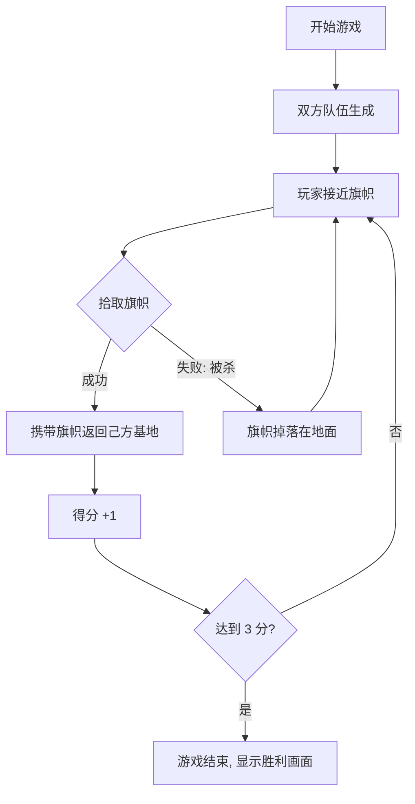

# 实战创建新的游戏模式

> 通过实战案例，学习如何在 Lyra 项目中创建完整的自定义游戏模式（Experience）。

---

## 概述

本实战教程将带你一步步创建一个**夺旗模式（Capture the Flag）**的完整游戏模式。

**你将学到**：
1. 创建自定义 Experience Definition
2. 配置 Game Features 和 Pawn Data
3. 添加自定义的 Game Feature 插件
4. 实现游戏逻辑（Action）
5. 测试新的游戏模式

**预计时间**：60-90 分钟

---

## 实战案例：夺旗模式（CTF）

### 游戏模式设计

| 要素 | 设计 |
|------|------|
| **目标** | 夺取对方旗帜并带回己方基地 |
| **胜负条件** | 先获得 3 分的队伍获胜 |
| **核心机制** | 旗帜拾取、旗帜携带、旗帜返回、得分 |
| **地图** | 对称式设计，双方各有基地和旗帜 |



---

## 步骤 1：创建 Experience Definition

### 1.1 创建资产

1. 在 Content Browser 中右键 → **Miscellaneous** → **Data Asset**
2. 选择父类为 `ULyraExperienceDefinition`
3. 命名为 `Experience_CaptureTheFlag`
4. 保存到 `Content/Lyra/Experiences/` 目录

### 1.2 基础配置

打开 `Experience_CaptureTheFlag` 资产，配置基础属性：

| 属性 | 值 | 说明 |
|------|-----|------|
| **Default Gameplay Experience ID** | `CaptureTheFlag` | Experience 唯一标识 |
| **Game Features To Enable** | `LyraShooterCore` | 启用射击核心功能 |
| **Default Pawn Data** | `PawnData_Hero_Standard` | 使用标准英雄配置 |
| **Actions** | （稍后配置） | 初始化操作 |
| **Action Sets** | （稍后配置） | 批量操作集合 |

---

## 步骤 2：配置 Game Features

### 2.1 添加现有 Game Feature

在 **Game Features To Enable** 数组中添加：

| Game Feature | 说明 |
|--------------|------|
| `LyraShooterCore` | 射击核心功能（武器、弹药物理等） |
| `LyraWeapons` | 武器系统 |
| `LyraAbilities` | 技能系统 |

### 2.2 创建自定义 Game Feature（CTF 逻辑）

#### 步骤 2.2.1：创建插件

1. 菜单栏 **Edit** → **Plugins**
2. 点击 **New Plugin**
3. 选择模板 **Game Feature Plugin**
4. 填写信息：
   - **Plugin Name**：`CTFGameMode`
   - **Author**：Your Name
   - **Description**：Capture the Flag game mode logic
5. 点击 **Create Plugin**

#### 步骤 2.2.2：配置 `.uplugin` 文件

```json
{
  "FileVersion": 3,
  "Version": 1,
  "VersionName": "1.0",
  "FriendlyName": "Capture the Flag",
  "Description": "CTF game mode logic and assets",
  "Category": "Game Features",
  "CreatedBy": "Your Name",
  "EnabledByDefault": false,
  "CanContainContent": true,
  "IsBetaVersion": false,
  "Installed": false
}
```

#### 步骤 2.2.3：添加 C++ 类

**创建 `UCTFGameModeComponent`**：

```cpp
// CTFGameModeComponent.h
UCLASS()
class UCTFGameModeComponent : public UPawnComponent
{
    GENERATED_BODY()

public:
    // 旗帜被拾取
    UFUNCTION(BlueprintCallable, Category = "CTF")
    void OnFlagPickedUp(AActor* Flag, AController* PickupController);

    // 旗帜被带回
    UFUNCTION(BlueprintCallable, Category = "CTF")
    void OnFlagReturned(AActor* Flag, AController* ReturnController);

    // 得分
    UFUNCTION(BlueprintCallable, Category = "CTF")
    void OnScore(AController* Scorer, int32 Points = 1);

protected:
    // 当前分数
    UPROPERTY(ReplicatedUsing=OnRep_TeamScores)
    TArray<int32> TeamScores;

    // 分数上限
    UPROPERTY(EditDefaultsOnly, Category = "CTF")
    int32 ScoreLimit = 3;

    // 复制回调
    UFUNCTION()
    void OnRep_TeamScores();
};
```

**实现文件**：

```cpp
// CTFGameModeComponent.cpp
#include "Net/UnrealNetwork.h"

void UCTFGameModeComponent::GetLifetimeReplicatedProps(TArray<FLifetimeProperty>& OutLifetimeProps) const
{
    Super::GetLifetimeReplicatedProps(OutLifetimeProps);

    DOREPLIFETIME(UCTFGameModeComponent, TeamScores);
}

void UCTFGameModeComponent::OnFlagPickedUp(AActor* Flag, AController* PickupController)
{
    if (!HasAuthority()) return;

    // 标记玩家携带旗帜
    // 实现省略...
}

void UCTFGameModeComponent::OnScore(AController* Scorer, int32 Points)
{
    if (!HasAuthority()) return;

    // 获取队伍索引
    int32 TeamIndex = /* 从 PlayerState 获取 */;

    // 增加分数
    if (TeamScores.IsValidIndex(TeamIndex))
    {
        TeamScores[TeamIndex] += Points;
        MARK_PROPERTY_DIRTY_FROM_NAME(UCTFGameModeComponent, TeamScores, this);

        // 检查是否达到分数上限
        if (TeamScores[TeamIndex] >= ScoreLimit)
        {
            // 游戏结束
            EndGame(TeamIndex);
        }
    }
}
```

#### 步骤 2.2.4：在 Experience 中启用

1. 打开 `Experience_CaptureTheFlag` 资产
2. 在 **Game Features To Enable** 中添加 `CTFGameMode`

---

## 步骤 3：配置 Pawn Data

### 3.1 使用现有 Pawn Data

对于 CTF 模式，我们可以直接使用 `PawnData_Hero_Standard`，但需要添加 CTF 相关的 Ability Set。

### 3.2 创建自定义 Pawn Data（可选）

如果需要特殊的 CTF 角色配置：

1. 在 Content Browser 中右键 → **Miscellaneous** → **Data Asset**
2. 选择父类为 `ULyraPawnData`
3. 命名为 `PawnData_CTF`
4. 配置属性：

| 属性 | 值 | 说明 |
|------|-----|------|
| **Pawn Class** | `BP_LyraCharacter` | 使用默认角色类 |
| **Ability Sets** | `AS_WeaponAbilities`, `AS_CTF_Abilities` | 添加 CTF 技能集 |
| **Input Config** | `InputData_Hero` | 使用默认输入配置 |
| **Camera Mode** | `LyraCameraMode_ThirdPerson` | 第三人称相机 |

---

## 步骤 4：创建 Actions 和 Action Sets

### 4.1 创建 Action Set

1. 在 Content Browser 中右键 → **Miscellaneous** → **Data Asset**
2. 选择父类为 `ULyraExperienceActionSet`
3. 命名为 `ActionSet_CTF`
4. 打开并添加 Actions：

#### Action 1：添加 HUD Widget

```cpp
// 在 ActionSet_CTF 中添加
UCLASS()
class UCTFAction_AddHUD : public ULyraExperienceAction
{
    GENERATED_BODY()

public:
    virtual void OnActionActivated() override
    {
        Super::OnActionActivated();

        // 添加 CTF HUD Widget
        if (ULyraHUDLayout* HUDLayout = /* 获取 HUD Layout */)
        {
            HUDLayout->AddWidgetToLayer(
                CTFHUDWidgetClass,
                TAG_UI_LAYER_GAME
            );
        }
    }

protected:
    UPROPERTY(EditDefaultsOnly, Category = "CTF")
    TSubclassOf<UUserWidget> CTFHUDWidgetClass;
};
```

#### Action 2：初始化分数

```cpp
UCLASS()
class UCTFAction_InitScore : public ULyraExperienceAction
{
    GENERATED_BODY()

public:
    virtual void OnActionActivated() override
    {
        Super::OnActionActivated();

        // 初始化分数数组
        if (UCTFGameModeComponent* CTFComponent = /* 获取 Component */)
        {
            CTFComponent->InitializeTeamScores(2); // 2 支队伍
        }
    }
};
```

### 4.2 在 Experience 中引用 Action Set

1. 打开 `Experience_CaptureTheFlag` 资产
2. 在 **Action Sets** 数组中添加 `ActionSet_CTF`

---

## 步骤 5：创建 CTF 游戏逻辑

### 5.1 创建旗帜 Actor

**`ACTFFlag` 类**：

```cpp
// CTFFlag.h
UCLASS()
class ACTFFlag : public AActor
{
    GENERATED_BODY()

public:
    ACTFFlag();

    // 旗帜被拾取
    UFUNCTION(BlueprintCallable, Category = "CTF")
    void PickUp(AController* PickupController);

    // 旗帜被掉落
    UFUNCTION(BlueprintCallable, Category = "CTF")
    void Drop();

    // 旗帜返回基地
    UFUNCTION(BlueprintCallable, Category = "CTF")
    void ReturnToBase();

protected:
    // 静态网格体
    UPROPERTY(VisibleAnywhere, BlueprintReadOnly, Category = "CTF")
    TObjectPtr<UStaticMeshComponent> FlagMesh;

    // 当前持有者
    UPROPERTY(ReplicatedUsing=OnRep_Holder)
    TObjectPtr<AController> Holder;

    // 所属队伍
    UPROPERTY(EditDefaultsOnly, Category = "CTF")
    int32 TeamID;

    // 初始位置
    FVector InitialLocation;

    // 复制回调
    UFUNCTION()
    void OnRep_Holder();
};
```

### 5.2 创建 CTF HUD Widget

**创建 Widget Blueprint**：

1. 在 Content Browser 中右键 → **User Interface** → **Widget Blueprint**
2. 选择父类为 `ULyraActivatableWidget`
3. 命名为 `W_CTF_HUD`
4. 设计 UI：
   - 显示双方队伍分数
   - 显示旗帜状态（是否被拾取、持有者是谁）
   - 显示剩余时间

**蓝图逻辑**：

```
Event Construct
  → 绑定到 CTFGameModeComponent 的 OnRep_TeamScores
  → 更新分数显示

Event Destruct
  → 解除绑定
```

---

## 步骤 6：测试新的游戏模式

### 6.1 配置地图

1. 打开或创建地图（如 `L_CTF_Arena`）
2. 放置 **Player Start** 点（双方基地各放置多个）
3. 放置 **CTF Flag** Actor（双方基地各一个）
4. 配置 **Game Mode Override** 为 `Experience_CaptureTheFlag`

### 6.2 运行测试

1. 点击 **Play** 按钮
2. 检查 Output Log 中是否有错误
3. 验证以下功能：
   - ✅ Game Feature 正确加载
   - ✅ 角色正确生成
   - ✅ 可以拾取旗帜
   - ✅ 携带旗帜返回基地后得分
   - ✅ 分数达到上限后游戏结束
   - ✅ UI 正确显示分数

### 6.3 网络测试

1. 使用 **Play as Listen Server** 或 **Play as Client**
2. 验证网络同步：
   - ✅ 分数在客户端正确显示
   - ✅ 旗帜状态同步正确
   - ✅ RPC 正确执行

---

## 常见问题与解决方案

### Q1：Experience 加载失败

**现象**：游戏启动时卡住，或报错 "Failed to load Experience"。

**原因**：
- Game Feature 插件未正确安装
- Experience Definition 资产路径错误
- 依赖的 Game Feature 缺失

**解决方法**：
1. 检查 **Output Log** 中的错误信息
2. 确认所有 `Game Features To Enable` 中的插件已安装
3. 验证 Experience Definition 资产的引用是否正确

### Q2：Pawn Data 不生效

**现象**：角色生成后，Ability 或 Input Config 没有正确应用。

**原因**：
- Experience 未正确加载
- Pawn Data 资产配置错误
- Pawn Class 与 Pawn Data 不匹配

**解决方法**：
1. 在 PIE 中检查 Pawn 的 Ability System Component
2. 验证 Pawn Data 中的 Pawn Class 是否正确
3. 检查 Ability Sets 是否正确授予

### Q3：网络同步问题

**现象**：客户端看到的分数与服务器不一致。

**原因**：
- 属性没有正确标记为 `Replicated`
- 没有调用 `MARK_PROPERTY_DIRTY_FROM_NAME`
- RPC 没有正确声明为 `Server` 或 `Client`

**解决方法**：
1. 检查 `GetLifetimeReplicatedProps` 中是否添加了属性
2. 使用 PushModel 时，确保调用 `MARK_PROPERTY_DIRTY_FROM_NAME`
3. 验证 RPC 函数的声明和实现

---

## 最佳实践

### 1. 模块化设计

将功能拆分为独立的 Game Feature：

```
CTFGameMode (Game Feature)
├── CTFGameModeComponent.cpp
├── CTFFlag.cpp
├── CTFScoreComponent.cpp
└── Content/
    ├── W_CTF_HUD.uasset
    └── GA_CTF_PickupFlag.uasset
```

### 2. 使用 Action Sets 组织初始化逻辑

将相关的 Actions 组织到 Action Set 中：

```
ActionSet_CTF
├── Action: Add CTF HUD
├── Action: Init Team Scores
└── Action: Spawn Flag Actors
```

### 3. 支持动态加载

避免硬编码 Experience，使用 `ULyraExperienceManagerComponent` 动态加载：

```cpp
// C++ 示例
ULyraExperienceManagerComponent* ExperienceManager = /* 获取 Component */;
ExperienceManager->LoadExperience(Experience_CaptureTheFlag);
```

### 4. 添加日志便于调试

在关键路径添加 `UE_LOG`：

```cpp
UE_LOG(LogCTF, Log, TEXT("Flag %s picked up by %s"), *Flag->GetName(), *Picker->GetName());
```

---

## 总结

| 步骤 | 关键要点 |
|------|----------|
| **创建 Experience** | 使用 `ULyraExperienceDefinition` 定义游戏模式 |
| **配置 Game Features** | 启用所需功能模块，可创建自定义 Game Feature |
| **配置 Pawn Data** | 定义角色能力、输入、相机等 |
| **创建 Actions** | 使用 `ULyraExperienceAction` 执行初始化逻辑 |
| **实现游戏逻辑** | 创建自定义 Actor、Component、Widget |
| **测试** | 验证单机、网络同步、性能 |

---

## 相关页面

- [[30-tutorials/lyra-practical/08-Lyra网络同步详解|← 08 网络同步]]
- [[30-tutorials/lyra-practical/10-高级主题与性能优化|10 高级主题 →]]
- [[30-tutorials/lyra-practical/02-ExperienceSystem详解|Experience 系统架构]]

<!-- nav:auto -->

---

**导航**: ← [[30-tutorials/lyra-practical/08-Lyra网络同步详解|08-Lyra网络同步详解]] · [[30-tutorials/lyra-practical/10-高级主题与性能优化|10-高级主题与性能优化]] →

<!-- /nav:auto -->
