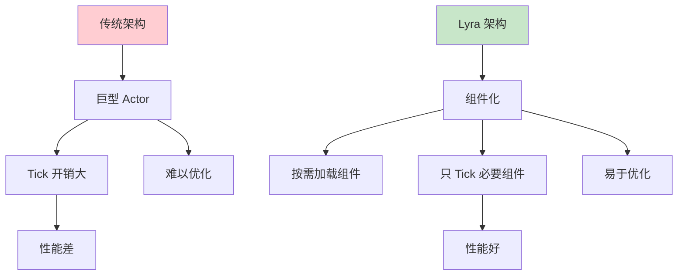
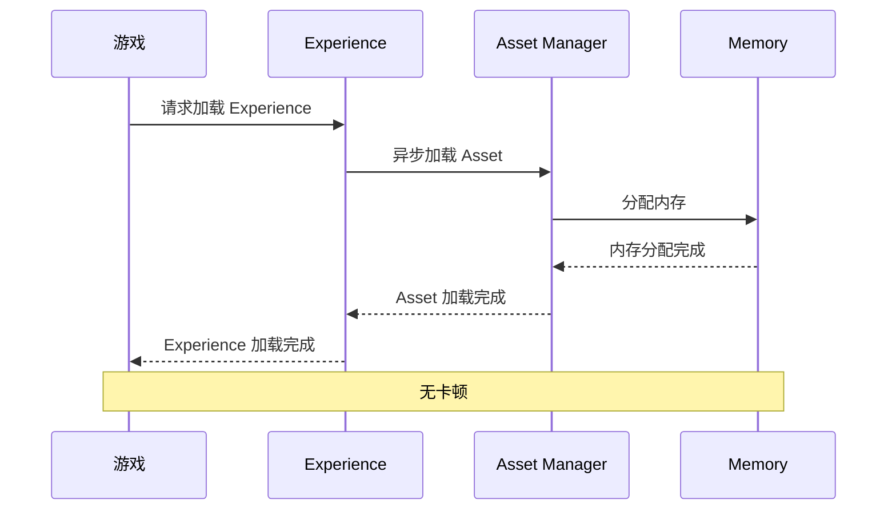

# 高级主题与性能优化

> 掌握 Lyra 项目的高级开发技巧、性能优化策略和常见陷阱规避。

---

## 概述

本课将深入探讨 Lyra 项目的高级主题：

1. **性能优化**：CPU、GPU、内存、网络优化技巧
2. **常见陷阱（Gotchas）**：避免典型错误
3. **高级 GAS 用法**：Lyra 中的复杂 Ability 设计
4. **扩展 Lyra**：如何基于 Lyra 框架创建自定义游戏类型
5. **调试技巧**：高效排查问题的方法

---

## 1. Lyra 性能优化实战

### 1.1 组件化架构优化

Lyra 使用 **Modular Gameplay** 架构，将功能分解为独立的组件：



#### 优化技巧 1：按需 Tick

```cpp
// LyraPawnExtensionComponent.cpp
void ULyraPawnExtensionComponent::TickComponent(float DeltaTime, ELevelTick TickType,
                                                  FActorComponentTickFunction* ThisTickFunction)
{
    Super::TickComponent(DeltaTime, TickType, ThisTickFunction);

    // 只在必要时 Tick
    if (!IsReadyToTick())
    {
        PrimaryComponentTick.SetTickFunctionEnable(false);
        return;
    }

    // 优化后的 Tick 逻辑
    // ...
}
```

#### 优化技巧 2：Tick 间隔控制

```cpp
// 设置 Tick 间隔，降低 CPU 开销
PrimaryComponentTick.TickInterval = 0.1f;  // 每 100ms Tick 一次

// 根据距离动态调整
void UMyComponent::UpdateTickInterval()
{
    ACharacter* PlayerCharacter = UGameplayStatics::GetPlayerCharacter(GetWorld(), 0);
    if (!PlayerCharacter) return;

    float Distance = GetOwner()->GetDistanceTo(PlayerCharacter);

    // 距离越远，Tick 间隔越长
    if (Distance > 5000.0f)
    {
        PrimaryComponentTick.TickInterval = 0.5f;
    }
    else if (Distance > 2000.0f)
    {
        PrimaryComponentTick.TickInterval = 0.2f;
    }
    else
    {
        PrimaryComponentTick.TickInterval = 0.0f;  // 每帧 Tick
    }
}
```

### 1.2 异步资源加载优化

Lyra 的 **Experience System** 使用异步加载，避免游戏卡顿：



#### 代码示例：Lyra 风格的异步加载

```cpp
// 参考 Lyra 的 Experience 加载
void ULyraExperienceManagerComponent::LoadExperience()
{
    // 异步加载 Experience
    TSubclassOf<ULyraExperienceDefinition> ExperienceClass = /* ... */;
    UAssetManager& AssetManager = UAssetManager::Get();

    // 创建异步加载句柄
    TSharedPtr<FStreamableHandle> Handle = AssetManager.LoadAssetAsync(
        ExperienceClass,
        FStreamableDelegate::CreateUObject(this, &ThisClass::OnExperienceLoaded)
    );
}
```

### 1.3 网络复制优化

#### 技术 1：`ReplicatedAcceleration` 压缩

```cpp
// LyraCharacter.h (L97-98)
/** Replicated acceleration, compressed to 3 bytes */
UPROPERTY(ReplicatedUsing=OnRep_ReplicatedAcceleration, Meta=(ClampMin=0, ClampMax=255))
uint8 CompressedAcceleration[3];
```

**压缩算法**：
- X、Y、Z 各压缩到 1 字节（0-255）
- 解压时在 `OnRep_ReplicatedAcceleration()` 中还原为 `FVector`

#### 技术 2：`FastSharedReplication`

```cpp
// 使用 unreliable multicast 广播移动快照
void ALyraCharacter::FastSharedReplication()
{
    // 跳过默认属性复制，使用自定义序列化
    FSharedRepMovement RepMovement;
    RepMovement.FillFromCharacter(this);

    // 广播给所有客户端
    MulticastFastReplication(RepMovement);
}
```

#### 技术 3：PushModel 优化

```cpp
// LyraPlayerState.h
UPROPERTY(ReplicatedUsing=OnRep_PawnData, Meta=(PushReplication))
TObjectPtr<const ULyraPawnData> PawnData;

// 只有在值真正变化时才标记脏
MARK_PROPERTY_DIRTY_FROM_NAME(ALyraPlayerState, PawnData, this);
```

### 1.4 渲染优化

#### LOD 和 Impostor

Lyra 使用 LOD（Level of Detail）和 Impostor 技术优化渲染：

| 技术 | 说明 | Lyra 应用 |
|------|------|----------|
| **LOD** | 根据距离切换模型精度 | 角色、武器、道具 |
| **Impostor** | 远距离用 2D 卡片替代 3D 模型 | 远处角色 |
| **Culling** | 视锥裁剪、遮挡裁剪 | 自动处理 |
| **Instancing** | 实例化渲染 | 子弹、粒子 |

---

## 2. 常见陷阱（Gotchas）

### 2.1 网络同步陷阱

#### 陷阱 1：属性复制没有生效

**现象**：修改了 `UPROPERTY(Replicated)` 属性，但客户端没有收到更新。

**原因**：
1. 没有调用 `MARK_PROPERTY_DIRTY_FROM_NAME`（使用 PushModel 时）
2. 没有调用 `ForceNetUpdate()`
3. 属性条件不满足（如 `COND_SimulatedOnly` 但修改在权威端）

**解决**：
```cpp
// 使用 PushModel
MARK_PROPERTY_DIRTY_FROM_NAME(AMyActor, MyProperty, this);

// 或者强制更新
ForceNetUpdate();
```

#### 陷阱 2：FastArray 增量复制失效

**现象**：数组修改后，客户端收到完整数组而非增量。

**原因**：没有正确调用 `MarkItemDirty()` 或 `MarkArrayDirty()`。

**解决**：
```cpp
// 修改条目后标记脏
FLyraInventoryEntry& Entry = InventoryList.Entries[Index];
Entry.MarkItemDirty();

// 或者标记整个数组脏
InventoryList.MarkArrayDirty();
```

#### 陷阱 3：RPC 时序问题

**现象**：RPC 和属性复制的到达顺序不一致。

**原因**：
- 同一 ActorChannel 内 reliable RPC 有顺序约束
- 不同 Actor/Channel 间不能假设全局顺序

**解决**：
- 不要依赖 RPC 与属性复制的到达顺序
- 使用 `FScopedPredictionWindow` 进行预测
- 在服务端进行关键逻辑验证

### 2.2 GAS 陷阱

#### 陷阱 4：Ability 激活失败

**现象**：按下按键，但 Ability 没激活。

**原因**：
1. Ability 的 `DynamicSourceTags` 没有包含对应的 `InputTag`
2. `CanActivateAbility()` 返回 false（冷却、资源不足等）
3. `AbilitySystemComponent` 没有正确初始化

**解决**：
```
在编辑器中打开 Gameplay Ability（如 GA_Dash）
→ 找到 Dynamic Source Tags
→ 添加 InputTag.Ability.Dash
```

#### 陷阱 5：PredictionKey 消费失败

**现象**：客户端预测成功，但服务端拒绝，导致回滚。

**原因**：
1. 预测窗口没有正确设置
2. 服务端验证失败
3. `CallServerSetReplicatedTargetData` 没有正确调用

**解决**：
```cpp
// 确保使用 FScopedPredictionWindow
{
    FScopedPredictionWindow PredictionWindow(GetAbilitySystemComponentFromActorInfo());
    CallServerSetReplicatedTargetData(TargetData);
}
```

### 2.3 UI 陷阱

#### 陷阱 6：Widget 没有显示在正确位置

**现象**：Widget 创建了，但显示在屏幕左上角。

**原因**：没有注册到正确的 Layer，或者 Layer 没有在 Layout 中定义。

**解决**：
1. 确保 Layout Widget 中调用了 `RegisterLayer(LayerTag)`
2. 确保 `SlotID` 与 Layout 中定义的 Layer 匹配

#### 陷阱 7：输入模式没有正确切换

**现象**：打开 UI 后，游戏仍然接收输入。

**原因**：Widget 没有正确设置 `InputConfig`。

**解决**：
1. 确保 Widget 继承自 `UCommonActivatableWidget`
2. 在 Widget Blueprint 中设置 `Input Config` 属性

---

## 3. 高级 GAS 用法

### 3.1 复杂 Ability 设计

#### 案例：Combo 连击系统

```cpp
// GA_ComboAttack.h
UCLASS()
class UGA_ComboAttack : public ULyraGameplayAbility
{
    GENERATED_BODY()

public:
    UGA_ComboAttack();

protected:
    virtual void ActivateAbilityFromEvent(const FGameplayEventData& EventData) override;
    virtual void EndAbility(const FGameplayAbilitySpecHandle Handle, const FGameplayAbilityActorInfo* ActorInfo, const FGameplayAbilityActivationInfo ActivationInfo, bool bReplicateEndAbility, bool bWasCancelled) override;

    // Combo 阶段
    UPROPERTY(EditDefaultsOnly, Category = "Combo")
    TArray<FComboStage> ComboStages;

    // 当前阶段索引
    int32 CurrentStageIndex;

    // 输入缓冲窗口
    FTimerHandle InputBufferHandle;
};

// Combo 阶段定义
USTRUCT()
struct FComboStage
{
    GENERATED_BODY()

    // 动画蒙太奇
    UPROPERTY(EditDefaultsOnly)
    TObjectPtr<UAnimMontage> Montage;

    // 伤害
    UPROPERTY(EditDefaultsOnly)
    float Damage;

    // 输入窗口（秒）
    UPROPERTY(EditDefaultsOnly)
    float InputWindow;
};
```

### 3.2 动态 GameplayEffect

```cpp
// 动态创建 GameplayEffect
UFUNCTION(BlueprintCallable, Category = "GAS")
void ApplyDynamicDamage(float DamageAmount)
{
    if (!GetAbilitySystemComponentFromActorInfo()) return;

    // 创建动态 GameplayEffect
    UGameplayEffect* DynamicGE = NewObject<UGameplayEffect>(GetAbilitySystemComponentFromActorInfo()->GetOwner());
    DynamicGE->DurationPolicy = EGameplayEffectDurationType::Instant;

    // 添加 Modifier
    FGameplayModifierInfo Modifier;
    Modifier.ModifierOp = EGameplayModOp::Additive;
    Modifier.ModifierMagnitude = FScalableFloat(DamageAmount);
    Modifier.Attribute = ULyraAttributeSet::GetHealthAttribute();

    DynamicGE->Modifiers.Add(Modifier);

    // 应用 GE
    GetAbilitySystemComponentFromActorInfo()->ApplyGameplayEffectToSelf(
        DynamicGE,
        1.0f,
        GetAbilitySystemComponentFromActorInfo()->MakeEffectContext()
    );
}
```

---

## 4. 扩展 Lyra：创建自定义游戏类型

### 4.1 创建自定义 Game Feature

#### 步骤 1：创建插件

1. 菜单栏 **Edit** → **Plugins**
2. 点击 **New Plugin**
3. 选择模板 **Game Feature Plugin**
4. 填写信息：
   - **Plugin Name**：`MyCustomGameMode`
   - **Description**：My custom game mode logic
5. 点击 **Create Plugin**

#### 步骤 2：添加游戏逻辑

```cpp
// MyCustomGameModeComponent.h
UCLASS()
class UMyCustomGameModeComponent : public UPawnComponent
{
    GENERATED_BODY()

public:
    // 自定义游戏逻辑
    UFUNCTION(BlueprintCallable, Category = "MyGameMode")
    void OnPlayerScored(int32 TeamIndex);

protected:
    // 分数
    UPROPERTY(ReplicatedUsing=OnRep_TeamScores)
    TArray<int32> TeamScores;

    // 分数上限
    UPROPERTY(EditDefaultsOnly, Category = "MyGameMode")
    int32 ScoreLimit = 10;

    // 复制回调
    UFUNCTION()
    void OnRep_TeamScores();
};
```

### 4.2 创建自定义 Pawn Data

1. 在 Content Browser 中右键 → **Miscellaneous** → **Data Asset**
2. 选择父类为 `ULyraPawnData`
3. 配置属性：
   - **Pawn Class**：`BP_MyCustomCharacter`
   - **Ability Sets**：`AS_MyCustomAbilities`
   - **Input Config**：`InputData_MyCustom`

### 4.3 创建自定义 Experience

1. 创建 Experience Definition 资产：`Experience_MyCustom`
2. 配置 **Game Features To Enable**：`MyCustomGameMode`
3. 配置 **Default Pawn Data**：`PawnData_MyCustom`
4. 添加 **Actions**：初始化游戏逻辑

---

## 5. 调试技巧

### 5.1 性能调试

#### 工具 1：Unreal Insights

```bash
# 启用 Unreal Insights
-Trace=cpu,gpu,loadtime,file,memory

# 分析 CPU 性能
# 1. 运行游戏并收集 trace
# 2. 打开 Unreal Insights
# 3. 分析 Timing Insights 中的 Tick 函数
```

#### 工具 2：Stat 命令

```
# 显示 FPS
stat fps

# 显示帧时间
stat unit

# 显示 Draw Call 数量
stat rhi

# 显示 GPU 时间
stat gpu
```

### 5.2 网络调试

#### 命令 1：显示网络修正

```
net.NetShowCorrections 1
```

#### 命令 2：显示瞬移

```
p.NetShowTeleport 1
```

#### 命令 3：GAS 调试

```
ShowDebug AbilitySystem
```

### 5.3 GAS 调试

#### 技巧 1：Ability 调试

```cpp
// 在 Ability 中添加日志
UE_LOG(LogLyra, Log, TEXT("Ability %s activated"), *GetName());

// 在蓝图中使用 Print String
```

#### 技巧 2：GameplayEffect 调试

```cpp
// 监听 GameplayEffect 应用
virtual void OnGameplayEffectAppliedToTarget(...) override
{
    UE_LOG(LogLyra, Log, TEXT("GE %s applied to %s"), *EffectSpec.ToGameplayEffect()->GetName(), *TargetActor->GetName());
}
```

---

## 6. 最佳实践总结

### 6.1 架构设计

| 原则 | 说明 |
|------|------|
| **组件化** | 使用 Modular Gameplay，避免巨型 Actor |
| **数据驱动** | 使用 Experience、Pawn Data、Input Config |
| **Experience 驱动** | UI、Game Feature、Ability 都通过 Experience 加载 |
| **解耦设计** | 使用 GameplayTag、GameplayEvent 进行通信 |

### 6.2 性能优化

| 领域 | 优化策略 |
|------|----------|
| **CPU** | 按需 Tick、Tick 间隔控制、距离裁剪 |
| **GPU** | LOD、Impostor、Instancing、遮挡裁剪 |
| **内存** | 异步加载、对象池、智能指针 |
| **网络** | 属性压缩、FastArray、PushModel、Iris |

### 6.3 网络同步

| 原则 | 说明 |
|------|------|
| **避免时序依赖** | 不要假设 RPC 和属性复制的到达顺序 |
| **使用预测** | 使用 `FScopedPredictionWindow` 进行客户端预测 |
| **服务端验证** | 所有关键逻辑必须在服务端验证 |
| **增量复制** | 使用 FastArray 进行数组式状态同步 |

---

## 7. 总结

恭喜！你已经完成了 **Lyra 项目架构与实战** 系列教程。

### 学到的核心知识

1. **Lyra 架构**：Experience System、Modular Gameplay、GameFeature
2. **核心系统**：Pawn 组件、GAS 集成、输入系统、UI 框架
3. **网络同步**：Legacy、ReplicationGraph、Iris 三套方案
4. **实战能力**：创建自定义游戏模式、性能优化、调试技巧
5. **高级主题**：复杂 Ability 设计、扩展 Lyra、避免常见陷阱

### 下一步学习建议

| 方向 | 建议内容 |
|------|----------|
| **深入 GAS** | 学习 `[[30-tutorials/gas/00-overview]]` 系列 |
| **深入网络** | 学习 `[[30-tutorials/network-sync/00-UE网络通信总览]]` 系列 |
| **性能优化** | 学习 `[[30-tutorials/performance-optimization/00-性能优化系列概览]]` 系列 |
| **实战项目** | 基于 Lyra 创建自己的游戏项目 |

---

## 相关页面

- [[30-tutorials/lyra-practical/09-实战创建新的游戏模式|← 09 实战：创建新游戏模式]]
- [[30-tutorials/performance-optimization/06-Lyra性能实战|Lyra 性能优化实战]]

<!-- nav:auto -->

---

**导航**: ← [[30-tutorials/lyra-practical/09-实战创建新的游戏模式|09-实战创建新的游戏模式]]

<!-- /nav:auto -->
