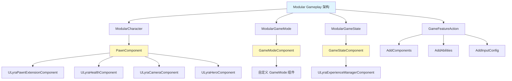
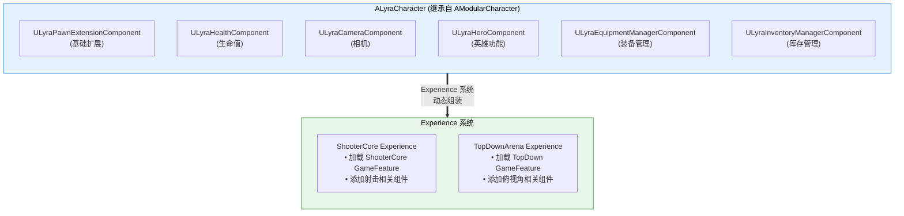
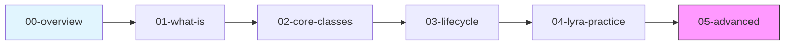

# ModularGameplay系统教程系列

> **UE5 模块化游戏架构**：用组件组合替代深层继承，让游戏功能像"搭积木"一样灵活组装。

## 系列概述

本系列将带你深入理解 UE5 的 **Modular Gameplay（模块化游戏玩法）** 架构：

| 核心价值 | 说明 |
|---------|------|
| **组合优于继承** | 用组件组合替代 `A → B → C → D` 的深层继承链 |
| **功能解耦** | 每个功能模块独立开发、测试、维护 |
| **动态组装** | 运行时通过 Experience 系统动态加载/卸载功能 |

### 你会学到什么

1. **Modular Gameplay 是什么** — 设计理念、与传统继承的对比
2. **核心类详解** — ModularCharacter、ModularGameMode、ModularGameState、PawnComponent
3. **组件生命周期** — 从注册到注销的完整流程
4. **Lyra 实战** — 看 Lyra 如何用 Modular Gameplay 构建可扩展的角色系统
5. **高级主题** — 自定义组件、最佳实践、性能优化

## 核心概念全景图

## 与 Lyra 项目的关系

Lyra 是 Modular Gameplay 的**最佳实践范例**：

## 系列阅读指南

### 学习路径

### 课时导航

| 课时 | 标题 | 难度 | 核心内容 |
|------|------|------|----------|
| 00 | [系列概览](00-ModularGameplay系统教程系列.md) | 入门 | 系列导航、核心概念全景图 |
| 01 | [Modular Gameplay 是什么？](01-ModularGameplay是什么.md) | 入门 | 设计理念、与传统继承对比 |
| 02 | [核心类详解](02-核心类详解.md) | 中级 | ModularCharacter/GameMode/GameState |
| 03 | [组件生命周期](03-组件生命周期.md) | 中级 | 注册、初始化、回调、注销 |
| 04 | [Lyra 实战](04-Lyra实战.md) | 中高级 | Lyra 角色架构、Experience 集成 |
| 05 | [高级主题](05-ModularGameplay高级主题与最佳实践.md) | 高级 | 自定义组件、最佳实践、性能优化 |

### 前置知识

| 知识点 | 推荐教程 | 重要程度 |
|--------|----------|----------|
| Actor 与组件系统 | `30-tutorials/ue-framework/02-actor-and-component` | ⭐⭐⭐ |
| GameMode/GameState | `30-tutorials/ue-framework/05-game-framework` | ⭐⭐⭐ |
| GameFeature 系统 | `30-tutorials/game-feature/00-overview` | ⭐⭐ |
| 面向对象设计原则 | 外部资源 | ⭐⭐ |

## 相关页面

- [[30-tutorials/modular-gameplay/01-ModularGameplay是什么]] - Modular Gameplay 架构文档
- [[30-tutorials/lyra-practical/02-ExperienceSystem详解]] - Experience 系统（动态加载 Modular Gameplay）
- [[30-tutorials/game-feature/00-GameFeature系统从入门到实战]] - GameFeature 教程系列（协同工作）

---

> 建议从 **[01-ModularGameplay是什么](01-ModularGameplay是什么.md)** 开始学习。

<!-- nav:auto -->

---

**导航**: [[30-tutorials/modular-gameplay/01-ModularGameplay是什么|01-ModularGameplay是什么]] →

<!-- /nav:auto -->
