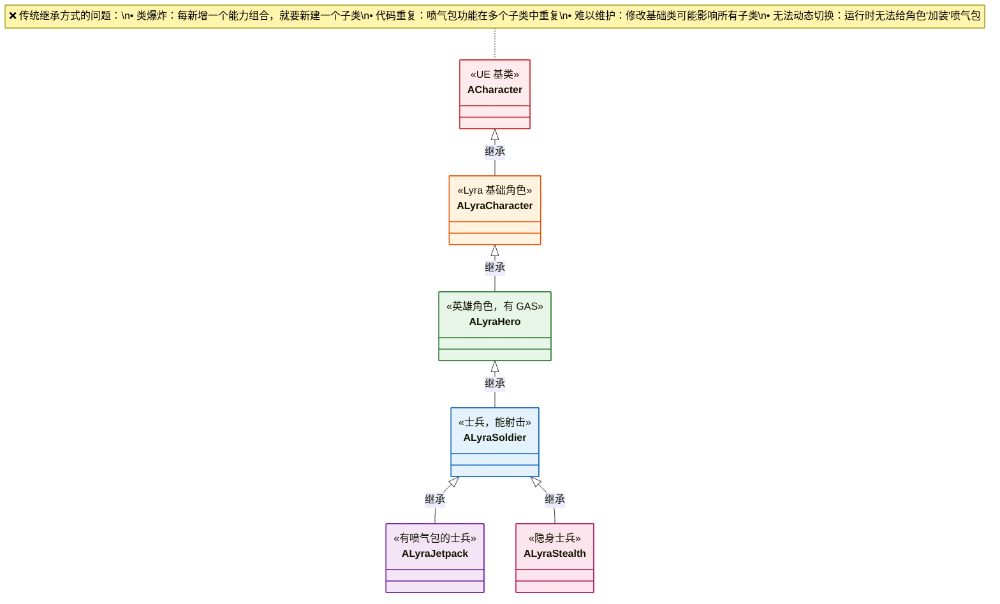
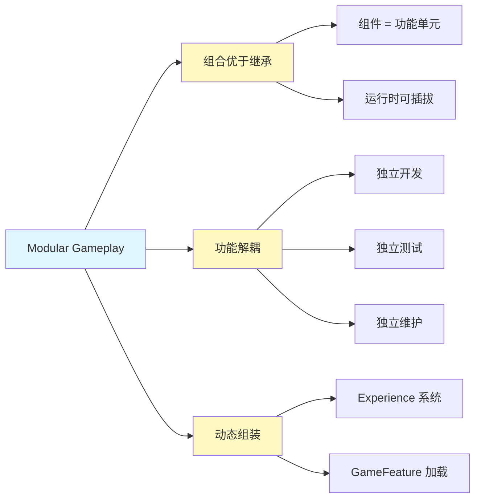
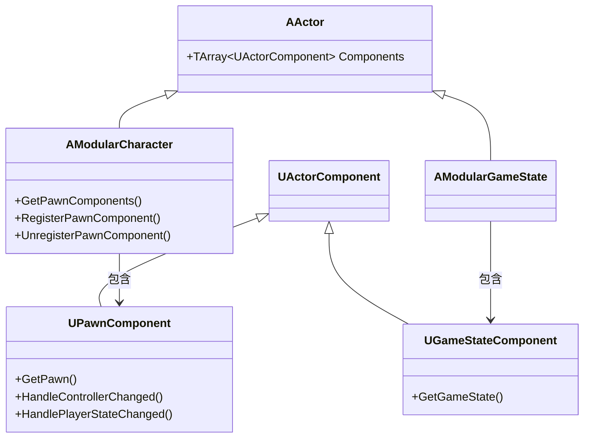
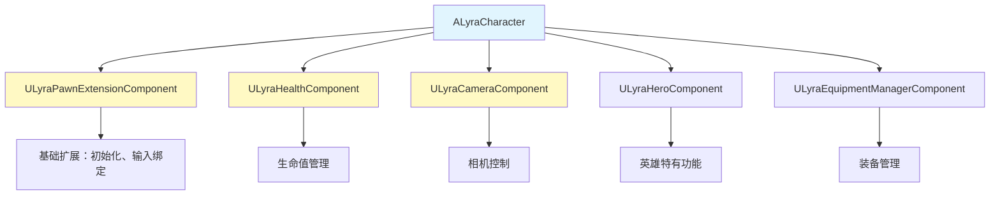
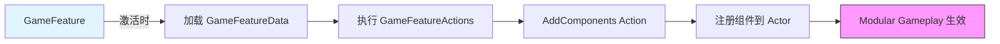

# ModularGameplay是什么

> **一句话概括**：把游戏功能拆成一个个可插拔的"组件"，像搭积木一样组装角色和游戏逻辑。

## 本课目标

学完这篇，你将能够：
1. 理解 **为什么需要 Modular Gameplay**（传统继承的痛点）
2. 掌握 **Modular Gameplay 的核心思想**（组合优于继承）
3. 对比 **传统方式 vs 模块化方式** 的差异
4. 了解 **Modular Gameplay 在 UE5 中的位置**

---

## 1. 传统继承的痛点

### 1.1 问题：继承链越来越深

假设你要做一个多人在线射击游戏，角色有多种能力：



**痛点**：
| 问题 | 说明 |
|------|------|
| **类爆炸** | 每新增一个能力组合，就要新建一个子类 |
| **代码重复** | 喷气包功能在 `ALyraJetpack` 和 `ALyraStealthJetpack` 中重复 |
| **难以维护** | 修改基础类可能影响所有子类 |
| **无法动态切换** | 运行时无法给角色"加装"喷气包 |

### 1.2 现实类比：乐高 vs 雕刻

| | 传统继承 | Modular Gameplay |
|--|----------|-----------------|
| **类比** | 雕刻（一刀下去改不了） | 乐高（随时拆装） |
| **扩展方式** | 新建子类 | 添加/移除组件 |
| **灵活性** | 编译时固定 | 运行时动态组装 |

---

## 2. Modular Gameplay 的核心思想

### 2.1 设计原则：组合优于继承



### 2.2 核心类一览

UE5 的 Modular Gameplay 提供了以下基类：

| 基类 | 作用 | Lyra 中的使用 |
|------|------|---------------|
| `AModularCharacter` | 模块化的 Character | `ALyraCharacter` 继承自它 |
| `AModularPlayerState` | 模块化的 PlayerState | Lyra 使用 |
| `AModularGameState` | 模块化的 GameState | `ALyraGameState` 继承自它 |
| `AModularGameModeBase` | 模块化的 GameMode | `ALyraGameMode` 继承自它 |
| `UPawnComponent` | Pawn 组件基类 | `ULyraPawnExtensionComponent` 等 |
| `UGameStateComponent` | GameState 组件基类 | `ULyraExperienceManagerComponent` |

### 2.3 组件类型



---

## 3. 实例对比：传统 vs 模块化

### 3.1 场景：给角色添加"喷气包"功能

#### 传统继承方式（❌）

```cpp
// 方案 1：修改 ALyraCharacter（影响所有角色）
class ALyraCharacter : public ACharacter {
    UPROPERTY()
    UJetpackComponent* Jetpack;  // 所有角色都有喷气包？❌
};

// 方案 2：新建子类（类爆炸）
class ALyraCharacterWithJetpack : public ALyraCharacter {
    // 只有这个子类有喷气包
    // 但如果要"隐身+喷气包"又要新建一个类...
};
```

#### Modular Gameplay 方式（✅）

```cpp
// 1. 定义喷气包组件（一次定义，到处使用）
UCLASS()
class UJetpackComponent : public UPawnComponent {
    GENERATED_BODY()
public:
    UFUNCTION(BlueprintCallable)
    void ActivateJetpack();
    
    UFUNCTION(BlueprintCallable)
    void DeactivateJetpack();
};

// 2. 需要喷气包的角色：添加组件即可
ALyraCharacter* Hero = Cast<ALyraCharacter>(GetPawn());
UJetpackComponent* Jetpack = NewObject<UJetpackComponent>(Hero);
Hero->RegisterPawnComponent(Jetpack);  // 运行时动态添加！

// 3. 不需要时移除
Hero->UnregisterPawnComponent(Jetpack);  // 动态移除
```

### 3.2 在 Lyra 中的实际应用

Lyra 的角色系统完全基于 Modular Gameplay：



**优势体现**：
- `ULyraHealthComponent` 可以在任何 Pawn 上复用
- `ULyraCameraComponent` 可以根据 Experience 动态加载
- 新增功能只需写新组件，不影响现有代码

---

## 4. Modular Gameplay 在 UE5 架构中的位置

### 4.1 与 GameFeature 的关系



**分工**：
| 系统 | 职责 |
|------|------|
| **GameFeature** | 管理功能的"加载/卸载"生命周期 |
| **Modular Gameplay** | 提供"组件"作为功能载体 |
| **Experience System** | 定义"当前游戏需要哪些 GameFeatures" |

### 4.2 在 Lyra 中的完整流程

```
1. 玩家选择 Experience（如 ShooterCore）
   ↓
2. Experience 定义需要加载的 GameFeatures
   ↓
3. GameFeature 激活，执行 Actions
   ↓
4. AddComponents Action 注册组件到 Character/GameState
   ↓
5. Modular Gameplay 接管组件生命周期
   ↓
6. 玩家获得完整游戏功能
```

---

## 5. 总结与要点

### 核心要点

1. **Modular Gameplay = 组件组合架构**
   - 替代深层继承链
   - 功能解耦，易于维护

2. **核心类**
   - `AModularCharacter` — 可附加 Pawn 组件的 Character
   - `UPawnComponent` — Pawn 组件基类
   - `UGameStateComponent` — GameState 组件基类

3. **与传统方式对比**
   - 传统：继承链深、类爆炸、难以维护
   - 模块化：组件复用、动态组装、易于扩展

4. **与 GameFeature 协同**
   - GameFeature 负责"加载/卸载"
   - Modular Gameplay 负责"组件生命周期"

### 下一步

下一课 **[02-核心类详解](02-核心类详解.md)** 将深入学习 Modular Gameplay 的核心类。

## 相关页面

- [[30-tutorials/modular-gameplay/01-ModularGameplay是什么]] - Modular Gameplay 架构文档
- [[30-tutorials/game-feature/02-核心机制详解]] - GameFeature 核心机制
- [[30-tutorials/ue-framework/40-actor-system/00-AActor架构概述]] - AActor 架构概述

---

> 下一课：**[02-核心类详解](02-核心类详解.md) — 核心类详解**

<!-- nav:auto -->

---

**导航**: ← [[30-tutorials/modular-gameplay/00-ModularGameplay系统教程系列|00-ModularGameplay系统教程系列]] · [[30-tutorials/modular-gameplay/02-核心类详解|02-核心类详解]] →

<!-- /nav:auto -->
