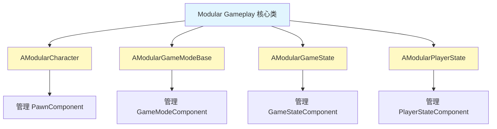
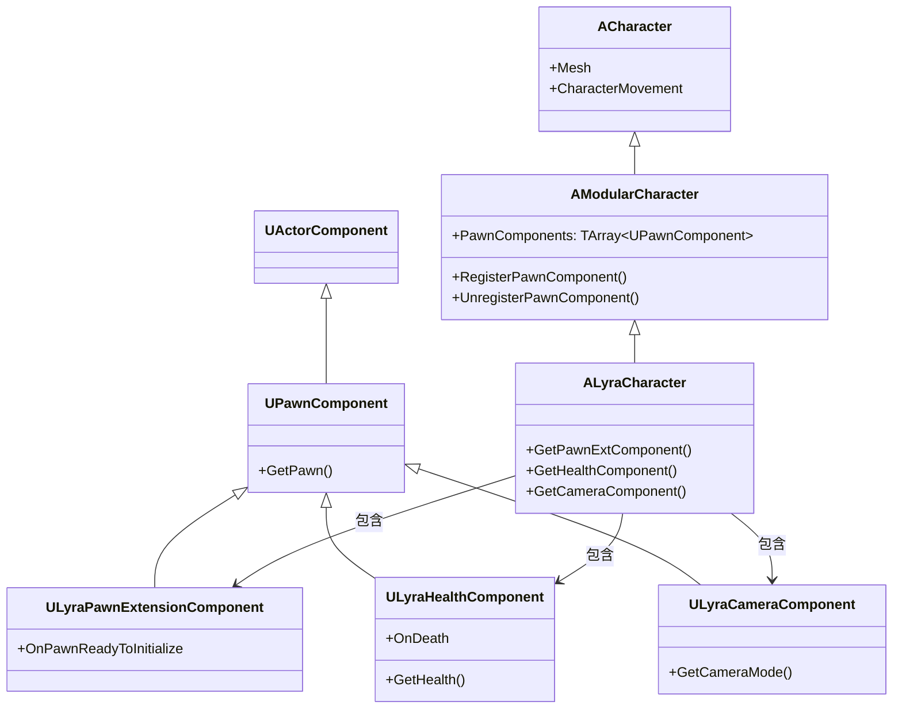
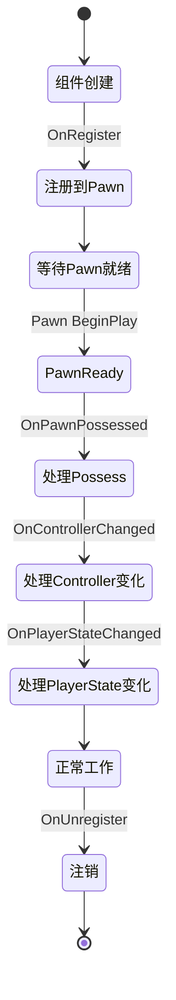
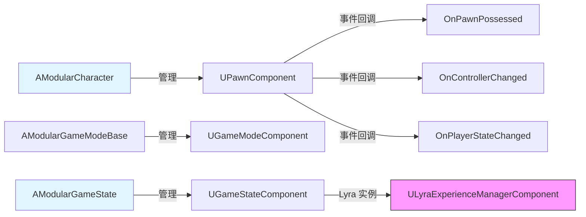

# 核心类详解

> **本课目标**：深入理解 Modular Gameplay 的 4 大核心类及其在 Lyra 中的应用。

## 概述

Modular Gameplay 提供了 4 个核心基类，分别用于不同的游戏对象：



---

## 1. AModularCharacter

### 1.1 类定义

```cpp
// Engine/Source/Runtime/ModularGameplay/Public/GameFramework/ModularCharacter.h
UCLASS()
class AModularCharacter : public ACharacter
{
    GENERATED_BODY()

public:
    // 获取所有 Pawn Components
    UFUNCTION(BlueprintCallable)
    const TArray<UPawnComponent*>& GetPawnComponents() const;

    // 注册 Pawn Component
    UFUNCTION(BlueprintCallable)
    void RegisterPawnComponent(UPawnComponent* Component);

    // 注销 Pawn Component
    UFUNCTION(BlueprintCallable)
    void UnregisterPawnComponent(UPawnComponent* Component);

protected:
    // Pawn Components 数组
    UPROPERTY()
    TArray<TObjectPtr<UPawnComponent>> PawnComponents;
};
```

### 1.2 关键特性

| 特性 | 说明 |
|------|------|
| **自动注册** | Component 的 `OnRegister` 会自动调用 `RegisterPawnComponent` |
| **自动注销** | Component 的 `OnUnregister` 会自动调用 `UnregisterPawnComponent` |
| **事件回调** | 自动转发 Pawn 事件给所有 Pawn Components |
| **蓝图支持** | 可在蓝图中访问 `GetPawnComponents()` |

### 1.3 Lyra 中的使用

```cpp
// Source/LyraGame/Character/LyraCharacter.h
UCLASS()
class ALyraCharacter : public AModularCharacter, 
                      public IAbilitySystemInterface, 
                      public IGameplayCueInterface, 
                      public IGameplayTagAssetInterface, 
                      public ILyraTeamAgentInterface
{
    GENERATED_BODY()

public:
    ALyraCharacter(const FObjectInitializer& ObjectInitializer);

    // 获取 Pawn Extension Component
    UFUNCTION(BlueprintCallable)
    ULyraPawnExtensionComponent* GetPawnExtComponent() const;

    // 获取 Health Component
    UFUNCTION(BlueprintCallable)
    ULyraHealthComponent* GetHealthComponent() const;

    // 获取 Camera Component
    UFUNCTION(BlueprintCallable)
    ULyraCameraComponent* GetCameraComponent() const;
};
```

**Lyra 的架构**：



---

## 2. AModularGameModeBase

### 2.1 类定义

```cpp
// Engine/Source/Runtime/ModularGameplay/Public/GameFramework/ModularGameModeBase.h
UCLASS()
class AModularGameModeBase : public AGameModeBase
{
    GENERATED_BODY()

public:
    // 获取所有 Game Mode Components
    UFUNCTION(BlueprintCallable)
    const TArray<UGameModeComponent*>& GetGameModeComponents() const;

    // 注册 Game Mode Component
    UFUNCTION(BlueprintCallable)
    void RegisterGameModeComponent(UGameModeComponent* Component);

    // 注销 Game Mode Component
    UFUNCTION(BlueprintCallable)
    void UnregisterGameModeComponent(UGameModeComponent* Component);

protected:
    // Game Mode Components 数组
    UPROPERTY()
    TArray<TObjectPtr<UGameModeComponent>> GameModeComponents;
};
```

### 2.2 关键特性

| 特性 | 说明 |
|------|------|
| **游戏级别扩展** | 为 GameMode 添加模块化功能 |
| **全局逻辑** | 管理游戏规则、回合控制等 |
| **动态组装** | 通过 GameFeature 动态加载 |

### 2.3 Lyra 中的使用

```cpp
// Source/LyraGame/GameModes/LyraGameMode.h
UCLASS()
class ALyraGameMode : public AModularGameModeBase
{
    GENERATED_BODY()

public:
    ALyraGameMode(const FObjectInitializer& ObjectInitializer);

    // 获取 Experience Manager Component
    ULyraExperienceManagerComponent* GetExperienceManagerComponent() const;

protected:
    // 重写 BeginPlay
    virtual void BeginPlay() override;

    // 尝试加载当前 Experience
    void TryLoadExperience();
};
```

---

## 3. AModularGameState

### 3.1 类定义

```cpp
// Engine/Source/Runtime/ModularGameplay/Public/GameFramework/ModularGameState.h
UCLASS()
class AModularGameState : public AGameStateBase
{
    GENERATED_BODY()

public:
    // 获取所有 Game State Components
    UFUNCTION(BlueprintCallable)
    const TArray<UGameStateComponent*>& GetGameStateComponents() const;

    // 注册 Game State Component
    UFUNCTION(BlueprintCallable)
    void RegisterGameStateComponent(UGameStateComponent* Component);

    // 注销 Game State Component
    UFUNCTION(BlueprintCallable)
    void UnregisterGameStateComponent(UGameStateComponent* Component);

protected:
    // Game State Components 数组
    UPROPERTY()
    TArray<TObjectPtr<UGameStateComponent>> GameStateComponents;
};
```

### 3.2 关键特性

| 特性 | 说明 |
|------|------|
| **全局状态管理** | 管理游戏级别的持久状态 |
| **网络同步** | GameState 是网络同步的 |
| **跨玩家数据** | 存储所有玩家都需要访问的数据 |

### 3.3 Lyra 中的使用

```cpp
// Source/LyraGame/GameModes/LyraGameState.h
UCLASS()
class ALyraGameState : public AModularGameState, 
                       public IAbilitySystemInterface
{
    GENERATED_BODY()

public:
    ALyraGameState(const FObjectInitializer& ObjectInitializer);

    // 获取 Experience Manager Component
    ULyraExperienceManagerComponent* GetExperienceManagerComponent() const;

    // 获取 Ability System Component（用于 GameState 级别的 GAS）
    virtual UAbilitySystemComponent* GetAbilitySystemComponent() const override;

protected:
    // Experience Manager Component（管理 Experience 加载）
    UPROPERTY()
    TObjectPtr<ULyraExperienceManagerComponent> ExperienceManagerComponent;
};
```

---

## 4. UPawnComponent

### 4.1 类定义

```cpp
// Engine/Source/Runtime/ModularGameplay/Public/Components/PawnComponent.h
UCLASS()
class UPawnComponent : public UActorComponent
{
    GENERATED_BODY()

public:
    // 获取所属的 Pawn
    UFUNCTION(BlueprintCallable)
    APawn* GetPawn() const;

    // 获取所属的 Controller
    UFUNCTION(BlueprintCallable)
    AController* GetController() const;

    // 获取所属的 Player State
    UFUNCTION(BlueprintCallable)
    APlayerState* GetPlayerState() const;

protected:
    // Pawn 被 Possess 时调用
    virtual void OnPawnPossessed(APawn* Pawn, AController* OldController, AController* NewController);

    // Controller 变化时调用
    virtual void OnControllerChanged(APawn* Pawn, AController* OldController, AController* NewController);

    // Player State 变化时调用
    virtual void OnPlayerStateChanged(APawn* Pawn, APlayerState* OldPlayerState, APlayerState* NewPlayerState);
};
```

### 4.2 关键回调



### 4.3 Lyra 中的 Pawn Components

| 组件 | 职责 |
|------|------|
| `ULyraPawnExtensionComponent` | Pawn 扩展基础组件，提供初始化回调 |
| `ULyraHealthComponent` | 生命值管理，处理伤害和死亡 |
| `ULyraCameraComponent` | 相机控制，管理相机模式 |
| `ULyraHeroComponent` | 英雄角色特有功能 |
| `ULyraEquipmentManagerComponent` | 装备管理 |
| `ULyraInventoryManagerComponent` | 库存管理 |

---

## 5. UGameStateComponent

### 5.1 类定义

```cpp
// Engine/Source/Runtime/ModularGameplay/Public/Components/GameStateComponent.h
UCLASS()
class UGameStateComponent : public UActorComponent
{
    GENERATED_BODY()

public:
    // 获取所属的 Game State
    UFUNCTION(BlueprintCallable)
    AGameStateBase* GetGameState() const;

    // 获取 Game Mode
    UFUNCTION(BlueprintCallable)
    AGameModeBase* GetGameMode() const;
};
```

### 5.2 Lyra 中的使用

```cpp
// Source/LyraGame/GameModes/LyraExperienceManagerComponent.h
UCLASS()
class ULyraExperienceManagerComponent : public UGameStateComponent
{
    GENERATED_BODY()

public:
    // 加载 Experience
    void LoadExperience(const ULyraExperienceDefinition* Experience);

    // 获取加载进度
    float GetLoadProgress() const;

    // 加载完成回调
    FOnExperienceLoadComplete OnExperienceLoadComplete;

protected:
    // 当前加载的 Experience
    UPROPERTY()
    TObjectPtr<const ULyraExperienceDefinition> CurrentExperience;
};
```

---

## 6. 总结与要点

### 核心类总结



### 关键要点

1. **AModularCharacter** — 管理 Pawn 组件，Lyra 的 `ALyraCharacter` 继承自它
2. **AModularGameModeBase** — 管理 GameMode 组件，用于游戏规则
3. **AModularGameState** — 管理 GameState 组件，用于全局状态
4. **UPawnComponent** — Pawn 组件基类，接收 Pawn 事件回调
5. **组件自动注册/注销** — 基于 `UActorComponent::OnRegister/OnUnregister`

### 下一步

下一课 **[03-组件生命周期](03-组件生命周期.md)** 将深入学习组件的生命周期和事件回调机制。

## 相关页面

- [[30-tutorials/modular-gameplay/01-ModularGameplay是什么]] - Modular Gameplay 架构文档
- [[30-tutorials/modular-gameplay/01-ModularGameplay是什么]] - 上一课：Modular Gameplay 是什么？

---

> 下一课：**[03-组件生命周期](03-组件生命周期.md) — 组件生命周期**

<!-- nav:auto -->

---

**导航**: ← [[30-tutorials/modular-gameplay/01-ModularGameplay是什么|01-ModularGameplay是什么]] · [[30-tutorials/modular-gameplay/03-组件生命周期|03-组件生命周期]] →

<!-- /nav:auto -->
