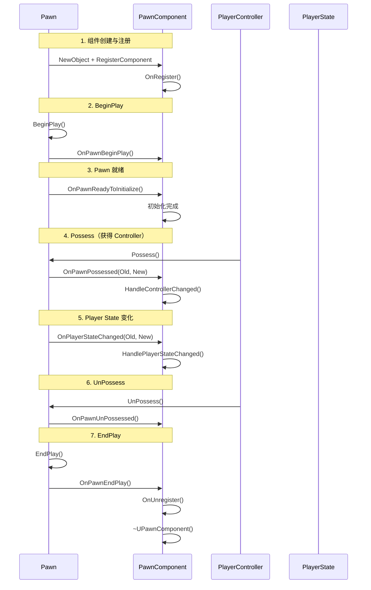
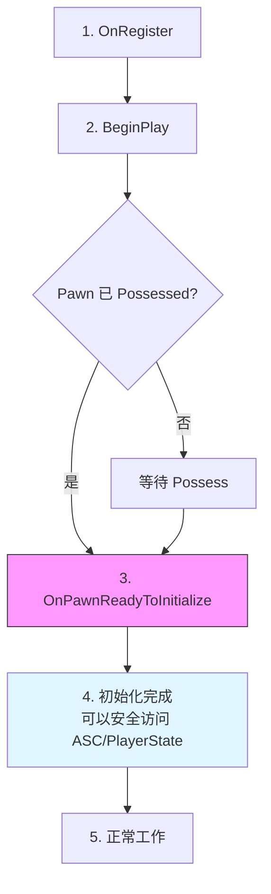

# 组件生命周期

> **本课目标**：掌握 Modular Gameplay 组件的完整生命周期，从创建到销毁的每一个关键节点。

## 概述

Modular Gameplay 的组件生命周期比普通 `UActorComponent` 更复杂，因为它需要响应 Pawn 的各种事件。

```mermaid
stateDiagram-v2
    [*] --> 组件创建: NewObject
    组件创建 --> 注册: OnRegister
    注册 --> PawnBeginPlay: Pawn::BeginPlay
    PawnBeginPlay --> 等待初始化: ReadyToInitialize
    等待初始化 --> 正常工作: OnPawnReadyToInitialize
    正常工作 --> Controller变化: OnControllerChanged
    Controller变化 --> PlayerState变化: OnPlayerStateChanged
    PlayerState变化 --> 正常工作
    正常工作 --> 注销: OnUnregister
    注销 --> [*]
```

---

## 1. 生命周期总览

### 1.1 完整时序图



### 1.2 生命周期阶段总结

| 阶段 | 调用时机 | 常见操作 |
|------|----------|----------|
| **创建** | `NewObject` | 分配内存、设置默认值 |
| **注册** | `OnRegister` | 注册到 Pawn、绑定事件 |
| **BeginPlay** | `Pawn::BeginPlay` | 开始游戏逻辑 |
| **ReadyToInitialize** | Pawn 准备就绪 | 安全访问 AbilitySystem、PlayerState |
| **Possess** | `Pawn::PossessedBy` | 处理 Controller 绑定 |
| **PlayerStateChanged** | PlayerState 设置/变化 | 绑定 GAS、更新 UI |
| **UnPossess** | `Pawn::UnPossessed` | 清理 Controller 相关 |
| **EndPlay** | `Pawn::EndPlay` | 清理资源 |
| **注销** | `OnUnregister` | 注销事件、释放引用 |
| **销毁** | 垃圾回收 | 释放内存 |

---

## 2. 关键回调详解

### 2.1 OnRegister / OnUnregister

```cpp
// Engine/Source/Runtime/ModularGameplay/Private/Components/PawnComponent.cpp
void UPawnComponent::OnRegister()
{
    Super::OnRegister();
    
    // 注册到 Pawn
    if (APawn* Pawn = GetPawn())
    {
        if (AModularCharacter* ModularChar = Cast<AModularCharacter>(Pawn))
        {
            ModularChar->RegisterPawnComponent(this);
        }
    }
}

void UPawnComponent::OnUnregister()
{
    // 注销 from Pawn
    if (APawn* Pawn = GetPawn())
    {
        if (AModularCharacter* ModularChar = Cast<AModularCharacter>(Pawn))
        {
            ModularChar->UnregisterPawnComponent(this);
        }
    }
    
    Super::OnUnregister();
}
```

**最佳实践**：

```cpp
UCLASS()
class ULyraMyComponent : public UPawnComponent
{
    GENERATED_BODY()

protected:
    virtual void OnRegister() override
    {
        Super::OnRegister();
        
        // ✅ 安全的初始化操作
        // - 绑定到 PawnExtensionComponent 的事件
        // - 注册到 GameFrameworkComponentManager
    }

    virtual void OnUnregister() override
    {
        // ✅ 清理操作
        // - 取消事件绑定
        // - 释放引用
        
        Super::OnUnregister();
    }
};
```

### 2.2 OnPawnReadyToInitialize

这是**最重要的回调** — 当 Pawn 完全初始化后调用，可以安全访问：
- `AbilitySystemComponent`
- `PlayerState`
- `PlayerController`

```cpp
// Source/LyraGame/Character/LyraPawnExtensionComponent.h
UCLASS()
class ULyraPawnExtensionComponent : public UPawnComponent
{
    GENERATED_BODY()

public:
    // Pawn 准备初始化时调用（委托类型，具体声明见 Lyra 源码）
    FOnPawnReadyToInitialize OnPawnReadyToInitialize;

    // 判断是否已初始化
    bool IsPawnReadyToInitialize() const { return bPawnReadyToInitialize; }

protected:
    virtual void OnRegister() override;
    virtual void EndPlay(const EEndPlayReason::Type EndPlayReason) override;

    // 内部初始化函数
    void CheckPawnReadyToInitialize();

private:
    bool bPawnReadyToInitialize = false;
};
```

**Lyra 中的使用模式**：

```cpp
// 在其他组件中监听 Pawn 初始化
UCLASS()
class ULyraHealthComponent : public UPawnComponent
{
    GENERATED_BODY()

protected:
    virtual void OnRegister() override
    {
        Super::OnRegister();
        
        // 监听 Pawn 初始化
        if (ULyraPawnExtensionComponent* PawnExt = 
            ULyraPawnExtensionComponent::FindPawnExtensionComponent(GetOwnerPawn()))
        {
            PawnExt->OnPawnReadyToInitialize.AddUObject(this, &ThisClass::OnPawnReadyToInitialize);
        }
    }

private:
    void OnPawnReadyToInitialize()
    {
        // ✅ 现在可以安全访问：
        // - GetOwnerPawn()->GetController()
        // - GetOwnerPawn()->GetPlayerState()
        // - AbilitySystemComponent
        
        InitAbilitySystem();
    }
};
```

### 2.3 HandleControllerChanged

```cpp
// Engine/Source/Runtime/ModularGameplay/Public/Components/PawnComponent.h
UCLASS()
class UPawnComponent : public UActorComponent
{
    GENERATED_BODY()

protected:
    // Controller 变化时调用
    virtual void HandleControllerChanged(APawn* Pawn, AController* OldController, AController* NewController);
};
```

**使用场景**：

```cpp
void ULyraMyComponent::HandleControllerChanged(APawn* Pawn, AController* OldController, AController* NewController)
{
    // ✅ 处理 Input 绑定
    if (OldController)
    {
        if (ULocalPlayer* OldLP = OldController->GetLocalPlayer())
        {
            OldLP->GetSubsystem<ULyraInputComponent>()->RemoveInputConfig(this);
        }
    }
    
    if (NewController)
    {
        if (ULocalPlayer* NewLP = NewController->GetLocalPlayer())
        {
            NewLP->GetSubsystem<ULyraInputComponent>()->AddInputConfig(MyInputConfig);
        }
    }
}
```

### 2.4 HandlePlayerStateChanged

```cpp
protected:
    // Player State 变化时调用
    virtual void HandlePlayerStateChanged(APawn* Pawn, APlayerState* OldPlayerState, APlayerState* NewPlayerState);
```

**使用场景**：

```cpp
void ULyraHealthComponent::HandlePlayerStateChanged(APawn* Pawn, APlayerState* OldPlayerState, APlayerState* NewPlayerState)
{
    // ✅ 绑定 GAS
    if (UAbilitySystemComponent* ASC = UAbilitySystemBlueprintLibrary::GetAbilitySystemComponentFromActor(NewPlayerState))
    {
        InitializeWithAbilitySystem(ASC);
    }
}
```

---

## 3. 生命周期最佳实践

### 3.1 初始化顺序



### 3.2 常见错误

| 错误 | 问题 | 正确做法 |
|------|------|----------|
| 在 `OnRegister` 中访问 `GetController()` | Controller 可能还未设置 | 在 `OnPawnReadyToInitialize` 中访问 |
| 在 `BeginPlay` 中访问 `PlayerState` | PlayerState 可能还未复制 | 在 `OnPawnReadyToInitialize` 中访问 |
| 忘记取消事件绑定 | 内存泄漏、崩溃 | 在 `EndPlay` 或 `OnUnregister` 中清理 |

### 3.3 模板代码

```cpp
UCLASS()
class ULyraMyComponent : public UPawnComponent
{
    GENERATED_BODY()

public:
    ULyraMyComponent();

protected:
    // 1. 注册时绑定事件
    virtual void OnRegister() override
    {
        Super::OnRegister();
        
        if (ULyraPawnExtensionComponent* PawnExt = 
            ULyraPawnExtensionComponent::FindPawnExtensionComponent(GetOwnerPawn()))
        {
            PawnExt->OnPawnReadyToInitialize.AddUObject(this, &ThisClass::OnPawnReadyToInitialize);
        }
    }

    // 2. Pawn 初始化完成后调用（安全访问点）
    void OnPawnReadyToInitialize()
    {
        // ✅ 安全访问 ASC、PlayerState、Controller
        InitAbilitySystem();
        BindInput();
    }

    // 3. Controller 变化时处理
    virtual void HandleControllerChanged(APawn* Pawn, AController* OldController, AController* NewController) override
    {
        // 处理 Input 绑定变化
    }

    // 4. Player State 变化时处理
    virtual void HandlePlayerStateChanged(APawn* Pawn, APlayerState* OldPlayerState, APlayerState* NewPlayerState) override
    {
        // 重新绑定 GAS
    }

    // 5. 清理资源
    virtual void EndPlay(const EEndPlayReason::Type EndPlayReason) override
    {
        // 取消事件绑定、释放引用
        
        Super::EndPlay(EndPlayReason);
    }

    // 6. 注销时清理
    virtual void OnUnregister() override
    {
        // 注销 from Pawn
        
        Super::OnUnregister();
    }

private:
    void InitAbilitySystem();
    void BindInput();
};
```

---

## 4. GameStateComponent 生命周期

### 4.1 简化版本

`UGameStateComponent` 的生命周期比 `UPawnComponent` 简单：

```mermaid
stateDiagram-v2
    [*] --> 组件创建
    组件创建 --> 注册: OnRegister
    注册 --> GameStateBeginPlay: GameState::BeginPlay
    GameStateBeginPlay --> 正常工作
    正常工作 --> 注销: OnUnregister
    注销 --> [*]
```

### 4.2 Lyra 实例：Experience Manager Component

```cpp
// Source/LyraGame/GameModes/LyraExperienceManagerComponent.cpp
void ULyraExperienceManagerComponent::OnRegister()
{
    Super::OnRegister();
    
    // 注册到 GameState
    if (ALyraGameState* GameState = GetGameState<ALyraGameState>())
    {
        GameState->RegisterGameStateComponent(this);
    }
}

void ULyraExperienceManagerComponent::BeginPlay()
{
    Super::BeginPlay();
    
    // 开始加载 Experience
    TryLoadExperience();
}

void ULyraExperienceManagerComponent::EndPlay(const EEndPlayReason::Type EndPlayReason)
{
    // 清理加载状态
    
    Super::EndPlay(EndPlayReason);
}
```

---

## 5. 总结与要点

### 核心要点

1. **生命周期顺序**：创建 → 注册 → BeginPlay → ReadyToInitialize → 正常工作 → 注销 → 销毁
2. **安全访问点**：`OnPawnReadyToInitialize` 是唯一可以安全访问 ASC/PlayerState/Controller 的地方
3. **事件回调**：`HandleControllerChanged`、`HandlePlayerStateChanged` 用于响应动态变化
4. **清理**：在 `EndPlay` 和 `OnUnregister` 中清理资源

### 生命周期速查表

| 回调 | 调用时机 | 可以访问 |
|------|----------|----------|
| `OnRegister` | 组件注册 | 只有 Pawn |
| `BeginPlay` | 游戏开始 | Pawn、但 Controller/PlayerState 可能为空 |
| `OnPawnReadyToInitialize` | Pawn 完全初始化 | ✅ 所有（ASC、Controller、PlayerState） |
| `HandleControllerChanged` | Controller 变化 | 新的 Controller |
| `HandlePlayerStateChanged` | PlayerState 变化 | 新的 PlayerState |
| `EndPlay` | 结束游戏 | 所有（但即将销毁） |
| `OnUnregister` | 注销 | 只有 Pawn |

### 下一步

下一课 **[04-Lyra实战](04-Lyra实战.md)** 将学习 Lyra 如何应用 Modular Gameplay 架构。

## 相关页面

- [[30-tutorials/modular-gameplay/01-ModularGameplay是什么]] - Modular Gameplay 架构文档
- [[30-tutorials/modular-gameplay/02-核心类详解]] - 上一课：核心类详解

---

> 下一课：**[04-Lyra实战](04-Lyra实战.md) — Lyra 实战**

<!-- nav:auto -->

---

**导航**: ← [[30-tutorials/modular-gameplay/02-核心类详解|02-核心类详解]] · [[30-tutorials/modular-gameplay/04-Lyra实战|04-Lyra实战]] →

<!-- /nav:auto -->
