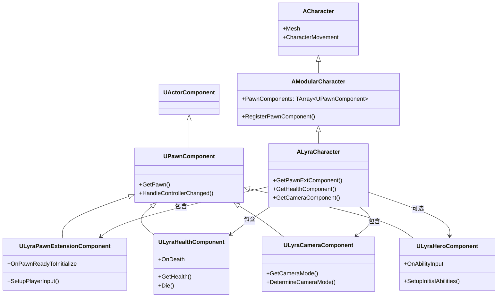
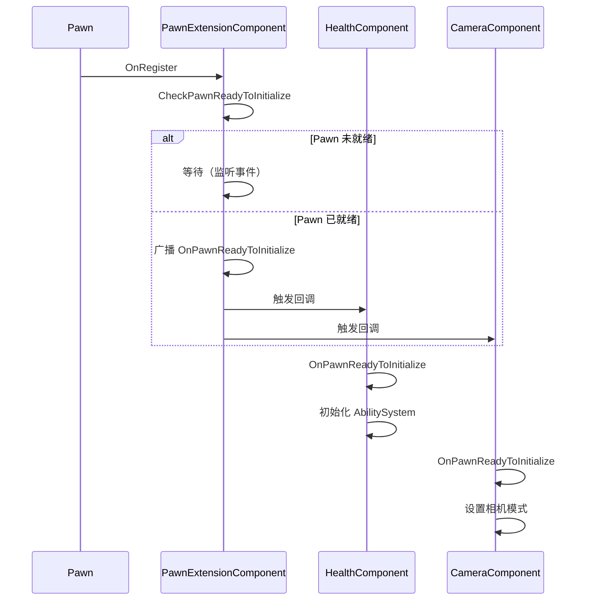
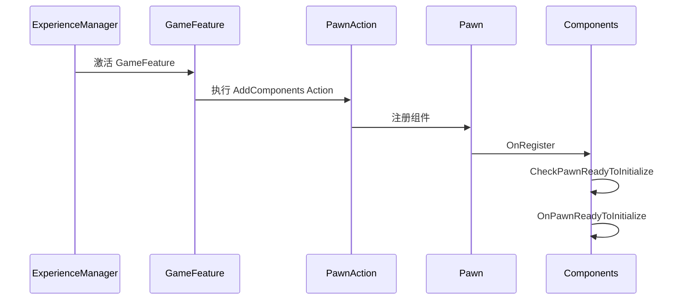
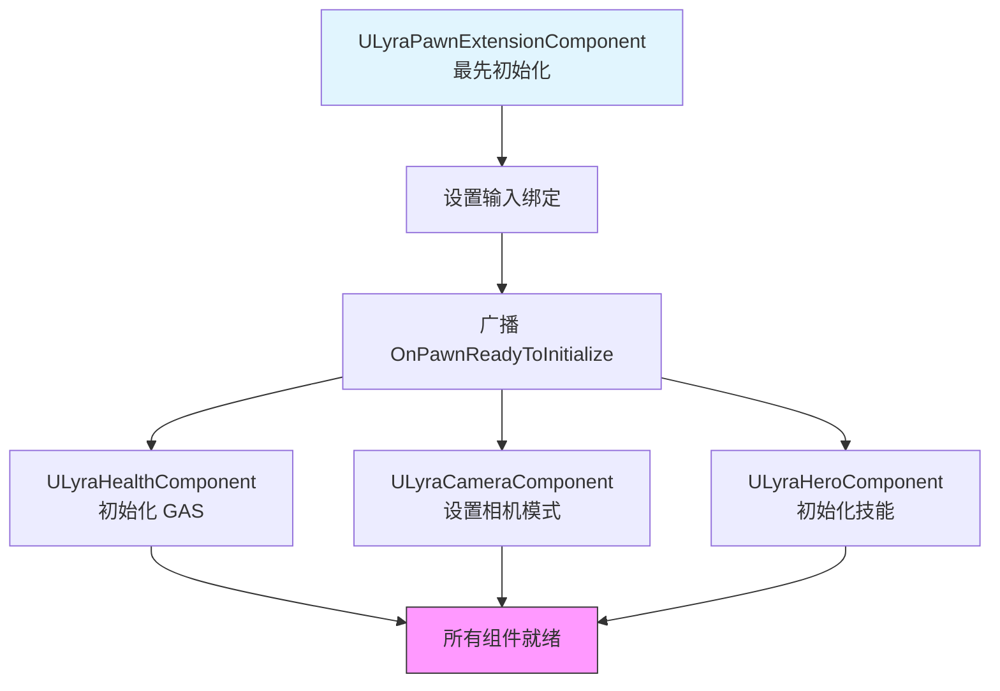

# Lyra实战

> **本课目标**：通过 Lyra 的真实代码，学习 Modular Gameplay 在实际项目中的应用。

## 概述

Lyra 是 Modular Gameplay 的**最佳实践范例**。本课将深入分析：

1. **Lyra 的角色架构** — 如何用组件组装角色
2. **Experience 系统** — 如何动态加载组件
3. **组件协作** — 多个组件如何协同工作
4. **网络同步** — 多人游戏中的组件处理

---

## 1. Lyra 角色架构全景

### 1.1 类图



### 1.2 组件职责划分

| 组件 | 职责 | 初始化时机 |
|------|------|------------|
| `ULyraPawnExtensionComponent` | 基础扩展：输入绑定、初始化协调 | 最早 |
| `ULyraHealthComponent` | 生命值管理：伤害、死亡、无敌 | 中等 |
| `ULyraCameraComponent` | 相机控制：相机模式、视角 | 中等 |
| `ULyraHeroComponent` | 英雄功能：技能、输入 | 较晚 |
| `ULyraEquipmentManagerComponent` | 装备管理：武器、道具 | 动态 |

---

## 2. 核心组件分析

### 2.1 ULyraPawnExtensionComponent（基础组件）

**职责**：所有 Lyra Pawn 的"基础组件"，负责协调其他组件的初始化。

```cpp
// Source/LyraGame/Character/LyraPawnExtensionComponent.h
UCLASS()
class ULyraPawnExtensionComponent : public UPawnComponent
{
    GENERATED_BODY()

public:
    // 当 Pawn 准备初始化时广播（委托类型，具体声明见 Lyra 源码）
    FOnPawnReadyToInitialize OnPawnReadyToInitialize;

    // 判断是否已初始化
    bool IsPawnReadyToInitialize() const { return bPawnReadyToInitialize; }

protected:
    virtual void OnRegister() override;
    virtual void EndPlay(const EEndPlayReason::Type EndPlayReason) override;

    // 检查 Pawn 是否准备就绪
    void CheckPawnReadyToInitialize();

    // 设置玩家输入
    void SetupPlayerInput();

private:
    bool bPawnReadyToInitialize = false;
};
```

**初始化逻辑**：



### 2.2 ULyraHealthComponent（生命值组件）

**职责**：管理 Pawn 的生命值，处理伤害和死亡。

```cpp
// Source/LyraGame/Character/LyraHealthComponent.h
UCLASS()
class ULyraHealthComponent : public UPawnComponent
{
    GENERATED_BODY()

public:
    // 获取当前生命值
    UFUNCTION(BlueprintCallable)
    float GetHealth() const;

    // 获取最大生命值
    UFUNCTION(BlueprintCallable)
    float GetMaxHealth() const;

    // 死亡事件
    FGameplayTagCountContainer OnDeath;

    // 造成伤害
    UFUNCTION(BlueprintCallable)
    void TakeDamage(float Damage, const FDamageEvent& DamageEvent);

protected:
    virtual void OnRegister() override;
    
    // 当 Pawn 准备初始化时调用
    void OnPawnReadyToInitialize();

private:
    UPROPERTY()
    float Health = 100.0f;

    UPROPERTY()
    float MaxHealth = 100.0f;
};
```

**关键实现**：

```cpp
void ULyraHealthComponent::OnRegister()
{
    Super::OnRegister();
    
    // 监听 Pawn 初始化
    if (ULyraPawnExtensionComponent* PawnExt = 
        ULyraPawnExtensionComponent::FindPawnExtensionComponent(GetOwnerPawn()))
    {
        PawnExt->OnPawnReadyToInitialize.AddUObject(this, 
            &ThisClass::OnPawnReadyToInitialize);
    }
}

void ULyraHealthComponent::OnPawnReadyToInitialize()
{
    // ✅ 安全访问 AbilitySystem
    if (UAbilitySystemComponent* ASC = 
        UAbilitySystemBlueprintLibrary::GetAbilitySystemComponentFromActor(GetOwnerPawn()))
    {
        // 初始化生命值
        Health = MaxHealth;
        
        // 绑定伤害事件
        ASC->OnDamageReceived.AddUObject(this, &ThisClass::OnDamageReceived);
    }
}
```

### 2.3 ULyraCameraComponent（相机组件）

**职责**：管理 Pawn 的相机模式。

```cpp
// Source/LyraGame/Character/LyraCameraComponent.h
UCLASS()
class ULyraCameraComponent : public UPawnComponent
{
    GENERATED_BODY()

public:
    // 获取当前相机模式
    UFUNCTION(BlueprintCallable)
    TSubclassOf<ULyraCameraMode> GetCameraMode() const;

protected:
    virtual void OnRegister() override;
    
    // 确定相机模式
    TSubclassOf<ULyraCameraMode> DetermineCameraMode();

private:
    UPROPERTY()
    TSubclassOf<ULyraCameraMode> CameraMode;
};
```

---

## 3. Experience 系统集成

### 3.1 动态加载组件

Lyra 通过 Experience 系统动态加载 GameFeature，从而动态注册组件：



### 3.2 GameFeatureAction_AddComponents

```cpp
// 简化示例：GameFeature 如何添加组件
UCLASS()
class UGameFeatureAction_AddPawnComponent : public UGameFeatureAction
{
    GENERATED_BODY()

protected:
    virtual void OnGameFeatureActivating() override
    {
        // 注册回调：当 Pawn 注册 PawnComponent 时
        FGameFrameworkComponentManager::Get().RegisterComponentInitCallback(
            ULyraMyComponent::StaticClass(),
            FComponentInitDelegate::CreateUObject(this, &ThisClass::OnComponentInitialized)
        );
    }

    virtual void OnGameFeatureDeactivating() override
    {
        // 注销回调
    }

private:
    void OnComponentInitialized(UActorComponent* Component)
    {
        // 组件已注册，可以安全使用
        if (ULyraMyComponent* MyComp = Cast<ULyraMyComponent>(Component))
        {
            MyComp->Initialize();
        }
    }
};
```

---

## 4. 组件协作模式

### 4.1 事件驱动协作

Lyra 的组件通过**事件**而非**直接引用**进行协作：

```cpp
// ✅ 推荐：通过事件协作
void ULyraHealthComponent::OnPawnReadyToInitialize()
{
    if (ULyraPawnExtensionComponent* PawnExt = 
        ULyraPawnExtensionComponent::FindPawnExtensionComponent(GetOwnerPawn()))
    {
        // 监听死亡事件
        PawnExt->OnDeath.AddUObject(this, &ThisClass::OnDeath);
    }
}

// ❌ 避免：直接引用其他组件
UCLASS()
class ULyraHealthComponent : public UPawnComponent
{
    // 不要直接引用其他组件！
    UPROPERTY()
    ULyraCameraComponent* Camera;  // ❌
};
```

### 4.2 初始化顺序控制



---

## 5. 网络同步

### 5.1 组件属性同步

```cpp
UCLASS()
class ULyraHealthComponent : public UPawnComponent
{
    GENERATED_BODY()

public:
    // ✅ 使用 RepNotify 同步生命值
    UPROPERTY(ReplicatedUsing=OnRep_Health)
    float Health;

    UFUNCTION()
    void OnRep_Health(float OldHealth);

    // ✅ 使用 Gameplay Tags 同步状态
    UPROPERTY()
    FGameplayTagCountContainer ActiveGameplayTags;
};

// 网络同步设置
void ULyraHealthComponent::GetLifetimeReplicatedProps(TArray<FLifetimeProperty>& OutLifetimeProps) const
{
    Super::GetLifetimeReplicatedProps(OutLifetimeProps);

    DOREPLIFETIME(ULyraHealthComponent, Health);
}
```

### 5.2 客户端预测

```cpp
void ULyraHealthComponent::TakeDamage(float Damage, const FDamageEvent& DamageEvent)
{
    // 客户端预测
    if (GetOwnerPawn()->HasAuthority())
    {
        // ✅ Server: 实际应用伤害
        Health = FMath::Max(0.0f, Health - Damage);
    }
    else
    {
        // ✅ Client: 预测伤害（等待 Server 确认）
        PredictiveHealth = Health - Damage;
    }
}
```

---

## 6. 总结与要点

### Lyra 的 Modular Gameplay 实践总结

| 实践 | 说明 |
|------|------|
| **组件职责单一** | 每个组件只做一件事 |
| **事件驱动协作** | 通过 `OnPawnReadyToInitialize` 协调初始化 |
| **动态加载** | 通过 GameFeature + Experience 动态组装 |
| **网络同步** | 使用 `Replicated` 属性和 `OnRep` 函数 |

### 关键要点

1. **ULyraPawnExtensionComponent** 是所有组件的"协调者"
2. **初始化安全点**：`OnPawnReadyToInitialize` 是唯一安全访问点
3. **组件协作**：通过事件而非直接引用
4. **动态组装**：Experience 系统 + GameFeature 实现运行时加载

### 下一步

下一课 **[05-ModularGameplay高级主题与最佳实践](05-ModularGameplay高级主题与最佳实践.md)** 将学习自定义组件和高级主题。

## 相关页面

- [[30-tutorials/modular-gameplay/01-ModularGameplay是什么]] - Modular Gameplay 架构文档
- [[30-tutorials/lyra-practical/02-ExperienceSystem详解]] - Experience 系统
- [[30-tutorials/modular-gameplay/03-组件生命周期]] - 上一课：组件生命周期

---

> 下一课：**[05-ModularGameplay高级主题与最佳实践](05-ModularGameplay高级主题与最佳实践.md) — 高级主题与最佳实践**

<!-- nav:auto -->

---

**导航**: ← [[30-tutorials/modular-gameplay/03-组件生命周期|03-组件生命周期]] · [[30-tutorials/modular-gameplay/05-ModularGameplay高级主题与最佳实践|05-ModularGameplay高级主题与最佳实践]] →

<!-- /nav:auto -->
