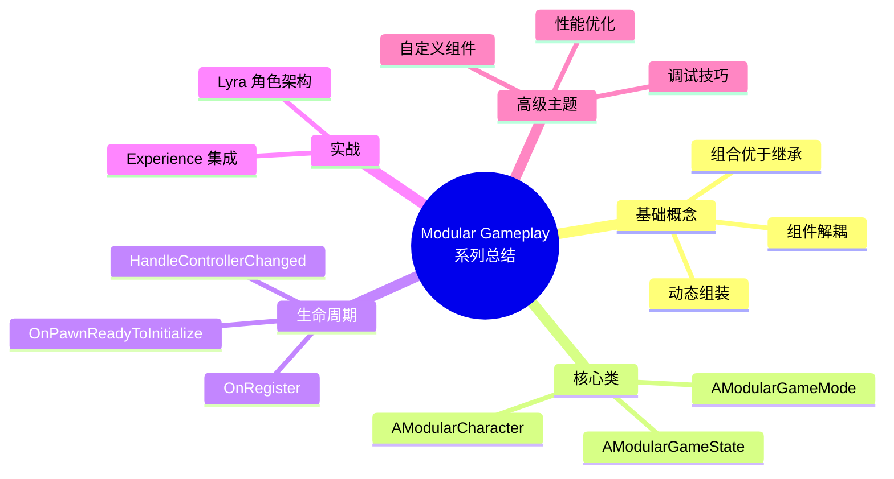

# ModularGameplay高级主题与最佳实践

> **本课目标**：掌握自定义 Modular Gameplay 组件的高级技巧和实战经验。

## 概述

本课将学习：
1. **自定义 Pawn Component** — 从零开始创建自己的组件
2. **自定义 GameFeatureAction** — 扩展 GameFeature 系统
3. **性能优化** — 避免常见性能陷阱
4. **调试技巧** — 如何调试组件生命周期
5. **最佳实践总结** — Lyra 团队的经验教训

---

## 1. 自定义 Pawn Component

### 1.1 完整模板

```cpp
// MyCustomComponent.h
UCLASS(ClassGroup=(Custom), meta=(BlueprintSpawnableComponent))
class UMyCustomComponent : public UPawnComponent
{
    GENERATED_BODY()

public:
    UMyCustomComponent();

protected:
    // ========== 生命周期 ==========
    
    virtual void OnRegister() override;
    virtual void BeginPlay() override;
    virtual void EndPlay(const EEndPlayReason::Type EndPlayReason) override;
    virtual void OnUnregister() override;

    // ========== Pawn 事件回调 ==========
    
    virtual void HandleControllerChanged(APawn* Pawn, 
                                        AController* OldController, 
                                        AController* NewController) override;
    virtual void HandlePlayerStateChanged(APawn* Pawn, 
                                         APlayerState* OldPlayerState, 
                                         APlayerState* NewPlayerState) override;

    // ========== 初始化 ==========
    
    void OnPawnReadyToInitialize();

    // ========== 属性 ==========
    
    UPROPERTY(ReplicatedUsing=OnRep_IsActive)
    bool bIsActive = false;

    UFUNCTION()
    void OnRep_IsActive();

    // ========== 网络 ==========
    
    virtual void GetLifetimeReplicatedProps(TArray<FLifetimeProperty>& OutLifetimeProps) const override;

private:
    // 监听 Pawn 初始化
    void InitPawnReadyCallback();
};
```

### 1.2 实现要点

```cpp
// MyCustomComponent.cpp
UMyCustomComponent::UMyCustomComponent()
{
    // ✅ 设置网络同步
    SetIsReplicatedByDefault(true);
}

void UMyCustomComponent::OnRegister()
{
    Super::OnRegister();
    
    // ✅ 监听 Pawn 初始化
    InitPawnReadyCallback();
    
    UE_LOG(LogTemp, Log, TEXT("[MyCustomComponent] Registered for Pawn: %s"), 
        *GetOwnerPawn()->GetName());
}

void UMyCustomComponent::BeginPlay()
{
    Super::BeginPlay();
    
    // ✅ BeginPlay 中可以安全地做一些事，但还不能直接访问 PlayerState
}

void UMyCustomComponent::OnPawnReadyToInitialize()
{
    // ✅ 唯一安全访问点：可以访问 ASC、PlayerState、Controller
    
    APawn* Pawn = GetOwnerPawn();
    AController* Controller = GetController();
    APlayerState* PlayerState = GetPlayerState();
    
    UE_LOG(LogTemp, Log, TEXT("[MyCustomComponent] Pawn ready: %s, Controller: %s"), 
        *Pawn->GetName(), *Controller->GetName());
    
    // 初始化 AbilitySystem
    if (UAbilitySystemComponent* ASC = 
        UAbilitySystemBlueprintLibrary::GetAbilitySystemComponentFromActor(Pawn))
    {
        // 绑定事件、授予技能等
    }
}

void UMyCustomComponent::HandleControllerChanged(APawn* Pawn, 
                                                AController* OldController, 
                                                AController* NewController)
{
    // ✅ 处理 Input 绑定变化
    
    if (OldController)
    {
        // 取消旧的 Input 绑定
    }
    
    if (NewController && bIsActive)
    {
        // 设置新的 Input 绑定
    }
}

void UMyCustomComponent::HandlePlayerStateChanged(APawn* Pawn, 
                                                  APlayerState* OldPlayerState, 
                                                  APlayerState* NewPlayerState)
{
    // ✅ 重新绑定 GAS
    
    if (OldPlayerState)
    {
        // 清理旧的 GAS 绑定
    }
    
    if (NewPlayerState)
    {
        // 绑定新的 GAS
    }
}

void UMyCustomComponent::EndPlay(const EEndPlayReason::Type EndPlayReason)
{
    // ✅ 清理资源
    
    UE_LOG(LogTemp, Log, TEXT("[MyCustomComponent] EndPlay: %s"), 
        *GetOwnerPawn()->GetName());
    
    Super::EndPlay(EndPlayReason);
}

void UMyCustomComponent::OnUnregister()
{
    // ✅ 注销事件
    
    Super::OnUnregister();
}

void UMyCustomComponent::GetLifetimeReplicatedProps(TArray<FLifetimeProperty>& OutLifetimeProps) const
{
    Super::GetLifetimeReplicatedProps(OutLifetimeProps);

    DOREPLIFETIME(UMyCustomComponent, bIsActive);
}

void UMyCustomComponent::InitPawnReadyCallback()
{
    if (ULyraPawnExtensionComponent* PawnExt = 
        ULyraPawnExtensionComponent::FindPawnExtensionComponent(GetOwnerPawn()))
    {
        PawnExt->OnPawnReadyToInitialize.AddUObject(this, 
            &ThisClass::OnPawnReadyToInitialize);
    }
}
```

---

## 2. 自定义 GameFeatureAction

### 2.1 为什么需要自定义 Action？

`UGameFeatureAction` 是 GameFeature 的"执行单元"。内置的 Action 有：
- `UGameFeatureAction_AddComponents` — 添加组件
- `UGameFeatureAction_AddAbilities` — 授予技能
- `UGameFeatureAction_AddInputConfig` — 添加输入配置

**自定义场景**：
- 注册自定义数据表
- 初始化全局系统
- 动态修改 GameMode 设置

### 2.2 自定义 Action 模板

```cpp
// MyGameFeatureAction_RegisterData.h
UCLASS()
class UMyGameFeatureAction_RegisterData : public UGameFeatureAction
{
    GENERATED_BODY()

public:
    // 要注册的数据表
    UPROPERTY(EditAnywhere, Category="GameFeature")
    TArray<UDataTable*> DataTablesToRegister;

protected:
    virtual void OnGameFeatureActivating() override;
    virtual void OnGameFeatureDeactivating() override;

private:
    void RegisterDataTables();
    void UnregisterDataTables();
};
```

**实现**：

```cpp
// MyGameFeatureAction_RegisterData.cpp
void UMyGameFeatureAction_RegisterData::OnGameFeatureActivating()
{
    Super::OnGameFeatureActivating();
    
    RegisterDataTables();
}

void UMyGameFeatureAction_RegisterData::OnGameFeatureDeactivating()
{
    UnregisterDataTables();
    
    Super::OnGameFeatureDeactivating();
}

void UMyGameFeatureAction_RegisterData::RegisterDataTables()
{
    for (UDataTable* DataTable : DataTablesToRegister)
    {
        if (DataTable)
        {
            // 注册到全局数据管理器
            UMyDataManager::Get().RegisterDataTable(DataTable);
            
            UE_LOG(LogTemp, Log, TEXT("[GameFeature] Registered DataTable: %s"), 
                *DataTable->GetName());
        }
    }
}

void UMyGameFeatureAction_RegisterData::UnregisterDataTables()
{
    for (UDataTable* DataTable : DataTablesToRegister)
    {
        if (DataTable)
        {
            UMyDataManager::Get().UnregisterDataTable(DataTable);
        }
    }
}
```

### 2.3 在 GameFeatureData 中使用

```cpp
// 在 GameFeatureData 中添加自定义 Action
UMyGameFeatureAction_RegisterData* Action = NewObject<UMyGameFeatureAction_RegisterData>(GameFeatureData);
Action->DataTablesToRegister.Add(MyDataTable);
GameFeatureData->Actions.Add(Action);
```

---

## 3. 性能优化

### 3.1 常见性能陷阱

| 陷阱 | 问题 | 解决方案 |
|------|------|----------|
| **Tick 组件** | 每帧更新，性能消耗大 | 禁用 Tick，使用事件驱动 |
| **过多组件** | 组件数量过多 | 按需加载，使用 Experience 动态组装 |
| **频繁 GetComponent** | 运行时频繁查找组件 | 缓存组件指针 |
| **不必要的复制** | 复制不必要的数据 | 使用 `ReplicatedUsing` 按需同步 |

### 3.2 优化技巧

```cpp
UCLASS()
class UMyOptimizedComponent : public UPawnComponent
{
    GENERATED_BODY()

public:
    UMyOptimizedComponent();

protected:
    virtual void OnRegister() override;

private:
    // ✅ 缓存组件指针
    UPROPERTY()
    TWeakObjectPtr<ULyraHealthComponent> CachedHealthComponent;
    
    // ✅ 禁用 Tick（如果不需要）
    void DisableTick();
};

UMyOptimizedComponent::UMyOptimizedComponent()
{
    // ✅ 禁用 Tick
    PrimaryComponentTick.bCanEverTick = false;
    PrimaryComponentTick.bStartWithTickEnabled = false;
}

void UMyOptimizedComponent::OnRegister()
{
    Super::OnRegister();
    
    // ✅ 缓存组件指针（避免后续查找）
    if (ULyraPawnExtensionComponent* PawnExt = 
        ULyraPawnExtensionComponent::FindPawnExtensionComponent(GetOwnerPawn()))
    {
        CachedHealthComponent = PawnExt->GetOwnerPawn()->FindComponentByClass<ULyraHealthComponent>();
    }
}
```

### 3.3 网络优化

```cpp
UCLASS()
class UMyNetworkedComponent : public UPawnComponent
{
    GENERATED_BODY()

protected:
    // ✅ 只复制必要属性
    UPROPERTY(ReplicatedUsing=OnRep_Health)
    float Health;

    // ✅ 使用 RepNotify 而不是每帧同步
    UFUNCTION()
    void OnRep_Health(float OldHealth);

    // ✅ 使用 Gameplay Tags 代替枚举复制
    UPROPERTY()
    FGameplayTagCountContainer ActiveTags;
};
```

---

## 4. 调试技巧

### 4.1 日志分类

```cpp
// 在模块头文件中定义日志分类
DECLARE_LOG_CATEGORY_EXTERN(LogMyGameplay, Log, All);

// 在模块实现文件中定义
DEFINE_LOG_CATEGORY(LogMyGameplay);

// 使用
UE_LOG(LogMyGameplay, Log, TEXT("[%s] Component registered"), *GetName());
```

### 4.2 可视化调试

```cpp
void UMyCustomComponent::OnRegister()
{
    Super::OnRegister();
    
    // ✅ 在屏幕上显示调试信息
#if !UE_BUILD_SHIPPING
    if (GEngine && GetOwnerPawn())
    {
        GEngine->AddOnScreenDebugMessage(-1, 5.0f, FColor::Green, 
            FString::Printf(TEXT("[%s] MyCustomComponent registered"), 
                *GetOwnerPawn()->GetName()));
    }
#endif
}
```

### 4.3 使用 Console Command 调试

```cpp
// 注册控制台命令
static FAutoConsoleCommand DebugMyComponentCommand(
    TEXT("MyGame.DebugComponent"),
    TEXT("Debug my component state"),
    FConsoleCommandWithArgsDelegate::CreateLambda([](const TArray<FString>& Args)
    {
        if (Args.Num() > 0)
        {
            UE_LOG(LogTemp, Log, TEXT("[Debug] Component state: %s"), *Args[0]);
        }
    })
);
```

---

## 5. 最佳实践总结

### 5.1 DO（推荐）

| 实践 | 说明 |
|------|------|
| ✅ **单一职责** | 每个组件只做一件事 |
| ✅ **事件驱动** | 使用 `OnPawnReadyToInitialize` 而非 Tick |
| ✅ **缓存指针** | 避免运行时 `FindComponentByClass` |
| ✅ **按需加载** | 使用 Experience 动态组装组件 |
| ✅ **网络优化** | 只复制必要数据，使用 `RepNotify` |
| ✅ **清理资源** | 在 `EndPlay` 和 `OnUnregister` 中清理 |

### 5.2 DON'T（避免）

| 反模式 | 问题 |
|---------|------|
| ❌ **在 `OnRegister` 中访问 `GetController()`** | Controller 可能还未设置 |
| ❌ **在 `BeginPlay` 中访问 `PlayerState`** | PlayerState 可能还未复制 |
| ❌ **使用 Tick 做轮询** | 性能消耗大，改用事件 |
| ❌ **组件间直接引用** | 造成耦合，改用事件 |
| ❌ **复制大量数据** | 造成网络带宽浪费 |

### 5.3 Lyra 团队的教训

> **教训 1**：不要过早优化
> - 先让功能跑起来，再优化性能
> 
> **教训 2**：组件职责要清晰
> - `ULyraHealthComponent` 只管生命值，不管 UI
> - UI 通过监听事件更新
> 
> **教训 3**：使用 Experience 系统动态组装
> - 不要在 `ALyraCharacter` 中硬编码所有组件
> - 让每个 Experience 定义自己需要的组件

---

## 6. 总结

### 系列回顾



### 你可以继续学习

| 方向 | 推荐教程 | 说明 |
|------|----------|------|
| **GameFeature 系统** | `30-tutorials/game-feature/` | 与 Modular Gameplay 协同工作 |
| **GAS 系统** | `30-tutorials/gas/` | 在组件中集成 Ability System |
| **Lyra 架构** | `10-architecture/overview` | 深入理解 Lyra 的设计理念 |

---

## 相关页面

- [[30-tutorials/modular-gameplay/01-ModularGameplay是什么]] - Modular Gameplay 架构文档
- [[30-tutorials/game-feature/00-GameFeature系统从入门到实战]] - GameFeature 教程系列
- [[30-tutorials/modular-gameplay/04-Lyra实战]] - 上一课：Lyra 实战

---

> **系列完成！** 🎉 你现在掌握了 UE5 Modular Gameplay 的核心知识和实战技巧。

<!-- nav:auto -->

---

**导航**: ← [[30-tutorials/modular-gameplay/04-Lyra实战|04-Lyra实战]]

<!-- /nav:auto -->
