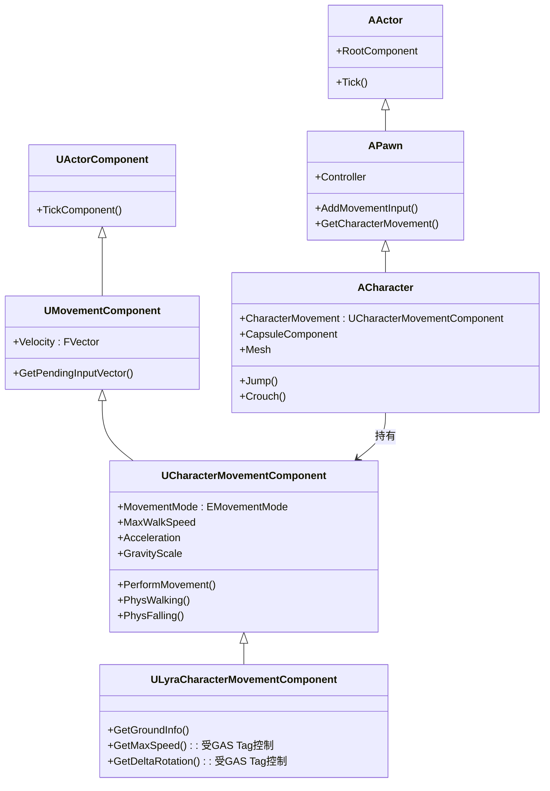

# UE移动系统深度解析系列概览

> 从 `UCharacterMovementComponent` 架构到 Lyra 实战，系统学习 UE 角色移动的完整技术体系。

## 概述

`UCharacterMovementComponent`（简称 **CMC**）是 Unreal Engine 中驱动 `ACharacter` 移动的核心组件。它处理行走、跳跃、飞行、游泳等所有移动模式，并内置完整的**网络预测与校正**机制。

本系列从引擎层源码出发，逐层解析 CMC 的架构设计、物理参数、网络同步机制，最后落地到 Lyra 项目中的实战应用。

## 核心概念全景图

## MovementMode 体系

| MovementMode | 枚举值 | 核心行为 | 关键函数 |
|-------------|---------|---------|---------|
| **Walking** | `MOVE_Walking` | 在可行走表面上移动，受摩擦力影响 | `PhysWalking()` |
| **Falling** | `MOVE_Falling` | 受重力影响下落，可空中控制 | `PhysFalling()` |
| **Flying** | `MOVE_Flying` | 忽略重力，自由飞行 | `PhysFlying()` |
| **Swimming** | `MOVE_Swimming` | 在流体体积内移动，受浮力影响 | `PhysSwimming()` |
| **Custom** | `MOVE_Custom` | 用户自定义移动逻辑 | `PhysCustom()` |

## 与 Lyra 项目的关系

| 引擎层 | Lyra 扩展 | 扩展目的 |
|---------|---------|---------|
| `UCharacterMovementComponent` | `ULyraCharacterMovementComponent` | 增加 `GetGroundInfo()`、GAS Tag 控制移动停止 |
| `ACharacter::AddMovementInput()` | `ALyraCharacter::UpdateSharedReplication()` | 移动网络同步优化（`FSharedRepMovement`） |
| `UCharacterMovementComponent::GetMaxSpeed()` | 覆写：受 `Gameplay.MovementStopped` Tag 阻断 | GAS 能力阻断移动 |
| `UCharacterMovementComponent::CanAttemptJump()` | 覆写：允许 Fall 中二段跳 | Lyra 跳跃机制扩展 |

## 系列学习路线

### 第一阶段：基础架构

| 课程序号 | 标题 | 核心内容 |
|---------|------|---------|
| 00 | 本概览 | 全景图、核心概念、学习路线 |
| 01 | CMC 架构详解 | 类继承树、核心属性（Velocity/Acceleration/MaxWalkSpeed）、Tick 流程 |

### 第二阶段：移动模式与输入

| 课程序号 | 标题 | 核心内容 |
|---------|------|---------|
| 02 | MovementMode 详解 | 五种模式切换机制、`PhysWalking()`/`PhysFalling()` 源码分析 |
| 03 | 输入到移动的全链路 | `AddMovementInput()` → `Acceleration` → `CalcVelocity()` → `PerformMovement()` 完整调用链 |

### 第三阶段：移动物理与数学

| 课程序号 | 标题 | 核心内容 |
|---------|------|---------|
| 04 | 移动物理参数详解 | `Friction`、`BrakingDeceleration`、`MaxAcceleration`、`AirControl`、`GravityScale` |
| 05 | 跳跃 / 飞行 / 游泳机制 | `DoJump()`、`AirControl`、Fly/Swim 模式特殊逻辑 |

### 第四阶段：网络同步与高级主题

| 课程序号 | 标题 | 核心内容 |
|---------|------|---------|
| 06 | 移动网络同步机制 | `ReplicatedMovement`、`FLyraReplicatedAcceleration`、`FSharedRepMovement`、`FastSharedReplication`、客户端预测与校正 |
| 07 | 自定义移动模式 | `PhysCustom()` 扩展点、CustomMode 注册与使用 |
| 08 | Root Motion 机制 | `FRootMotionMovementParams`、与 CMC 的协作 |

### 第五阶段：Lyra 实战

| 课程序号 | 标题 | 核心内容 |
|---------|------|---------|
| 09 | Lyra 移动系统实战 | `ULyraCharacterMovementComponent` 三大扩展点、`Gameplay.MovementStopped` Tag 应用、Death 流程与移动系统交互 |

### 第六阶段：Crouch 机制

| 课程序号 | 标题 | 核心内容 |
|---------|------|---------|
| 10 | 蹲伏（Crouch）机制 | 引擎层实现、对移动/碰撞/相机的影响、Lyra 中的 GAS 集成 |

## 相关页面

- [[30-tutorials/ue-framework/50-player-system/00-APawn与ACharacter详解]] - Pawn / Character 基础
- [[30-tutorials/ue-framework/50-player-system/01-AController详解]] - Controller 与输入处理
- [[30-tutorials/input-system/00-UE5输入系统系列概览]] - UE5 输入系统系列
- [[30-tutorials/gas/00-GAS系统总览]] - GAS 系统总览（`Gameplay.MovementStopped` Tag 相关）

<!-- nav:auto -->

---

**导航**: [[30-tutorials/movement-system/01-UCharacterMovementComponent架构详解|01-UCharacterMovementComponent架构详解]] →

<!-- /nav:auto -->
