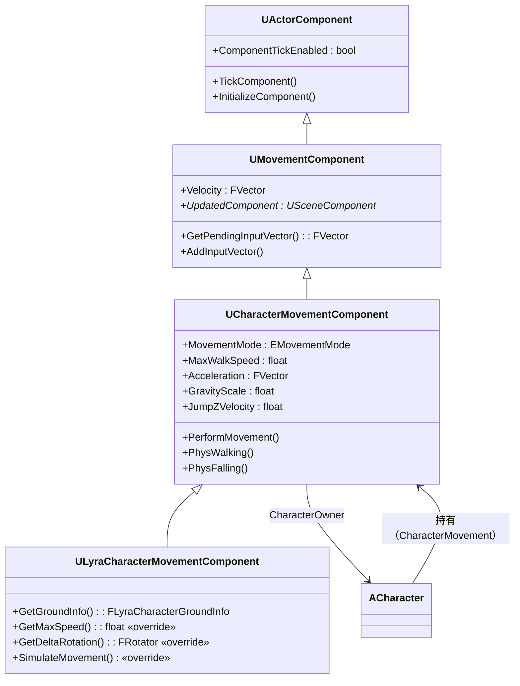
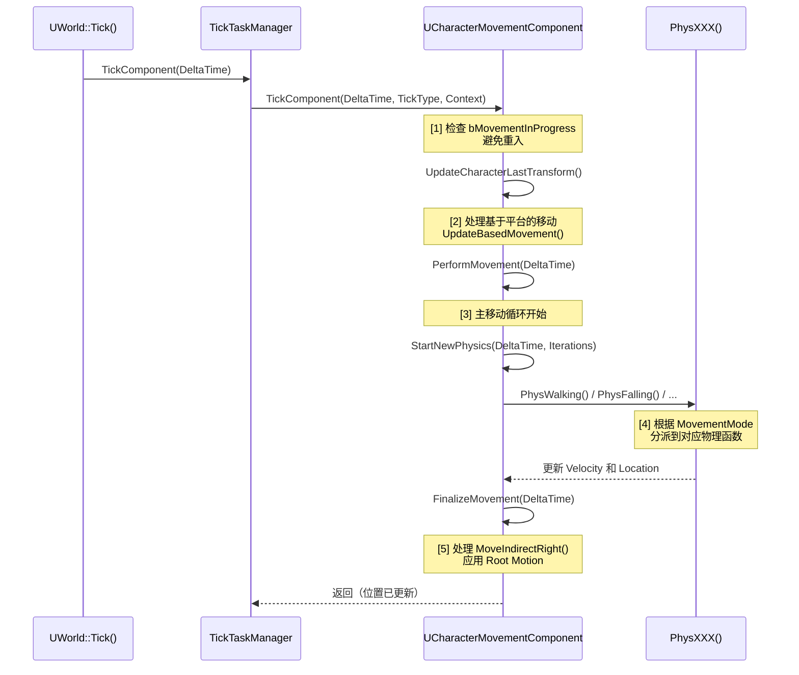

# UCharacterMovementComponent架构详解

> 理解 CMC 在 UE 架构中的位置：它如何继承、持有怎样的属性、每一帧如何驱动角色移动。

## 概述

`UCharacterMovementComponent`（简称 **CMC**）是 `ACharacter` 的核心移动引擎。它不直接继承 `AActor`，而是作为 `UActorComponent` 挂载在 `ACharacter` 上，每帧计算 `Velocity`，执行碰撞检测，并更新 `CharacterOwner` 的位置。

学完本课你将能够：
- 画出 CMC 的完整继承树
- 列举 10 个以上影响移动行为的核心属性
- 描述一帧内 `TickComponent()` → `PerformMovement()` 的调用链
- 解释 CMC 与 `ACharacter`、`UCharacter` 的关系

---

## 一、类继承树



**关键点**：
- `UActorComponent` → `UMovementComponent` → `UCharacterMovementComponent` 是三层继承链
- `UMovementComponent` 定义了 `Velocity` 和输入接口（`AddInputVector()`）
- `UCharacterMovementComponent` 实现了所有具体移动模式（Walking/Falling/Flying/Swimming/Custom）
- `ACharacter` **持有**一个 `UCharacterMovementComponent*`（`CharacterMovement` 属性），而非继承

---

## 二、核心属性详解

以下属性均在 `UCharacterMovementComponent.h` 中定义，是控制移动行为的主要调参入口。

### 2.1 移动模式（MovementMode）

```cpp
// Engine/Source/Runtime/Engine/Classes/GameFramework/CharacterMovementComponent.h:L228-L237
UPROPERTY(Category="Character Movement (MovementMode)", BlueprintReadOnly)
TEnumAsByte<enum EMovementMode> MovementMode;

UPROPERTY(Category="Character Movement (MovementMode)", BlueprintReadOnly)
uint8 CustomMovementMode;
```

`MovementMode` 决定当前使用哪种物理模拟分支。引擎层对应的物理函数为：

| MovementMode | 物理函数 | 说明 |
|-------------|---------|------|
| `MOVE_Walking` | `PhysWalking()` | 走/跑，受地面摩擦力影响 |
| `MOVE_Falling` | `PhysFalling()` | 自由落体，受 `AirControl` 影响 |
| `MOVE_Flying` | `PhysFlying()` | 飞行，忽略重力 |
| `MOVE_Swimming` | `PhysSwimming()` | 游泳，受浮力影响 |
| `MOVE_Custom` | `PhysCustom()` | 自定义模式，由 `CustomMovementMode` 区分 |

切换模式调用 `SetMovementMode(MOVE_Walking)` 即可，CMC 会自动处理状态迁移。

### 2.2 速度相关属性

```cpp
// 当前速度（世界坐标系），每帧由 PerformMovement() 更新
UPROPERTY()
FVector Velocity;  // [1] 这是移动系统的核心状态变量

// 地面最大行走速度
UPROPERTY(Category="Character Movement: Walking", EditAnywhere, BlueprintReadWrite)
float MaxWalkSpeed;  // [2] 默认值通常为 600 cm/s

// 蹲伏时的最大行走速度
UPROPERTY(Category="Character Movement: Walking", EditAnywhere, BlueprintReadWrite)
float MaxWalkSpeedCrouched;

// 游泳最大速度
UPROPERTY(Category="Character Movement: Swimming", EditAnywhere, BlueprintReadWrite)
float MaxSwimSpeed;

// 飞行最大速度
UPROPERTY(Category="Character Movement: Flying", EditAnywhere, BlueprintReadWrite)
float MaxFlySpeed;
```

**[1]** `Velocity` 是 CMC 最重要的状态变量。它不是 `UPROPERTY`，不会复制，每帧由 `PerformMovement()` 重新计算。`ACharacter::GetVelocity()` 直接返回 `CharacterMovement->Velocity`。

**[2]** `MaxWalkSpeed` 是"地面移动时的最高速度上限"，但不直接等于 `Velocity` 的大小。`CalcVelocity()` 函数在每帧根据 `Acceleration`、`GroundFriction`、`BrakingDecelerationWalking` 等参数渐进地改变 `Velocity`，最终钳制到 `MaxWalkSpeed`。

### 2.3 加速度与摩擦力

```cpp
// Engine/Source/Runtime/Engine/Classes/GameFramework/CharacterMovementComponent.h:L292-L307
UPROPERTY(Category="Character Movement (General Settings)", EditAnywhere, BlueprintReadWrite)
float MaxAcceleration;  // [3] 加速度上限，影响速度变化快慢

UPROPERTY(Category="Character Movement: Walking", EditAnywhere, BlueprintReadWrite)
float GroundFriction;  // [4] 地面摩擦力系数，影响刹车距离

UPROPERTY(Category="Character Movement (General Settings)", EditAnywhere, BlueprintReadWrite)
float BrakingFrictionFactor;  // [5] 刹车摩擦力倍率（默认 2.0）

UPROPERTY(Category="Character Movement (General Settings)", EditAnywhere, BlueprintReadWrite)
float BrakingFriction;  // 独立刹车摩擦（需 bUseSeparateBrakingFriction=true）
```

**[3]** `MaxAcceleration` 越大，`Velocity` 越快接近 `MaxWalkSpeed`。公式在 `CalcVelocity()` 中：`Velocity += Acceleration * DeltaTime`，然后钳制到 `MaxAcceleration * DeltaTime` 的增量上限。

**[4]** `GroundFriction` 决定"松开按键后多久停下来"。`BrakingDecelerationWalking` 是常数量（与速度无关的减速度），`GroundFriction` 是速度的线性阻力（力 ∝ 速度）。

### 2.4 跳跃与重力

```cpp
// Engine/Source/Runtime/Engine/Classes/GameFramework/CharacterMovementComponent.h:L154-L163
UPROPERTY(Category="Character Movement (General Settings)", EditAnywhere, BlueprintReadWrite)
float GravityScale;  // [6] 重力倍率，1.0 = 默认重力

UPROPERTY(Category="Character Movement: Jumping / Falling", EditAnywhere, BlueprintReadWrite)
float JumpZVelocity;  // [7] 跳跃初速度（垂直方向）

UPROPERTY(Category="Character Movement: Jumping / Falling", EditAnywhere, BlueprintReadWrite)
float AirControl;  // [8] 空中移动控制量（0=无空中控制，1=满速）
```

**[6]** `GravityScale` 乘以 `UWorld::GetGravityZ()` 得到实际重力。默认 UE 世界重力为 `-980 cm/s²`（Z 轴向下为正），故 `GravityScale=1.0` 时每秒速度减少 `980 cm/s`。

**[7]** `JumpZVelocity` 是 `ACharacter::Jump()` 调用时直接赋予 `Velocity.Z` 的值。跳跃高度公式：`H = JumpZVelocity² / (2 * |GravityZ| * GravityScale)`。

**[8]** `AirControl` 控制"在空中时能否用输入改变水平速度"。典型值 `0.3` 表示空中只能达到地面 `MaxWalkSpeed` 的 30% 水平控制力。

---

## 三、Tick 执行流程

CMC 的 `TickComponent()` 是每帧移动的入口。以下是完整调用链（基于 UE 5.7 源码分析）：



### 关键步骤解读

**[1] 重入保护**：`bMovementInProgress` 标志防止在 `PerformMovement()` 内部再次触发移动更新（例如通过 `MoveUpdatedComponent()` 触发的回调中又调用移动）。

**[2] 基于平台的移动**：如果角色站在一个移动的 Actor（如电梯）上，`UpdateBasedMovement()` 会将平台的位移叠加到角色上，避免"站在电梯上却原地不动"的问题。

**[3] `PerformMovement()`**：这是 CMC 的核心函数，约 500 行代码。它处理：
- 加速度计算（`CalcVelocity()`）
- 物理迭代（可能多次调用 `StartNewPhysics()`，取决于 `MaxMoveIterationCount`）
- Root Motion 应用
- 移动后的位置修正（撞墙后的沿墙滑动）

**[4] 物理函数分派**：`StartNewPhysics()` 根据 `MovementMode` 调用对应函数，这些函数是 CMC 的 protected 虚函数，可以在子类中覆写。

---

## 四、与 ACharacter 的关系

`ACharacter` 在构造函数中创建 `UCharacterMovementComponent`：

```cpp
// Engine/Source/Runtime/Engine/Private/GameFramework/Character.cpp（约 L80）
ACharacter::ACharacter(const FObjectInitializer& ObjectInitializer)
    : Super(ObjectInitializer)
{
    // [1] 创建 CapsuleComponent（根部碰撞体）
    CapsuleComponent = CreateDefaultSubobject<UCapsuleComponent>(ACharacter::CapsuleComponentName);
    // ...

    // [2] 创建 CharacterMovementComponent
    CharacterMovement = CreateDefaultSubobject<UCharacterMovementComponent>(
        ACharacter::CharacterMovementComponentName);
    CharacterMovement->UpdatedComponent = CapsuleComponent;  // [3] 绑定碰撞体
    CharacterMovement->CharacterOwner = this;           // [4] 绑定角色所有者

    // [5] 创建 Mesh（骨骼网格体）
    Mesh = CreateDefaultSubobject<USkeletalMeshComponent>(ACharacter::MeshComponentName);
    Mesh->SetupAttachment(CapsuleComponent);
}
```

**[3]** `UpdatedComponent` 告诉 CMC "移动哪个 SceneComponent"。对 `ACharacter` 来说，就是 `CapsuleComponent`（胶囊体）。CMC 所有的位置更新都作用在这个组件上。

**[4]** `CharacterOwner` 是反向引用，让 CMC 能调用 `CharacterOwner->GetActorLocation()` 等方法。

### ACharacter 提供的移动接口

| 函数 | 作用 | 内部调用 |
|---------|---------|---------|
| `AddMovementInput(WorldDirection, Scale)` | 添加移动输入 | `CharacterMovement->AddInputVector()` |
| `Jump()` | 请求跳跃 | `CharacterMovement->DoJump()` |
| `Crouch()` | 请求蹲伏 | `CharacterMovement->Crouch()` |
| `GetVelocity()` | 获取当前速度 | `CharacterMovement->Velocity` |

---

## 五、Lyra 的扩展点

`ULyraCharacterMovementComponent` 覆写了 4 个关键函数，将移动与 GAS 系统集成：

```cpp
// Source/LyraGame/Character/LyraCharacterMovementComponent.h
class ULyraCharacterMovementComponent : public UCharacterMovementComponent
{
    virtual float GetMaxSpeed() const override;        // [5] GAS Tag 可阻断移动
    virtual FRotator GetDeltaRotation(float DeltaTime) const override;  // [6] 同上
    virtual bool CanAttemptJump() const override;      // [7] 允许 Fall 中二段跳
    virtual void SimulateMovement(float DeltaTime) override;  // [8] 保留复制的加速度
};
```

**[5]** `GetMaxSpeed()`：当 ASC 上有 `Gameplay.MovementStopped` Tag 时返回 0，实现"被眩晕/击退时无法移动"的效果。这是 GAS 控制移动的优雅方案——不需要修改 CMC 内部逻辑，只需在 Ability 中施加/移除 Tag。

**[6]** `GetDeltaRotation()`：同理，当有 `Gameplay.MovementStopped` 时返回零旋转，阻断角色转向。

---

## 总结

| 要点 | 说明 |
|------|------|
| CMC 继承链 | `UActorComponent` → `UMovementComponent` → `UCharacterMovementComponent` |
| 核心状态 | `Velocity`（每帧计算）、`MovementMode`（决定物理分支） |
| 关键调参属性 | `MaxWalkSpeed`、`MaxAcceleration`、`GroundFriction`、`JumpZVelocity`、`AirControl` |
| 每帧流程 | `TickComponent()` → `PerformMovement()` → `PhysXXX()` → 更新位置 |
| 与 ACharacter 关系 | 组合而非继承：`ACharacter` 持有 `CharacterMovement` 指针 |
| Lyra 扩展方式 | 覆写 `GetMaxSpeed()` 等，将移动控制权交给 GAS Tag |

---

## 相关页面

- [[30-tutorials/movement-system/00-UE移动系统深度解析系列概览]] ← 系列概览
- [[30-tutorials/movement-system/02-MovementMode详解]] → MovementMode 详解
- [[30-tutorials/ue-framework/50-player-system/00-APawn与ACharacter详解]] - Pawn / Character 基础

<!-- nav:auto -->

---

**导航**: ← [[30-tutorials/movement-system/00-UE移动系统深度解析系列概览|00-UE移动系统深度解析系列概览]] · [[30-tutorials/movement-system/02-MovementMode详解|02-MovementMode详解]] →

<!-- /nav:auto -->
