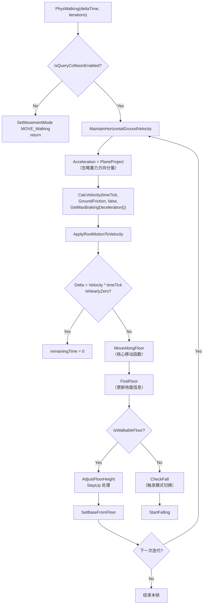

# MovementMode详解

> 深入理解 UE 的五种移动模式：Walking、Falling、Flying、Swimming、Custom，以及模式切换的完整源码机制。

## 概述

`UCharacterMovementComponent` 用 `MovementMode` 枚举决定每帧使用哪套物理规则。`SetMovementMode()` 切换模式时，CMC 会自动处理状态迁移（如离开地面时从 `MOVE_Walking` 切到 `MOVE_Falling`）。

学完本课你将能够：
- 描述五种 MovementMode 各自的行为特征
- 解释 `PhysWalking()` 的完整执行流程
- 理解模式自动切换的触发条件
- 在自定义子类中扩展 `PhysCustom()`

---

## 一、MovementMode 枚举

```cpp
// Engine/Source/Runtime/Engine/Classes/GameFramework/CharacterMovementComponent.h:L218-L237
/**
 *  Actor's current movement mode:
 *   - walking:  Walking on a surface, under friction, able to "step up" barriers.
 *   - falling:  Falling under gravity, after jumping or walking off an edge.
 *   - flying:   Flying, ignoring gravity.
 *   - swimming: Swimming through a fluid volume.
 *   - custom:   User-defined custom movement mode.
 */
UPROPERTY(Category="Character Movement: MovementMode", BlueprintReadOnly)
TEnumAsByte<enum EMovementMode> MovementMode;

UPROPERTY(Category="Character Movement: MovementMode", BlueprintReadOnly)
uint8 CustomMovementMode;  // MovementMode==MOVE_Custom 时的子模式编号
```

`EMovementMode` 定义（在 `Engine/Source/Runtime/Engine/Classes/GameFramework/CharacterMovementComponent.h` 的 enum 区域）：

| 枚举值 | 数值 | 物理函数 | 行为特征 |
|--------|------|---------|---------|
| `MOVE_Walking` | 0 | `PhysWalking()` | 地面移动，摩擦力生效，可"踩上"障碍物 |
| `MOVE_Falling` | 1 | `PhysFalling()` | 受重力下落，可空中控制（`AirControl`） |
| `MOVE_Flying` | 2 | `PhysFlying()` | 忽略重力，全方向自由移动 |
| `MOVE_Swimming` | 3 | `PhysSwimming()` | 在 `APhysicsVolume` 流体体积内，受浮力影响 |
| `MOVE_Custom` | 4 | `PhysCustom()` | 用户自定义，由 `CustomMovementMode` 区分子模式 |

切换模式调用：
```cpp
// 切换到行走模式
CharacterMovement->SetMovementMode(MOVE_Walking);

// 切换到自定义模式 1
CharacterMovement->SetMovementMode(MOVE_Custom, 1);
```

---

## 二、Walking 模式详解

### 2.1 PhysWalking() 执行流程

以下是 `PhysWalking()`（L5554，约 200 行）的核心逻辑拆解：



### 2.2 关键步骤解读

**[1] 加速度平面投影**：Walking 模式下，加速度被投影到地面平面（忽略重力方向分量），确保输入不会把角色"推离地面"。

```cpp
// CharacterMovementComponent.cpp:L5611（在 PhysWalking 内）
Acceleration = FVector::VectorPlaneProject(Acceleration, -GravityDirection);
```

**[2] CalcVelocity()**：根据 `Acceleration`、`GroundFriction`、`BrakingDecelerationWalking` 计算新速度。核心逻辑：
- 有加速度时：`Velocity += Acceleration * DeltaTime`，钳制到 `MaxWalkSpeed`
- 无加速度时：施加摩擦力 `Velocity *= (1 - Friction * DeltaTime)` 和常数量减速度 `Velocity -= BrakingDeceleration * DeltaTime`

**[3] MoveAlongFloor()**：调用 `SafeMoveUpdatedComponent()` 执行带碰撞检测的移动。碰到墙时，会计算"沿墙滑动"向量（将速度分解为"沿墙方向"和"嵌入墙方向"，去掉嵌入分量）。

**[4] FindFloor()**：向下发射射线/扫描体，检测脚下的地面。结果存入 `CurrentFloor`（类型为 `FFindFloorResult`）。

**[5] CheckFall()**：当 `FindFloor()` 返回不可行走地面时，调用 `CheckFall()` → `StartFalling()`，将 `MovementMode` 切换到 `MOVE_Falling`。

### 2.3 踏步（Step Up）机制

Walking 的核心特性之一是能"踩上"障碍物（台阶、门槛等）：

```cpp
// CharacterMovementComponent.cpp 中的 StepUp 相关逻辑
if (CurrentFloor.bWalkableFloor)
{
    // 如果前方有障碍物（碰撞），且高度 < MaxStepHeight
    // 则先向上移动 MaxStepHeight，再向前移动，再向下落回地面
}
```

这解释了为什么 UE 角色能自然走上楼梯——不需要特殊的"楼梯体积"，CMC 会自动处理高度 < `MaxStepHeight`（默认 45 cm）的障碍物。

---

## 三、Falling 模式详解

### 3.1 PhysFalling() 核心逻辑

Falling 模式受重力影响，同时保留一定程度的空中控制：

```cpp
// 伪代码，基于 PhysFalling() 逻辑
void PhysFalling(float deltaTime, int32 iterations)
{
    // [1] 计算重力加速度
    FVector Gravity = GetGravityDirection() * GetGravityZ() * GravityScale;
    Velocity += Gravity * timeTick;

    // [2] 应用空中控制（AirControl）
    if (AirControl > 0.0f && !Acceleration.IsNearlyZero())
    {
        // 只控制水平方向，且最大速度 = MaxWalkSpeed * AirControl
        FVector AirAccel = Acceleration.GetClampedToMaxSize(MaxAcceleration) * AirControl;
        Velocity += AirAccel * timeTick;
    }

    // [3] 移动
    SafeMoveUpdatedComponent(Velocity * timeTick, ...);

    // [4] 检测是否落地
    FindFloor();
    if (CurrentFloor.IsWalkableFloor())
    {
        SetMovementMode(MOVE_Walking);  // 自动切回 Walking
    }
}
```

**AirControl 的作用**：值为 `0.3` 时，空中只能达到地面最高速度的 30% 的水平控制力。这让跳跃弧线有一定可控性，但不会完全抵消惯性的"失控制感"。

### 3.2 自动切换回 Walking

落地检测在每次 `PhysFalling()` 迭代末尾执行：

```cpp
// CharacterMovementComponent.cpp 中 PhysFalling 的落地处理
FindFloor(UpdatedComponent->GetComponentLocation(), CurrentFloor);
if (CurrentFloor.IsWalkableFloor() && 
    CurrentFloor.HitResult.bBlockingHit)
{
    SetMovementMode(MOVE_Walking);
    // 调整位置到地面上方
    AdjustFloorHeight();
}
```

---

## 四、Flying / Swimming / Custom 模式

### 4.1 Flying 模式

```cpp
// PhysFlying() 核心：忽略重力
void UCharacterMovementComponent::PhysFlying(float deltaTime, int32 Iterations)
{
    CalcVelocity(deltaTime, 0.f, false, GetMaxBrakingDeceleration());
    // 注意：Friction = 0，所以空中没有摩擦力减速
    // 但 BrakingDecelerationFlying 提供常数量减速（松开输入时逐渐减速）
    
    SafeMoveUpdatedComponent(Velocity * deltaTime, ...);
}
```

Flying 模式的 `MaxFlySpeed` 是速度上限。由于没有重力，`Velocity.Z` 可以正负自由变化（对应上升/下降）。

### 4.2 Swimming 模式

进入 `APhysicsVolume`（水体体积）时，`APawn::PhysicsVolumeChanged()` 会自动将 MovementMode 切换到 `MOVE_Swimming`。

```cpp
// PhysSwimming() 核心：受 Buoyancy（浮力）影响
void UCharacterMovementComponent::PhysSwimming(float deltaTime, int32 Iterations)
{
    // 浮力：Gravity * (1 - Buoyancy)
    // Buoyancy = 1.0 → 完全浮力（悬浮）
    // Buoyancy = 0.0 → 完全重力
    FVector NetGravity = Gravity * (1.0f - Buoyancy);
    Velocity += NetGravity * timeTick;
    
    CalcVelocity(deltaTime, 0.f, false, BrakingDecelerationSwimming);
    SafeMoveUpdatedComponent(Velocity * timeTick, ...);
}
```

离开水体时，`PhysicsVolumeChanged()` 会切回 `MOVE_Falling` 或 `MOVE_Walking`（取决于是否落地）。

### 4.3 Custom 模式

`PhysCustom()` 是虚函数，可在子类中覆写：

```cpp
// Engine/Source/Runtime/Engine/Classes/GameFramework/CharacterMovementComponent.h
// 声明（protected virtual）
virtual void PhysCustom(float deltaTime, int32 Iterations);

// 默认实现（什么都不做，交给子类）
void UCharacterMovementComponent::PhysCustom(float deltaTime, int32 Iterations)
{
    // 默认空实现，由子类根据 CustomMovementMode 分派
    if (GetOuter() != nullptr)
    {
        UE_LOG(LogCharacterMovement, Warning, TEXT("PhysCustom called but not implemented for CustomMovementMode %d"), CustomMovementMode);
    }
}
```

**使用模式**：在子类中覆写 `PhysCustom()`，根据 `CustomMovementMode` 的值实现不同行为。例如：
- `CustomMovementMode = 1`：爬梯子
- `CustomMovementMode = 2`：墙上跑（重力方向改变）
- `CustomMovementMode = 3`：滑行道

---

## 五、模式切换机制

### 5.1 自动切换

| 触发条件 | 从模式 | 到模式 | 触发函数 |
|-----------|---------|--------|-----------|
| 离开可行走地面 | Walking | Falling | `CheckFall()` → `StartFalling()` |
| 落地（检测到可行走地面） | Falling | Walking | `SetMovementMode(MOVE_Walking)` |
| 进入水体体积 | * | Swimming | `APawn::PhysicsVolumeChanged()` |
| 离开水体体积 | Swimming | Falling/Walking | `APawn::PhysicsVolumeChanged()` |

### 5.2 手动切换

```cpp
// 任何时候都可以手动切换
CharacterMovement->SetMovementMode(MOVE_Flying);

// 等效地，直接设置属性（不会触发 OnMovementModeChanged）
CharacterMovement->MovementMode = MOVE_Flying;
CharacterMovement->bOrientRotationToMovement = false;
CharacterMovement->bUseControllerDesiredRotation = true;
```

**注意**：`SetMovementMode()` 会触发 `OnMovementModeChanged()` 虚函数，用于清理/初始化模式特定状态。直接设置 `MovementMode` 属性不会触发此回调。

### 5.3 OnMovementModeChanged（Lyra 中的用法）

`ACharacter::OnMovementModeChanged()` 是一个重要的虚函数，在模式切换时触发：

```cpp
// Source/LyraGame/Character/LyraCharacter.cpp（继承自 ACharacter）
void ALyraCharacter::OnMovementModeChanged(EMovementMode PrevMovementMode, uint8 PreviousCustomMode)
{
    Super::OnMovementModeChanged(PrevMovementMode, PreviousCustomMode);
    
    // Lyra 在这里更新 GameplayTag（用于 GAS 查询当前移动状态）
    SetMovementModeTag(PrevMovementMode, PreviousCustomMode, false);
    SetMovementModeTag(MovementMode, CustomMovementMode, true);
}
```

---

## 六、Lyra 中的 MovementMode 实践

Lyra 没有自定义新的 MovementMode，但它通过 **GAS Tag** 来标记和查询当前移动状态：

```cpp
// Source/LyraGame/Character/LyraCharacter.cpp
void ALyraCharacter::SetMovementModeTag(EMovementMode MovementMode, uint8 CustomMovementMode, bool bTagEnabled)
{
    // 根据 MovementMode 设置对应 Tag
    // 例如：Movement.Mode.Walking、Movement.Mode.Falling 等
    // 这些 Tag 可以被 GAS Ability 查询（如"只有在地面才能跳跃"）
}
```

这使得 Gameplay Ability 可以方便地查询角色当前移动状态，而不需要直接访问 CMC。

---

## 总结

| 要点 | 说明 |
|------|------|
| 五种模式 | Walking（地面）、Falling（坠落）、Flying（飞行）、Swimming（游泳）、Custom（自定义） |
| 模式切换 | 自动（落地/离地/入水）或手动 `SetMovementMode()` |
| Walking 核心 | `CalcVelocity()` + `MoveAlongFloor()` + `FindFloor()` + StepUp |
| Falling 核心 | 重力 + `AirControl`（空中控制系数） |
| Custom 模式扩展 | 覆写 `PhysCustom()`，用 `CustomMovementMode` 区分子模式 |
| Lyra 的做法 | 不扩展新模式，用 GAS Tag 标记移动状态 |

---

## 相关页面

- [[30-tutorials/movement-system/01-UCharacterMovementComponent架构详解]] ← CMC 架构
- [[30-tutorials/movement-system/03-输入到移动的全链路]] → 输入到移动的全链路
- [[30-tutorials/movement-system/07-自定义移动模式CustomMovementMode]] → 自定义移动模式详解

<!-- nav:auto -->

---

**导航**: ← [[30-tutorials/movement-system/01-UCharacterMovementComponent架构详解|01-UCharacterMovementComponent架构详解]] · [[30-tutorials/movement-system/03-输入到移动的全链路|03-输入到移动的全链路]] →

<!-- /nav:auto -->
