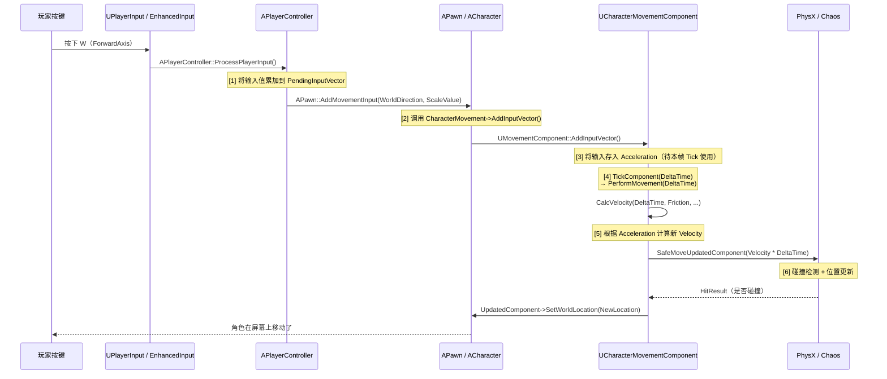

# 输入到移动的全链路

> 从玩家按下 W 键到角色在屏幕上移动，完整追踪一帧内发生的一切。

## 概述

当你按下 W 键，到角色向前移动，中间经过了**输入系统 → Pawn → CMC → 物理引擎** 四层处理。本课完整追踪这条链路，并解释每一层的关键源码。

学完本课你将能够：
- 画出"W 键 → 角色移动"的完整调用链时序图
- 解释 `AddMovementInput()` 和 `CalcVelocity()` 的关系
- 理解 `AnalogInputModifier` 如何影响模拟摇杆的移动速度
- 说明 Lyra 中 `IA_Move` 如何绑定到 C++ 移动函数

---

## 一、全链路时序图



---

## 二、各阶段详解

### 2.1 阶段 1：输入系统（Input System）

UE5 使用 **Enhanced Input** 系统。当玩家按下 W 键：

```cpp
// 1. Input Action "IA_Move" 触发（Axis2D 类型）
// 2. EnhancedInput 调用绑定的 C++ 函数
void ALyraPlayerController::SetupInputComponent(UInputComponent* PlayerInputComponent)
{
    // Lyra 使用 BindNativeAction() 将 InputTag 映射到 C++ 函数
    BindNativeAction(InputConfig, TAG_Input_Move, ETriggerEvent::Started, 
        FSimpleDelegate::CreateUObject(this, &ThisClass::OnMoveAction));
}
```

**Lyra 的特殊做法**：Lyra 不直接在蓝图中处理移动输入，而是通过 `ULyraInputConfig` 中的 `NativeInputActions` 将 `IA_Move` 绑定到 C++ 的 `OnMoveAction()`，再转发给 `ALyraCharacter::AddMovementInput()`。

### 2.2 阶段 2：APawn::AddMovementInput()

```cpp
// Engine/Source/Runtime/Engine/Classes/GameFramework/Pawn.h（声明）
void APawn::AddMovementInput(FVector WorldDirection, float ScaleValue, bool bForce /*= false*/)
{
    // [1] 将输入方向累加到 ControlInputVector
    ControlInputVector += WorldDirection * ScaleValue;
    
    // [2] 通知 CharacterMovementComponent
    if (CharacterMovement)
    {
        CharacterMovement->AddInputVector(WorldDirection * ScaleValue);
    }
}
```

**关键点**：`ControlInputVector` 是"待处理的输入向量"，在 `TickComponent()` 中被读取并清零。

### 2.3 阶段 3：UMovementComponent::AddInputVector()

```cpp
// Engine/Source/Runtime/Engine/Classes/GameFramework/PawnMovementComponent.h（声明）
void UMovementComponent::AddInputVector(FVector WorldVector, bool bForce /*= false*/)
{
    // [1] 将输入向量存入 Acceleration（这是 CMC 每帧读取的变量）
    Acceleration += WorldVector;
    
    // [2] 如果 bForceMaxAccel 为 true，忽略输入大小，直接用 MaxAcceleration
    if (bForceMaxAccel)
    {
        Acceleration = Acceleration.GetClampedToMaxSize(MaxAcceleration);
    }
}
```

**关键点**：`Acceleration` 是 CMC 的 protected 成员变量（`UCharacterMovementComponent.h`:L646），每帧在 `PerformMovement()` 开头根据 `ControlInputVector` 更新。

### 2.4 阶段 4：PerformMovement() → CalcVelocity()

```cpp
// Engine/Source/Runtime/Engine/Private/Components/CharacterMovementComponent.cpp:L3786
void UCharacterMovementComponent::CalcVelocity(float DeltaTime, float Friction, bool bFluid, float BrakingDeceleration)
{
    // [1] 如果有输入（Acceleration 非零）
    if (!Acceleration.IsZero())
    {
        // 根据 Acceleration、Friction、BrakingDeceleration 计算新速度
        FVector DesiredMove = Acceleration.GetSafeNormal() * MaxSpeed;
        Velocity = FMath::VInterpConstantTo(Velocity, DesiredMove, DeltaTime, MaxAcceleration);
    }
    // [2] 如果无输入（Acceleration 为零）
    else
    {
        // 施加摩擦力（速度相关阻力）
        Velocity *= (1.0f - Friction * DeltaTime);
        // 施加常数量减速度
        Velocity -= Velocity.GetSafeNormal() * BrakingDeceleration * DeltaTime;
    }
}
```

**关键点**：`CalcVelocity()` 不直接修改位置，只修改 `Velocity`。位置更新在后续的 `SafeMoveUpdatedComponent()` 中完成。

---

## 三、AnalogInputModifier 详解

`AnalogInputModifier` 是"模拟摇杆"输入的核心变量。当玩家轻轻推摇杆时，`AnalogInputModifier < 1.0f`，移动速度上限降低：

```cpp
// Engine/Source/Runtime/Engine/Private/Components/CharacterMovementComponent.cpp
float UCharacterMovementComponent::ComputeAnalogInputModifier() const
{
    // 根据 Acceleration 的大小计算修正系数
    float AnalogAmount = Acceleration.Size() / MaxAcceleration;
    return FMath::Clamp(AnalogAmount, 0.0f, 1.0f);
}

// 在 CalcVelocity() 中：
MaxSpeed = MaxWalkSpeed * AnalogInputModifier;  // 轻轻推摇杆 → 慢走
```

**Lyra 中的用法**：`MinAnalogWalkSpeed` 属性（默认 20 cm/s）确保即使玩家轻轻推摇杆，角色也会以最小速度移动（不会"几乎不动"）。

---

## 四、Lyra 的输入绑定实战

Lyra 使用 **InputTag** 系统将输入 Action 映射到 Gameplay Ability：

```cpp
// Source/LyraGame/Character/LyraPlayerController.cpp（伪代码）
void ALyraPlayerController::SetupInputComponent(UInputComponent* PlayerInputComponent)
{
    // [1] 将 IA_Move 通过 NativeInputAction 绑定到 C++ 函数
    BindNativeAction(InputConfig, TAG_Input_Move, ETriggerEvent::Triggered,
        FSimpleDelegate::CreateUObject(this, &ThisClass::OnMoveAction));
}

void ALyraPlayerController::OnMoveAction(const FInputActionValue& ActionValue)
{
    // [2] 直接转发给 LyraCharacter，不走 GAS Ability
    if (ALyraCharacter* LyraChar = GetPawn<ALyraCharacter>())
    {
        FVector MoveDirection = ActionValue.Get<FVector>();
        LyraChar->AddMovementInput(MoveDirection, 1.0f);
    }
}
```

**注意**：Lyra 的移动输入**不走 Ability**！`IA_Move` 是直接绑定到 C++ 函数的 `NativeInputAction`，不经过 GAS。只有"按下按键触发技能"（如射击、跳跃）才通过 Ability 处理。

---

## 五、常见问题与陷阱

### 5.1 "为什么我按下 W 角色不移动？"

**排查清单**：
1. `CharacterMovement` 是否为 `nullptr`？（构造函数中创建）
2. `UpdatedComponent` 是否绑定了 `CapsuleComponent`？
3. `MaxWalkSpeed` 是否为 0？
4. 是否有 `Gameplay.MovementStopped` Tag？（Lyra 特有，会阻断移动）
5. `MovementMode` 是否是 `MOVE_NavWalking` 且没有可行走地面？

### 5.2 "角色移动速度比预期慢"

**可能原因**：
1. `AnalogInputModifier` 被错误计算（摇杆输入被修正）
2. `GroundFriction` 太大（加速度被摩擦力"吃掉"）
3. `BrakingDecelerationWalking` 太小（松开按键后减速太慢，但不会影响加速）
4. `AirControl` 影响（在空中时，水平速度受 `AirControl` 限制）

---

## 总结

| 阶段 | 关键函数 | 核心变量 | 说明 |
|------|---------|---------|------|
| 输入系统 | `EnhancedInput::ProcessInputStack()` | `PendingInputVector` | 将按键映射为 `FVector2D` 输入 |
| Pawn | `APawn::AddMovementInput()` | `ControlInputVector` | 将输入方向传递给 CMC |
| CMC | `UMovementComponent::AddInputVector()` | `Acceleration` | 将输入转换为加速度 |
| CMC | `CalcVelocity()` | `Velocity` | 根据 `Acceleration` 计算新速度 |
| 物理 | `SafeMoveUpdatedComponent()` | `UpdatedComponent` 位置 | 执行带碰撞检测的移动 |

---

## 相关页面

- [[30-tutorials/movement-system/02-MovementMode详解]] ← MovementMode 详解
- [[30-tutorials/movement-system/04-移动物理与数学]] → 移动物理参数详解
- [[30-tutorials/input-system/05-Lyra实践InputTag与GAS联动详解]] - Lyra 输入系统实战

<!-- nav:auto -->

---

**导航**: ← [[30-tutorials/movement-system/02-MovementMode详解|02-MovementMode详解]] · [[30-tutorials/movement-system/04-移动物理与数学|04-移动物理与数学]] →

<!-- /nav:auto -->
