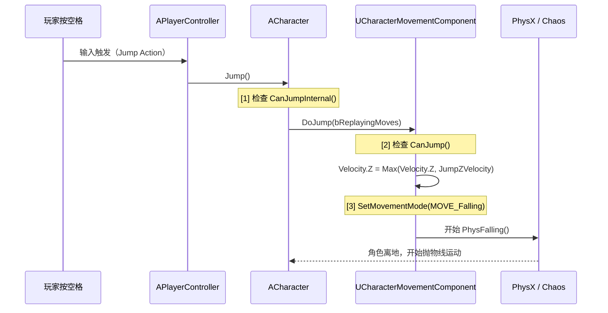

# 跳跃飞行游泳机制

> 深入理解 UE 的跳跃物理、空中控制、飞行与游泳模式。

## 概述

`DoJump()` 是跳跃的入口，`JumpZVelocity` 决定"跳多高"，`AirControl` 决定"空中能不能控制方向"。本课完整拆解这套机制，并延伸到 `Flying` 和 `Swimming` 模式。

学完本课你将能够：
- 用公式计算跳跃高度与 `JumpZVelocity` 的关系
- 解释 `AirControl` 在空中控制中的具体算法
- 理解 `Buoyancy` 如何影响游泳浮力
- 在 Lyra 中实现"二段跳"和"水中移动"

---

## 一、跳跃机制详解

### 1.1 跳跃触发链路



### 1.2 DoJump() 源码解读

```cpp
// Engine/Source/Runtime/Engine/Private/Components/CharacterMovementComponent.cpp:L1120-L1158
bool UCharacterMovementComponent::DoJump(bool bReplayingMoves, float DeltaTime)
{
    if (CharacterOwner && CharacterOwner->CanJump())
    {
        // [1] 第一次跳（JumpCurrentCountPreJump == 0）
        // 或将 Velocity.Z 提升到至少 JumpZVelocity
        if (bFirstJump || bDoNotFallBelowJumpZVelocityDuringJump)
        {
            if (HasCustomGravity())
            {
                // 自定义重力方向：在"上"方向设置速度
                SetGravitySpaceZ(Velocity, FMath::Max(GetGravitySpaceZ(Velocity), JumpZVelocity));
            }
            else
            {
                Velocity.Z = FMath::Max(Velocity.Z, JumpZVelocity);  // [2]
            }
        }

        SetMovementMode(MOVE_Falling);  // [3] 切换到 Falling 模式
        return true;
    }
    return false;
}
```

**[1]** `CanJump()` 的检查条件（`UCharacterMovementComponent::CanJump()`）：

```cpp
bool UCharacterMovementComponent::CanJump() const
{
    return IsJumpAllowed() &&
           (IsMovingOnGround() || IsFalling()) &&  // [A] 必须在地面或已坠落中
           (!bWantsToCrouch) &&                  // [B] 不能蹲伏
           (JumpCount >= JumpCurrentCount);          // [C] 跳跃次数限制
}
```

**[2]** `Velocity.Z = Max(Velocity.Z, JumpZVelocity)` 是"保持或超越"逻辑。如果已在上升（如二段跳），不会减少现有上升速度。

**[3]** `SetMovementMode(MOVE_Falling)` 让下一帧进入 `PhysFalling()`，开始受重力影响。

### 1.3 跳跃高度公式

```
跳跃最高点高度 H = (JumpZVelocity²) / (2 × |GravityZ| × GravityScale)
```

**示例计算**：
- `JumpZVelocity = 420 cm/s`
- `GravityZ = -980 cm/s²`（UE 默认世界重力）
- `GravityScale = 1.0`

→ `H = 420² / (2 × 980) ≈ 90 cm`

**`bApplyGravityWhileJumping` 的影响**：

当此标志为 `true`（默认），跳跃过程中重力持续作用，使跳跃弧线更自然（但跳跃高度略低于公式值）。设为 `false` 则"刚起跳时不受重力"，直到达到 `JumpZVelocity`。

---

## 二、空中控制（AirControl）

### 2.1 AirControl 算法

```cpp
// PhysFalling() 中的空中控制逻辑（伪代码）
if (AirControl > 0.0f && !Acceleration.IsZero())
{
    // [1] 计算空中加速度（受 AirControl 缩放）
    FVector AirAccel = Acceleration.GetClampedToMaxSize(MaxAcceleration) * AirControl;
    
    // [2] 限制在 MaxWalkSpeed * AirControl 以内
    FVector DesiredVelocity = Velocity;
    DesiredVelocity.X += AirAccel.X * DeltaTime;
    DesiredVelocity.Y += AirAccel.Y * DeltaTime;
    
    // [3] 钳制水平速度
    float MaxAirSpeed = MaxWalkSpeed * AirControl;
    DesiredVelocity.X = FMath::Clamp(DesiredVelocity.X, -MaxAirSpeed, MaxAirSpeed);
    DesiredVelocity.Y = FMath::Clamp(DesiredVelocity.Y, -MaxAirSpeed, MaxAirSpeed);
    
    Velocity.X = DesiredVelocity.X;
    Velocity.Y = DesiredVelocity.Y;
}
```

**效果示例**（假设 `MaxWalkSpeed = 600`，`AirControl = 0.3`）：
- 地面最高速：600 cm/s
- 空中最高水平速：`600 × 0.3 = 180 cm/s`
- 空中加速能力也按 0.3 倍缩放

### 2.2 AirControlBoost（空中控制加速）

`AirControlBoostMultiplier`（默认 `2.0`）在"低速时"增强空中控制：

```cpp
// 伪代码
if (Velocity.Size() < AirControlBoostVelocityThreshold)  // 默认 200 cm/s
{
    AirControlUsed = FMath::Min(AirControl * AirControlBoostMultiplier, 1.0f);
}
```

这让角色"刚刚起跳、速度还很低"时能快速改变方向，而在高速下落时保持惯性（更真实）。

---

## 三、Flying 模式详解

### 3.1 PhysFlying() 核心逻辑

```cpp
// Engine/Source/Runtime/Engine/Private/Components/CharacterMovementComponent.cpp
void UCharacterMovementComponent::PhysFlying(float deltaTime, int32 Iterations)
{
    // [1] 计算速度（忽略重力！）
    CalcVelocity(deltaTime, 0.f, false, BrakingDecelerationFlying);
    
    // [2] 移动
    SafeMoveUpdatedComponent(Velocity * deltaTime, ...);
    
    // [3] 无摩擦力（Friction = 0）
    // 但 BrakingDecelerationFlying 提供常量减速
}
```

**与 Walking 的关键区别**：
| 特性 | Walking | Flying |
|--------|---------|--------|
| 重力 | 受 `GravityScale` 影响 | **完全忽略** |
| 摩擦力 | `GroundFriction` 生效 | `Friction = 0` |
| 减速 | `BrakingDecelerationWalking` | `BrakingDecelerationFlying` |
| 速度上限 | `MaxWalkSpeed` | `MaxFlySpeed` |
| 地面检测 | `FindFloor()` | **无** |

### 3.2 使用场景

- 飞行类游戏（如飞翔模拟器）
- 观战摄像机
- 调试用"自由飞行"模式

---

## 四、Swimming 模式详解

### 4.1 PhysSwimming() 核心逻辑

```cpp
void UCharacterMovementComponent::PhysSwimming(float deltaTime, int32 Iterations)
{
    // [1] 计算净重力（受浮力影响）
    FVector NetGravity = Gravity * (1.0f - Buoyancy);
    Velocity += NetGravity * DeltaTime;
    
    // [2] 计算速度（类似 Walking，但有流体摩擦）
    CalcVelocity(deltaTime, FluidFriction, true, BrakingDecelerationSwimming);
    
    // [3] 移动
    SafeMoveUpdatedComponent(Velocity * deltaTime, ...);
}
```

**`Buoyancy`（浮力）的效果**：
| Buoyancy 值 | 效果 |
|---------------|------|
| `0.0` | 完全重力（沉底） |
| `0.5` | 半浮力（悬浮在中层） |
| `1.0` | 完全浮力（上浮） |
| `> 1.0` | 反向重力（向上加速） |

**`MaxSwimSpeed`**：水中最高速度，通常比 `MaxWalkSpeed` 小（水阻力）。

### 4.2 自动切换

`APawn::PhysicsVolumeChanged()` 在角色进入/离开 `APhysicsVolume`（水体体积）时自动切换：

```cpp
// Engine/Source/Runtime/Engine/Private/GameFramework/Pawn.cpp
void APawn::PhysicsVolumeChanged(APhysicsVolume* NewVolume)
{
    if (CharacterMovement)
    {
        if (NewVolume && NewVolume->bWaterVolume)
        {
            CharacterMovement->SetMovementMode(MOVE_Swimming);
        }
        else if (CharacterMovement->IsSwimming())
        {
            // 离开水体：检查是否在地面上方
            if (CharacterMovement->IsMovingOnGround())
            {
                CharacterMovement->SetMovementMode(MOVE_Walking);
            }
            else
            {
                CharacterMovement->SetMovementMode(MOVE_Falling);
            }
        }
    }
}
```

---

## 五、Lyra 中的跳跃扩展

### 5.1 二段跳实现

`ULyraCharacterMovementComponent::CanAttemptJump()` 覆写：

```cpp
// Source/LyraGame/Character/LyraCharacterMovementComponent.cpp:L42-L47
bool ULyraCharacterMovementComponent::CanAttemptJump() const
{
    // [1] 与 Super 相同，但不检查 IsCrouched()
    return IsJumpAllowed() &&
           (IsMovingOnGround() || IsFalling());  // [2] Falling 中也允许跳跃 = 二段跳！
}
```

**注意**：这只是"允许"二段跳。`JumpCurrentCount` 和 `JumpMaxCount` 控制"最多跳几次"。Lyra 的 `ALyraCharacter` 默认 `JumpMaxCount = 1`（只能跳一次），需要在 GAS 的 Jump Ability 中修改。

### 5.2 Lyra 跳跃 Ability

Lyra 将跳跃实现为 **Gameplay Ability**（而非直接在 `ACharacter::Jump()` 中处理）：

```cpp
// Source/LyraGame/AbilitySystem/Abilities/LyraGameplayAbility_Jump.cpp（伪代码）
void ULyraGameplayAbility_Jump::ActivateAbilityFromEvent(FGameplayEventData EventData)
{
    // [1] 检查能否跳跃（调用 CharacterMovement->CanAttemptJump()）
    if (Character->CanJump())
    {
        // [2] 调用 Jump
        Character->Jump();
        
        // [3] 等待落地（通过 WaitNetSync 或 Delay）
        WaitForLanding();
        
        // [4] 结束时结束 Ability
        EndAbility();
    }
}
```

**好处**：跳跃可以被 GAS 的**游戏标签** 控制（如"眩晕中不能跳跃"只需施加 `Gameplay.MovementStopped` Tag）。

---

## 六、常见问题与陷阱

### 6.1 "角色跳不起来"

**排查清单**：
1. `JumpZVelocity = 0`？（默认 420，设为 0 则跳不起来）
2. `IsJumpAllowed() = false`？（被 `SetJumpAllowed(false)` 禁用）
3. `bWantsToCrouch = true`？（蹲伏中不能跳，除非覆写 `CanAttemptJump()`）
4. `MovementMode = MOVE_None`？（C MC 未激活）
5. `CanJump()` 返回 `false`？（检查 `JumpCurrentCount >= JumpMaxCount`）

### 6.2 "空中完全不能控制方向"

**原因**：`AirControl = 0.0`。设为 `0.3 ~ 0.5` 可获得一定空中控制。

### 6.3 "水中移动很慢"

**可能原因**：
1. `MaxSwimSpeed` 太小（默认通常比 `MaxWalkSpeed` 小）
2. `Buoyancy` 太高（> 0.8）导致角色一直上浮，水平移动困难
3. `BrakingDecelerationSwimming` 太大（松开输入后迅速减速）

---

## 总结

| 要点 | 说明 |
|------|------|
| 跳跃入口 | `ACharacter::Jump()` → `DoJump()` → `Velocity.Z = JumpZVelocity` |
| 跳跃高度 | `H = JumpZVelocity² / (2 × |GravityZ| × GravityScale)` |
| 空中控制 | `AirControl`（0=无控制，1=满速控制） |
| 飞行模式 | 忽略重力，`MaxFlySpeed` 为上限 |
| 游泳模式 | 受 `Buoyancy` 浮力影响，`MaxSwimSpeed` 为上限 |
| Lyra 二段跳 | 覆写 `CanAttemptJump()` 允许 `IsFalling()` 中跳跃 |

---

## 相关页面

- [[30-tutorials/movement-system/04-移动物理与数学]] ← 移动物理参数
- [[30-tutorials/movement-system/02-MovementMode详解]] → MovementMode 详解
- [[30-tutorials/gas/03-GA输入绑定]] - GA 输入绑定（Lyra 跳跃通过 GA 触发）

<!-- nav:auto -->

---

**导航**: ← [[30-tutorials/movement-system/04-移动物理与数学|04-移动物理与数学]] · [[30-tutorials/movement-system/06-移动网络同步机制|06-移动网络同步机制]] →

<!-- /nav:auto -->
