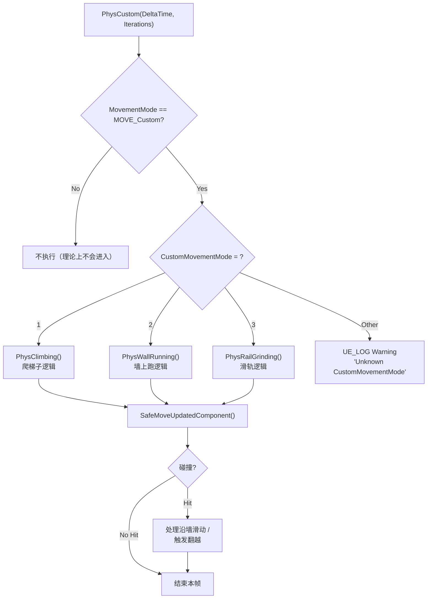

# 自定义移动模式CustomMovementMode

> 当需要实现"爬梯子"、"墙上跑"、"滑轨"等非标准移动时，扩展 `PhysCustom()`。

## 概述

当五种内置模式（Walking/Falling/Flying/Swimming/Custom）都不满足需求时，可以继承 `UCharacterMovementComponent` 并覆写 `PhysCustom()`，用 `CustomMovementMode` 区分多个子模式。

学完本课你将能够：
- 继承 `UCharacterMovementComponent` 并覆写 `PhysCustom()`
- 在 `PhysCustom()` 中实现"爬梯子"逻辑
- 用 `CustomMovementMode` 区分子模式（爬梯子=1，墙上跑=2）
- 处理自定义模式的网络同步

---

## 一、`PhysCustom()` 机制

### 1.1 函数声明

```cpp
// Engine/Source/Runtime/Engine/Classes/GameFramework/CharacterMovementComponent.h
protected:
    // 可覆写的虚函数
    virtual void PhysCustom(float deltaTime, int32 Iterations);
    
    // CustomMovementMode 子模式编号（仅当 MovementMode==MOVE_Custom 时有效）
    UPROPERTY(Category="Character Movement: MovementMode", BlueprintReadOnly)
    uint8 CustomMovementMode;
```

### 1.2 默认实现（什么都不做）

```cpp
// Engine/Source/Runtime/Engine/Private/Components/CharacterMovementComponent.cpp
void UCharacterMovementComponent::PhysCustom(float deltaTime, int32 Iterations)
{
    // 默认空实现 — 由子类覆写
    if (GetOuter() != nullptr)
    {
        UE_LOG(LogCharacterMovement, Warning, 
            TEXT("PhysCustom called but not implemented for CustomMovementMode %d"), 
            CustomMovementMode);
    }
}
```

### 1.3 PhysCustom() 分派流程图



> **解读**：`PhysCustom()` 是 CMC 的 protected 虚函数，每帧在 `StartNewPhysics()` 中被调用。子类通过 `CustomMovementMode` 字段区分不同子模式，分别实现对应的物理逻辑。

### 1.4 如何进入 Custom 模式？

```cpp
// 手动切换到自定义模式
CharacterMovement->SetMovementMode(MOVE_Custom, 1);  // 子模式 = 1（爬梯子）

// 等效地，直接设置属性（不会触发 OnMovementModeChanged）
CharacterMovement->MovementMode = MOVE_Custom;
CharacterMovement->CustomMovementMode = 1;
```

---

## 二、实战：实现"爬梯子"模式

### 2.1 子类声明

```cpp
// MyCharacterMovementComponent.h
UCLASS()
class UMyCharacterMovementComponent : public UCharacterMovementComponent
{
    GENERATED_BODY()

public:
    UMyCharacterMovementComponent(const FObjectInitializer& ObjectInitializer);

protected:
    // 覆写 PhysCustom 处理自定义移动
    virtual void PhysCustom(float DeltaTime, int32 Iterations) override;

    // 爬梯子专用函数
    void PhysClimbing(float DeltaTime);
    
    // 墙上跑专用函数
    void PhysWallRunning(float DeltaTime);
    
    // 可配置：爬梯子速度
    UPROPERTY(Category="Custom Movement", EditAnywhere, BlueprintReadWrite)
    float ClimbSpeed = 200.0f;
};
```

### 2.2 PhysCustom() 分派逻辑

```cpp
// MyCharacterMovementComponent.cpp
void UMyCharacterMovementComponent::PhysCustom(float DeltaTime, int32 Iterations)
{
    // [1] 根据 CustomMovementMode 分派到不同函数
    switch (CustomMovementMode)
    {
        case 1:  // 爬梯子
            PhysClimbing(DeltaTime);
            break;
        case 2:  // 墙上跑
            PhysWallRunning(DeltaTime);
            break;
        default:
            UE_LOG(LogTemp, Warning, TEXT("Unknown CustomMovementMode: %d"), CustomMovementMode);
            break;
    }
}
```

### 2.3 PhysClimbing() 实现（爬梯子）

```cpp
void UMyCharacterMovementComponent::PhysClimbing(float DeltaTime)
{
    SCOPE_CYCLE_COUNTER(STAT_CharPhysCustom);

    if (DeltaTime < MIN_TICK_TIME) return;

    // [1] 检查是否到达梯子顶端
    if (bReachedLadderTop)
    {
        // 自动切换到 Walking 模式
        SetMovementMode(MOVE_Walking);
        return;
    }

    // [2] 根据输入计算爬梯子方向
    FVector ClimbDirection = FVector::ZeroVector;
    if (bWantsToClimbUp)    ClimbDirection.Z += 1.0f;
    if (bWantsToClimbDown)  ClimbDirection.Z -= 1.0f;

    // [3] 计算速度（忽略重力！）
    Velocity = ClimbDirection.GetSafeNormal() * ClimbSpeed;

    // [4] 执行移动（不带物理重力，但带碰撞检测）
    FVector Delta = Velocity * DeltaTime;
    SafeMoveUpdatedComponent(Delta, UpdatedComponent->GetComponentQuat(), true, Hit);

    // [5] 如果撞到顶端，触发"翻越"
    if (Hit.bBlockingHit && Hit.Normal.Z < -0.7f)  // 头顶有阻挡
    {
        bReachedLadderTop = true;
        SetMovementMode(MOVE_Walking);
    }
}
```

### 2.4 如何触发爬梯子？

```cpp
// 在 ACharacter 子类中
void AMyCharacter::InteractWithLadder(AActor* Ladder)
{
    if (UMyCharacterMovementComponent* MyCMC = Cast<UMyCharacterMovementComponent>(GetCharacterMovement()))
    {
        // [1] 切换到自定义模式 1（爬梯子）
        MyCMC->SetMovementMode(MOVE_Custom, 1);
        
        // [2] 禁用重力
        MyCMC->GravityScale = 0.0f;
        
        // [3] 绑定输入
        bWantsToClimbUp = true;  // 由输入系统设置
    }
}
```

---

## 三、其他自定义模式示例

### 3.1 墙上跑（Wall Running）

```cpp
void UMyCharacterMovementComponent::PhysWallRunning(float DeltaTime)
{
    // [1] 改变重力方向（让角色"贴墙"）
    FVector WallNormal = GetWallNormal();  // 从射线检测获取墙面法线
    GravityDirection = WallNormal;  // 重力朝向墙面（把角色"压"在墙上）
    
    // [2] 墙上移动（类似 Walking，但地面是"墙面"）
    Acceleration = WallTangent * MaxAcceleration;  // 沿墙面切线方向加速
    CalcVelocity(DeltaTime, GroundFriction, false, BrakingDecelerationWalking);
    
    // [3] 检测是否离开墙面
    if (!IsStillOnWall())
    {
        SetMovementMode(MOVE_Falling);  // 离开墙面 → 坠落
    }
}
```

### 3.2 滑轨（Rail Grinding）

```cpp
void UMyCharacterMovementComponent::PhysRailGrinding(float DeltaTime)
{
    // [1] 获取滑轨曲线
    FVector RailTangent = GetRailTangent();  // 滑轨切线方向
    
    // [2] 沿滑轨移动（只能前进/后退，不能离开轨道）
    Velocity = RailTangent * RailSpeed;
    SafeMoveUpdatedComponent(Velocity * DeltaTime, ...);
    
    // [3] 检测是否到达滑轨尽头
    if (GetDistanceAlongRail() >= RailLength)
    {
        SetMovementMode(MOVE_Falling);  // 到达尽头 → 飞出
    }
}
```

---

## 四、网络同步

### 4.1 问题：自定义模式默认不同步

`PhysCustom()` 在**客户端预测**时不会自动同步。需要实现：

1. **`FSavedMove_My`** — 保存自定义输入状态
2. **`UCharacterMovementComponent::UpdateFromCompressedFlags()`** — 解压自定义标志
3. **`UCharacterMovementComponent::AddInputVector()`** — 处理自定义输入

### 4.2 实现 SavedMove（简化示例）

```cpp
// MySavedMove.h
UCLASS()
class FSavedMove_My : public FSavedMove_Character
{
    uint8 bWantsToClimbUp : 1;
    uint8 bWantsToClimbDown : 1;

    virtual void Clear() override;
    virtual void SetMoveFor(ACharacter* C, float InDeltaTime, FVector InAccel, ...) override;
    virtual uint8 GetCompressedFlags() const override;
};

// MyCharacterMovementComponent.cpp
void UMyCharacterMovement::UpdateFromCompressedFlags(uint8 Flags)
{
    Super::UpdateFromCompressedFlags(Flags);
    
    // 解压自定义标志（使用 FSavedMove_Character 保留的位）
    bWantsToClimbUp = (Flags & FLAG_Custom_0) != 0;
    bWantsToClimbDown = (Flags & FLAG_Custom_1) != 0;
}
```

---

## 五、Lyra 中的相关实践

Lyra **没有使用 `PhysCustom()`**，但提供了另一种扩展移动的方式：

| 扩展方式 | Lyra 的做法 | 优点 |
|---------|---------|------|
| **GAS Tag 控制** | `Gameplay.MovementStopped` Tag 阻断移动 | 不需要修改 CMC，纯数据驱动 |
| **LyraMovementComponent** | 覆写 `GetMaxSpeed()` 和 `GetDeltaRotation()` | 与 GAS 深度集成 |
| **Ability 驱动移动** | `ULyraMoveAbility` 处理移动输入 | 移动逻辑可网络化同步 |

**如果 Lyra 需要爬梯子**：应该在 `ULyraMoveAbility` 中处理，而不是直接扩展 `PhysCustom()`，这样能利用 GAS 的网络预测。

---

## 六、常见问题

### 6.1 "进入 Custom 模式后角色一直掉下去？"

**原因**：`PhysCustom()` 默认不应用重力，但如果忘记设置 `GravityScale = 0`，角色仍受重力影响。

**修复**：
```cpp
void PhysCustom(float DeltaTime, int32 Iterations)
{
    // 临时禁用重力
    float SavedGravityScale = GravityScale;
    GravityScale = 0.0f;
    
    // ... 自定义移动逻辑 ...
    
    GravityScale = SavedGravityScale;  // 恢复
}
```

### 6.2 "自定义模式的移动不平滑？"

**原因**：`SafeMoveUpdatedComponent()` 默认使用 `WalkableFloorZ` 检测地面，但自定义模式中可能不需要。

**修复**：覆写 `IsWalkable()` 或在 `PhysCustom()` 中使用 `bOrientRotationToMovement = false`。

---

## 总结

| 要点 | 说明 |
|------|------|
| **入口** | 覆写 `PhysCustom(float DeltaTime, int32 Iterations)` |
| **子模式** | 用 `CustomMovementMode`（uint8）区分子模式 |
| **进入模式** | `SetMovementMode(MOVE_Custom, SubMode)` |
| **网络同步** | 需要实现 `FSavedMove` 和 `UpdateFromCompressedFlags()` |
| **Lyra 推荐做法** | 用 GAS Ability 驱动移动，而非 `PhysCustom()` |

---

## 相关页面

- [[30-tutorials/movement-system/06-移动网络同步机制]] ← 移动网络同步机制
- [[30-tutorials/movement-system/08-RootMotion机制]] → Root Motion 机制
- [[30-tutorials/gas/03-GA输入绑定]] - GA 输入绑定（Lyra 移动通过 GA 处理）

<!-- nav:auto -->

---

**导航**: ← [[30-tutorials/movement-system/06-移动网络同步机制|06-移动网络同步机制]] · [[30-tutorials/movement-system/08-RootMotion机制|08-RootMotion机制]] →

<!-- /nav:auto -->
