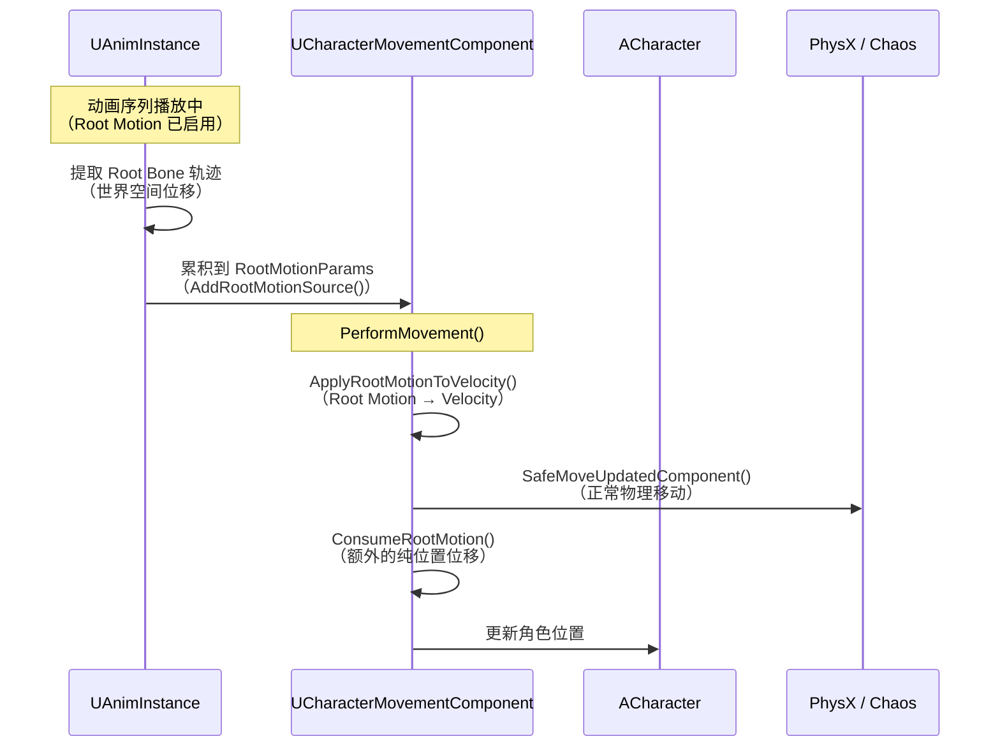

# RootMotion机制

> Root Motion 让动画驱动角色移动，而非代码控制 Velocity。本课详解其实现原理和与 CMC 的交互。

## 概述

**Root Motion** 是指：动画序列中"骨骼根骨骼（Root Bone）的移动轨迹"被用来驱动角色的**世界位置变化**，而不是由 C++ 代码设置 `Velocity`。

学完本课你将能够：
- 解释 Root Motion 与代码控制移动的区别
- 理解 `FRootMotionMovementParams` 和 `FRootMotionSource` 的关系
- 在动画序列中启用 Root Motion 并观察效果
- 在 Lyra 中排查 Root Motion 未生效的问题

---

## 一、Root Motion 是什么？

### 1.1 传统移动 vs. Root Motion

| 方式 | 移动驱动源 | 典型使用场景 |
|------|------------|-------------|
| **代码驱动** | `Velocity` + `Acceleration`（CMC 计算） | 玩家控制移动（WASD） |
| **Root Motion** | 动画序列中 Root Bone 的轨迹 | 动画驱动的位移（攀爬、翻滚、技能位移） |

**示例**：
- 攀爬动画：手抓住梯子 → 身体上升（Root Bone 在动画中向上移动）→ 角色位置自动跟随
- 翻滚动画：角色向前翻滚（Root Bone 向前移动）→ 角色位置自动向前移动

### 1.2 如何启用 Root Motion？

在动画序列（Animation Sequence）中：

```
1. 打开 Animation Sequence 编辑器
2. 在 "Root Motion" 分段：
   - √ Enable Root Motion → 从这个动画提取 Root Motion 数据
   - √ Root Motion from Everything → 包括所有骨骼的贡献（不只是 Root Bone）
3. 在 AnimInstance 中：
   - 播放这个动画时，Root Motion 会自动应用到角色
```

---

## 二、引擎层实现原理

### 2.1 核心数据结构

#### FRootMotionMovementParams

```cpp
// Engine/Source/Runtime/Engine/Classes/GameFramework/RootMotionSource.h
struct ENGINE_API FRootMotionMovementParams
{
    bool bHasRootMotion;  // [1] 是否有 Root Motion 数据
    FTransform RootMotionTransform;  // [2] 累积的 Root Motion 变换（世界空间）
    TArray<TSharedPtr<FRootMotionSource>> RootMotionSources;  // [3] 活跃的 Root Motion 源列表
};
```

**[1]** `bHasRootMotion`：快速检查是否有 Root Motion 需要处理。没有则跳过，节省性能。

**[2]** `RootMotionTransform`：本帧（或本 Move）累积的 Root Motion 变换。CMC 在 `PerformMovement()` 中读取并应用到位置。

**[3]** `RootMotionSources`：支持**多个 Root Motion 源同时活跃**（例如：基础移动动画 + 叠加一个技能位移动画）。

#### FRootMotionSource

```cpp
// Engine/Source/Runtime/Engine/Classes/GameFramework/RootMotionSource.h
class ENGINE_API FRootMotionSource
{
public:
    FName InstanceName;       // 标识符（用于后续移除）
    float Duration;              // 持续时间（秒），≤ 0 表示"直到动画结束"
    FRootMotionSourceStatus Status;  // 状态（活跃/已完成/已取消）
    
    // 核心虚函数：计算本帧的 Root Motion 贡献
    virtual bool PrepareRootMotion(float SimulationRate, const FRootMotionMovementParams& RootMotionParams);
    
    // 应用 Root Motion 到 Velocity（或直接计算位移）
    virtual void ApplyRootMotionToVelocity(float DeltaTime);
    virtual void ApplyRootMotionToPosition(float DeltaTime);
};
```

**内置子类**：

| 子类 | 用途 |
|------|------|
| `FRootMotionSource_Constant` | 恒定速度的 Root Motion（如"被击退"） |
| `FRootMotionSource_Curve` | 基于曲线的 Root Motion（速度随时间变化） |
| `FRootMotionSource_Animation` | 从动画提取 Root Motion（最常用） |

### 2.2 CMC 中的集成点

Root Motion 在 `UCharacterMovementComponent::PerformMovement()` 中的两个地方被处理：

#### [1] 应用 Root Motion 到 Velocity

```cpp
// CharacterMovementComponent.cpp ::PerformMovement()（伪代码）
void UCharacterMovementComponent::PerformMovement(float DeltaTime)
{
    // ... 前面的加速度计算 ...
    
    // [A] 将 Root Motion 应用到 Velocity
    ApplyRootMotionToVelocity(DeltaTime);
    
    // ... 后续移动计算 ...
    
    // [B] 在移动后，应用"纯位置" Root Motion（不通过 Velocity）
    if (RootMotionParams.bHasRootMotion)
    {
        ConsumeRootMotion(DeltaTime, OutMovementResult);
    }
}
```

#### [2] ApplyRootMotionToVelocity()

```cpp
// CharacterMovementComponent.cpp
void UCharacterMovementComponent::ApplyRootMotionToVelocity(float DeltaTime)
{
    if (!RootMotionParams.bHasRootMotion) return;
    
    // 遍历所有活跃的 RootMotionSource
    for (TSharedPtr<FRootMotionSource>& Source : RootMotionParams.RootMotionSources)
    {
        if (Source->Status.bIsActive)
        {
            // 调用每个源的 ApplyRootMotionToVelocity()
            Source->ApplyRootMotionToVelocity(DeltaTime);
        }
    }
}
```

#### [3] ConsumeRootMotion()

```cpp
// CharacterMovementComponent.cpp
void UCharacterMovementComponent::ConsumeRootMotion(float DeltaTime, FCharacterMovementOutParams& OutParams)
{
    // [1] 从 RootMotionTransform 中提取位移
    FVector RootMotionDelta = RootMotionParams.RootMotionTransform.GetTranslation();
    
    // [2] 将位移加到最终位置
    OutParams.DeltaLocation += RootMotionDelta;
    
    // [3] 清除已消费的 Root Motion 数据
    RootMotionParams.RootMotionTransform.SetIdentity();
}
```

---

## 三、Root Motion 与 CMC 的交互详解

### 3.1 数据流



### 3.2 关键细节

#### Root Motion 可以"叠加"到代码控制的移动上

```cpp
// 示例：玩家向前走，同时播放一个"被击退"动画
Velocity = (0, 600, 0);  // 向前走（代码控制）
RootMotionVelocity = (0, 0, -200);  // 被击退（Root Motion）

// 最终 Velocity = (0, 600, -200)
// 角色会"边向前走，边被击退"
```

#### Root Motion 可以"覆盖"代码控制的移动

如果你希望 Root Motion **完全控制** 位移（不叠加代码控制的 `Velocity`）：

```cpp
// 在 AnimInstance 中：
void UMyAnimInstance::NativeUpdateAnimation(float DeltaSeconds)
{
    // 如果有 Root Motion，清零代码控制的 Velocity
    if (CharacterMovement && CharacterMovement->RootMotionParams.bHasRootMotion)
    {
        CharacterMovement->Velocity = FVector::ZeroVector;
    }
}
```

---

## 四、Lyra 中的 Root Motion 实践

### 4.1 Lyra 是否在用 Root Motion？

**是的**，Lyra 在以下场景使用 Root Motion：

| 场景 | 动画 | Root Motion 类型 |
|------|---------|------------------|
| **被击退** | `AM_HitReaction` | `FRootMotionSource_Constant`（恒定速度击退） |
| **翻滚/躲避** | `AM_Roll` | 从动画提取（`FRootMotionSource_Animation`） |
| **攀爬** | `AM_Climb` | 从动画提取（`FRootMotionSource_Animation`） |

### 4.2 Lyra 的 Root Motion 实现（推测）

```cpp
// Source/LyraGame/Abilities/LyraGameplayAbility.cpp（伪代码）
void ULyraGameplayAbility::ApplyRootMotionToTarget(AActor* Target)
{
    // [1] 创建 Root Motion Source
    TSharedPtr<FRootMotionSource_Constant> RootMotionSource = 
        MakeShared<FRootMotionSource_Constant>();
    RootMotionSource->InstanceName = "LyraAbility_RootMotion";
    RootMotionSource->Duration = 0.5f;  // 持续 0.5 秒
    RootMotionSource->Velocity = (0, 0, -500);  // 击退速度
    
    // [2] 添加到 CMC
    if (UCharacterMovementComponent* CMC = TargetCharacter->GetCharacterMovement())
    {
        CMC->RootMotionParams.RootMotionSources.Add(RootMotionSource);
    }
}
```

### 4.3 常见问题：Root Motion 未生效

**排查清单**：

1. **动画序列中未启用 Root Motion** → 检查 `Enable Root Motion`
2. **CMC 的 `bAllowRootMotion` 为 false** → 在 C++ 中设置
   ```cpp
   CharacterMovement->bAllowRootMotion = true;
   ```
3. **Root Motion Source 已过期（Duration ≤ 0 且动画已结束）** → 检查动画时长
4. **Lyra 的 GAS 阻断了移动** → 检查 `Gameplay.MovementStopped` Tag

---

## 五、性能优化建议

### 5.1 减少 Root Motion 计算

如果 Root Motion **不常用**（例如只在受击时触发），可以：

```cpp
// 在 AnimInstance 中：
void UMyAnimInstance::NativeUpdateAnimation(float DeltaSeconds)
{
    // 只在有 Root Motion 时更新
    if (CharacterMovement && CharacterMovement->RootMotionParams.bHasRootMotion)
    {
        // 更新 Root Motion 相关逻辑
    }
    else
    {
        // 跳过 Root Motion 计算（节省性能）
    }
}
```

### 5.2 使用 `FRootMotionSource_Curve` 代替逐帧计算

```cpp
// 创建一个基于曲线的 Root Motion（性能更好）
TSharedPtr<FRootMotionSource_Curve> RootMotionSource = 
    MakeShared<FRootMotionSource_Curve>();
RootMotionSource->TranslationCurve = MyCurve;  // 指定速度曲线
// CMC 会自动在每帧读取曲线值，不需要手动计算
```

---

## 总结

| 要点 | 说明 |
|------|------|
| **Root Motion** | 动画驱动角色移动（Root Bone 轨迹 → 角色位置） |
| **与传统移动区别** | 传统：代码控制 `Velocity`；Root Motion：动画控制位移 |
| **核心数据结构** | `FRootMotionMovementParams`（累积）+ `FRootMotionSource`（单个源） |
| **CMC 集成点** | `ApplyRootMotionToVelocity()`（加到 Velocity）+ `ConsumeRootMotion()`（纯位置位移） |
| **Lyra 使用场景** | 被击退、翻滚、攀爬 |
| **未生效排查** | 检查动画设置、`bAllowRootMotion`、GAS Tag |

---

## 相关页面

- [[30-tutorials/movement-system/07-自定义移动模式CustomMovementMode]] ← 自定义移动模式
- [[30-tutorials/movement-system/09-Lyra移动系统实战]] → Lyra 移动实战
- [[30-tutorials/animation/02-UE5动画系统引擎基础框架深度分析]] - 动画系统基础（Root Motion 相关）

<!-- nav:auto -->

---

**导航**: ← [[30-tutorials/movement-system/07-自定义移动模式CustomMovementMode|07-自定义移动模式CustomMovementMode]] · [[30-tutorials/movement-system/09-Lyra移动系统实战|09-Lyra移动系统实战]] →

<!-- /nav:auto -->
