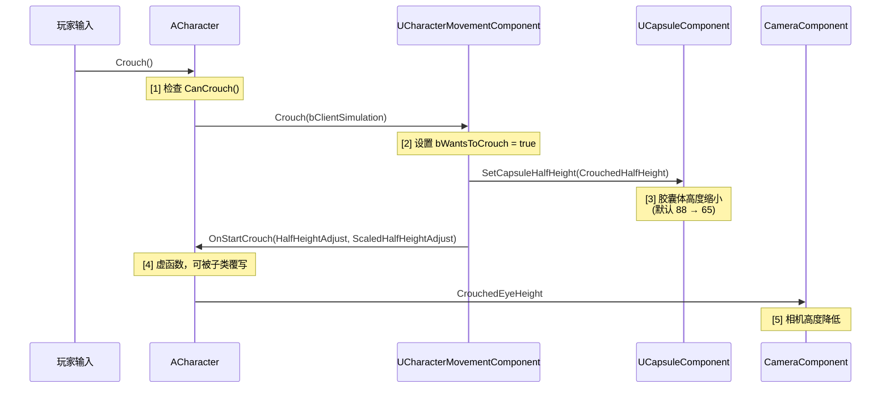

# 蹲伏-Crouch机制

> 详解 UE 蹲伏系统的引擎层实现、对移动/碰撞/相机的影响，以及 Lyra 中通过 GAS Tag 的集成方式。

## 概述

**Crouch（蹲伏）** 是 `ACharacter` 的内置功能，通过缩小胶囊体高度来实现"下蹲"效果。它不是独立的 `MovementMode`，而是与现有移动模式（Walking/Falling）叠加工作的角色状态。

学完本课你将能够：
- 描述 `Crouch()` → `OnStartCrouch()` → 胶囊体重缩 的完整调用链
- 解释 Crouch 对 `MaxWalkSpeed`、胶囊体高度、相机高度的影响
- 在 Lyra 中理解 `Status.Crouching` Tag 如何与移动系统集成
- 处理 Crouch 的网络同步（`FSharedRepMovement::bIsCrouched`）

---

## 一、引擎层实现

### 1.1 核心函数声明

```cpp
// Engine/Source/Runtime/Engine/Classes/GameFramework/Character.h
class ACharacter
{
    // [1] 触发蹲伏（本地调用，会复制到服务器）
    UFUNCTION(BlueprintCallable, Category="Character")
    void Crouch(bool bClientSimulation = false);

    // [2] 取消蹲伏
    UFUNCTION(BlueprintCallable, Category="Character")
    void UnCrouch(bool bClientSimulation = false);

    // [3] 蹲伏状态查询
    UFUNCTION(BlueprintPure, Category="Character")
    bool IsCrouched() const;

    // [4] 蹲伏开始/结束的虚函数（子类覆写）
    virtual void OnStartCrouch(float HalfHeightAdjust, float ScaledHalfHeightAdjust);
    virtual void OnEndCrouch(float HalfHeightAdjust, float ScaledHalfHeightAdjust);
};
```

### 1.2 启用条件：`bCanCrouch`

```cpp
// Engine/Source/Runtime/Engine/Classes/GameFramework/CharacterMovementComponent.h
UPROPERTY(Category="Character Movement (General Settings)", EditAnywhere, BlueprintReadWrite)
uint8 bCanCrouch : 1;  // [1] 必须为 true 才能 Crouch
```

**[1]** `bCanCrouch` 是前提条件。`ACharacter::CanCrouch()` 虚函数会检查此项，以及：
- 当前 `MovementMode == MOVE_Walking`（只有 Walking 时才能蹲）
- 胶囊体上方有足够空间（`AvoidWalkingIntoWalls()` 检测）

### 1.3 `Crouch()` 完整调用链



### 1.4 关键属性

| 属性 | 默认值 | 说明 |
|--------|---------|------|
| `CrouchedHalfHeight` | `44.0 cm` | 蹲伏时胶囊体半高（`SetCrouchedHalfHeight()` 设置） |
| `MaxWalkSpeedCrouched` | `200.0 cm/s` | 蹲伏时的最高速度（低于 `MaxWalkSpeed`） |
| `CrouchedEyeHeight` | `38.0 cm` | 蹲伏时相机高度（相对于胶囊体中心） |
| `bCanWalkOffLedgesWhenCrouching` | `true` | 蹲伏时能否走下边缘 |

**Lyra 中的配置**（在 `ALyraCharacter` 构造函数中）：

```cpp
// Source/LyraGame/Character/LyraCharacter.cpp（构造函数）
ULyraCharacterMovementComponent* LyraMoveComp =
    CastChecked<ULyraCharacterMovementComponent>(GetCharacterMovement());

LyraMoveComp->GetNavAgentPropertiesRef().bCanCrouch = true;       // [A] 允许蹲伏
LyraMoveComp->bCanWalkOffLedgesWhenCrouching = true;                // [B] 蹲伏时可走下边缘
LyraMoveComp->SetCrouchedHalfHeight(65.0f);                         // [C] 蹲伏半高 = 65 cm
CrouchedEyeHeight = 50.0f;                                      // [D] 蹲伏时相机高度
```

**[A]** `bCanCrouch = true` 是蹲伏的前提，在 `CanCrouch()` 中检查。

**[C]** `SetCrouchedHalfHeight(65.0f)` 设置蹲伏时胶囊体半高。默认 `88.0 / 2 = 44.0`，Lyra 设为 `65.0`（更高，适合 FPS 视角）。

---

## 二、Crouch 对移动的影响

### 2.1 速度限制

```cpp
// Engine/Source/Runtime/Engine/Private/Components/CharacterMovementComponent.cpp
float UCharacterMovementComponent::GetMaxSpeed() const
{
    if (IsCrouched())
    {
        return MaxWalkSpeedCrouched;  // [1] 蹲伏时使用更慢的速度
    }
    return MaxWalkSpeed;  // [2] 正常速度
}
```

**[1]** 蹲伏时 `GetMaxSpeed()` 返回 `MaxWalkSpeedCrouched`（默认 `200 cm/s`），远低于正常 `MaxWalkSpeed`（`600 cm/s`）。

### 2.2 胶囊体碰撞变化

```
正常站立：  蹲伏：
┌─────┐       ┌──┐
│     │       │  │  ← CrouchedEyeHeight (50cm)
│     │       ├──┤
│     │       │  │  ← 眼睛位置
│     │       └──┘  ← 胶囊体顶部 (HalfHeight = 65cm)
│     │                ↓
│     │                │  ← 地面
└─────┘
HalfHeight = 88cm
```

蹲伏后胶囊体变矮，**可以进入更低的掩体**（如窗户、矮墙）。

### 2.3 边缘行走行为

`bCanWalkOffLedgesWhenCrouching` 控制蹲伏时能否从边缘走下去：

- `true`（默认）：蹲伏时可以从边缘走下（正常行为）
- `false`：蹲伏时不能走下边缘（会停在边缘）

---

## 三、Lyra 中的 Crouch 实现

### 3.1 `ToggleCrouch()` — 输入绑定

```cpp
// Source/LyraGame/Character/LyraCharacter.cpp
void ALyraCharacter::ToggleCrouch()
{
    const ULyraCharacterMovementComponent* LyraMoveComp =
        CastChecked<ULyraCharacterMovementComponent>(GetCharacterMovement());

    // [1] 检查 bWantsToCrouch（由 CMC 内部设置）
    if (IsCrouched() || LyraMoveComp->bWantsToCrouch)
    {
        UnCrouch();  // 当前已蹲伏 → 站起
    }
    else
    {
        Crouch();     // 当前站立 → 蹲下
    }
}
```

**注意**：`bWantsToCrouch` 是 `ULyraCharacterMovementComponent` 的扩展字段，用于在网络同步中标记"客户端想蹲伏"的状态。

### 3.2 `OnStartCrouch()` — GAS Tag 集成

```cpp
// Source/LyraGame/Character/LyraCharacter.cpp
void ALyraCharacter::OnStartCrouch(float HalfHeightAdjust, float ScaledHalfHeightAdjust)
{
    if (ULyraAbilitySystemComponent* LyraASC = GetLyraAbilitySystemComponent())
    {
        // [1] 添加 GAS Tag：Status.Crouching
        LyraASC->SetLooseGameplayTagCount(LyraGameplayTags::Status_Crouching, 1);
    }

    Super::OnStartCrouch(HalfHeightAdjust, ScaledHalfHeightAdjust);  // [2] 调用父类实现
}
```

**[1]** `Status.Crouching` Tag 被添加到 ASC，可以被 Gameplay Ability 查询（如"蹲伏时移速降低"的 GE 可以通过 Tag 触发）。

### 3.3 `OnEndCrouch()` — 移除 Tag

```cpp
// Source/LyraGame/Character/LyraCharacter.cpp
void ALyraCharacter::OnEndCrouch(float HalfHeightAdjust, float ScaledHalfHeightAdjust)
{
    if (ULyraAbilitySystemComponent* LyraASC = GetLyraAbilitySystemComponent())
    {
        // [1] 移除 GAS Tag：Status.Crouching
        LyraASC->SetLooseGameplayTagCount(LyraGameplayTags::Status_Crouching, 0);
    }

    Super::OnEndCrouch(HalfHeightAdjust, ScaledHalfHeightAdjust);  // [2] 调用父类实现
}
```

### 3.4 `bWantsToCrouch` 的作用

```cpp
// Source/LyraGame/Character/LyraCharacter.cpp（在 CanJumpInternal_Implementation 中）
bool ALyraCharacter::CanJumpInternal_Implementation() const
{
    const ULyraCharacterMovementComponent* LyraMoveComp =
        CastChecked<ULyraCharacterMovementComponent>(GetCharacterMovement());

    // [1] 如果正在蹲伏或想蹲伏，不允许跳跃
    if (IsCrouched() || LyraMoveComp->bWantsToCrouch)
    {
        return false;
    }

    return Super::CanJumpInternal_Implementation();
}
```

**设计意图**：`bWantsToCrouch` 是 CMC 的本地标志，用于在网络同步完成前"预告"蹲伏状态，避免蹲伏中还能跳跃的竞态问题。

---

## 四、网络同步

### 4.1 `FSharedRepMovement::bIsCrouched`

Lyra 通过 `FSharedRepMovement` 同步蹲伏状态：

```cpp
// Source/LyraGame/Character/LyraCharacter.h
struct FSharedRepMovement
{
    // ... 其他字段 ...
    bool bIsCrouched;  // [1] 蹲伏状态（同步给模拟代理）
};

// Source/LyraGame/Character/LyraCharacter.cpp
void ALyraCharacter::UpdateSharedReplication()
{
    FSharedRepMovement NewData;
    if (NewData.FillForCharacter(this))
    {
        // [2] 将 bIsCrouched 写入同步数据
        NewData.bIsCrouched = IsCrouched();

        if (!NewData.Equals(LastSharedReplication, this))
        {
            FastSharedReplication(NewData);  // [3] 发送 unreliable RPC
        }
    }
}
```

### 4.2 客户端接收同步

```cpp
// Source/LyraGame/Character/LyraCharacter.cpp
void ALyraCharacter::FastSharedReplication_Implementation(const FSharedRepMovement& SharedRepMovement)
{
    // [1] 读取同步过来的蹲伏状态
    if (IsCrouched() != SharedRepMovement.bIsCrouched)
    {
        if (SharedRepMovement.bIsCrouched)
        {
            Crouch();   // [2] 同步为蹲伏
        }
        else
        {
            UnCrouch(); // [3] 同步为站立
        }
    }
}
```

---

## 五、常见问题

### 5.1 "调用 Crouch() 没反应"

**排查清单**：
1. `bCanCrouch` 是否为 `true`？（在构造函数或 BeginPlay 中设置）
2. 当前是否在 `MOVE_Walking` 模式？（只有 Walking 时能蹲）
3. 胶囊体上方是否有足够空间？（`AvoidWalkingIntoWalls()` 检测）
4. `IsCrouched()` 返回 `true` 但动画没变化？（检查 AnimInstance 的 Crouch 状态机）

### 5.2 "蹲伏后速度没变化"

**原因**：`GetMaxSpeed()` 的覆写没有正确处理 `IsCrouched()`。

**修复**：在 `ULyraCharacterMovementComponent::GetMaxSpeed()` 中：

```cpp
float ULyraCharacterMovementComponent::GetMaxSpeed() const
{
    if (IsCrouched())
    {
        return MaxWalkSpeedCrouched;  // 确保返回蹲伏速度
    }
    return Super::GetMaxSpeed();
}
```

### 5.3 "网络同步后蹲伏状态不对"

**原因**：`FSharedRepMovement::bIsCrouched` 没有正确填充或读取。

**修复**：检查 `FillForCharacter()` 是否包含 `bIsCrouched` 的序列化。

---

## 总结

| 要点 | 说明 |
|------|------|
| **触发函数** | `ACharacter::Crouch()` → `OnStartCrouch()` → 胶囊体缩小 |
| **速度影响** | `GetMaxSpeed()` 返回 `MaxWalkSpeedCrouched`（默认 `200 cm/s`） |
| **碰撞影响** | 胶囊体半高从 `HalfHeight` 缩小到 `CrouchedHalfHeight` |
| **相机影响** | `CrouchedEyeHeight` 控制蹲伏时相机高度 |
| **Lyra 扩展** | `OnStartCrouch()` 添加 `Status.Crouching` Tag（GAS 可查询） |
| **网络同步** | `FSharedRepMovement::bIsCrouched` 通过 `FastSharedReplication` 同步 |

---

## 相关页面

- [[30-tutorials/movement-system/00-UE移动系统深度解析系列概览]] ← 系列概览
- [[30-tutorials/movement-system/02-MovementMode详解]] ← MovementMode 详解
- [[30-tutorials/movement-system/09-Lyra移动系统实战]] ← Lyra 移动实战
- [[30-tutorials/gas/00-GAS系统总览]] - GAS 系统总览（`Status.Crouching` Tag 相关）

<!-- nav:auto -->

---

**导航**: ← [[30-tutorials/movement-system/09-Lyra移动系统实战|09-Lyra移动系统实战]]

<!-- /nav:auto -->
