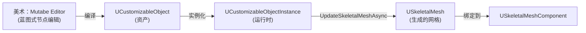
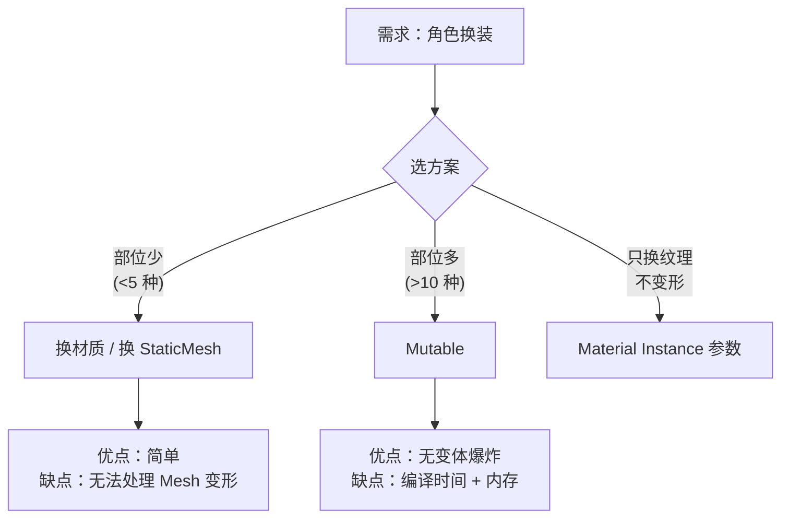

# Mutable是什么可定制角色系统的本质

> 学完本课，你将理解：Mutable 解决什么问题、与传统"硬变体"方案的对比、核心术语体系。

## 概述

传统角色换装需要预制大量 Mesh 变体（`SK_Character_ArmorA_HelmetB_...`），变体数量呈指数爆炸。Mutable 通过**参数化网格生成**，在编辑器或运行时按需合成唯一 Mesh，彻底解决变体爆炸问题。

## Mutable 解决的核心问题

### 问题：硬变体方案的瓶颈

| 方案 | 变体数量 | 内存 | 维护成本 |
|------|---------|------|---------|
| 硬变体（每个组合一个 Mesh） | O(2^n) | 极高 | 不可维护 |
| 材质参数驱动（只换纹理） | 有限 | 低 | 中 |
| **Mutable（参数化生成）** | **按需生成** | **共享基础网格** | **低** |

示例：一个角色有 4 个可选部位（头盔/护甲/裤子/靴子），每个部位 5 种选项 → 硬变体需要 5^4 = 625 个 Mesh 文件；Mutable 只需 1 个基础 `CustomizableObject` + 参数驱动。

## Mutable 在 UE5 中的位置



Mutable 是**编辑器工具 + 运行时库**的组合：
- **编辑器侧**：`CustomizableObject` 资产（类似蓝图，用节点图定义生成规则）
- **运行时侧**：`CustomizableObjectInstance` 持有参数值，驱动 Mesh 生成

## 核心术语表

| 术语 | 英文 | 含义 |
|------|------|------|
| 可定制对象 | `UCustomizableObject` | 定义"有哪些可定制参数"和"如何生成 Mesh"的资产 |
| 实例 | `UCustomizableObjectInstance` | 一个具体的参数组合（如"红盔甲+蓝裤子"） |
| 参数 | Parameter | 驱动生成的输入变量（枚举/布尔/浮点/纹理/向量等） |
| 基网格 | Base Mesh | 角色的基础 Skeletal Mesh，可变部位在其上叠加 |
| 部位（Component） | Component | Mutable 中的"可开关部位"概念（非 UE Component） |
| 烘焙（Bake） | Baking | 将运行时生成的 Mesh 离线固化为标准资产 |

## Mutable vs 其他方案



## UCustomizableObject 类概览（引擎层）

> 源码：`Engine/Plugins/Mutable/Source/CustomizableObject/Public/MuCO/CustomizableObject.h`

`UCustomizableObject` 继承自 `UObject`，核心职责：
- 定义参数列表（`BoolParameters`、`IntParameters`、`FloatParameters` 等）
- 持有编译后的内部模型数据（`CustomizableObjectResourceData`）
- 提供编译接口（编辑器侧触发）

关键结构体（`CustomizableObject.h` L69-L107）：

```cpp
// 参数标签结构体：描述一个 Parameter 的元数据
USTRUCT()
struct FParameterTags
{
    // 该参数关联的所有 Tag
    UPROPERTY(Category = "CustomizablePopulation", EditAnywhere)
    TArray<FString> Tags;

    // 参数的可用选项及其 Tag 映射
    UPROPERTY(Category = "CustomizablePopulation", EditAnywhere)
    TMap<FString, FFParameterOptionsTags> ParameterOptions;
};
```

## 在项目中启用 Mutable

1. 打开 **Edit → Plugins**
2. 搜索 **Mutable**
3. 勾选 **Enabled**
4. 重启编辑器

验证启用成功：
```cpp
// 在 C++ 中验证 Mutable 模块可用
#include "MuCO/CustomizableObject.h"

if (UCustomizableObject* CO = LoadObject<UCustomizableObject>(nullptr, TEXT("/Game/MyCharacter.MyCharacter")))
{
    // 成功加载 CustomizableObject 资产
}
```

## 总结与要点

| # | 要点 |
|---|------|
| 1 | Mutable 解决**变体爆炸**问题，用参数化生成替代硬变体 |
| 2 | 核心三角：`UCustomizableObject`（定义）→ `Instance`（参数值）→ `SkeletalMesh`（生成结果） |
| 3 | Mutable 是 UE5 **内置插件**，无需额外安装 |
| 4 | 适用场景：角色创建器、换装系统、武器自定义（部位多、变体多的场景） |

## 下一步

下一课：[[30-tutorials/mutable/02-Mutable核心架构三个类的三角关系|核心架构]] — 深入 `CustomizableObject` / `Instance` / `Component` 三角关系。

## 相关页面

- [[30-tutorials/ue-framework/00-UE框架概述|UE 框架总览]] — 理解 UObject 体系
- [[30-tutorials/animation/01-Lyra动画系统框架深度分析-概览|动画系统概览]] — SkeletalMesh 基础

<!-- nav:auto -->

---

**导航**: ← [[30-tutorials/mutable/00-Mutable可定制角色系统系列概览|00-Mutable可定制角色系统系列概览]] · [[30-tutorials/mutable/02-Mutable核心架构三个类的三角关系|02-Mutable核心架构三个类的三角关系]] →

<!-- /nav:auto -->
