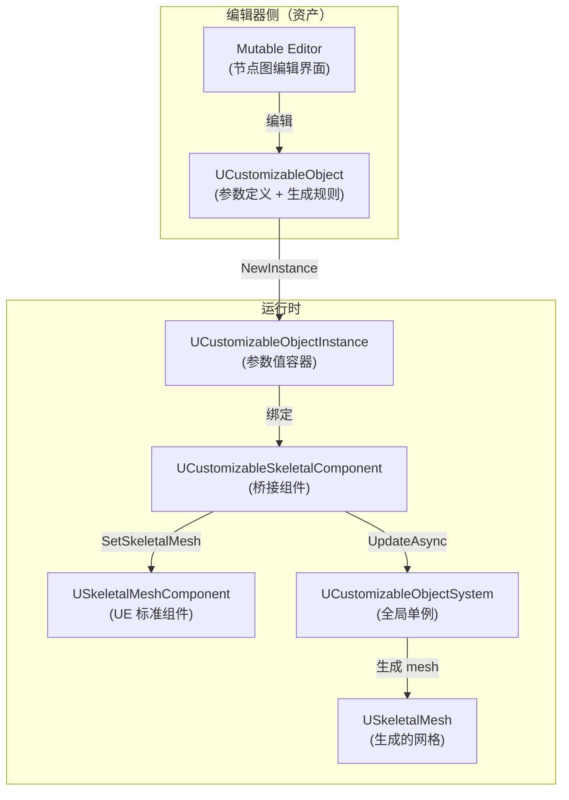
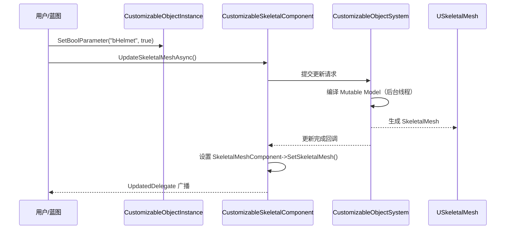

# Mutable核心架构三个类的三角关系

> 学完本课，你将清晰理解 `UCustomizableObject`、`UCustomizableObjectInstance`、`UCustomizableSkeletalComponent` 各自的职责与协作关系。

## 概述

Mutable 的设计遵循**"定义 → 实例 → 渲染"**三层分离架构，类似"蓝图类 → 蓝图实例 → Actor 组件"的关系。

## 三层架构图



## 三个核心类详解

### 1. UCustomizableObject（定义层）

> 源码：`Engine/Plugins/Mutable/Source/CustomizableObject/Public/MuCO/CustomizableObject.h`

**本质**：一个数据资产（类似 `UBlueprint`），定义"有哪些参数"和"如何生成 Mesh"。

| 职责 | 说明 |
|------|------|
| 参数定义 | 声明 Bool/Int/Float/Texture/Vector 等参数 |
| 生成规则 | 内部持有编译后的 Mutable Model（二进制） |
| 编译入口 | 编辑器侧触发编译，生成 `ResourceData` |
| LOD 设置 | 控制各平台的 LOD 策略（`FMutableLODSettings`） |

**关键**：`UCustomizableObject` 本身不参与运行时 Mesh 生成，它是**模板**。

### 2. UCustomizableObjectInstance（运行时参数容器）

> 源码：`Engine/Plugins/Mutable/Source/CustomizableObject/Public/MuCO/CustomizableObjectInstance.h`

**本质**：`UCustomizableObject` 的运行时实例，持有**具体参数值**。

| 职责 | 说明 |
|------|------|
| 参数赋值 | `SetBoolParameter(name, value)` 等 |
| 触发更新 | `UpdateSkeletalMeshAsync()` |
| Baking | 将生成结果固化为标准资产 |
| Profile 管理 | 保存/加载参数组合（`FProfileParameterDat`） |

关键结构体（`CustomizableObjectInstance.h` L61-L99）：

```cpp
// Baking 输出结果
USTRUCT(BlueprintType, Blueprintable)
struct FCustomizableObjectInstanceBakeOutput
{
    // 烘焙是否成功
    UPROPERTY(BlueprintReadOnly, Category = CustomizableObjectInstanceBaker)
    bool bWasBakeSuccessful = false;

    // 所有保存的 Package 路径
    UPROPERTY(BlueprintReadOnly, Category = CustomizableObjectInstanceBaker)
    TArray<FBakedResourceData> SavedPackages;
};
```

### 3. UCustomizableSkeletalComponent（桥接层）

> 源码：`Engine/Plugins/Mutable/Source/CustomizableObject/Public/MuCO/CustomizableSkeletalComponent.h`

**本质**：`USceneComponent` 子类，挂在 `AActor` 上，桥接 Mutable Instance 与 `USkeletalMeshComponent`。

```cpp
// 源码：CustomizableSkeletalComponent.h 约 L21
class UCustomizableSkeletalComponent : public USceneComponent
{
    // 持有的 Mutable 实例
    UPROPERTY(BlueprintReadWrite, EditAnywhere, Category = CustomizableSkeletalComponent)
    TObjectPtr<UCustomizableObjectInstance> CustomizableObjectInstance;
};
```

| 职责 | 说明 |
|------|------|
| 持有 Instance | 通过 `CustomizableObjectInstance` 属性关联 |
| 触发更新 | `UpdateSkeletalMeshAsync()` — 异步生成 Mesh |
| 设置 Mesh | 生成完成后，自动设置父 `SkeletalMeshComponent` 的 `SkeletalMesh` |
| 委托通知 | `UpdatedDelegate` — Mesh 更新完成时广播 |

## 完整协作时序



## 在蓝图中使用的最小流程

```
1. 创建 CustomizableObject 资产（编辑器）
2. 在 Actor Blueprint 中添加 CustomizableSkeletalComponent
3. 设置 Instance → CustomizableObject 资产
4. 调用 UpdateSkeletalMeshAsync
5. 等待 UpdatedDelegate → 完成
```

## 总结与要点

| # | 要点 |
|---|------|
| 1 | `UCustomizableObject` = 模板（定义参数 + 生成规则） |
| 2 | `UCustomizableObjectInstance` = 实例（持有具体参数值） |
| 3 | `UCustomizableSkeletalComponent` = 桥接器（连接 Instance 与 SkeletalMesh） |
| 4 | 更新流程：设参数 → `UpdateSkeletalMeshAsync()` → 等待委托 → 完成 |

## 下一步

下一课：[[30-tutorials/mutable/03-CustomizableObject与Instance详解|CustomizableObject 与 Instance 详解]] — 深入参数系统与 Instance 的 C++ 接口。

## 相关页面

- [[30-tutorials/mutable/01-Mutable是什么可定制角色系统的本质|Mutable 是什么]] — 前置概念
- [[30-tutorials/ue-framework/40-actor-system/00-AActor架构概述|Actor 系统概览]] — Actor 与 Component 关系

<!-- nav:auto -->

---

**导航**: ← [[30-tutorials/mutable/01-Mutable是什么可定制角色系统的本质|01-Mutable是什么可定制角色系统的本质]] · [[30-tutorials/mutable/03-CustomizableObject与Instance详解|03-CustomizableObject与Instance详解]] →

<!-- /nav:auto -->
