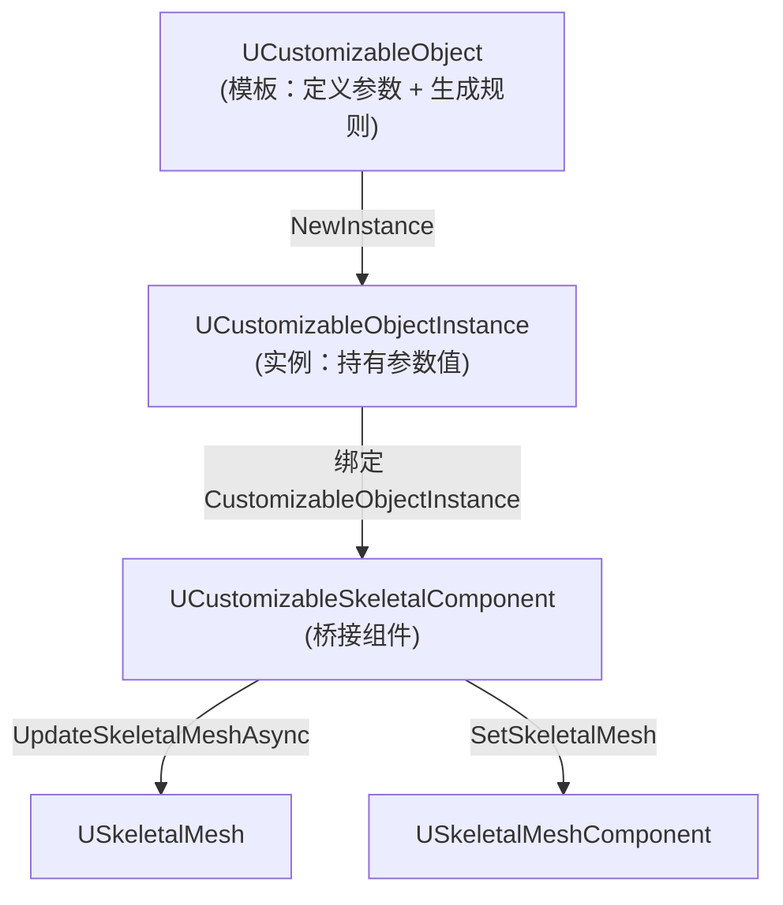

# CustomizableObject与Instance详解

> 学完本课，你将掌握：`UCustomizableObject` 的参数定义机制、`UCustomizableObjectInstance` 的参数赋值与更新全流程。

## 概述

`UCustomizableObject` 是"模板"（定义有哪些参数），`UCustomizableObjectInstance` 是"实例"（持有具体参数值）。本课深入两者的 C++ 接口与协作机制。

### 两者协作关系图



## UCustomizableObject 深度解析

> 源码：`Engine/Plugins/Mutable/Source/CustomizableObject/Public/MuCO/CustomizableObject.h`

### 类继承与核心属性

```cpp
// CustomizableObject.h 约 L218
UCLASS(MinimalAPI,  BlueprintType, config=Engine )
class UCustomizableObject : public UObject
{
    // 编译后的资源数据（运行时使用）
    // 编辑器侧由 Mutable Editor 编译生成
```

### 参数系统

`UCustomizableObject` 通过内部数据定义参数列表，实例通过参数名访问：

```cpp
// CustomizableObject.h 约 L348 — 查询参数接口
UFUNCTION(BlueprintCallable, Category = CustomizableObject)
CUSTOMIZABLEOBJECT_API int32 GetParameterCount() const;

UFUNCTION(BlueprintCallable, Category = CustomizableObject)
CUSTOMIZABLEOBJECT_API bool ContainsParameter(const FString& ParameterName) const;
```

| 参数类型 | C++ 类型 | 说明 |
|---------|-----------|------|
| 布尔 | `FBoolParameterValue` | 开关型参数 |
| 整数（枚举） | `FIntParameterValue` | 下拉选择 |
| 浮点 | `FFloatParameterValue` | 滑块/数值 |
| 纹理 | `FTextureParameterValue` | 贴图参数 |
| 向量 | `FVectorParameterValue` | 颜色/坐标 |
| 投影器 | `FProjectorParameterValue` | 纹理投影 |
| 变换 | `FTransformParameterValue` | 位置/旋转/缩放 |
| SkeletalMesh | `FSkeletalMeshParameterValue` | Mesh 引用 |

### 编译系统接口

```cpp
// CustomizableObject.h 约 L213 — 编译参数结构体
USTRUCT(BlueprintType)
struct FCompileParams
{
    // 若已编译则跳过（增量编译）
    UPROPERTY(BlueprintReadWrite, Category = Compile)
    bool bSkipIfCompiled = false;

    // 异步编译（推荐 true）
    UPROPERTY(BlueprintReadWrite, Category = Compile)
    bool bAsync = true;

    // 编译完成回调
    UPROPERTY(BlueprintReadWrite, Category = Compile)
    FCompileDelegate Callback;
};
```

编译状态查询（`CustomizableObject.h` L165-L168）：

```cpp
USTRUCT(BlueprintType)
struct FCompileCallbackParams
{
    UPROPERTY(BlueprintReadOnly, Category = Compile)
    bool bRequestFailed = false;  // 编译失败

    UPROPERTY(BlueprintReadOnly, Category = Compile)
    bool bWarnings = false;       // 有警告

    UPROPERTY(BlueprintReadOnly, Category = Compile)
    bool bErrors = false;         // 有错误

    UPROPERTY(BlueprintReadOnly, Category = Compile)
    bool bCompiled = false;       // 编译成功
};
```

### LOD 与流式加载设置

```cpp
// CustomizableObject.h 约 L276
// 是否启用 Mesh 流式加载（按需生成 LOD）
UPROPERTY(EditAnywhere, Category = CustomizableObject)
bool bEnableMeshStreaming = true;

// 首次生成时保留用户指定的 LOD（不强制全量生成）
UPROPERTY(Category = "CustomizableObject", EditAnywhere)
bool bPreserveUserLODsOnFirstGeneration = false;
```

## UCustomizableObjectInstance 深度解析

> 源码：`Engine/Plugins/Mutable/Source/CustomizableObject/Public/MuCO/CustomizableObjectInstance.h`

### 类概览

```cpp
// CustomizableObjectInstance.h 约 L264
UCLASS(MinimalAPI, BlueprintType, HideCategories=(CustomizableObjectInstance))
class UCustomizableObjectInstance : public UObject
{
    // 持有参数值、触发更新、管理 Baking
```

### 绑定 CustomizableObject

```cpp
// CustomizableObjectInstance.h 约 L306
UFUNCTION(BlueprintCallable, Category = CustomizableObjectInstance)
CUSTOMIZABLEOBJECT_API void SetObject(UCustomizableObject* InObject);

// CustomizableObjectInstance.h 约 L310
UFUNCTION(BlueprintCallable, Category = CustomizableObjectInstance)
CUSTOMIZABLEOBJECT_API UCustomizableObject* GetCustomizableObject() const;
```

### 参数赋值接口

| 参数类型 | Set 方法 | Get 方法 |
|---------|---------|---------|
| Bool | `SetBoolParameter(Name, Value)` | `GetBoolParameter(Name)` |
| Int | `SetIntParameter(Name, Value)` | `GetIntParameter(Name)` |
| Float | `SetFloatParameter(Name, Value)` | `GetFloatParameter(Name)` |
| Texture | `SetTextureParameter(Name, Tex)` | `GetTextureParameter(Name)` |
| Vector | `SetVectorParameter(Name, Value)` | `GetVectorParameter(Name)` |

### 更新流程

```cpp
// CustomizableObjectInstance.h 约 L226
// 更新完成委托（最重要：游戏逻辑在此回调中响应 Mesh 生成完成）
DECLARE_DYNAMIC_MULTICAST_DELEGATE_OneParam(FObjectInstanceUpdatedDelegate,
    UCustomizableObjectInstance*, Instance);
```

更新结果枚举（`CustomizableObjectInstance.h` L196-L207）：

```cpp
UENUM(BlueprintType)
enum class EUpdateResult : uint8
{
    Success,          // 更新成功
    Warning,          // 成功但有警告
    Error,            // 错误
    ErrorOptimized,   // 跳过：结果与当前相同（优化）
    ErrorReplaced,    // 跳过：被更新的请求替换
    ErrorDiscarded,   // 跳过：被 LOD 管理丢弃
    Error16BitBoneIndex // 错误：不支持 16bit Bone Index
};
```

### Baking 系统

Baking 将运行时生成的 Mesh **固化为标准 UE 资产**（可打包、可版本管理）：

```cpp
// CustomizableObjectInstance.h 约 L175
USTRUCT(BlueprintType, Blueprintable)
struct FBakingConfiguration
{
    // 烘焙输出路径（如 "/Game/BakedCharacters"）
    UPROPERTY(BlueprintReadWrite, Blueprintable, Category = CustomizableObjectInstanceBaker)
    FString OutputPath = TEXT("/Game");

    // 是否导出所有资源（false = 仅导出引用的）
    UPROPERTY(BlueprintReadWrite, Blueprintable, Category = CustomizableObjectInstanceBaker)
    bool bExportAllResourcesOnBake = false;
};
```

## C++ 使用示例

### 加载 CustomizableObject 并创建 Instance

```cpp
// 加载 CustomizableObject 资产
UCustomizableObject* CharacterCO = LoadObject<UCustomizableObject>(
    nullptr, TEXT("/Game/Characters/BaseCharacter.BaseCharacter"));

// 创建 Instance
UCustomizableObjectInstance* Instance = NewObject<UCustomizableObjectInstance>(
    this, UCustomizableObjectInstance::StaticClass());

// 绑定 Object
Instance->SetObject(CharacterCO);

// 赋值参数
Instance->SetBoolParameter(TEXT("bHelmet"), true);
Instance->SetIntParameter(TEXT("BodyType"), 2);
Instance->SetTextureParameter(TEXT("SkinTexture"), MySkinTex);
```

### 监听更新完成

```cpp
// 绑定更新完成委托
Instance->UpdatedDelegate.AddDynamic(this, &AMyCharacter::OnMutableUpdated);

// 触发异步更新（通过 CustomizableSkeletalComponent）
USkeletalMeshComponent* SkelComp = GetSkeletalMeshComponent();
UCustomizableSkeletalComponent* MutableComp =
    SkelComp->FindComponentByClass<UCustomizableSkeletalComponent>();

if (MutableComp)
{
    MutableComp->SetCustomizableObjectInstance(Instance);
    MutableComp->UpdateSkeletalMeshAsync();
}
```

## 参数 Profile 系统

`UCustomizableObject` 支持保存/加载参数组合（Profile）：

```cpp
// CustomizableObject.h 约 L — 存储的 Profile 列表
UPROPERTY()
TArray<FProfileParameterDat> InstancePropertiesProfiles;
```

`FProfileParameterDat`（`CustomizableObject.h` L70-L107）保存所有参数类型的当前值，可用于实现"预设造型"功能（如"造型 A / 造型 B"）。

## 总结与要点

| # | 要点 |
|---|------|
| 1 | `UCustomizableObject` = 模板：定义参数列表 + 持有编译后的生成规则 |
| 2 | `UCustomizableObjectInstance` = 实例：持有具体参数值 + 触发更新 |
| 3 | 参数类型：Bool / Int / Float / Texture / Vector / Projector / Transform |
| 4 | 更新是异步的：`UpdatedDelegate` 广播完成事件 |
| 5 | Baking 可将生成结果固化为标准资产（利于打包与版本管理） |

## 下一步

下一课：[[30-tutorials/mutable/04-SkeletalComponent与运行时更新详解|SkeletalComponent 与运行时更新]] — 深入 `UCustomizableSkeletalComponent` 的更新机制。

## 相关页面

- [[30-tutorials/mutable/02-Mutable核心架构三个类的三角关系|核心架构]] — 三角关系总览
- [[30-tutorials/animation/02-UE5动画系统引擎基础框架深度分析|动画引擎基础]] — SkeletalMesh 集成参考

<!-- nav:auto -->

---

**导航**: ← [[30-tutorials/mutable/02-Mutable核心架构三个类的三角关系|02-Mutable核心架构三个类的三角关系]] · [[30-tutorials/mutable/04-SkeletalComponent与运行时更新详解|04-SkeletalComponent与运行时更新详解]] →

<!-- /nav:auto -->
