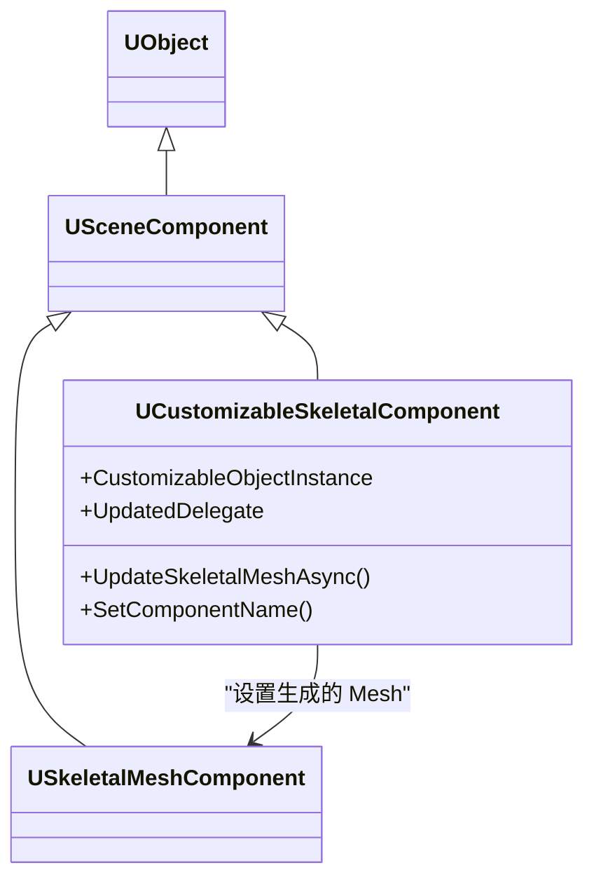
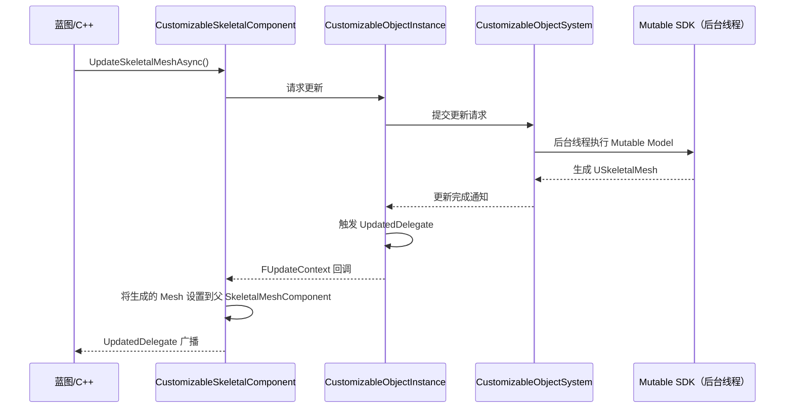

# SkeletalComponent与运行时更新详解

> 学完本课，你将掌握：`UCustomizableSkeletalComponent` 的桥接机制、异步更新全流程、`UpdatedDelegate` 的使用方式。

## 概述

`UCustomizableSkeletalComponent` 是 Mutable 与 UE 动画系统之间的**唯一桥梁**：它持有 `UCustomizableObjectInstance`，负责触发更新、接收生成结果、并注入到 `USkeletalMeshComponent`。

## UCustomizableSkeletalComponent 类架构

> 源码：`Engine/Plugins/Mutable/Source/CustomizableObject/Public/MuCO/CustomizableSkeletalComponent.h`

```cpp
// CustomizableSkeletalComponent.h 约 L21
UCLASS(MinimalAPI, Blueprintable, BlueprintType, ClassGroup = (CustomizableObject),
       meta = (BlueprintSpawnableComponent))
class UCustomizableSkeletalComponent : public USceneComponent
{
    // 核心属性：持有的 Mutable Instance
    UPROPERTY(BlueprintReadWrite, EditAnywhere, Category = CustomizableSkeletalComponent)
    TObjectPtr<UCustomizableObjectInstance> CustomizableObjectInstance;
};
```

### 继承关系



## 核心属性详解

### CustomizableObjectInstance

```cpp
// CustomizableSkeletalComponent.h 约 L28
UPROPERTY(BlueprintReadWrite, EditAnywhere, Category = CustomizableSkeletalComponent)
TObjectPtr<UCustomizableObjectInstance> CustomizableObjectInstance;
```

- 在**编辑器 Details 面板**直接赋值，或运行时 `SetCustomizableObjectInstance()`
- 每个 `UCustomizableSkeletalComponent` 持有**一个** Instance
- 多部位角色（头/躯干/腿分开）需要多个 Component，各自持有一个 Instance

### ComponentName（替代废弃的 ComponentIndex）

```cpp
// CustomizableSkeletalComponent.h 约 L40
// 注意：ComponentIndex 已废弃，请使用 ComponentName
UPROPERTY(EditAnywhere, Category = CustomizableSkeletalComponent)
FName ComponentName;
```

`ComponentName` 对应 `UCustomizableObject` 中定义的** Component 名称**（在 Mutable Editor 中命名）。

## 异步更新全流程

### 触发更新

```cpp
// CustomizableSkeletalComponent.h 约 L100
// 异步更新（无回调版本）
UFUNCTION(BlueprintCallable, Category = CustomizableSkeletalComponent)
UE_API void UpdateSkeletalMeshAsync(bool bNeverSkipUpdate = false);

// 异步更新（有回调版本，推荐）
UFUNCTION(BlueprintCallable, Category = CustomizableSkeletalComponent)
UE_API void UpdateSkeletalMeshAsyncResult(
    FInstanceUpdateDelegate Callback,
    bool bIgnoreCloseDist = false,
    bool bForceHighPriority = false);
```

### 更新时序（完整）



### UpdatedDelegate 的使用

```cpp
// CustomizableSkeletalComponent.h 约 L
FCustomizableSkeletalComponentUpdatedDelegate UpdatedDelegate;
```

**C++ 绑定示例**：

```cpp
// 在 Actor 中绑定
void AMyCharacter::BeginPlay()
{
    Super::BeginPlay();

    if (UCustomizableSkeletalComponent* MutableComp =
        FindComponentByClass<UCustomizableSkeletalComponent>())
    {
        MutableComp->UpdatedDelegate.AddDynamic(this, &AMyCharacter::OnMutableUpdated);
    }
}

void AMyCharacter::OnMutableUpdated()
{
    UE_LOG(LogTemp, Log, TEXT("Mutable mesh update complete!"));

    // 此时 SkeletalMesh 已就绪，可播放动画等
    if (USkeletalMeshComponent* SkelComp = GetSkeletalMeshComponent())
    {
        SkelComp->PlayAnimation(IdleAnim, true);
    }
}
```

**蓝图绑定**：在蓝图中直接绑定 `On Updated` 事件。

## 跳过 Reference Mesh 设置

两个布尔控制 Mesh 设置的时机：

```cpp
// CustomizableSkeletalComponent.h 约 L43
// true = 不自动设置 Reference Skeletal Mesh（用于自定义控制）
UPROPERTY(EditAnywhere, Category = CustomizableSkeletalComponent)
bool bSkipSetReferenceSkeletalMesh = false;

// CustomizableSkeletalComponent.h 约 L50
// true = 完全跳过设置任何 Mesh（完全手动控制）
UPROPERTY()
bool bSkipSkipSetSkeletalMeshOnAttach = false;
```

| 场景 | `bSkipSetReferenceSkeletalMesh` | `bSkipSetSkeletalMeshOnAttach` |
|------|----------------------------------------|--------------------------------------|
| 正常流程（自动设置 Mesh） | `false` | `false` |
| 需要等 Mesh 生成后再手动设置 | `true` | `false` |
| 完全手动控制 Mesh 设置 | 任意 | `true` |

## 多 Component 管理

复杂角色（头/躯干/手臂/腿分开定制）需要多个 `UCustomizableSkeletalComponent`：

```cpp
// 每个部位一个 Component，各自设置 ComponentName
// HeadComponent -> ComponentName = "Head"
// TorsoComponent -> ComponentName = "Torso"
// ...

// 全部设置完毕后，逐一触发更新
HeadComponent->UpdateSkeletalMeshAsync();
TorsoComponent->UpdateSkeletalMeshAsync();
// 注意：Mutable 会自动合并为一个最终 SkeletalMesh
```

> **关键**：多个 Component 的更新完成后，`USkeletalMeshComponent` 会持有**合并后的完整 Mesh**。

## 性能相关接口

### 优先级控制

```cpp
// CustomizableObjectInstance.h 约 L
// 更新队列优先级（Mutable 内部使用）
enum class EQueuePriorityType : uint8 { High, Med, Med_Low, Low };
```

- `bForceHighPriority = true` → 插入队列头部（用于玩家可见的角色）
- 默认：按距离排序（`Med_Low`）

###  close distance 跳过

```cpp
// CustomizableSkeletalComponent.h 约 L
void UpdateSkeletalMeshAsyncResult(
    FInstanceUpdateDelegate Callback,
    bool bIgnoreCloseDist = false,  // true = 忽略距离剔除，强制更新
    bool bForceHighPriority = false);
```

## 总结与要点

| # | 要点 |
|---|------|
| 1 | `UCustomizableSkeletalComponent` 是 Mutable 与 `USkeletalMeshComponent` 的唯一桥梁 |
| 2 | 更新是**异步**的：`UpdateSkeletalMeshAsync()` → 后台生成 → `UpdatedDelegate` 回调 |
| 3 | 多部位角色用多个 Component，各自设置 `ComponentName`，最终 Mesh 自动合并 |
| 4 | `bSkipSetReferenceSkeletalMesh` 控制是否自动设置 Reference Mesh |
| 5 | 优先级：`bForceHighPriority = true` 可插队 |

## 下一步

下一课：[[30-tutorials/mutable/05-编译Baking与性能优化|编译、Baking 与性能优化]] — 编辑器编译流程、运行时 Baking、LOD 与内存优化。

## 相关页面

- [[30-tutorials/mutable/03-CustomizableObject与Instance详解|CustomizableObject 与 Instance 详解]] — 前置知识
- [[30-tutorials/animation/06-Lyra动画系统实现详解|Lyra 动画系统实现]] — SkeletalMeshComponent 集成参考

<!-- nav:auto -->

---

**导航**: ← [[30-tutorials/mutable/03-CustomizableObject与Instance详解|03-CustomizableObject与Instance详解]] · [[30-tutorials/mutable/05-编译Baking与性能优化|05-编译Baking与性能优化]] →

<!-- /nav:auto -->
