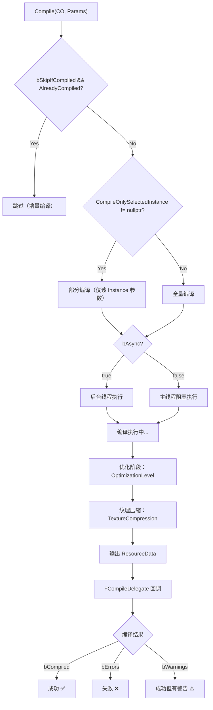
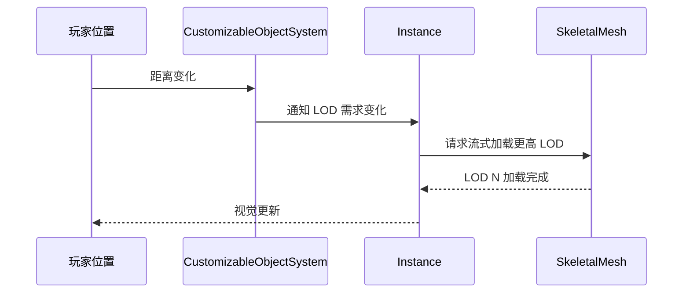

# 编译Baking与性能优化

> 学完本课，你将掌握：Mutable 编辑器编译流程、运行时 Baking 策略、LOD 流式加载、内存与性能优化方法。

## 概述

Mutable 有**两条生成路径**：编辑器编译（离线、质量优先）和运行时更新（在线、速度优先）。本课深入两者的机制与优化策略。

## 编辑器编译流程

### 编译触发方式

| 方式 | 接口 | 说明 |
|------|------|------|
| 编辑器手动 | 点击 **Compile** 按钮 | 最常用 |
| C++/蓝图 | `UCustomizableObject::Compile()` | 需要构造 `FCompileParams` |
| 自动编译 | `UCustomizableObjectSystem::IsAutoCompileEnabled()` | 实例更新时自动触发 |

### 编译流程示意图



### 编译参数（`FCompileParams`）

> 源码：`CustomizableObject.h` L176-L213

```cpp
USTRUCT(BlueprintType)
struct FCompileParams
{
    // 若已编译则跳过（增量编译）
    UPROPERTY(BlueprintReadWrite, Category = Compile)
    bool bSkipIfCompiled = false;

    // 仅编译选中的 Instance 参数（部分编译，极速）
    UPROPERTY(BlueprintReadWrite, Category = Compile)
    TObjectPtr<UCustomizableObjectInstance> CompileOnlySelectedInstance = nullptr;

    // 异步编译（推荐 true，避免冻结编辑器）
    UPROPERTY(BlueprintReadWrite, Category = Compile)
    bool bAsync = true;

    // 优化级别
    UPROPERTY(BlueprintReadWrite, Category = Compile)
    ECustomizableObjectOptimizationLevel OptimizationLevel =
        ECustomizableObjectOptimizationLevel::FromCustomizableObject;

    // 纹理压缩策略
    UPROPERTY(BlueprintReadWrite, Category = Compile)
    ECustomizableObjectTextureCompression TextureCompression =
        ECustomizableObjectTextureCompression::Fast;
};
```

### 编译回调

```cpp
// CustomizableObject.h 约 L173
DECLARE_DYNAMIC_DELEGATE_OneParam(FCompileDelegate,
    const FCompileCallbackParams&, Params);
```

`FCompileCallbackParams`（`CustomizableObject.h` L144-L168）包含编译结果：
- `bRequestFailed` — 编译失败
- `bWarnings` — 有警告
- `bErrors` — 有错误
- `bCompiled` — 编译成功
- `bSkipped` — 被跳过（已是最新）

## 运行时 Baking（烘焙）

Baking 将**运行时生成的 Mesh 固化为标准 UE 资产**，用于：
1. 打包后无需 Mutable 运行时（减少包体/内存）
2. 版本管理（Baking 结果可纳入资产版本控制）
3. 性能敏感场景（避免运行时编译开销）

### Baking 配置

> 源码：`CustomizableObjectInstance.h` L108-L175

```cpp
USTRUCT(BlueprintType, Blueprintable)
struct FBakingConfiguration
{
    // 烘焙输出路径（如 "/Game/BakedCharacters"）
    UPROPERTY(BlueprintReadWrite, Blueprintable, Category = CustomizableObjectInstanceBaker)
    FString OutputPath = TEXT("/Game");

    // 输出文件名前缀
    UPROPERTY(BlueprintReadWrite, Blueprintable, Category = ...)
    FString OutputFilesBaseName;

    // 是否导出所有资源（false = 仅导出引用的）
    UPROPERTY(BlueprintReadWrite, Blueprintable, Category = CustomizableObjectInstanceBaker)
    bool bExportAllResourcesOnBake = false;

    // 是否为每个材质创建常量 MaterialInstance
    UPROPERTY(BlueprintReadWrite, Blueprintable, Category = CustomizableObjectInstanceBaker)
    bool bGenerateConstantMaterialInstancesOnBake = false;

    // 资源命名前缀（可自定义）
    UPROPERTY(BlueprintReadWrite, Blueprintable, Category = "ResourceNameGeneration")
    FString SkeletalMeshAssetPrefix = TEXT("SK_");
    // ... 还有 Skeleton/PhysicsAsset/Texture/Material 等前缀
};
```

### Baking 输出

```cpp
USTRUCT(BlueprintType, Blueprintable)
struct FCustomizableObjectInstanceBakeOutput
{
    // 烘焙是否成功
    UPROPERTY(BlueprintReadOnly, Category = CustomizableObjectInstanceBaker)
    bool bWasBakeSuccessful = false;

    // 所有保存的 Package 信息
    UPROPERTY(BlueprintReadOnly, Category = CustomizableObjectInstanceBaker)
    TArray<FBakedResourceData> SavedPackages;
};
```

`FBakedResourceData` 包含：
- `SaveType` — 保存方式（`NewFile` / `ReusedFile`）
- `AssetPath` — 保存路径

### C++ Baking 示例

```cpp
FBakingConfiguration BakeConfig;
BakeConfig.OutputPath = TEXT("/Game/BakedCharacters");
BakeConfig.OutputFilesBaseName = TEXT("Hero");
BakeConfig.bExportAllResourcesOnBake = true;

// 绑定完成回调
BakeConfig.OnBakeOperationCompletedCallback.BindDynamic(
    this, &AMyCharacter::OnBakeComplete);

// 执行 Baking（UCustomizableObjectInstance 方法）
Instance->Bake(BakeConfig);
```

## LOD 与流式加载

### LOD 策略配置

> 源码：`CustomizableObject.h` L111-L141

```cpp
USTRUCT()
struct FMutableLODSettings
{
    // 各平台最低 LOD
    UPROPERTY(EditAnywhere, Category = LODSettings)
    FPerPlatformInt MinLOD;

    // 各 Quality Level 最低 LOD
    UPROPERTY(EditAnywhere, Category = LODSettings)
    FPerQualityLevelInt MinQualityLevelLOD;

    // 是否启用 LOD 流式加载（默认 true）
    UPROPERTY(EditAnywhere, Category = LODSettings)
    FPerPlatformBool bEnableLODStreaming = true;

    // 最大流式 LOD 数量（0 = 禁用流式）
    UPROPERTY(EditAnywhere, Category = LODSettings)
    FPerPlatformInt NumMaxStreamedLODs = MAX_MESH_LOD_COUNT;
};
```

### LOD 流式加载原理



关键 ConsoleVariable（`CustomizableObjectSystem.h` L30-L44）：
```
mutable.EnableLODStreaming=1        // 启用 LOD 流式
mutable.NumMaxStreamedLODs=4        // 最大流式 LOD 数
mutable.PreserveUserLODsOnFirstGeneration=1  // 首次生成保留用户 LOD
```

## 内存管理

### WorkingMemory 限制

> 源码：`CustomizableObjectSystem.h` L253-L262

```cpp
// 设置 Mutable 工作内存上限（KB）
UFUNCTION(BlueprintCallable, Category = CustomizableObjectSystem)
static void SetWorkingMemory(int32 KiloBytes);

// 查询当前设置
UFUNCTION(BlueprintCallable, BlueprintPure, Category = CustomizableObjectSystem)
static int32 GetWorkingMemory();
```

- Mutable 会在更新之间**自动清理缓存**，尽量保持内存低于此限制
- **不是硬限制**：UObject 内存不被追踪
- 推荐设置：PC 51200（50MB），移动端 10240（10MB）

### Mesh Cache

```cpp
// CustomizableObject.h 约 L272
// 启用 Mesh 缓存（复用相同 CO 的已生成 Mesh）
UPROPERTY(EditAnywhere, Category = CustomizableObject)
bool bEnableMeshCache = false;
```

- `true` = 相同 `UCustomizableObject` 的 Instance 之间**复用已生成的 Mesh**
- 条件：Mesh 未变、LOD 数量未变
- 节省内存，但增加查找开销

### 相关 ConsoleVariable

```
mutable.WorkingMemory=51200        // 工作内存上限（KB）
mutable.ClearWorkingMemoryOnUpdateEnd=1  // 更新结束后清除工作内存
mutable.EnableMeshCache=1           // 启用 Mesh 缓存
mutable.ReuseTexturesBetweenInstances=1 // 实例间复用纹理
```

## 性能优化清单

| 优化项 | 方法 | 效果 |
|--------|------|------|
| 减少编译时间 | `CompileOnlySelectedInstance` 部分编译 | 编译时间 ↓ 70% |
| 减少运行时开销 | `bEnableMeshStreaming=true` | 内存 ↓，CPU 开销 ↑ |
| 控制内存 | `SetWorkingMemory(51200)` | 防止内存溢出 |
| 减少变体 | `bEnableMeshCache=true` | 内存共享 ↓ |
| 纹理优化 | `TextureCompression=Fast` | 编译时间 ↓，质量 ↓ |
| 异步更新 | `bForceHighPriority` 仅用于可见角色 | 更新响应速度 ↑ |

## 总结与要点

| # | 要点 |
|---|------|
| 1 | 编辑器编译是**离线**的，`FCompileParams` 控制增量/全量/部分编译 |
| 2 | Baking 将运行时结果固化为标准资产，利于打包与版本管理 |
| 3 | LOD 流式加载：`bEnableLODStreaming` 控制，按需生成 LOD |
| 4 | 内存管理：`SetWorkingMemory()` 设置上限，`bEnableMeshCache` 启用复用 |
| 5 | 性能优化核心：**部分编译 + Mesh 缓存 + LOD 流式 + 合理内存上限** |

## 下一步

下一课：[[30-tutorials/mutable/08-Mutable高级主题与常见陷阱|高级主题与常见陷阱]] — 多 Component 管理、纹理压缩、与项目集成的实战经验。

## 相关页面

- [[30-tutorials/mutable/04-SkeletalComponent与运行时更新详解|SkeletalComponent 与运行时更新]] — 前置知识
- [[30-tutorials/performance-optimization/00-性能优化系列概览|性能优化系列]] — 全局性能策略

<!-- nav:auto -->

---

**导航**: ← [[30-tutorials/mutable/04-SkeletalComponent与运行时更新详解|04-SkeletalComponent与运行时更新详解]] · [[30-tutorials/mutable/06-Mutable多Component高级管理与性能优化|06-Mutable多Component高级管理与性能优化]] →

<!-- /nav:auto -->
